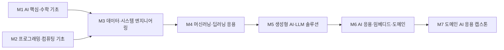

# AI학부 · AI응용학과

> 한성대학교 창의융합대학(2027 이후 AI융합대학) AI학부 / 2026학년도 AI융합교육과정 개편 리서치 · 작성 기준일: 2026-06-25

## 1. 개요

**AI응용학과**는 LLM·생성형 AI를 실제 서비스·산업 문제에 적용하는 **AI 응용·솔루션 개발 인재**를 양성하는 학과로 정의한다. 모델을 처음부터 만드는 연구보다, 이미 공개된 파운데이션 모델을 활용해 **RAG·AI 에이전트·MLOps·컴퓨터비전** 기반 서비스를 설계·구축·운영하는 실무 역량에 초점을 둔다.

**AI 융합 개편 방향**: 생성형 AI → 에이전트 AI → Physical AI 패러다임에 맞춰 커리큘럼을 재구성한다. 거시 지표상 국내 AI 역량 요구 기업 비중이 2026년 69%(증가세가 가장 가파름)에 이르러, "AI를 만드는 사람"보다 **"AI를 잘 쓰는 사람(AI 활용·응용)"** 수요가 폭발적으로 증가. 학과 포지셔닝을 *모델 개발자*가 아닌 **AI 애플리케이션 엔지니어 / AI 솔루션 컨설턴트 / AI 서비스 기획자**로 설정한다.

## 2. 산업·기술 트렌드 (2024–2026)

### 대기업 — 자체 LLM에서 'AI 에이전트'로 전환

| 기업 | 동향 |
| --- | --- |
| 네이버 | HyperCLOVA X 검색 적용, 통합 AI 에이전트 'Agent N' 전면화. 옴니모달(omnimodal) HyperCLOVA X SEED 오픈소스 |
| 카카오 | AI 에이전트 앱 '카나나' 공개, 온디바이스 '카나나 인 카카오톡' 2026 1분기 출시 예정 |
| 삼성전자 | 멀티모달 '삼성 가우스2', 사내 코딩 어시스턴트 code.i를 DX부문 SW 개발자 약 60% 사용 |
| LG | 하이브리드 AI '엑사원(EXAONE) 4.0', Hugging Face 50만 다운로드. MCP·Function Calling |
| SKT | 자체 LLM 'A.X 4.0' 오픈소스, 에이닷 검색에 A.X 4.0·GPT-5 도입 |
| KT | 한국어 특화 LLM '믿:음(Mi:dm) 2.0' MIT 라이선스 오픈소스 |

핵심 흐름: AI 시장 화두가 **학습(Training) → 추론(Inference)·에이전트(Agent)**로 이동. SI 대기업(삼성SDS, LG CNS, SK C&C)은 'AI 퍼스트' 전환으로 **MLOps·AI 솔루션 아키텍트** 수요 집중.

### Physical AI / 휴머노이드

- 정부 '피지컬 AI 핵심 경쟁력 확보 전략' 및 제4차 지능형로봇 기본계획(2024~2028): 2030년까지 로봇 100만대 투입, 핵심부품 국산화율 80%.
- 기업: 로보티즈 'AI 워커', 뉴로메카 산업용 휴머노이드 '젠(ZEN)'. **2025년이 피지컬 AI 산업 원년**.

### 중소·스타트업 — RAG·에이전트 솔루션

- 올거나이즈, 스켈터랩스, 솔트룩스, 사이오닉에이아이(노코드 에이전트 'STORM'), 뒤튼(Wrtn, MAU 약 600만, 시리즈B 830억원 — 추정), 업스테이지(Solar LLM), 스캐터랩('이루다') 등.

### 정부 AI 인재양성 정책

- 디지털 인재양성 종합방안(2022~2026): 5년간 100만 명. **2026년 정부 AI 예산 역대 최대 약 9조 9,000억원**(2025년 약 3.3조 대비 약 3배). AX대학원 10개 신규, AI 기본법 2026.1.22 시행.

## 3. 채용 동향

- 최근 5년간 **AI 채용 공고 +112%**, **신입직 +162%**, **비수도권 +232%**(잡코리아).
- 2026년 1~5월 'AI' 키워드 공고 약 15,000건, 전년 동기비 +70%(역대 최고).
- AI 직무 구성비: AI 서비스 개발자 18.1% / AI·ML 엔지니어 17.9% / 데이터 사이언티스트 17.4% / AI 기획 13.8%.
- 연봉(추정·집계): ML 엔지니어 한국 평균 약 9,390만원, 원티드 AI 직무 합격자 평균 7,770만원 > 비AI 개발자 7,389만원.
- 원티드랩 2026 서베이(153개사): 'AI·데이터 활용 역량' 중요 기준 4위(24.2%), 74.5%가 채용 유지·확대. (기업 69.2% AI 역량 고려는 대한상의 조사 — [공통 채용 데이터 출처](../data-sources.md) 참조)
- 신입 직무명: '프롬프트 엔지니어' 단독 감소, **LLM 엔지니어·AI Agent Engineer·AI 솔루션 컨설턴트·AI 서비스 기획**으로 통합.

> ⚠ 주의: "Python +527%, AWS +1,778%, RAG +2,047%" 등 스킬 수요 증가율은 **출처가 미국 노동시장 데이터(Stanford AI Index/Lightcast)**이며 한국 공고 수요가 아니다. 인용 시 '미국 시장 기준'으로 표기해야 한다.

### 3-1. 고용 전망 — 국내·미국·중국 동향

!!! abstract "이 트랙과 향후 10년 고용"
    - **국내(고용노동부):** 2027년 신산업 인력 부족 중 AI 1.28만명이 핵심 부족 직종이며, 수요가 공학·정보통신 전문가에 집중되고 연구개발업 취업자가 늘어 AI 응용 직무 수요를 뒷받침한다.
    - **미국(BLS)·글로벌(WEF):** 컴퓨터·수학 직군이 +10.1%로 AI 수요를 주도하고, WEF는 AI/ML 전문가를 최상위 성장 직무로 꼽으며 기업 86%가 AI·정보처리 기술 전환을 추진한다.
    - **중국:** AI·로봇에 1조 위안 규모 펀드를 투입하는 등 미·중 AI 경쟁이 심화돼 글로벌 AI 인재 수요를 끌어올린다.
    - **시사점:** 프롬프트 단일 직무를 넘어 LLM·AI Agent·솔루션 설계로 통합되는 흐름에 맞춰 응용 개발 역량을 폭넓게 길러야 한다.

> 📊 거시 분석 전체: [고용노동부 취업동향·10년 전망](../employment-outlook.md) · [글로벌 비교 (미국·중국)](../global-employment-outlook.md)

## 4. 요구 직무 역량

| 구분 | 내용 |
| --- | --- |
| **핵심 직무 역량** | Python, 자료구조·알고리즘, 통계·수학 기초, SQL/데이터 처리, Git·협업, 도메인 문제 정의·서비스 설계 |
| **AI 융합 역량** | 생성형 AI 활용·프롬프트 엔지니어링, RAG 파이프라인 설계(청킹·하이브리드 검색·리랭킹), AI 에이전트 오케스트레이션(LangChain/LlamaIndex), 모델 파인튜닝(LoRA/QLoRA), AI 윤리 |
| **주요 기술스택** | Python, PyTorch/TensorFlow, scikit-learn, LangChain/LlamaIndex, 벡터DB(Pinecone·Weaviate·Milvus·Qdrant·pgvector·FAISS), 추론최적화(vLLM·TensorRT-LLM), Hugging Face, Docker/Kubernetes, 클라우드(AWS·GCP·Azure), MLOps(MLflow·Kubeflow·BentoML·Triton) |
| **자격·우대** | 빅데이터분석기사, ADsP/ADP, SQLD, 클라우드 자격(AWS/GCP) |

!!! tip "추가 보강 제안 (2026 개편 반영안 · 공식 교과 아님)"
    공식 교과를 대체하지 않는 **추가 보강 방향**이다(신설/심화 제안).
    - **추가 기술트렌드:** LLM 앱 · 멀티모달 AI · 에이전트 · AI 안전성
    - **추가 직무역량:** RAG · 평가 · MLOps · 프롬프트/도구 사용
    - **교육과정 보강(제안):** LLM 평가-운영 · 에이전트 시스템 설계

## 5. 대표 채용 기업 & 직무 예시

**대기업**

- 네이버(머신러닝 엔지니어, CLOVA ML 모델러), 네이버클라우드(AI 모델러, AI Agent 엔지니어)
- 카카오(ML 엔지니어 신입), 카카오모빌리티(MLOps), 카카오VX(CV)
- LG AI연구원(EXAONE Lab), 삼성전자 DS AI센터, 삼성SDS(생성형 AI 플랫폼 Fabrix/Brity Copilot)

**중견·스케일업**

- 토스(ML Engineer 추천/MLOps), 당근(ML Engineer, 2026 신입/전환형 인턴), 솔트룩스(AI 에이전트 7개 직군), 마키나락스(제조·국방 AI FDE), 몰로코(Staff ML Engineer 서울)

**스타트업**

- 업스테이지(AI Research Engineer-LLM, AI Agent Engineer), 뒤튼(AI/Agent Developer), 스캐터랩(ML 엔지니어/리서처), 라이너(Search Engineer), 베슬에이아이(MLOps Architect)

## 6. 교육과정 개편 시사점

1. **'AI 응용 + 도메인' 결합** — 모델 개발이 아니라 *공개 LLM을 활용한 RAG·에이전트 서비스 구축*을 중심 트랙으로. 캡스톤은 "벡터DB+LangChain 기반 도메인 특화 에이전트".
2. **'AI + MLOps 운영' 결합** — Docker·Kubernetes·MLflow·모델 서빙(vLLM/Triton) 실습. 추론 비용·지연 최적화가 핵심 차별 역량.
3. **'AI + 비전공자 활용 역량' 결합** — 프롬프트·AI 협업·AI 윤리/리터러시 기초를 전 학년 공통 교양으로 편성.

## 7. 출처

> 인용 형식: **기관·매체 — 「제목」 (발행일/연도) · URL** / 확인일 2026-06-27

- **LG·SKT·카카오·네이버·KT** — 「산업·기술 보도·공식 자료」
- **irobotnews** — 「산업·기술 보도」
- **HuggingFace** — 「산업·기술 자료」
- **korea.kr** — 「정책브리핑」 · <http://korea.kr>
- **국가법령정보센터** — 「인공지능 발전과 신뢰 기반 조성 등에 관한 기본법」(2026-01-22 시행) · <https://www.law.go.kr/lsInfoP.do?lsiSeq=268543> · 확인일 2026-07-01
- **msit.go.kr** — 「정부 정책」 · <http://msit.go.kr>
- **잡코리아** — 「AI 채용 트렌드」
- **한국데이터경제신문** — 「채용 동향」
- **dataq.or.kr** — 「채용 동향」 · <http://dataq.or.kr>
- **wanted.co.kr** — 「역량·스택·기업」 · <http://wanted.co.kr>
- **recruit.navercorp.com** — 「역량·스택·기업」 · <http://recruit.navercorp.com>
- **careers.kakao.com** — 「역량·스택·기업」 · <http://careers.kakao.com>
- **lgresearch.ai** — 「역량·스택·기업」 · <http://lgresearch.ai>
- **toss.im** — 「역량·스택·기업」 · <http://toss.im>
- **daangn** — 「역량·스택·기업」
- **upstage** — 「역량·스택·기업」

> 추정·주의: 잡코리아 스킬 증가율(미국 데이터), 뒤튼 MAU·투자액, AI 직무 연봉 일부, 중견/대기업 분류는 추정 또는 2차 출처 기반.

## 8. 교육 목표 (예시)

> 학문 분야 정체성: AI응용학과는 AI/ML 기술을 다양한 산업·서비스 도메인에 적용하여 실질적 문제를 해결하는 'AI를 잘 쓰는' 응용·솔루션 전문가를 양성한다.

생성형 AI·에이전트 시대에 요구되는 것은 모델을 처음부터 만드는 능력보다, 검증된 AI 구성요소를 조합·튜닝·운영하여 현장 문제를 해결하는 **응용 역량**이다. 본 학과는 이러한 응용·통합·운영 중심의 전문성을 핵심 정체성으로 삼는다.

**구체적·측정가능 교육 목표**

1. **AI/ML 기초 운용 능력**: 졸업 시점까지 지도·비지도·딥러닝 모델을 데이터 전처리부터 평가·배포까지 end-to-end로 구현할 수 있으며, 2개 이상의 실데이터 프로젝트를 포트폴리오로 보유한다.
2. **생성형 AI·에이전트 솔루션 개발 능력**: LLM API·RAG·에이전트 프레임워크를 활용하여 도메인 특화 AI 서비스를 1개 이상 기획·구현하고, 프롬프트·검색·도구 호출의 품질을 정량 지표(정확도·응답시간 등)로 개선할 수 있다.
3. **MLOps·서비스화 능력**: 학습한 모델을 API·컨테이너로 배포하고, 모니터링·재학습 파이프라인을 구성하는 MLOps 기본 워크플로우를 1개 이상 직접 운영한다.
4. **AI 윤리·책임성 적용 능력**: 편향·환각·프라이버시·저작권 등 위험을 식별하고, 자신이 만든 솔루션에 대해 거버넌스 체크리스트 기반의 위험 평가서를 작성할 수 있다.

## 9. 교육과정 구성 및 교수법 활용

**교육과정 구성**

- **기초 단계 (1~2학년)**: 프로그래밍·자료구조·선형대수·통계 등 컴퓨팅·수리 기초와 AI 입문으로 응용의 토대를 다진다.
- **전공심화 단계 (2~3학년)**: 머신러닝·딥러닝·데이터엔지니어링 등 핵심 전공으로 모델링·데이터 처리 역량을 심화한다.
- **AI 융합 단계 (3~4학년)**: 생성형 AI·RAG·에이전트·MLOps와 도메인(헬스·금융·미디어 등) 응용을 결합하여 솔루션 설계 역량을 키운다.
- **캡스톤 단계 (4학년)**: 산학연계 실문제를 팀 단위로 기획·개발·배포하여 실전 AI 솔루션을 완성한다.

**교수법 활용**

- **PBL(문제기반학습)**: 실데이터·실문제를 중심으로 모델링부터 서비스화까지 학생 주도로 해결한다.
- **AI 페어실습**: AI 코딩 어시스턴트를 페어 파트너로 활용해 빠른 프로토타이핑과 코드 리뷰 역량을 학습한다.
- **산학 캡스톤**: 기업 제공 데이터·과제로 현업 수준의 결과물을 제작하고 멘토 피드백을 받는다.
- **프로젝트 포트폴리오**: 학기·과목별 산출물을 누적 관리하여 취업·진학용 증빙 포트폴리오로 발전시킨다.

## 10. 모듈형 전공교육과정 (M1~M7)

### 10-1. 모듈형 교육과정 안내

> 출처: 한성대학교 AI응용학과 공식 교과과정([https://www.hansung.ac.kr/CreCon/2779/subview.do](https://www.hansung.ac.kr/CreCon/2779/subview.do)) 기준, 확인일 2026-06-30. 구성 교과목 공식, 미존재 보강은 (예시). (전기=전공기초·전필=전공필수·전선=전공선택)

| 모듈 | 모듈명 | 구성 교과목 (학년-학기·이수구분) | 모듈 설명 | 모듈 학습성과 | 모듈 간 관계 |
| --- | --- | --- | --- | --- | --- |
| **M1** | AI 핵심·수학 기초 | 인공지능 개론(1-1·전기) · 선형대수(1-1·전선) · 확률 및 통계(1-2·전선) · 인공지능 수학(2-1·전필) | AI 개론, 선형대수·확률통계, AI 수학 | AI 핵심 개념과 수리 토대를 이해·설명할 수 있다 | 단과대학 공통·전공기초 |
| **M2** | 프로그래밍·컴퓨팅 기초 | C프로그래밍(2-1·전선) · 객체지향프로그래밍(2-2·전선) · 자료구조 및 실습(2-2·전필) · 알고리즘 및 실습(3-1·전선) | C·객체지향 프로그래밍, 자료구조·알고리즘 | 자료구조·알고리즘 기반으로 프로그램을 구현할 수 있다 | 학부 공통·M1과 병렬 |
| **M3** | 데이터·시스템 엔지니어링 | 데이터베이스(2-2·전선) · 컴퓨터구조(2-2·전선) · 운영체제(3-2·전선) · 클라우드 컴퓨팅(3-2·전선) | 데이터베이스, 컴퓨터구조·운영체제, 클라우드 | 실데이터를 처리하고 시스템·클라우드 기반을 다룰 수 있다 | 학부 공통·M1·M2→M3 |
| **M4** | 머신러닝·딥러닝 응용 | 머신러닝(2-2·전필) · 딥러닝(3-1·전필) · 컴퓨터비전(3-1·전선) · 강화학습(4-2·전선) | 지도·비지도학습, CNN·RNN·Transformer, 강화학습 | 문제 유형에 맞는 모델을 선택·학습·평가할 수 있다 | 학과 전공·M3→M4 |
| **M5** | 생성형 AI·LLM 솔루션 | 시각지능 학습(3-2·전선) · 자연어처리(4-1·전선) · LLM응용프로그래밍(예시) · RAG시스템설계(예시) | 자연어처리, 시각지능, LLM·RAG 응용 | 도메인 특화 생성형 AI 서비스를 설계·구현할 수 있다 | 학과 전공·M4→M5 |
| **M6** | AI 응용·임베디드·도메인 | 지능형 임베디드 시스템(3-1·전필) · 지능형 IoT 통신시스템(3-2·전선) · 의료 인공지능(3-2·전선) · 로보틱스와 인공지능(4-2·전선) | 임베디드·IoT AI, 로보틱스, 도메인 AI | AI를 임베디드·도메인 서비스로 응용할 수 있다 | 학과 전공·M5→M6 |
| **M7** | 도메인 AI 응용 캡스톤 | 기업연계 AI캡스톤디자인(3-2·전필) · 소프트웨어공학(4-1·전필) · 인공지능 캡스톤 디자인(4-1·전필) · 산학협력프로젝트(4-2·전선) | 산업 도메인 문제 정의·솔루션 통합 | 실문제를 해결하는 AI 솔루션을 완성하고 검증할 수 있다 | 학과 전공·M1~M6 종합·검증 |

### 10-2. 모듈형 교육과정 로드맵 (학년·학기)

| 모듈 | 1-1 | 1-2 | 2-1 | 2-2 | 3-1 | 3-2 | 4-1 | 4-2 |
| --- | --- | --- | --- | --- | --- | --- | --- | --- |
| **M1** AI 핵심·수학 기초 | 인공지능 개론 · 선형대수 | 확률 및 통계 | 인공지능 수학 | | | | | |
| **M2** 프로그래밍·컴퓨팅 기초 | | | C프로그래밍 | 객체지향프로그래밍 · 자료구조 및 실습 | 알고리즘 및 실습 | | | |
| **M3** 데이터·시스템 엔지니어링 | | | | 데이터베이스 · 컴퓨터구조 | | 운영체제 · 클라우드 컴퓨팅 | | |
| **M4** 머신러닝·딥러닝 응용 | | | | 머신러닝 | 딥러닝 · 컴퓨터비전 | | | 강화학습 |
| **M5** 생성형 AI·LLM 솔루션 | | | | | | 시각지능 학습 | 자연어처리 · LLM응용프로그래밍(예시) · RAG시스템설계(예시) | |
| **M6** AI 응용·임베디드·도메인 | | | | | 지능형 임베디드 시스템 | 지능형 IoT 통신시스템 · 의료 인공지능 | | 로보틱스와 인공지능 |
| **M7** 도메인 AI 응용 캡스톤 | | | | | | 기업연계 AI캡스톤디자인 | 소프트웨어공학 · 인공지능 캡스톤 디자인 | 산학협력프로젝트 |

**모듈 흐름(요약 다이어그램):**

### 10-3. 학습자 진로 가이드

| 진로 분야 | 권장 모듈 조합 | 지향 |
| --- | --- | --- |
| 생성형 AI 서비스 개발 | M1 AI 핵심·수학 기초 + M5 생성형 AI·LLM 솔루션 + M6 AI 응용·임베디드·도메인 | LLM 애플리케이션 개발자·AI 서비스 기획·개발자 |
| AI 엔지니어링·MLOps | M3 데이터·시스템 엔지니어링 + M4 머신러닝·딥러닝 응용 + M7 도메인 AI 응용 캡스톤 | ML 엔지니어·MLOps 엔지니어·AI 플랫폼 엔지니어 |
| 도메인 AI 컨설팅·응용 | M4 머신러닝·딥러닝 응용 + M5 생성형 AI·LLM 솔루션 + M7 도메인 AI 응용 캡스톤 | AI 솔루션 컨설턴트·도메인 AI 애널리스트 |

### 10-4. 학생 학습경로 예시

**경로 A — 생성형 AI 솔루션 개발자**

- 1학년: 프로그래밍·AI개론·통계기초로 토대 마련
- 2학년: 데이터엔지니어링·머신러닝 이수, 생성형AI와에이전트입문 수강
- 3학년: LLM응용프로그래밍·RAG시스템설계·AI에이전트설계로 전공 심화, 'AI 윤리와 거버넌스' 병행
- 4학년: 산학캡스톤에서 도메인 특화 생성형 AI 서비스 개발, 포트폴리오 완성 후 LLM 애플리케이션 개발자로 진출

**경로 B — ML/MLOps 엔지니어**

- 1학년: 프로그래밍·선형대수·자료구조 학습
- 2학년: 데이터베이스·데이터엔지니어링·머신러닝 이수
- 3학년: 딥러닝·컴퓨터비전·MLOps·클라우드AI서비스로 운영 역량 강화
- 4학년: AI시스템운영 기반 캡스톤 수행, 모델 배포·모니터링 경험을 쌓아 MLOps 엔지니어로 진출

**경로 C — 도메인 AI 솔루션 컨설턴트**

- 1학년: 프로그래밍·AI개론·통계기초로 분석 토대 마련
- 2학년: 데이터엔지니어링·머신러닝·데이터시각화로 데이터 해석 역량 강화
- 3학년: 딥러닝·LLM응용프로그래밍·RAG시스템설계로 도메인 응용 역량 심화, 'AI 윤리와 거버넌스' 병행
- 4학년: 산학캡스톤에서 도메인(헬스·금융) AI 응용 프로젝트를 기획·검증, AI 솔루션 컨설턴트·도메인 AI 애널리스트로 진출

**경로 D — 멀티모달·컴퓨터비전 AI 엔지니어**

- 1학년: 프로그래밍·선형대수·AI개론 학습
- 2학년: 데이터엔지니어링·데이터베이스·머신러닝 이수
- 3학년: 딥러닝·컴퓨터비전·멀티모달AI로 비전·멀티모달 모델 활용 역량 강화
- 4학년: AI응용프로젝트 기반 캡스톤에서 멀티모달 인식 서비스를 개발·배포, 멀티모달·컴퓨터비전 AI 엔지니어로 진출

### 10-5. 상위 수준 보완 권고

> 아래는 KAIST AI대학원·서울대 AI·성균관대 AI 등 LLM·생성형 AI 응용 특성화 **상위 비교군** 및 산업 표준 정렬을 위한 **보완 권고**다. **공식 교과를 대체하지 않으며**, 2027학년도 교과 개편 시 심의 의견·향후 개선 계획으로 활용한다.

| 보완 영역 | 반영 위치 | 추가하면 좋은 내용 | 기대 효과 |
| --- | --- | --- | --- |
| LLM 체계적 평가·벤치마킹 | M4, M5 | LM-Eval-Harness·HELM 기반 평가 파이프라인, MMLU·KMMLU·KoBEST 한국어 평가셋, LLM-as-judge·자체 평가셋 구축 | 모델·프롬프트 선택을 정량 근거로 결정, 환각·성능을 재현 가능하게 검증 |
| 에이전트 오케스트레이션 심화 | M5, M6 | LangGraph 상태그래프·ReAct, 함수호출(tool-use)·MCP 연동, 멀티에이전트 협업·휴먼인더루프 설계 | 단순 체인을 넘어 도구·상태 기반 복합 에이전트를 안정적으로 구축 |
| LLMOps·서빙 운영 관측성 | M3, M7 | vLLM·TGI 서빙, LangSmith·Langfuse 트레이싱, 프롬프트 버전관리·토큰 비용·지연 모니터링 | 프로토타입을 운영 서비스로 전환, 비용·품질 회귀를 상시 추적 |
| AI 안전성·레드팀·가드레일 | M5, M7 | 프롬프트 인젝션·탈옥 레드팀, NeMo Guardrails·입출력 필터, OWASP LLM Top 10·AI 기본법 대응 | 보안·규제 리스크 사전 차단, 책임 있는 AI 솔루션 신뢰성 확보 |
| RAG 고도화·정량 평가 | M3, M5 | 하이브리드 검색·리랭킹·청킹 전략, GraphRAG, RAGAS·검색 품질 지표 기반 개선 | 검색 정확도·근거성 향상으로 도메인 RAG 서비스 품질을 표준화 |
| 멀티모달 생성·응용 | M4, M6 | VLM(시각언어모델)·CLIP·음성(STT/TTS) 통합, 멀티모달 RAG·문서이해 파이프라인 | 텍스트 한계를 넘어 문서·이미지·음성 융합 서비스로 응용 범위 확장 |
