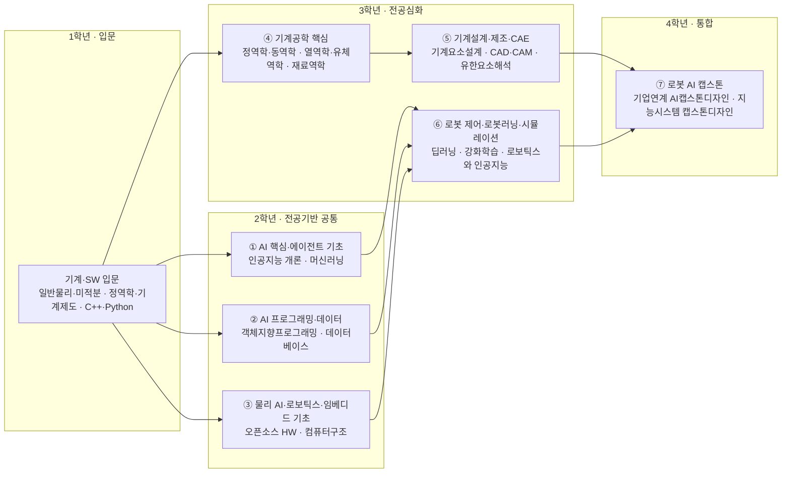

# AI융합학부 · AI기계로봇공학과(2027학년도 신설 예정)

> 한성대 (2027학년도 이후) AI융합대학 · AI융합학부 **2027학년도 신설 예정 학과** / **전통 기계공학 50% + AI·로봇 융합 50%** 균형 설계 (PARC Lab Physical AI·실시간 제어 정렬)

> 조사일 2026-06-25 · 미검증·편차 항목은 **추정** 표기

## 1. 개요

AI기계로봇공학과는 **기계공학(4대 역학·기계설계·제조)을 굳건한 토대**로 삼고, 여기에 **제어·임베디드와 AI(강화학습·모방학습·컴퓨터비전)**를 융합해 휴머노이드·협동로봇·**Physical AI**를 구현하는 인재를 양성하는 **2027학년도 신설 예정** 학과다. 설계 원칙은 **전통 기계공학 50% : AI·로봇 융합 50%**의 균형으로, 'AI에만 치우치지 않은' 기계공학 정체성을 유지한다.

**개편 방향:** 한 축에서는 정역학·동역학·열역학·유체역학의 **4대 역학**과 기계요소설계·생산공학·CAE(유한요소해석)를 전공의 절반으로 탄탄히 유지한다. 다른 축에서는 글로벌 패러다임이 생성형 AI→에이전트 AI→**Physical AI**로 전환되고 Physical AI 시장이 2026년 약 $110.8B(CAGR≈36%)로 성장하는 흐름에 맞춰, NVIDIA의 '세 대의 컴퓨터'(학습-시뮬레이션-탑재추론) 구조와 PARC Lab의 실시간 제어·로봇 역량을 결합한다. **기계공학 기본기 위에 AI·로봇을 얹는** 순서가 핵심이다.

## 2. 산업·기술 트렌드 (2024–2026)

### 전통 기계·제조 산업 기반 (학과의 절반)

- **기계공학은 모든 제조의 토대:** 자동차·조선·항공·중공업·일반기계·반도체 장비 등 주력 산업이 정역학·동역학·열역학·유체역학과 기계요소설계·생산공학 위에서 작동한다. 로봇·휴머노이드 역시 **구조설계·구동계·열관리·정밀가공** 없이는 성립하지 않는다.
- **설계·해석의 디지털화:** CAD(SolidWorks·CATIA·NX)·CAE(ANSYS·Abaqus)·유한요소해석(FEA)·전산유체역학(CFD)이 설계 표준이며, 디지털 트윈·생성형 설계(Generative Design)로 확장 중.
- **스마트 제조:** CNC·정밀가공·적층제조(3D 프린팅)·스마트팩토리 자동화가 기계 엔지니어의 핵심 현장으로, AI·로봇과 자연스럽게 접속한다.

### 글로벌 휴머노이드 상용화 (AI·로봇 축)

- **Tesla Optimus:** Optimus V3를 2026년 공개 예정(시점 반복 연기), 프리몬트 공장 생산 추진. 장기적 연 100만~5천만 대 비전(구체 가격·양산일은 추정·미검증).
- **NVIDIA Isaac GR00T:** 2025.3 GTC에서 GR00T N1 공개 — 세계 최초 오픈 범용 휴머노이드 파운데이션 모델(System 1 반사 + System 2 추론). 합성데이터·Newton 물리엔진·Isaac Lab 오픈소스. 채택: 1X, Agility, Boston Dynamics 등.
- **Boston Dynamics Atlas(현대차그룹 소유):** 전기식 New Atlas, CES 2026 상용 버전 시연. 2028년 현대 조지아 EV 공장 투입, 현대차그룹 미국 260억$ 투자.
- **Physical AI:** 현실세계에서 인지·추론·계획·행동을 체화한 AI. '세 대의 컴퓨터'(학습 DGX / 시뮬 Omniverse·Cosmos / 탑재 Jetson Thor).

### 시장 규모 / CAGR (실제 보고서)

| 기관 | 시작 | 목표 | CAGR |
| --- | --- | --- | --- |
| Goldman Sachs | — | 380억$(2035), 출하 140만대 | — |
| MarketsandMarkets | 29.2억$(2025) | 152.6억$(2030) | 39.2% |
| Mordor Intelligence | 39.3억$(2026) | 178.0억$(2031) | 35.26% |

### 한국 로봇 기업

- **두산로보틱스:** 협동로봇 중심, 2024 미국 ONExia 인수, 2028년 산업용 휴머노이드 목표, NVIDIA Isaac/Jetson Thor 기반 '에이전틱 로봇 OS'.
- **레인보우로보틱스:** KAIST 휴보랩 분사, 삼성전자 약 35% 확보·최대주주 편입. 양팔 세미휴머노이드 RB-Y1 쿠팡 물류센터 실증(2026.6).
- **로보티즈:** 액추에이터 '다이나믹셀' 자체 개발, Boston Dynamics에 관절 액추에이터 공급, LG전자 2대 주주.
- **HD현대로보틱스:** 국내 산업용 로봇 1위, 2026 IPO 거론.

### 정부 정책 (학과 신설 정당성 근거)

- 제4차 지능형로봇 기본계획(2024~2028): 2030년 로봇 100만대 투입, 인력 1.5만명+ 양성, 민관 3조원+ 투자.
- K-휴머노이드 연합(2025.4 출범): 2028년까지 상용 휴머노이드 + 로봇 AI 파운데이션 모델, 2030년까지 약 1조원 투자.

## 3. 채용 동향

- **플랫폼 구조:** 대기업은 자체 포털(삼성·LG·현대·두산), 중견·스타트업은 원티드·사람인·잡코리아 중심. 잡코리아 'ros2' 검색 총 186건(검색 시점).
- **신입 진입 경로:** 스타트업·중견(엑스와이지·클로봇·아이알에스·로보티즈·에이로봇)이 신입/인턴에 개방적, 대기업은 경력·전문연구요원 비중이 큼. 한국로봇산업협회 '로봇채용위크'.
- **연봉(추정):** 로봇 전용 통계 미확인. 일반 IT 신입 평균 약 3,243만원, 로봇·임베디드는 HW·제어 융합 전문성으로 다소 높을 것으로 추정.

### 3-1. 고용 전망 — 국내·미국·중국 동향

!!! abstract "이 트랙과 향후 10년 고용"
    - **국내(고용노동부):** 로봇·제어 같은 연구·공학기술직은 AI가 74.2% '보완'하는 대표 고숙련 영역으로 대체보다 수요 확대가 예상된다. 신산업 인력부족(2027)에서 AI 1.28만·빅데이터 1.96만 명 부족이 Physical AI 인재 수요와 직결되고, 생산가능인구 감소를 로봇·자동화로 상쇄하는 흐름과 맞물린다.
    - **미국(BLS)·글로벌(WEF):** BLS 2024~2034 컴퓨터·수학 +10.1% 성장, WEF는 AI/ML·SW개발을 핵심 성장 직무로 지목한다. 로봇 설치 상위 5개국(중국·일본·미국·한국·독일)이 세계 80%를 차지하고 한국이 그중 하나여서, 로봇 엔지니어 수요가 구조적으로 뒷받침된다.
    - **중국:** 산업로봇 200만 대(세계 54% 설치)·휴머노이드 2025 약 12,800대(세계 90%)·AI/로봇 1조 위안 펀드로 휴머노이드 양산을 선도하며, 제조직 70%+ 대체 가능성이 Physical AI 인재 경쟁을 가속한다.
    - **시사점:** ROS2·실시간 제어에 강화·모방학습과 Sim-to-Real을 결합한 PARC Lab 정렬 커리큘럼이 '보완' 고숙련 일자리를 직접 겨냥한다.

> 📊 거시 분석 전체: [고용노동부 취업동향·10년 전망](../employment-outlook.md) · [글로벌 비교 (미국·중국)](../global-employment-outlook.md)

## 4. 요구 직무 역량

| 구분 | 내용 |
| --- | --- |
| **기계공학 핵심 역량 (전통, 50%)** | 4대 역학(정역학·동역학·열역학·유체역학), 고체역학(재료역학), 기구학(Kinematics)·기계요소설계, 생산·제조공학(CNC·정밀가공·적층제조), CAD/CAM·CAE(유한요소해석 FEA·CFD) |
| **로봇·제어 역량 (융합, 50%)** | 제어공학·모션제어·경로계획·매니퓰레이터 제어, 모터/액추에이터 구동·펌웨어, 메카트로닉스 |
| **AI 융합 역량 (융합, 50%)** | 강화학습(RL)·모방학습, PyTorch·JAX, End-to-end Robotic Learning, 컴퓨터비전(OpenCV), SLAM·Navigation, 시뮬레이션(Isaac Sim·MuJoCo·Gazebo) |
| **기술스택·도구** | MATLAB·Simulink, SolidWorks·CATIA·NX, ANSYS·Abaqus(FEA/CFD), C++·Python, ROS/ROS2·DDS, Linux·Realtime Linux/RTOS, 임베디드(CAN·MCU·FPGA·STM32), Git·Docker |

> 전형적 신입 요건(두 갈래): ① 기계공학 학사 + 4대 역학·CAD/CAE + 제어 기초, 또는 ② 컴퓨터/전자/제어 학사 + C++/Python + ROS — 본 학과는 **두 갈래를 한 전공 안에서 융합**한다.

## 5. 대표 채용 기업 & 직무 예시

- **대기업/계열:** 삼성전자 미래로봇추진단(로봇 파운데이션 모델 RFM), LG전자(임베디드/FPGA 제어설계·AMR), 현대차 로보틱스랩/HD현대로보틱스(모션제어 SW·로봇전장 임베디드·RTOS 미들웨어), 네이버랩스(ML Engineer for Robot Control: C++/Python/ROS2/PyTorch/JAX·강화·모방학습)
- **로봇 전문 중견·상장사:** 두산로보틱스(기계설계·전기제어·Applied Motion), 레인보우로보틱스(로봇 SW 아키텍처·SDK), 로보티즈(액추에이터 펌웨어·휴머노이드 제어 신입/전문연구요원)
- **스타트업:** 엑스와이지(ROS2·CAN), 클로봇(C++/Python·ROS 신입), 위로봇틱스(휴머노이드 SW: Realtime Linux·ROS2/DDS·Isaac Sim), 아이알에스(ROS2·SLAM/Nav 신입), 에이로봇(채용전환 인턴: ROS2·MuJoCo·IsaacSim)

## 6. 교육과정 개편 시사점 (기계공학 기반 + AI 결합 제언)

> 전공 비중은 **전통 기계공학 50% : AI·로봇 융합 50%**를 원칙으로 한다. 아래 1은 전통 축, 2~4는 융합 축이다.

1. **기계공학 4대 역학·설계·제조 필수 트랙(전공의 절반):** 정역학·동역학·열역학·유체역학·고체역학과 기계요소설계·CAE(FEA)·생산공학을 흔들림 없는 핵심으로 배치 → 로봇·휴머노이드의 구조·구동·열관리 설계를 떠받치는 토대.
2. **ROS2 + C++/Python 저학년 필수 트랙:** 거의 전 로봇 공고 공통 요건이므로 입학~저학년에 미들웨어·프로그래밍 기초로 배치.
3. **AI 융합 트랙(강화학습·모방학습 + 시뮬레이션):** RL·모방학습 + Isaac Sim/MuJoCo가 휴머노이드·제어 포지션의 신규 표준 → NVIDIA '세 대의 컴퓨터'(학습-시뮬-탑재) 구조로 모듈화.
4. **임베디드·실시간 제어 별도 트랙:** CAN/RTOS/펌웨어·모터제어를 HW 트랙으로 유지하고, 제4차 지능형로봇 기본계획·K-휴머노이드 연합 산학 과제와 연계한 캡스톤 운영.

## 7. 출처

> 인용 형식: **기관·매체 — 「제목」 (발행일/연도) · URL** / 확인일 2026-06-27

- **NVIDIA** — 「GR00T」
- **NVIDIA** — 「Physical AI '세 대의 컴퓨터'」 · [blogs.nvidia.com](http://blogs.nvidia.com)
- **Boston Dynamics** — 「Atlas」
- **Electrek** — 「Tesla Optimus」
- **Goldman Sachs** — 「시장전망」
- **MarketsandMarkets** — 「시장전망」
- **Mordor** — 「시장전망」
- **ZDNet** — 「두산로보틱스」
- **탑데일리** — 「레인보우로보틱스」
- **로보티즈** — 「로보티즈 IR」
- **KDI** — 「제4차 지능형로봇 기본계획」
- **korea.net** — 「K-휴머노이드 연합」 · [korea.net](http://korea.net)
- **잡코리아** — 「채용: ros2」
- **네이버랩스** — 「채용」
- **원티드** — 「채용: 위로봇틱스·클로봇」

## 8. 교육 목표 (예시)

> 학문 분야 정체성: AI기계로봇공학과는 **기계공학(4대 역학·기계설계·제조)을 토대**로, 제어·임베디드와 강화학습·모방학습·컴퓨터비전을 결합해 휴머노이드·협동로봇·Physical AI를 구현하는 인재를 양성하는 **2027학년도 신설 예정** 학과다. 교육 목표도 **기계공학 50% : AI·로봇 50%**로 균형을 둔다.

2027학년도 신설 예정 학과로서 기계공학 기본기 위에 PARC Lab의 Physical AI·실시간 제어·로봇 역량을 결합하고, NVIDIA '세 대의 컴퓨터'(학습-시뮬레이션-탑재추론) 구조를 융합 골격으로 삼아 측정 가능한 목표를 설정한다.

1. **기계공학 설계·해석 역량 (전통):** 정역학·동역학·열역학·유체역학의 4대 역학과 고체역학을 이해하고, 기계요소설계와 CAD/CAM·CAE(유한요소해석)로 기계 시스템을 설계·해석할 수 있다(졸업 시 기계설계·구조해석 프로젝트 1건 이상).
2. **제조·생산공학 역량 (전통):** CNC·정밀가공·적층제조와 메카트로닉스·구동계를 이해하고, 스마트팩토리 환경에서 기계 시스템을 제작·통합할 수 있다.
3. **로봇 제어·AI 로봇러닝 역량 (융합):** 모션제어·경로계획·매니퓰레이터 제어와 강화학습·모방학습으로 로봇 정책을 학습하고, PyTorch/JAX 기반 로봇러닝·컴퓨터비전(OpenCV)·SLAM·Navigation을 구현할 수 있다.
4. **시뮬레이션·실시간 임베디드 역량 (융합):** Isaac Sim·MuJoCo로 학습한 정책을 실로봇에 이전(Sim-to-Real)하고, ROS2/DDS·Realtime Linux/RTOS·임베디드(CAN·MCU·FPGA) 환경에서 실시간 제어를 통합할 수 있다. (1기부터 K-휴머노이드 연합·제4차 지능형로봇 기본계획 산학 과제와 연계해 현장에 즉시 투입할 수 있는 인재로 육성한다.)

## 9. 교육과정 구성 및 교수법 활용

**교육과정 구성**

- **기초 단계(1학년):** 일반물리·미적분·**정역학**·기계제도/CAD와 C++·Python·Linux·Git을 공통 필수로 이수해 **기계공학과 프로그래밍 기본기**를 동시에 다진다.
- **기계공학 심화 단계(2~3학년, 전공의 절반):** **동역학·열역학·유체역학·고체역학(재료역학)**의 4대 역학과 **기계요소설계·생산공학·CAE(유한요소해석)**를 이수한다.
- **로봇·제어 심화 단계(2~3학년):** 제어공학·모션제어·경로계획, 메카트로닉스, 임베디드·실시간 제어를 심화한다.
- **AI 융합 단계(3~4학년):** 강화학습·모방학습·컴퓨터비전·SLAM과 시뮬레이션(Isaac Sim/MuJoCo), 단과대학 공통 AI 핵심·에이전트 모듈을 결합한다.
- **캡스톤 단계(4학년):** 기계설계·해석 또는 산학 연계 휴머노이드/협동로봇 프로젝트로, 설계→해석/학습→시뮬→실물 탑재 전 과정을 통합 구현한다.

**교수법 활용**

- **시뮬레이션 기반 실습:** Isaac Sim·MuJoCo·Gazebo 가상 환경에서 정책 학습 후 실로봇 검증하는 Sim-to-Real 랩.
- **산학 캡스톤(PBL):** 두산로보틱스·레인보우로보틱스·로보티즈·위로봇틱스 등과 연계한 실문제 프로젝트.
- **임베디드·실기 실습:** STM32·CAN·MCU 보드와 액추에이터(다이나믹셀)를 다루는 하드웨어 핸즈온.
- **AI 페어 실습:** 코딩 어시스턴트·LLM을 활용한 로봇 제어 코드 디버깅·강화학습 리워드 설계 페어링.

## 10. 모듈형 전공교육과정 (역량·성과 중심)

### 10-1. 역량 중심 모듈 구성

> 본 모듈은 **한성대 공식 교과과정([Engineering/4966](https://www.hansung.ac.kr/Engineering/4966/subview.do))**을 기본 데이터로 3~4과목 단위로 재구성했다(**현행 근거: AI로봇융합트랙**). AI기계로봇공학과는 **2027 신설 예정으로 학과 공식 교육과정 미확정**이라, 학과 미확정 과목은 **(예시)**로 표기. 확인일 2026-06-28.

| 모듈명 | 계층 | 핵심 역량·주제 | 학습 성과 | 대표 교과(공식/예시) |
| --- | --- | --- | --- | --- |
| AI 핵심·에이전트 기초 | 단과대학 공통 | AI/ML 기초, 생성형 AI·에이전트, AI 윤리 | ML 모델 구현, 에이전트 프로토타입, 로봇 AI 윤리 분석 | 인공지능 개론 · 인공지능 수학 · 머신러닝 · 생성형AI와에이전트(예시) |
| AI 프로그래밍·데이터 | 학부 공통 | C·Python, 객체지향, 데이터베이스 | 로봇·AI 코드 작성, 데이터셋 구축 | C프로그래밍 · 리눅스와C프로그래밍 · 객체지향프로그래밍 · 데이터베이스 |
| 물리 AI·로보틱스·임베디드 기초 | 학부 공통 | 디지털 논리·HW, 컴퓨터구조, 시스템 프로그래밍 | 센서·HW 처리, 시스템 레벨 코드 구현 | 디지털 논리 및 회로 · 오픈소스 HW · 컴퓨터구조 · 시스템 프로그래밍 |
| **기계공학 핵심(4대 역학·재료)** | **학과 전공(전통)** | **정역학·동역학·열역학·유체역학, 재료역학** | **역학 해석·운동 방정식 수립, 부재 강도 평가** | **정역학·동역학(예시) · 열역학·유체역학(예시) · 재료역학(예시)** |
| **기계설계·제조·CAE** | **학과 전공(전통)** | **기계요소설계, CAD·CAM, CAE(FEA·CFD), 생산공학** | **기계 시스템 설계·구조해석, 가공 공정 설계** | **기계요소설계(예시) · CAD·CAM(예시) · 유한요소해석CAE(예시) · 생산공학(예시)** |
| 로봇 제어·로봇러닝·시뮬레이션 | 학과 전공(융합) | 강화학습·딥러닝, 로봇 비전, 로보틱스·제어 | 로봇 정책 학습, 비전 인지, 제어 알고리즘 구현 | 딥러닝 · 컴퓨터비전 · 강화학습 · 로보틱스와 인공지능 |
| 로봇 AI 캡스톤 | 학과 전공 | 학습→시뮬→탑재 통합, 산학 휴머노이드/협동로봇 프로젝트 | Physical AI 풀스택 프로토타입 완성·발표 | AI프리캡스톤디자인 · 기업연계 AI캡스톤디자인 · 지능시스템 캡스톤디자인 · 산학협력프로젝트 |

#### 10-1 (A) 1~4학년 모듈 로드맵

#### 10-1 모듈–역량 매핑 (학습 역량 ↔ 기업 요구역량)

> 본 표는 위 모듈의 핵심 학습 역량을 4장 요구 직무 역량(기계공학 50% + AI·로봇 50%)과 직접 매핑한 것이다.

| 모듈 | 핵심 역량(학습) | 매핑되는 기업 요구 역량 |
| --- | --- | --- |
| ① AI 핵심·에이전트 기초 | AI/ML 기초, 생성형 AI·에이전트, AI 윤리 | AI 융합(강화학습·모방학습 토대, PyTorch·JAX), 로봇 AI 윤리 |
| ② AI 프로그래밍·데이터 | C·Python, 객체지향, 데이터베이스 | 기술스택(C++·Python), End-to-end Robotic Learning 코드 토대 |
| ③ 물리 AI·로보틱스·임베디드 기초 | 디지털 논리·HW, 컴퓨터구조, 시스템 프로그래밍 | 임베디드(CAN·MCU·FPGA·STM32), 메카트로닉스 |
| ④ 기계공학 핵심(4대 역학·재료) | 정역학·동역학·열역학·유체역학, 재료역학 | 기계공학 핵심(전통 50%): 4대 역학, 고체역학(재료역학) |
| ⑤ 기계설계·제조·CAE | 기계요소설계, CAD·CAM, CAE(FEA·CFD), 생산공학 | 기계공학 핵심(전통 50%): 기계요소설계, 생산·제조공학, CAD/CAM·CAE |
| ⑥ 로봇 제어·로봇러닝·시뮬레이션 | 강화학습·딥러닝, 로봇 비전, 로보틱스·제어 | 로봇·제어(제어공학·모션제어·매니퓰레이터), AI 융합(RL·모방학습, 컴퓨터비전, SLAM, Isaac Sim·MuJoCo) |
| ⑦ 로봇 AI 캡스톤 | 학습→시뮬→탑재 통합, 산학 휴머노이드/협동로봇 | 기계+로봇+AI 통합(Sim-to-Real), ROS2/DDS·Realtime Linux/RTOS |

### 10-2. 모듈 간 관계 (학과·학부·단과대학)

- **위계:** 단과대학 공통(AI 핵심·에이전트 기초) → AI융합학부 공통(물리 AI·로보틱스 기초, AI 프로그래밍·데이터) → 학과 전공심화로 수렴한다. 전공심화는 **전통 축(기계공학 핵심 4대 역학·재료 / 기계설계·제조·CAE)**과 **융합 축(로봇 제어·기계 시스템 / 임베디드·실시간 시스템 / 로봇러닝·시뮬레이션)**을 **약 1:1 비중**으로 운영해, 기계공학 기본기와 AI·로봇 역량을 균형 있게 쌓는다. 융합 축 모듈은 NVIDIA '세 대의 컴퓨터'(학습 DGX / 시뮬 Omniverse / 탑재 Jetson Thor) 구조에 대응한다.
- **선후수:** AI 핵심·에이전트 기초와 AI 프로그래밍·데이터(ROS2 포함) 이수 후 로봇러닝·시뮬레이션 모듈 수강. 로봇 제어·임베디드 이수 후 로봇 AI 캡스톤 진입.
- **마이크로디그리:** '로봇러닝·강화학습', 'ROS2 실시간 시스템', 'Sim-to-Real 시뮬레이션' 각 모듈을 마이크로디그리로 인증.
- **타 학과 교차수강:** AI기계로봇 ↔ 미래모빌리티학과 간 Physical AI·실시간 제어·시뮬레이션(Isaac Sim/MuJoCo)·Edge AI(Jetson) 모듈을 공유하며, PARC Lab 도메인을 매개로 로봇 제어와 자율 이동체 역량을 교차 이수한다.

### 10-3. 진로 분야별 모듈 조합 가이드

| 진로 분야 | 권장 모듈 조합 | 목표 직무 |
| --- | --- | --- |
| 기계설계·해석 (전통) | 기계공학 핵심(4대 역학·재료) + 기계설계·제조·CAE + 로봇 제어·기계 시스템 | 기계설계 엔지니어, 구조·CAE 해석 엔지니어 |
| 제조·생산기술 (전통) | 기계설계·제조·CAE + 기계공학 핵심 + 임베디드·실시간 시스템 | 생산기술 엔지니어, 스마트팩토리 자동화 엔지니어 |
| 로봇 AI/제어 학습 (융합) | AI 핵심·에이전트 기초 + 로봇러닝·시뮬레이션 + 물리 AI·로보틱스 기초 | 로봇 ML 엔지니어, 강화·모방학습 제어 엔지니어 |
| 로봇 SW·임베디드 (융합) | AI 프로그래밍·데이터 + 임베디드·실시간 시스템 + 로봇 제어·기계 시스템 | 로봇 SW 아키텍트, 모션제어·ROS2 엔지니어 |

### 10-4. 학생 학습경로 예시

- **경로 A — 로봇러닝(Physical AI) 엔지니어:** 1학년 C++·Python·ROS2 기초 + AI/ML 입문 → 2학년 물리 AI 개론 + 로봇 비전 → 3학년 로봇 강화학습·모방학습 + Isaac Sim 시뮬레이션 → 4학년 Sim-to-Real + 로봇 AI 캡스톤(네이버랩스·위로봇틱스형 휴머노이드 제어 프로젝트).
- **경로 B — 로봇 SW·임베디드 엔지니어:** 1학년 로봇 프로그래밍 + ROS2 기초 → 2학년 로봇 제어공학 + 임베디드 → 3학년 ROS2 미들웨어 + 실시간 임베디드(CAN/RTOS) → 4학년 로봇 전장·SDK 캡스톤(두산로보틱스·로보티즈형 제어 SW 프로젝트).

- **경로 C — 기계설계·구조해석(CAE) 엔지니어 [전통 기계공학]:** 1학년 정역학·기계제도/CAD + 일반물리·미적분 → 2학년 동역학·고체역학(재료역학) + 기계요소설계 → 3학년 열역학·유체역학 + CAE(유한요소해석 FEA·CFD)·CAD/CAM → 4학년 기계설계 캡스톤(로봇 구동계·구조부재 설계·구조해석 프로젝트, SolidWorks·ANSYS 활용) → 기계설계 엔지니어·구조/CAE 해석 엔지니어로 진출.

- **경로 D — 생산기술·스마트팩토리 자동화 엔지니어 [전통 기계공학]:** 1학년 정역학·기계제도 + Python 기초 → 2학년 재료역학·생산공학(CNC·정밀가공) → 3학년 메카트로닉스 + 적층제조·자동화 설비 + 실시간 임베디드(PLC/CAN) → 4학년 스마트팩토리 캡스톤(공정 자동화·로봇 셀 통합 프로젝트) → 생산기술 엔지니어·스마트팩토리 자동화 엔지니어로 진출.
