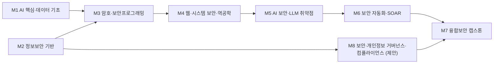

# AI학부 · 융합보안학과

> 한성대학교 창의융합대학(2027 이후 AI융합대학) AI학부 / 2026학년도 AI융합교육과정 개편 리서치 · 작성 기준일: 2026-06-25

??? note "🔎 이 페이지 수정 전후 대조표 (2026-07-13 · 융합보안학과 윤재석 교수 피드백 반영) — 클릭하여 펼치기"
    윤재석 교수님 피드백(2026-07-10, *개인 의견으로 학과 전체 의견은 아님*)으로 이 페이지가 어떻게 바뀌었는지 **수정 전 → 수정 후**로 정리했습니다. 신설 항목은 모두 **(제안)** 표기입니다.

    | 위치 | 수정 전 | 수정 후 |
    |---|---|---|
    | **1장** 개편 방향 | "AI를 지키고 AI로 지키는" 양방향 역량까지 | 문장 끝에 **"+ AI 보안 기술에 더해 정보보호 정책·거버넌스·개인정보보호 실무·AI 규제·컴플라이언스를 갖춘 '기술 + 관리' 균형형 인재 지향"** 추가 |
    | **2장** 규제 동향 | …ISMS-P 의무화 고시 개정 2026년 1분기 예정. | 뒤에 **"+ AI 기본법·EU AI Act·NIST AI RMF 등 AI 규제·위험관리 프레임워크 대응 수요 확대"** 추가 |
    | **4장** 요구 직무 역량 | 핵심 / AI 융합 / 기술스택 / 자격 4개 행 | **「보안 정책·거버넌스 역량」·「개인정보보호·AI 컴플라이언스 역량」 2개 행 신설** (ISMS-P·ISO 27001/27701·개인정보보호법·PIA/DPIA·가명처리·AI 규제) |
    | **4장** 보강 제안(tip) | 직무역량 "…·정책" / 보강 "LLM 보안·AI 보안운영 실습" | 직무역량에 **정보보호 정책·거버넌스·개인정보보호 실무·AI 컴플라이언스**, 보강에 **ISMS-P/ISO 27701·DPIA·AI 규제 대응** 추가 |
    | **6장** 시사점 | 1~3번(AI 보안·클라우드·SOAR) | **4번 "보안·개인정보 거버넌스·컴플라이언스 축 강화" 신설** + 피드백 출처 note |
    | **8장** 교육목표 ④ | "보안 거버넌스·윤리 역량 — 요구사항 식별·체크리스트 적용" | **"보안 거버넌스·개인정보·컴플라이언스 역량"**으로 확대 — ISMS-P·ISO 27001/27701·개인정보보호법·AI 규제 이해, **PIA/DPIA·보안위험평가**를 실제 서비스에 적용 |
    | **9장** 교수법 | 해커톤·PBL·산학캡스톤·AI 페어실습 | **"정책·관리체계형 PBL" 신설** — DPIA·보안위험평가·ISMS-P 통제 설계·컴플라이언스 체크리스트·유출 대응 시나리오 |
    | **10장** 모듈 | (M1~M7) | **(M1~M8)** — **M8「보안·개인정보 거버넌스·컴플라이언스」(제안) 모듈 신설**(10-1 표·10-2 로드맵·다이어그램) |
    | **10-3** 진로 가이드 | AI/LLM·SecOps·침해대응 3개 | **"보안·개인정보 거버넌스·컨설팅"(M2+M8+M7) 진로 신설** |
    | **10-4** 학습경로·진출 직무 | 경로 A~D | **경로 E "보안·개인정보 거버넌스/컨설팅 전문가" + 진출 직무(경로 E) 신설** |
    | **10-5** 보완 권고 | 반영 위치 **M7** / "ISO 27001·ISMS-P…" | 반영 위치 **M7·M8** / 내용에 **ISO 27701·DPIA·AI 규제(AI 기본법·EU AI Act·NIST AI RMF)** 추가 |

    원본 diff(🔴수정 전 / 🟢수정 후)는 [GitHub 커밋 c7a7091](https://github.com/parclab-hsu/ai-curriculum-2026/commit/c7a7091)에서, 전체 개정 내역은 [변경 이력](../changelog.md)에서 볼 수 있습니다.

## 1. 개요

**융합보안학과**는 클라우드·AI·IoT 등 신기술 환경에서 정보보안과 도메인(스마트카·제조·의료·금융 등)을 결합한 **융합보안 전문 인재**를 양성하는 학과로 정의합니다. 전통적 네트워크·시스템 보안을 넘어 **클라우드보안·제로트러스트·AI 보안·보안관제·침해대응·개인정보보호**를 아우릅니다.

**AI 융합 개편 방향**: 보안 위협이 **AI 악용(자동화 공격·딥페이크 피싱)**과 **AI 시스템 자체의 취약점(프롬프트 인젝션·데이터 포이즈닝)**으로 동시 확장됨에 따라, "AI를 지키고(AI 시스템 보안) AI로 지키는(AI 활용 보안)" 양방향 역량을 교육 핵심에 둡니다. 나아가 AI 보안 기술에 더해 **정보보호 정책·거버넌스, 개인정보보호 실무, AI 규제·컴플라이언스(AI 거버넌스)**를 함께 갖춘 '기술 + 관리' 균형형 융합보안 인재를 지향합니다.

## 2. 산업·기술 트렌드 (2024–2026)

### 시장 규모 (과기정통부·KISIA 정보보호산업 실태조사)

- 정보보호산업 전체 매출: 2023년 16조 8,310억원 → **2024년 18조 5,945억원(+10.5%)**.
- 정보보안(사이버보안): 2023년 6조 1,455억원 → **2024년 7조 1,244억원(+15.9%)**. KISA는 2030년까지 산업 40조원 확대 계획.

### 기술 트렌드

- **제로트러스트**: 과기정통부·KISA '제로트러스트 가이드라인 2.0'(2024.12) — 성숙도 4단계, 핵심기능 27개, 세부 보안역량 52개.
- **클라우드보안(CNAPP/CSPM)**: 공공분야 도입 검토 확대.
- **AI 보안**: 삼성SDS '2025년 5대 위협'에 AI 악용 피싱·SW 공급망 포함. OWASP Top 10 for LLM Applications 기반 프롬프트 인젝션·민감정보 유출 대응 부상.
- **EDR/XDR**: 국내 XDR 시장 2024년 약 822억원 → 2026년 약 1,942억원(추정).
- **융합보안**: 2025년 핵심 키워드 '융합보안 시장 본격화'(스마트카·시티·공장).

### 규제 동향

- 개인정보 전송요구권(마이데이터) 2025.3.13 시행. 정보보호 공시 의무 확대(2027년 공시 적용). 개인정보위 '생성형 AI 개발·활용 개인정보 처리 안내서'(2025.8). ISMS-P 의무화 고시 개정 2026년 1분기 예정. **AI 기본법**(2026.1.22 시행)·**EU AI Act**(2026.8.2 전면 적용)·**NIST AI RMF** 등 국내외 AI 규제·위험관리 프레임워크 대응 수요 확대.

### 주요 보안기업

| 기업 | 2024 매출 | AI 신사업 |
| --- | --- | --- |
| 안랩(코스피) | 2,606억원(+9%) | 'AhnLab AI PLUS', XDR AI어시스턴트 '애니', 'XTG' |
| SK쉴더스(업계1위) | 2조 47억원(+7%) | '시큐디움' AI MXDR, 2026년까지 200억 투입 |
| 이글루코퍼레이션 | 2025년 1,432억(+28.8%) | 'SPiDER ExD'(XDR/SaaS SIEM), AI에이전트 '에어' |
| 윈스 | 965억원 | 'SNIPER AIVAX'(AI 무인 통합관제) |

### 정부 사이버보안 인재양성 정책

- '사이버보안 10만 인재 양성'(2022~2026). 화이트해커 연 약 500명, 화이트핫 스쿨(KISA) 2026년 4기 420명, BoB(KITRI) 15기 110명, 융합보안대학원 8개 양성분야에 'AI보안' 포함.
- **인력 부족 심화**: 침해사고 신고 2021년 640건 → 2024년 1,887건(약 3배)인데 정보보안 종사자는 2024년 23,987명(+0.2%, 사실상 정체).

## 3. 채용 동향

- 플랫폼 공고(조회 시점): LinkedIn "보안" 1,000+건, 잡코리아 "클라우드보안" 약 1,095건·"모의해킹" 약 101건.
- **경력직 우위 구조 심화**: 2024년 정보보호산업 채용 신입 2,654명 vs 경력 5,170명(약 2:1). 보안관제 L1은 AI 자동화로 신입 자리 축소.
- **주요 신입 채용처**: 안랩(2025 R&D 신입공채 10개 직무), SK쉴더스('Rookies'), 이글루·윈스, 금융보안원(2026 상반기 신입 20명 내외), 카카오/카카오뱅크, 삼성SDS.
- **빈출 신입 직무**: 보안관제(SOC), 침해대응/CERT, 모의해킹·취약점진단, 보안컨설팅, 보안솔루션 개발, 클라우드보안, 디지털포렌식.
- **자격증 우선순위**: 정보보안기사(사실상 필수) > CISSP > ISMS-P 인증심사원 > CISA > CPPG > CEH/OSCP(공격직무) > AWS Security Specialty(클라우드).

### 3-1. 고용 전망 — 국내·미국·중국 동향

!!! abstract "이 트랙과 향후 10년 고용"
    - **국내(고용노동부):** 향후 10년 수요가 공학·정보통신 전문가에 집중되고, 신산업 인력난에서 클라우드 부족 1.88만명이 두드러져 클라우드보안 등 융합보안 직무 수요를 키운다.
    - **미국(BLS)·글로벌(WEF):** 디지털 전환으로 컴퓨터·수학 직군이 +10.1% 성장하고, WEF는 AI·정보처리 기술이 기업 86%의 전환과 스킬 39% 진부화로 보안 수요가 확대되는 한편 사무·단순직 감소를 전망한다.
    - **시사점:** 보안관제 L1이 AI 자동화로 축소되는 만큼 침해대응·클라우드보안·AI 보안 등 고숙련 역량으로 차별화해야 한다.

> 📊 거시 분석 전체: [고용노동부 취업동향·10년 전망](../employment-outlook.md) · [글로벌 비교 (미국·중국)](../global-employment-outlook.md)

## 4. 요구 직무 역량

| 구분 | 내용 |
| --- | --- |
| **핵심 직무 역량** | 리눅스·네트워크/방화벽, SIEM(Splunk/ELK) 운영·탐지룰, EDR/DLP/WAF 튜닝, 로그·패킷 분석, MITRE ATT&CK 기반 침해대응, 취약점진단·모의해킹, ISMS-P/ISO27001, 개인정보 영향평가(PIA) |
| **AI 융합 역량** | OWASP Top 10 for LLM/Agentic Applications 기반 프롬프트 인젝션·데이터 포이즈닝·민감정보 유출 대응, LLM Gateway, AI 레드팀, AI 활용 보안관제 자동화(SOAR), CI/CD 리스크 게이트 |
| **보안 정책·거버넌스 역량** | 정보보호 정책 수립·위험관리·내부통제, 보안관리체계(ISMS-P)·ISO/IEC 27001·27701 운영 및 인증심사 대응, 보안 감사 |
| **개인정보보호·AI 컴플라이언스 역량** | 개인정보보호법 실무(수집·이용·위탁·제3자제공·국외이전·보관·파기), 가명처리·재식별 위험관리, 개인정보 영향평가(PIA/DPIA), 생성형 AI 개인정보 처리기준·AI 학습데이터 관리, AI 규제(AI 기본법·EU AI Act·NIST AI RMF)·AI 거버넌스(신뢰성·투명성·안전성·책임성)·유출 대응 |
| **주요 기술스택** | Python·Bash, AWS/Azure/GCP, Docker/Kubernetes, Terraform(IaC), Splunk/ELK, BAS, 디지털포렌식 도구 |
| **자격·우대** | 정보보안기사, CISSP, ISMS-P 인증심사원, CISA, CPPG, OSCP/CEH(공격직무), AWS Security Specialty·CKS(클라우드) |

!!! tip "추가 보강 제안 (2026 개편 반영안 · 공식 교과 아님)"
    공식 교과를 대체하지 않는 **추가 보강 방향**입니다(신설/심화 제안).
    - **추가 기술트렌드:** AI 보안 · 프롬프트 인젝션 · 모델 공급망 · SOAR · AI 규제·거버넌스
    - **추가 직무역량:** 위협모델링 · AI 레드팀 · 로그분석 · 정보보호 정책·거버넌스 · 개인정보보호 실무 · AI 컴플라이언스
    - **교육과정 보강(제안):** LLM 보안 · AI 보안운영 실습 · ISMS-P/ISO 27001·27701 실무 · 개인정보 영향평가(DPIA) · AI 규제 대응

## 5. 대표 채용 기업 & 직무 예시

**대기업/대형**

- 통신3사: SKT(2025 해킹 후 보안인력 2배 확충, Red Team), KT(SOAR/AI SIEM, Public Cloud), LG U+(침해대응 EDR/포렌식, 모의해킹)
- 보안전문: SK쉴더스(모의해킹·CERT·클라우드 융합보안), 안랩(관제분석·취약점진단·디지털포렌식), 케이사인
- SI/플랫폼: LG CNS(보안관제·AI보안 LLM 취약점), 삼성SDS(CSIRT·포렌식·모의해킹), 네이버클라우드, 카카오, 쿠팡(Cybersecurity AI Engineer)

**중견 보안기업**

- 이글루코퍼레이션, 윈스, 시큐아이(방화벽/IPS), 파수, 지니언스(ZTNA), 모니터랩(WAF/SWG), 라온시큐어(모의침투·화이트해커), 한컴위드, 한싹

**스타트업/신생**

- S2W(다크웹 CTI), 티오리(공격보안·DevSecOps·AI보안), 시큐레터(악성코드), 에프원시큐리티, 노르마(PQC·양자보안), 센스톤(인증), 샌즈랩, 에이아이스페라/Criminal IP

## 6. 교육과정 개편 시사점

1. **'AI 보안(AI Security)' 트랙 신설** — OWASP LLM Top 10 기반 프롬프트 인젝션·AI 레드팀·LLM Gateway 실습. 융합보안대학원 양성분야에 'AI보안' 포함 흐름과 정합.
2. **'AI + 클라우드/제로트러스트' 결합** — AWS/Azure 보안·CNAPP·제로트러스트 가이드라인 2.0 실습과 AWS Security Specialty·CKS 자격 연계.
3. **'AI 활용 보안관제(SOAR)' 결합** — L1 관제가 자동화로 축소되는 만큼, Python 자동화·SIEM 탐지룰·AI 기반 위협분석 고숙련 SOC·침해대응 과목으로 차별화. 정보보안기사 취득 로드맵 병행.
4. **'보안·개인정보 거버넌스·컴플라이언스' 축 강화** — AI 보안 기술에 더해 **정보보호 정책·거버넌스(ISMS-P·ISO/IEC 27001·27701), 개인정보보호 실무(개인정보보호법·PIA/DPIA·가명처리·유출 대응), AI 규제 대응(AI 기본법·EU AI Act·NIST AI RMF·AI 거버넌스)**을 별도 역량 축으로 편성. 산업 현장의 보안·개인정보 컨설턴트·ISMS-P/ISO 인증심사 대응·CPO/CISO 지원 수요와 직접 정합.

!!! note "학과 피드백 반영 (2026-07-10 · 융합보안학과)"
    위 4번 시사점과 10장의 **M8 모듈·경로 E·진출 직무(경로 E)**는 융합보안학과 윤재석 교수님의 개편 피드백(2026-07-10, *개인 의견으로 학과 전체 의견은 아님*)을 반영한 것입니다. 핵심은 기술 중심 보안에 더해 **정보보호 정책·거버넌스, 개인정보보호 실무, AI 규제·컴플라이언스**를 균형 있게 포함하자는 제안이며, 신설 항목은 모두 **(제안)**으로 표기했습니다.

## 7. 출처

> 인용 형식: **기관·매체 — 「제목」 (발행일/연도) · URL** / 확인일 2026-06-27

- **한국정보보호산업협회(KISIA)** — 「국내 정보보호산업 실태조사」(연례 발간) · <https://www.kisia.or.kr> · 확인일 2026-07-01 (※ 홈 도메인 기준 — 해당 연도 보고서 원문 permalink 확보 권장)
- **과기정통부·KISA** — 「제로트러스트 가이드라인 2.0」
- **privacy.go.kr** — 「정부·기관 자료」 · <http://privacy.go.kr>
- **사이버보안 인력수급 실태조사** — 「사이버보안 인력수급 실태조사」
- **company.ahnlab.com** — 「기업 실적」 · <http://company.ahnlab.com>
- **boannews** — 「SK쉴더스·이글루 실적」
- **fnguide** — 「윈스 실적」
- **boannews** — 「자격증 우대 분석」
- **fsec.or.kr** — 「채용·역량 자료」 · <http://fsec.or.kr>
- **owasp.org** — 「LLM Top 10」 · <http://owasp.org>
- **국가직무능력표준(NCS)** — 「정보보호 직무 능력단위·채용 자료」 · <https://www.ncs.go.kr> · 확인일 2026-07-01 (※ 홈 도메인 기준 — 해당 직무분류 상세 페이지 permalink 확보 권장)
- **careers.kakao.com** — 「채용 직무」 · <http://careers.kakao.com>
- **coupang.jobs** — 「채용 직무」 · <http://coupang.jobs>

> 추정·주의: 시장규모는 정부 실태조사(매출)와 민간 백서(시장규모)가 산정기준 상이. CNAPP/EDR/XDR 국내 금액, AI 전담 보안 채용 구체 요건은 추정. 사람인·원티드 실시간 총 공고 수는 자동 추출 불가.

## 8. 교육 목표 (예시)

> 학문 분야 정체성: 융합보안학과는 정보보안의 전문성을 핵심 축으로 유지하면서, AI 보안·LLM 취약점·SOAR 자동화를 결합하여 지능형 위협에 대응하는 차세대 융합보안 전문가를 양성합니다.

보안의 본질(시스템·네트워크·암호·관리체계)을 견고히 지키되, 공격·방어 양측에서 AI가 핵심 변수가 된 환경에 대응하는 **AI 결합 보안 역량**을 정체성으로 삼습니다.

**구체적·측정가능 교육 목표**

1. **정보보안 기반 역량**: 시스템·네트워크·웹·암호 보안의 핵심 원리를 이해하고, 취약점 분석·모의해킹(CTF) 과제를 2개 이상 수행하여 방어·대응 능력을 입증한다.
2. **AI 보안 역량**: 적대적 공격·데이터 포이즈닝·모델 추출 등 AI 시스템 고유 위협을 식별·대응하고, LLM 프롬프트 인젝션·탈취·환각 악용 등 LLM 취약점에 대한 점검·완화 보고서를 1개 이상 작성한다.
3. **보안 자동화(SOAR) 역량**: 위협 탐지·분류·대응을 자동화하는 SOAR/플레이북을 1개 이상 설계·구현하고, AI 에이전트를 활용한 탐지·분석 자동화 워크플로우를 운영한다.
4. **보안 거버넌스·개인정보·컴플라이언스 역량**: 정보보호 정책·관리체계(ISMS-P·ISO/IEC 27001·27701)와 개인정보보호법·AI 규제(AI 기본법·EU AI Act·NIST AI RMF)를 이해하고, 개인정보 영향평가(PIA/DPIA)·보안위험평가·컴플라이언스 체크리스트를 실제 AI·데이터 서비스에 적용할 수 있다.

## 9. 교육과정 구성 및 교수법 활용

**교육과정 구성**

- **기초 단계 (1~2학년)**: 프로그래밍·네트워크·운영체제·정보보안 개론으로 보안의 기술적 토대를 마련한다.
- **전공심화 단계 (2~3학년)**: 시스템·네트워크·웹·암호 보안과 디지털 포렌식 등 핵심 보안 전공을 심화한다.
- **AI 융합 단계 (3~4학년)**: AI 보안·LLM 취약점·SOAR 자동화·위협 인텔리전스로 지능형 보안 역량을 결합한다.
- **캡스톤 단계 (4학년)**: 실위협 시나리오 기반 보안 시스템을 팀 단위로 설계·구축·검증한다.

**교수법 활용**

- **해커톤/CTF**: 공격·방어 시나리오를 경쟁형으로 실습하여 실전 침해대응 능력을 기른다.
- **PBL(문제기반학습)**: 실제 취약점·침해 사례를 기반으로 분석·대응 솔루션을 학생 주도로 개발한다.
- **정책·관리체계형 PBL**: 실제 AI·데이터 서비스를 대상으로 개인정보 영향평가(DPIA)·보안위험평가·ISMS-P/ISO 27001 통제 설계·AI 서비스 컴플라이언스 체크리스트·개인정보 유출 대응 시나리오를 작성하는 관리적 보안 과제를 수행한다.
- **산학 캡스톤**: 보안 기업·기관과 연계하여 SOAR 플레이북·AI 탐지 모델 등 현업 과제를 수행한다.
- **AI 페어실습**: AI 보조도구를 활용해 위협 헌팅·코드 취약점 분석·플레이북 작성을 실습한다.

## 10. 모듈형 전공교육과정 (M1~M8)

### 10-1. 모듈형 교육과정 안내

> 출처: 한성대학교 융합보안학과 공식 교과과정([https://www.hansung.ac.kr/CreCon/2789/subview.do](https://www.hansung.ac.kr/CreCon/2789/subview.do)) 기준, 확인일 2026-06-30. 구성 교과목 공식, 미존재 보강은 (제안). (전기=전공기초·전필=전공필수·전선=전공선택)
> **교과 구분 표기:** 이수구분(전기·전필·전선)이 붙은 과목은 **공식 현행 교과**, `(제안)`은 **신설 제안 교과**, `(미정)`은 **개설 학기 미정**입니다. 표 오른쪽 '구분' 열은 각 모듈의 교과 구성 성격을 요약합니다.

| 모듈 | 모듈명 | 구성 교과목 (학년-학기·이수구분) | 모듈 설명 | 모듈 학습성과 | 모듈 간 관계 | 구분 |
| --- | --- | --- | --- | --- | --- | --- |
| **M1** | AI 핵심·데이터 기초 | 선형대수(1-1·전선) · 파이썬프로그래밍(1-2·전필) · 확률 및 통계(1-2·전선) · 데이터 시각화(3-1·전선) | 데이터 처리·통계·시각화, AI 서비스 기초 | 보안 데이터를 분석하고 AI 서비스 동작 원리를 설명할 수 있다 | 단과대학 공통·전공기초 | 공식 |
| **M2** | 정보보안 기반 | 정보보안개론(1-1·전기) · 리눅스 시스템(2-2·전선) · 데이터 통신(3-1·전필) · 컴퓨터네트워크(3-2·전필) | 네트워크·시스템 보안, 운영체제, 데이터통신 | 보안 위협 모델을 이해하고 기본 방어체계를 구성할 수 있다 | 학부 공통·M1과 병렬 | 공식 |
| **M3** | 암호·보안프로그래밍 | 암호학의 기초(2-1·전필) · 암호학 고급(2-2·전필) · 보안프로그래밍(2-2·전선) · 암호프로그래밍 기초(3-1·전선) | 암호 이론·고급, 보안 코딩, 암호 구현 | 암호 알고리즘을 이해하고 안전한 보안 프로그램을 작성할 수 있다 | 학부 공통·M1·M2→M3 | 공식 |
| **M4** | 웹·시스템 보안·역공학 | 웹 프로그래밍(3-1·전선) · 역공학분석(3-1·전선) · 네트워크 해킹 및 보안(4-1·전선) · 차세대 암호시스템(4-1·전선) | 웹 보안, 해킹·방어, 역공학, 차세대 암호 | 시스템·웹 취약점을 진단하고 공격·방어를 수행할 수 있다 | 학과 전공·M3→M4 | 공식 |
| **M5** | AI 보안·LLM 취약점 | AI 서비스 엔지니어링(3-2·전선) · 인공지능 보안(4-2·전선) · 적대적머신러닝(제안) · LLM보안·레드팀(제안) | AI 시스템 보안, 적대적 공격, LLM 레드팀 | AI·LLM 시스템 고유 위협을 식별하고 완화할 수 있다 | 학과 전공·M4→M5 | 공식·제안 |
| **M6** | 보안 자동화·SOAR | 디지털포렌식(AI활용)(3-2·전선) · 보안운영자동화SOAR(제안) · 위협헌팅(제안) · AI탐지대응에이전트(제안) | 포렌식, SIEM·SOAR, AI 기반 위협대응 | 탐지·대응을 자동화하는 보안 운영 체계를 구축할 수 있다 | 학과 전공·M5→M6 | 공식·제안 |
| **M7** | 융합보안 캡스톤 | 융합보안 프리캡스톤 디자인(2-2·전선) · 융합보안 캡스톤 디자인(4-1·전필) · 개인정보보호 실무 프리인턴십(4-2·전선) · 침해대응프로젝트(제안) | 실위협 시나리오 통합 대응, 개인정보·침해대응 | 지능형 위협 대응 보안 시스템을 완성하고 검증할 수 있다 | 학과 전공·M1~M6 종합·검증 | 공식·제안 |
| **M8** | 보안·개인정보 거버넌스·컴플라이언스 (제안) | 정보보호정책과 거버넌스(제안) · 개인정보보호법과 실무(제안) · AI 규제와 컴플라이언스(제안) · ISMS-P/ISO 27001·27701 실무(제안) · 개인정보 영향평가·DPIA(제안) | 정보보호 정책·관리체계, 개인정보보호 실무, AI 규제·거버넌스, 인증심사 대응 | 보안관리체계·개인정보·AI 컴플라이언스를 설계·운영하고 인증심사에 대응할 수 있다 | 학과 전공·M2와 병행·거버넌스 축 | 제안 |

### 10-2. 모듈형 교육과정 로드맵 (학년·학기)

| 모듈 | 1-1 | 1-2 | 2-1 | 2-2 | 3-1 | 3-2 | 4-1 | 4-2 |
| --- | --- | --- | --- | --- | --- | --- | --- | --- |
| **M1** AI 핵심·데이터 기초 | 선형대수 | 파이썬프로그래밍 · 확률 및 통계 | | | 데이터 시각화 | | | |
| **M2** 정보보안 기반 | 정보보안개론 | | | 리눅스 시스템 | 데이터 통신 | 컴퓨터네트워크 | | |
| **M3** 암호·보안프로그래밍 | | | 암호학의 기초 | 암호학 고급 · 보안프로그래밍 | 암호프로그래밍 기초 | | | |
| **M4** 웹·시스템 보안·역공학 | | | | | 웹 프로그래밍 · 역공학분석 | | 네트워크 해킹 및 보안 · 차세대 암호시스템 | |
| **M5** AI 보안·LLM 취약점 | | | | | | AI 서비스 엔지니어링 | | 인공지능 보안 · 적대적머신러닝(제안) · LLM보안·레드팀(제안) |
| **M6** 보안 자동화·SOAR | | | | | | 디지털포렌식(AI활용) | 보안운영자동화SOAR(제안) · 위협헌팅(제안) · AI탐지대응에이전트(제안) | |
| **M7** 융합보안 캡스톤 | | | | 융합보안 프리캡스톤 디자인 | | | 융합보안 캡스톤 디자인 | 개인정보보호 실무 프리인턴십 · 침해대응프로젝트(제안) |
| **M8** 보안·개인정보 거버넌스·컴플라이언스 (제안) | | | | | | 정보보호정책과 거버넌스(제안) | 개인정보보호법과 실무(제안) · ISMS-P/ISO 실무(제안) | AI 규제와 컴플라이언스(제안) · 개인정보 영향평가·DPIA(제안) |

**모듈 흐름(요약 다이어그램):**

### 10-3. 학습자 진로 가이드

| 진로 분야 | 권장 모듈 조합 | 지향 |
| --- | --- | --- |
| AI/LLM 보안 전문 | M1 AI 핵심·데이터 기초 + M5 AI 보안·LLM 취약점 + M4 웹·시스템 보안·역공학 | AI 보안 엔지니어·LLM 레드팀·AI 안전성 엔지니어 |
| 보안운영·자동화(SecOps) | M2 정보보안 기반 + M1 AI 핵심·데이터 기초 + M6 보안 자동화·SOAR | SOC 분석가·SOAR 엔지니어·위협 헌터 |
| 침해대응·포렌식 | M2 정보보안 기반 + M5 AI 보안·LLM 취약점 + M7 융합보안 캡스톤 | 침해대응(IR) 전문가·디지털 포렌식 분석가 |
| 보안·개인정보 거버넌스·컨설팅 | M2 정보보안 기반 + M8 보안·개인정보 거버넌스·컴플라이언스 + M7 융합보안 캡스톤 | 보안 컨설턴트·개인정보보호 컨설턴트·ISMS-P/ISO 인증심사 대응·CISO/CPO 지원·AI 거버넌스·컴플라이언스 담당자 |

### 10-4. 학생 학습경로 예시

**경로 A — AI/LLM 보안 전문가**

- 1학년: 프로그래밍·네트워크·정보보안개론으로 보안 토대 마련
- 2학년: 시스템·운영체제보안·머신러닝 이수, 생성형AI와에이전트입문 수강
- 3학년: AI보안·적대적머신러닝·LLM보안·생성형AI레드팀으로 전공 심화, 'AI 윤리와 거버넌스' 병행
- 4학년: 산학캡스톤에서 LLM 서비스 취약점 점검·완화 시스템 구축, AI 보안 엔지니어로 진출

**경로 B — 보안운영·SOAR 엔지니어**

- 1학년: 프로그래밍·운영체제·정보보안개론 학습
- 2학년: 네트워크보안·데이터분석·머신러닝 이수
- 3학년: 보안데이터분석·보안운영자동화(SOAR)·위협헌팅·AI탐지·대응에이전트로 자동화 역량 강화
- 4학년: 침해대응프로젝트 기반 캡스톤에서 SOAR 플레이북·AI 탐지 모델 운영, SOC 분석가·SOAR 엔지니어로 진출

**경로 C — 침해대응·디지털 포렌식 전문가**

- 1학년: 프로그래밍·운영체제·정보보안개론으로 보안 토대 마련
- 2학년: 네트워크보안·시스템·운영체제보안·데이터분석 이수
- 3학년: 보안데이터분석·적대적머신러닝·위협헌팅으로 위협 분석 역량 강화
- 4학년: 디지털포렌식·침해대응프로젝트 기반 캡스톤에서 실위협 침해대응·증거분석 수행, 침해대응(IR)·디지털 포렌식 분석가로 진출

**경로 D — 클라우드·제로트러스트 보안 엔지니어**

- 1학년: 프로그래밍·네트워크·정보보안개론 학습
- 2학년: 시스템·운영체제보안·네트워크보안·머신러닝 이수
- 3학년: 보안데이터분석·AI보안·보안운영자동화(SOAR)로 클라우드·자동화 보안 역량 강화
- 4학년: 산학캡스톤에서 제로트러스트·클라우드 보안관제(CSPM) 시스템을 설계·구축, 클라우드 보안 엔지니어로 진출

**경로 E — 보안·개인정보 거버넌스/컨설팅 전문가**

- 1학년: 프로그래밍·정보보안개론으로 보안 토대 마련
- 2학년: 네트워크·시스템보안으로 기술 기반을 이수하며 개인정보보호 개념 학습
- 3학년: 개인정보보호법과 실무·정보보호정책과 거버넌스·AI 규제와 컴플라이언스(제안)로 관리체계 역량 강화
- 4학년: 개인정보보호 실무 프리인턴십·산학캡스톤에서 DPIA·ISMS-P/ISO 27001 통제 설계·AI 컴플라이언스 체크리스트를 수행, 보안·개인정보보호 컨설턴트/AI 거버넌스·컴플라이언스 담당자로 진출

!!! info "진출 직무 — 이런 전문가로 성장할 수 있어요"
    각 경로를 끝까지 걸으면 도달하는 직무입니다. 무슨 일을 하고 어떤 매력이 있는지, 그리고 졸업 무렵 갖추게 될 **AI 활용 능력·역량**을 함께 그려 봤습니다.

    - **AI/LLM 보안 전문가 (경로 A):** 세상에 막 퍼지기 시작한 AI 서비스의 약점을 가장 먼저 찾아내 악용을 막는 최전선의 방패입니다. 내가 세운 방어책이 수많은 사용자의 정보를 지켜 내는, 아무나 할 수 없는 역할의 자부심을 느낄 수 있습니다. → *AI 활용 능력·역량:* 프롬프트 인젝션·데이터 오염 같은 LLM 고유 취약점을 점검하고 가드레일로 완화하는 **AI 보안·레드팀 역량**.
    - **보안운영·SOAR 엔지니어 (경로 B):** 하루에도 쏟아지는 위협 경보를 사람 대신 AI가 걸러 내도록 자동화 체계를 설계하는 보안 운영의 지휘자입니다. 내가 만든 자동 대응이 새벽에도 스스로 공격을 막아 내는 든든함을 직접 경험할 수 있습니다. → *AI 활용 능력·역량:* AI로 위협을 자동 분석하고 SOAR 플레이북으로 대응을 자동화하는 **보안 운영 자동화 역량**.
    - **침해대응(IR)·디지털 포렌식 분석가 (경로 C):** 해킹 사고가 터진 현장에 뛰어들어 "어떻게 뚫렸는가"를 밝혀 내는 사이버 세계의 수사관입니다. 흩어진 흔적을 모아 진실을 재구성하고 재발을 막아 내는, 추리소설 같은 짜릿함이 매력입니다. → *AI 활용 능력·역량:* 대량 로그·메모리를 AI로 빠르게 분석해 침해 흔적(IOC)을 찾아내는 **침해대응·디지털 포렌식 분석 역량**.
    - **클라우드·제로트러스트 보안 엔지니어 (경로 D):** 전 세계 기업이 올라탄 클라우드를 '아무도 기본으로 믿지 않는' 원칙으로 지켜 내는 설계자입니다. 눈에 보이지 않는 거대한 인프라를 내 손으로 안전하게 다스린다는 스케일의 보람을 누릴 수 있습니다. → *AI 활용 능력·역량:* AI 기반 관제로 클라우드 설정 위험(CSPM)을 자동 탐지·차단하는 **클라우드·제로트러스트 보안 역량**.
    - **보안·개인정보 거버넌스/컨설팅 전문가 (경로 E):** 기업의 보안·개인정보 관리체계를 진단하고 규제에 맞게 설계해 주는, 기술과 제도를 잇는 신뢰의 설계자입니다. 내 손을 거친 서비스가 ISMS-P와 개인정보보호법을 지키며 사람들이 안심하고 쓰게 만드는 사회적 가치를 직접 만들어 낼 수 있습니다. → *AI 활용 능력·역량:* AI 서비스의 개인정보 영향평가(DPIA)·위험평가와 AI 규제(AI 기본법·EU AI Act·NIST AI RMF) 대응을 설계하는 **보안·개인정보 거버넌스·컴플라이언스 역량**.

### 10-5. 상위 수준 보완 권고

> 아래는 고려대 정보보호대학원·KAIST 정보보호대학원·세종대 정보보안학과·아주대 사이버보안학과 등 정보보안·AI 보안 특성화 **상위 비교군** 및 산업 표준 정렬을 위한 **보완 권고**입니다. **공식 교과를 대체하지 않으며**, 2027학년도 교과 개편 시 심의 의견·향후 개선 계획으로 활용합니다.

| 보완 영역 | 반영 위치 | 추가하면 좋은 내용 | 기대 효과 |
| --- | --- | --- | --- |
| 위협모델링 체계화(STRIDE·ATT&CK) | M2, M4 | STRIDE 기반 자산·공격면 도출, MITRE ATT&CK 전술·기법 매핑을 정규 실습으로 표준화 | 상위 비교군 수준의 구조적 위협분석 역량 확보, 탐지룰·대응 설계 일관성 |
| OWASP LLM Top 10·프롬프트 인젝션 방어 | M5 | LLM01 프롬프트 인젝션·LLM06 민감정보 유출 대응 패턴, 입출력 가드레일·LLM Gateway 방어 실습 | AI 시스템 고유 취약점 방어 체계화, AI 레드팀 역량 표준 정렬 |
| 모델·SW 공급망 보안 | M5, M6 | ML 모델 출처·서명 검증, SBOM/AIBOM, 데이터·가중치 포이즈닝 탐지, MLOps 파이프라인 무결성 | AI 공급망 위협 대응 격차 해소, DevSecOps 신뢰성 강화 |
| SOC·SOAR 운영 표준화 | M6 | ATT&CK 매핑 탐지룰·플레이북 표준 템플릿, 경보 분류·자동 트리아지, MITRE D3FEND 대응 매핑 | 실전 관제 운영 표준 내재화, L2급 고숙련 SOC 직무 차별화 |
| 침해대응·디지털 포렌식 고도화 | M6, M7 | 정형 IR 프로세스(NIST SP 800-61), 메모리·클라우드·컨테이너 포렌식, 침해지표(IOC) 분석 | 비교군 수준 IR·포렌식 실무 역량, CERT·포렌식 직무 경쟁력 |
| 보안관리체계·거버넌스 심화 | M7, M8 | ISO/IEC 27001·27701·ISMS-P 통제항목 매핑, 위험평가·인증심사 실무, 개인정보 영향평가(DPIA), AI 규제(AI 기본법·EU AI Act·NIST AI RMF)·신뢰성 평가 | 관리체계 인증심사원 트랙 연계, 거버넌스·규제대응 역량 강화 |
