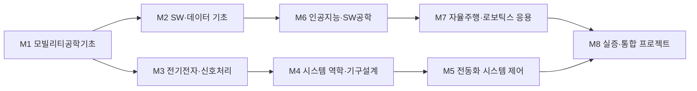

# AI융합학부 · 미래모빌리티학과

> 한성대 AI융합대학 · AI융합학부 / PARC Lab(Physical AI·실시간 제어·로봇·모빌리티) 도메인 정렬

> 조사일 2026-06-25 · 미확정값은 **추정** 표기

## 1. 개요

미래모빌리티학과는 자율주행·전동화(EV)·SDV(소프트웨어 정의 차량)·UAM 등 차세대 이동수단의 **설계·제어·소프트웨어**를 다루는 학과다.

**AI 융합 개편 방향:** 자동차 산업의 무게중심이 하드웨어에서 **소프트웨어·AI**로 이동하면서, 기존 기계·전자 중심 교육을 **인지(perception)→판단(planning)→제어(control) 풀스택 + 딥러닝·MLOps·Edge AI** 중심으로 재편한다. PARC Lab의 실시간 제어·모빌리티 역량과 정렬해 졸업생이 Physical AI 기반 자율 이동체 개발에 즉시 투입 가능하도록 한다.

## 2. 산업·기술 트렌드 (2024–2026)

### 대기업 — 현대차그룹

- **SDV 전환:** 2025년 말 기준 SDV가 기술 개발 단계를 넘어 레벨2+ 중심 양산 안착 국면 진입.
- **포티투닷(42dot):** 그룹 글로벌 소프트웨어 센터, 약 1조원 투입. 핵심 플랫폼 UMOS(Urban Mobility OS), 채용 직무에 VLA(Vision-Language-Action)·피지컬AI·LLM 등 최신 키워드 등장.
- **전동화(EV):** 그룹 2026~2030년 국내 사상 최대 125.2조원 투자. 현대 아이오닉3, 기아 EV2~EV5 등 대중화 모델 확대 → 채용 확장 구간.
- **UAM/슈퍼널(Supernal):** eVTOL S-A2 2028년 상용화 목표이나 2025~2026년 조직 재정비·인력 축소 보도. 중장기 유망·단기 속도조절 분야로 해석.

### 중소·스타트업

| 기업 | 핵심 기술 | 동향(2024–25) |
| --- | --- | --- |
| 스트라드비전 | 카메라 인식 SW 'SVNet' | 글로벌 OEM 13개사+, 누적양산 500만대 돌파, 2025.10 상장심사 청구 |
| 라이드플럭스 | 완전 무인 자율주행 SW | 2024.10 시리즈B 260억원 유치(누적 552억) |
| 서울로봇틱스 | 3D 라이다 AI 솔루션(B2B) | 인프라 기반 자율주행 |
| 토르드라이브 | 자율주행 SW | 2024 재설립·시드 투자 |

## 3. 채용 동향

- **플랫폼 흐름:** 잡코리아 '자율주행개발' 검색 약 350건 수준, 원티드·사람인에 인지/SW 엔지니어 신입·인턴 공고 활발. 42dot 자체 채용은 경력 중심.
- **시장 배경(추정):** 국내 자동차용 SW 시장 2020년 8.56억$ → 2025년 약 17.04억$ 전망(연 14.8% 추정), 자율주행 SW가 최고 성장률.
- **주요 채용 기업:** 현대차(2026년 모빌리티 기술인력 채용), 기아, 현대모비스(ADAS/자율주행 실차평가, IVI SW), 현대오토에버, 포티투닷.
- **신입 직무:** 자율주행 인지 SW 엔지니어, 자율주행 시스템/AI 엔지니어, LLM·에이전트 엔지니어, 차량제어 SW 개발·검증, 데이터 엔지니어링.
- **채용연계 교육(벤치마킹):** 현대차·기아 소프티어 부트캠프, 현대오토에버 모빌리티 SW 스쿨.

### 3-1. 고용 전망 — 국내·미국·중국 동향

!!! abstract "이 트랙과 향후 10년 고용"
    - **국내(고용노동부):** 자동차 등 제조업은 산업전환으로 취업자 감소(2023~2033 제조 -15.1만)하나, 감소는 단순 생산직에 집중되고 자율주행·SDV 같은 연구·공학기술직은 AI가 74.2% '보완'하는 고숙련 영역이다. 신산업 인력부족(2027)에서 AI 1.28만·빅데이터 1.96만 명 부족이 모빌리티 SW 수요와 직결된다.
    - **미국(BLS)·글로벌(WEF):** BLS 2024~2034 컴퓨터·수학 직군 +10.1%로 자율주행 인지·제어 SW 수요 상승, 반면 정형 영업·사무는 AI로 감소. WEF는 AI/ML·SW개발을 성장 직무로, 기업 86%의 AI 전환과 스킬 39% 진부화를 지목해 풀스택 재교육 필요성을 뒷받침한다.
    - **중국:** EV에서 축적한 하드웨어 공급망을 Physical AI로 확장 중이며, 전동화·자율 이동체 경쟁이 모빌리티 인재 수요를 가속한다.
    - **시사점:** 단순 생산직이 아닌 인지→판단→제어 풀스택 + 딥러닝·MLOps 고숙련으로 교육과정을 재편해야 '보완' 영역의 일자리를 선점할 수 있다.

> 📊 거시 분석 전체: [고용노동부 취업동향·10년 전망](../employment-outlook.md) · [글로벌 비교 (미국·중국)](../global-employment-outlook.md)

## 4. 요구 직무 역량

| 구분 | 내용 |
| --- | --- |
| **핵심 직무 역량** | 객체검출·차선인식 인지 모델 개발·검증, 다중센서(카메라·라이다) 캘리브레이션·센서퓨전, 자율주행 시스템 통합·테스트, 판단·제어 알고리즘 + 실차 검증 |
| **AI 융합 역량** | 딥러닝(PyTorch/TensorFlow) 모델 개발·튜닝, MLOps(학습 파이프라인·모니터링), 생성형 AI/LLM·VLA·피지컬AI, Edge AI 추론(NVIDIA Jetson) |
| **기술스택·자격** | C/C++(임베디드·실시간), Python(AI·데이터), MATLAB(제어) / ROS, AUTOSAR, OpenCV / CAN·LIN→차량용 Ethernet / Linux·Git·CI/CD·Yocto |

> 신입 표준 진입 스택: Python + 딥러닝(PyTorch) + Linux + Git + C++

!!! tip "추가 보강 제안 (2026 개편 반영안 · 공식 교과 아님)"
    공식 교과를 대체하지 않는 **추가 보강 방향**이다(신설/심화 제안).
    - **추가 기술트렌드:** Physical AI · 자율주행 · 로봇 시뮬레이션 · 드론/UAM
    - **추가 직무역량:** ROS2 · 제어 · 센서융합 · C++/Python · 안전성 검증
    - **교육과정 보강(제안):** 공식 교과와 Physical AI/로보틱스 시뮬레이션 연계 강화

## 5. 대표 채용 기업 & 직무 예시

- **대기업/계열:** 현대자동차(전동화/SDV 차량제어 SW), 현대모비스(ADAS 실차평가·자율주행 딥러닝·IVI SW·전력변환 제어 SW·임베디드 SW), 포티투닷(자율주행 Software Engineer·ML 엔지니어·LLM 엔지니어), 현대오토에버(차량전장 SW/SDV)
- **중견/전문기업:** 스트라드비전(카메라 인식 SW), 에이스웍스코리아(자율주행 인지 SW 신입)
- **스타트업:** 라이드플럭스(자율주행 SW·ML 엔지니어), 서울로봇틱스(3D 라이다 인지), 토르드라이브, 마스오토(상용차 자율주행)

## 6. 교육과정 개편 시사점 (AI 결합 제언)

1. **AI 진입 스택 편성 권장:** Python·딥러닝(PyTorch)·Linux·Git·C++를 1~2학년 공통 기초 역량으로 편성하는 방안을 권장하고, 인지→판단→제어 풀스택 + 센서퓨전·캘리브레이션 실습을 핵심 트랙으로 배치.
2. **SDV·AI 융합 신영역 신설:** AUTOSAR·차량 Ethernet/도메인 컨트롤러 임베디드 트랙과, 생성형 AI/LLM·VLA·MLOps·Edge AI(Jetson) 모듈을 병행 — 포티투닷·현대모비스 채용에 실제 등장하는 키워드.
3. **산학 연계:** 소프티어 부트캠프·현대오토에버 SW 스쿨·라이드플럭스/포티투닷 인턴십 벤치마킹 PBL·캡스톤. EV는 채용 확장, UAM은 중장기 비중으로 차등 설계.

## 7. 출처

> 인용 형식: **기관·매체 — 「제목」 (발행일/연도) · URL** / 확인일 2026-06-27

- **현대차그룹** — 「SW 생태계」
- **헬로티·파이낸셜뉴스** — 「포티투닷 UMOS·1조 투자」
- **이코노믹데일리** — 「현대차 SDV 전략」
- 「국내 125.2조 투자」
- **머니투데이** — 「스트라드비전 상장심사」
- **서울경제** — 「라이드플럭스 260억」
- **원티드** — 「에이스웍스코리아·포티투닷 채용」
- **현대모비스** — 「채용」
- **청년일보** — 「소프티어 부트캠프」
- **ETRI** — 「자동차 SW 생태계」

## 8. 교육 목표 (공식 교과 기준)

> 학문 분야 정체성: 미래모빌리티학과는 **공학·역학 기초** 위에 자율주행·전동화(EV)·SDV(소프트웨어 정의 차량)를 **인지→제어→AI/Physical AI**로 구현하는 차세대 이동체 인재를 양성한다.

아래 목표는 **한성대 미래모빌리티학과 공식 교과목**(9-1)에 근거해 측정 가능하게 설정한다. 생성형 AI·MLOps·Edge AI 등 심화 항목은 단과대학 공통 또는 보완(제안) 모듈로 운영한다.

1. **공학·역학 기초 역량:** 기초역학Ⅰ·Ⅱ·공학물리·모빌리티 공학수학·선형대수·확률 및 랜덤프로세스를 토대로 모빌리티 시스템을 수학·물리적으로 모델링·해석할 수 있다.
2. **모빌리티 SW·컴퓨팅 역량:** C프로그래밍·모빌리티 프로그래밍 실습·자료구조 및 알고리즘·논리회로 및 컴퓨터구조를 바탕으로 임베디드·AI 응용 소프트웨어를 구현할 수 있다.
3. **자율주행 인지·센서 역량:** 센서처리와 모터제어·모빌리티 센서 응용설계·자율주행시스템 응용을 통해 다중센서 기반 인지·자율주행 파이프라인을 구현할 수 있다.
4. **제어·임베디드·SDV 역량:** 모빌리티 제어설계·모빌리티 제어공학·임베디드시스템 및 운영체제·모빌리티 전자제어유닛 실습·모빌리티 SW공학으로 차량 제어 알고리즘과 ECU·임베디드 시스템을 개발·통합할 수 있다.
5. **AI·Physical AI 융합 및 종합설계 역량:** 인공지능 및 머신러닝개론·실습과 Physical AI & 로보틱스 시뮬레이션·이동로봇과 ROS·기계제품설계(CAD)를 결합해 AI 기반 자율 이동체를 시뮬레이션·구현하고, 모빌리티 종합설계 프로젝트로 통합할 수 있다(졸업 시 종합설계 캡스톤 1건 이상 완수).

## 9. 교육과정 구성 및 교수법 활용

### 9-1. 공식 교육과정 (한성대 미래모빌리티학과)

!!! info "출처·기준"
    한성대학교 미래모빌리티학과 **공식 교육과정**([hansung.ac.kr/CreCon/2798](https://www.hansung.ac.kr/CreCon/2798/subview.do)) 기준. 아래 9-2 이수 흐름과 10장 모듈·학습경로는 이 **공식 교과목을 역량 중심으로 재구성**한 것이며, 공식 목록에 없는 보완 제안 과목은 **(제안)**으로 표기한다.

| 학년·학기 | 교과목 (전공구분) |
| --- | --- |
| 1-1 | 미래모빌리티개론(전공기초), 모빌리티 창의설계 |
| 1-2 | C프로그래밍, 스마트모빌리티와 지역현안문제해결 |
| 2-1 | 모빌리티 공학수학, 모빌리티 프로그래밍 실습, **모빌리티 전기전자회로(전필)**, **논리회로 및 컴퓨터구조(전필)**, 공학물리 |
| 2-2 | **인공지능 및 머신러닝개론(전필)**, **기초역학Ⅰ(전필)**, 선형대수, 확률 및 랜덤프로세스, 자료구조 및 알고리즘, 모빌리티 제어설계 |
| 3-1 | 센서처리와 모터제어, 임베디드시스템 및 운영체제, 모빌리티 제어공학, **기초역학Ⅱ(전필)**, 인공지능 및 머신러닝 실습, 스마트모빌리티실증랩 |
| 3-2 | 모빌리티 센서 응용설계, 모빌리티 전자제어유닛 실습, 기계제품설계(CAD), **자율주행시스템 응용(전필)**, Physical AI & 로보틱스 시뮬레이션 |
| 4-1 | 이동로봇과 ROS, 모빌리티 SW공학, 드론 및 UAM, 모빌리티 종합설계 프로젝트 |
| 4-2 | 모빌리티 통신, 모빌리티 서비스응용 |

> **전공필수(6):** 모빌리티 전기전자회로 · 논리회로 및 컴퓨터구조 · 인공지능 및 머신러닝개론 · 기초역학Ⅰ · 기초역학Ⅱ · 자율주행시스템 응용 / **전공기초:** 미래모빌리티개론

### 9-2. 학년별 이수 흐름 (공식 교과 기준)

- **1학년:** 미래모빌리티개론·모빌리티 창의설계로 전공 정체성을 잡고, C프로그래밍으로 SW 기초를 다진다.
- **2학년:** 모빌리티 공학수학·공학물리·기초역학Ⅰ·선형대수·확률 및 랜덤프로세스로 공학·수학 기반을, 모빌리티 전기전자회로·논리회로 및 컴퓨터구조·모빌리티 프로그래밍 실습·자료구조 및 알고리즘으로 HW/SW 기초를, 인공지능 및 머신러닝개론·모빌리티 제어설계로 AI·제어 입문을 이수한다.
- **3학년:** 센서처리와 모터제어·모빌리티 센서 응용설계·모빌리티 제어공학·기초역학Ⅱ·임베디드시스템 및 운영체제로 인지·제어·임베디드를 심화하고, 인공지능 및 머신러닝 실습·Physical AI & 로보틱스 시뮬레이션·자율주행시스템 응용·기계제품설계(CAD)로 AI·자율주행·설계를 결합한다.
- **4학년:** 이동로봇과 ROS·모빌리티 SW공학·드론 및 UAM·모빌리티 통신·모빌리티 서비스응용을 이수하고, 모빌리티 종합설계 프로젝트(+스마트모빌리티실증랩)로 캡스톤을 수행한다.

### 9-3. 교수법 활용

- **산학 캡스톤(PBL):** 포티투닷·현대오토에버·라이드플럭스 인턴십·부트캠프를 벤치마킹한 실문제 기반 프로젝트.
- **시뮬레이션 실습:** CARLA·자율주행 시뮬레이터와 Jetson 실차 보드를 활용한 가상-실차 연계 실습.
- **AI 페어 실습:** 코딩 어시스턴트·LLM을 활용한 모델 디버깅·코드 리뷰 페어링.
- **데이터·MLOps 워크숍:** 학습 파이프라인 구축·모델 모니터링을 반복 수행하는 핸즈온 랩.

## 10. 모듈형 전공교육과정 (M1~M8)

### 10-1. 모듈형 교육과정 안내

> 출처: 한성대학교 미래모빌리티학과 「모듈형 전공교육과정 안내 및 학습자 진로 가이드」(공식 교과목 기준, 2026-06-30 개정). 아래 표는 공식 가이드의 모듈 안내 표를 그대로 옮긴 것으로, **모든 구성 교과목은 공식 교과목**이다(이수구분: 전기=전공기초, 전필=전공필수, 전선=전공선택).

> **교과 구분 표기:** 이수구분(전기·전필·전선)이 붙은 과목은 **공식 현행 교과**, `(제안)`은 **신설 제안 교과**, `(미정)`은 **개설 학기 미정**이다. 표 오른쪽 '구분' 열은 각 모듈의 교과 구성 성격을 요약한다.

| 모듈 | 모듈명 | 구성 교과목 (학년-학기·이수구분) | 모듈 설명 | 모듈 학습성과 | 모듈 간 관계 | 구분 |
| --- | --- | --- | --- | --- | --- | --- |
| **M1** | 모빌리티공학기초 | 미래모빌리티개론(1-1·전기) · 공학물리(2-1·전선) · 모빌리티 공학수학(2-1·전선) · 선형대수(2-2·전선) | 공학적 사고의 틀을 잡고 미래모빌리티의 개념을 정립하는 모듈 | 미래 모빌리티의 개념·구성요소를 이해하고, 물리 법칙과 선형대수 등 수학적 도구로 모빌리티 시스템을 설명 | 전공기초학습 | 공식 |
| **M2** | SW 프로그래밍 및 데이터 기초 | C 프로그래밍(1-2·전선) · 모빌리티 프로그래밍 실습(2-1·전선) · 자료구조 및 알고리즘(2-2·전선) · 확률 및 랜덤프로세스(2-2·전선) | 모빌리티 SW 구현을 위한 코딩 능력과 확률적 사고를 기르는 모듈 | C언어 기반 프로그래밍 역량으로 모빌리티 데이터를 효율적으로 관리하고, 알고리즘 설계와 확률·통계 기법으로 불확실한 주행 환경 데이터를 분석 | 전공기초학습 | 공식 |
| **M3** | 전기전자 및 신호처리 | 모빌리티 전기전자회로(2-1·전필) · 논리회로 및 컴퓨터구조(2-1·전필) · 모빌리티 제어설계(2-2·전선) | 차량 하드웨어의 기본이 되는 회로 설계와 신호 해석 능력을 배양하는 모듈 | 차량용 전자 회로와 디지털 논리 시스템의 동작 원리를 이해하고, 아날로그 신호를 디지털로 변환·처리해 시스템 제어의 기초 입력 데이터로 가공 | M3-M4-M5 상호보완 | 공식 |
| **M4** | 시스템 역학 및 기구 설계 | 모빌리티 창의설계(1-1·전선) · 기초역학Ⅰ(2-2·전필) · 기초역학Ⅱ(3-1·전필) · 기계제품설계(CAD)(3-2·전선) | 물리적 기체의 움직임을 이해하고 실제 구조물을 설계하는 역학 중심 모듈 | 모빌리티 기체의 구조적 안정성을 분석하고, CAD 소프트웨어로 제작 가능한 수준의 기계 도면 설계 및 3D 모델링을 수행 | M3-M4-M5 상호보완 | 공식 |
| **M5** | 전동화 시스템 제어 | 모빌리티 제어공학(3-1·전선) · 센서처리와 모터제어(3-1·전선) · 임베디드시스템 및 운영체제(3-1·전선) · 모빌리티 전자제어유닛실습(3-2·전선) | 전기차와 로봇의 핵심인 모터 제어와 시스템 데이터 처리를 집중 학습하는 모듈 | RTOS 환경에서 임베디드 시스템을 구축하고, 전동화 차량의 핵심인 모터와 센서를 정밀하게 제어하기 위한 전자제어유닛(ECU) 알고리즘을 구현 | M3-M4-M5 상호보완 | 공식 |
| **M6** | 인공지능 및 SW 공학 | 인공지능 및 머신러닝 개론(2-2·전필) · 인공지능 및 머신러닝 실습(3-1·전선) · Physical AI & 로보틱스 시뮬레이션(3-2·전선) · 모빌리티 SW공학(4-1·전선) | 데이터 기반의 인공지능 모델을 설계하고, 모빌리티 SW를 관리하는 역량을 키우는 모듈 | 머신러닝과 딥러닝 기법으로 주행 환경 객체를 인식하는 컴퓨터비전 시스템을 개발하고, 소프트웨어공학 방법론을 적용해 신뢰성 있는 모빌리티 소프트웨어를 설계 | M6-M7 상호보완 | 공식 |
| **M7** | 자율주행 및 로보틱스 응용 | 자율주행시스템응용(3-2·전필) · 모빌리티 센서 응용설계(3-2·전선) · 이동로봇과 ROS(4-1·전선) · 드론 및 UAM(4-1·전선) | 실제 이동체에 자율주행 알고리즘을 적용하고 드론/UAM 등 차세대 기체를 다루는 모듈 | ROS를 활용해 이동 로봇과 자율주행 시스템의 경로 계획 및 판단 알고리즘을 구현하고, 드론 및 UAM을 포함한 미래 이동체의 제어 시스템을 통합 운영 | M6-M7 상호보완 | 공식 |
| **M8** | 스마트모빌리티 실증 및 통합 프로젝트 | 스마트모빌리티와 지역현안문제해결(RISE 연계, 학년공통-2학기·전선) · 스마트모빌리티실증랩(프리캡스톤, 3-1·전선) · 모빌리티 종합설계 프로젝트(4-1·전선) · 모빌리티 서비스 응용(4-2·전선) · 모빌리티 통신(4-2·전선) | 시스템 간 연결을 배우고 실무 프로젝트를 통해 최종 성과물을 도출하는 모듈 | V2X 기술을 이해하고 이를 활용한 모빌리티 서비스를 기획하며, 4년간 습득한 전공 역량을 집결해 실제 모빌리티 시스템 프로토타입을 설계·제작·검증 | 기존 모듈학습 역량 검증 | 공식 |

### 10-2. 모듈형 교육과정 로드맵 (학년·학기)

공식 가이드의 로드맵 표를 그대로 옮긴 것으로, 각 모듈 교과목이 **언제 개설되는지**(학년-학기)를 한눈에 보여준다.

| 모듈 | 1-1 | 1-2 | 2-1 | 2-2 | 3-1 | 3-2 | 4-1 | 4-2 |
| --- | --- | --- | --- | --- | --- | --- | --- | --- |
| **M1** 모빌리티공학기초 | 미래모빌리티개론 | | 공학물리 · 모빌리티 공학수학 | 선형대수 | | | | |
| **M2** SW·데이터 기초 | | C 프로그래밍 | 모빌리티 프로그래밍 실습 | 자료구조 및 알고리즘 · 확률 및 랜덤프로세스 | | | | |
| **M3** 전기전자·신호처리 | | | 모빌리티 전기전자회로 · 논리회로 및 컴퓨터구조 | 모빌리티 제어설계 | | | | |
| **M4** 시스템 역학·기구설계 | 모빌리티 창의설계 | | | 기초역학Ⅰ | 기초역학Ⅱ | 기계제품설계(CAD) | | |
| **M5** 전동화 시스템 제어 | | | | | 모빌리티 제어공학 · 센서처리와 모터제어 · 임베디드시스템 및 운영체제 | 모빌리티 전자제어유닛실습 | | |
| **M6** 인공지능·SW공학 | | | | 인공지능 및 머신러닝 개론 | 인공지능 및 머신러닝 실습 | Physical AI & 로보틱스 시뮬레이션 | 모빌리티 SW공학 | |
| **M7** 자율주행·로보틱스 응용 | | | | | | 자율주행시스템응용 · 모빌리티 센서 응용설계 | 이동로봇과 ROS · 드론 및 UAM | |
| **M8** 스마트모빌리티 실증·통합 | | 스마트모빌리티와 지역현안문제해결 | | | 스마트모빌리티실증랩 | | 모빌리티 종합설계 프로젝트 | 모빌리티 서비스 응용 · 모빌리티 통신 |

**트랙별 핵심 모듈 흐름(요약 다이어그램):**

- **마이크로디그리:** 'M5 전동화 시스템 제어', 'M6 인공지능·SW공학', 'M7 자율주행·로보틱스 응용' 등 각 모듈을 마이크로디그리로 인증할 수 있다.
- **타 학과 교차수강:** 미래모빌리티 ↔ AI기계로봇공학과(2027 신설 예정) 간 Physical AI·실시간 제어·시뮬레이션 교과를 공유하며, PARC Lab 도메인을 매개로 자율 이동체와 로봇 제어 역량을 교차 이수한다.

### 10-3. 학습자 진로 가이드

공식 가이드가 제시하는 **트랙별 권장 모듈 조합**이다.

| 트랙 | 권장 모듈 조합 | 지향 |
| --- | --- | --- |
| **자율주행 트랙** | M1 모빌리티공학기초 + M2 SW·데이터 기초 + M6 인공지능·SW공학 + M7 자율주행·로보틱스 응용 | 자율주행 인지·판단·SW |
| **전동화제어 트랙** | M1 모빌리티공학기초 + M3 전기전자·신호처리 + M4 시스템 역학·기구설계 + M5 전동화 시스템 제어 | 모터·ECU·기구 설계 |
| **프로젝트·서비스 트랙** | M1~M7 중 관심 모듈 2개 이상 + M8 스마트모빌리티 실증·통합 프로젝트 | 실증·서비스 기획·통합 |

### 10-4. 학생 학습경로 예시

> 아래 경로의 과목은 모두 **공식 교과목명** 기준이다(보완 항목만 (제안) 표기).

- **경로 A — 자율주행 인지 엔지니어:** 1학년 미래모빌리티개론·C프로그래밍 → 2학년 인공지능 및 머신러닝개론·자료구조 및 알고리즘·모빌리티 전기전자회로 → 3학년 센서처리와 모터제어·모빌리티 센서 응용설계·자율주행시스템 응용·인공지능 및 머신러닝 실습 → 4학년 이동로봇과 ROS·모빌리티 종합설계 프로젝트(인지 캡스톤) → 자율주행 인지 SW 엔지니어로 진출.
- **경로 B — SDV·차량제어 엔지니어:** 1학년 C프로그래밍·모빌리티 창의설계 → 2학년 모빌리티 제어설계·모빌리티 전기전자회로·논리회로 및 컴퓨터구조 → 3학년 모빌리티 제어공학·임베디드시스템 및 운영체제·모빌리티 전자제어유닛 실습 → 4학년 모빌리티 SW공학·모빌리티 통신·모빌리티 종합설계 프로젝트 → 차량제어·SDV 임베디드 엔지니어로 진출.

- **경로 C — 모빌리티 데이터·AI 엔지니어:** 1학년 C프로그래밍 → 2학년 인공지능 및 머신러닝개론·확률 및 랜덤프로세스·선형대수·자료구조 및 알고리즘 → 3학년 인공지능 및 머신러닝 실습·Physical AI & 로보틱스 시뮬레이션·스마트모빌리티실증랩 → 4학년 모빌리티 종합설계 프로젝트(+(제안) MLOps·Edge AI 보완) → 모빌리티 데이터·AI 엔지니어로 진출.

- **경로 D — 모빌리티 메카·설계/로보틱스 연구(대학원 진학):** 1학년 미래모빌리티개론·공학물리 → 2학년 기초역학Ⅰ·모빌리티 공학수학·모빌리티 제어설계 → 3학년 기초역학Ⅱ·기계제품설계(CAD)·모빌리티 제어공학 → 4학년 이동로봇과 ROS·드론 및 UAM·Physical AI & 로보틱스 시뮬레이션·모빌리티 종합설계 프로젝트 → 대학원 진학·자율주행/로보틱스 연구원으로 진출.

### 10-5. 상위 수준 보완 권고

> 아래는 국민대·한양대·아주대·서울과기대 등 미래자동차·모빌리티 특성화 **상위 비교군** 및 산업 표준 정렬을 위한 **보완 권고**다. **공식 교과를 대체하지 않으며**, 2027학년도 교과 개편 시 심의 의견·향후 개선 계획으로 활용한다.

| 보완 영역 | 반영 위치 | 추가하면 좋은 내용 | 기대 효과 |
| --- | --- | --- | --- |
| SDV·차량 SW 아키텍처 | M6, M8 | AUTOSAR Classic/Adaptive, 차량 API, OTA, 서비스지향 아키텍처 개념 | 상위 비교군의 차량 SW 심화 수준과 정렬 |
| 차량 네트워크·V2X | M3, M8 | CAN/LIN/Ethernet, SOME/IP, V2X/C-ITS 로그 분석 실습 | 모빌리티 통신 과목의 산업 적합도 강화 |
| 안전·검증·보안 | M7, M8 | ISO 26262, SOTIF, UN R155/R156, 시나리오 기반 테스트, 사이버보안 점검표 | 자율주행 데모를 안전한 시스템 설계 역량으로 확장 |
| 센서퓨전·MLOps | M2, M6, M7 | 카메라/라이다 캘리브레이션, 데이터 버전관리, 모델 평가, 재학습 리포트 | AI 과목과 자율주행 과목의 연결성 강화 |
| EV/BMS·전력전자 | M3, M5 | 배터리, BMS, 인버터, 모터 제어, 열관리 기초 | 전동화제어 트랙의 산업 범위 확대 |
| 산업체 검증형 포트폴리오 | M8 | 요구사항 문서, 코드 저장소, 테스트 리포트, 안전/보안 체크, 데모 영상 | 졸업 시 취업·진학용 산출물 명확화 |
