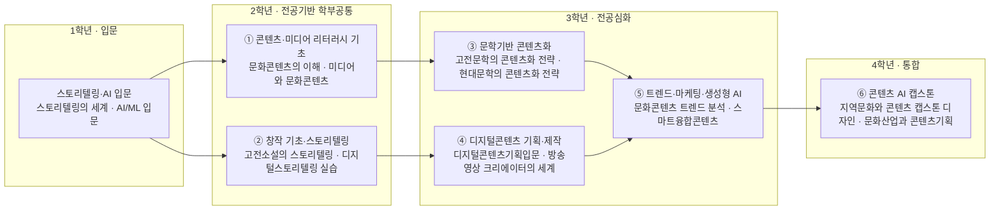

# AI융합학부 · 문학문화콘텐츠학과

> 한성대 창의융합대학(2027 이후 AI융합대학) · AI융합학부 / 조사일 2026-06-25 · 미확정값은 **추정** 표기

## 1. 개요

문학문화콘텐츠학과는 스토리텔링·시나리오·IP 기획·웹툰/웹소설·OTT 등 **콘텐츠 창작과 기획**을 다루는 학과다.

**AI 융합 개편 방향:** 생성형 AI가 콘텐츠 기획→작화→번역→유통 전 공정으로 확산되면서, 순수 창작 역량에 **프롬프트 엔지니어링·생성형 AI 툴 활용·AI 산출물 검수·데이터 리터러시**를 결합한다. '스토리텔링 × 생성형 AI' 통합 트랙으로 K-콘텐츠 글로벌 확장 시대의 기획·제작 인재를 양성한다.

## 2. 산업·기술 트렌드 (2024–2026)

### 시장 규모 (출처별 집계 기준 차이 있음)

- 콘텐츠산업 매출 157조~162조원, 수출 약 20~21조원(역대 최고, 5년 연속 성장). 게임이 수출의 절반 이상.
- 정부 K-콘텐츠 정책펀드 2025년 약 6,000억 → 2026년 역대 최대 7,300억원(정부 계획치).
- 2024년 웹툰산업 매출 2조2,856억원(+4.4%) — 한콘진 국가승인통계. 수출 일본 49.5%·북미 21.0%.

### 대기업 — 생성형 AI 전환

- **네이버웹툰:** AI 번역으로 해외 서비스 작품 약 2,000편 → 1.5만편+. 'AI 1차 번역 + 전세계 500명+ 현지 감수' 2단계 프로세스, 불법복제 추적 'AI 툰레이더'.
- **카카오엔터테인먼트:** IP용 AI 브랜드 '헬릭스(Helix)' — 헬릭스 푸시/큐레이션/숏츠(AI 웹툰 숏폼 자동 제작). 스토리 부문 흑자전환을 AI 성과로 제시.
- **CJ ENM:** 2025년 '글로벌 AI 콘텐츠 스튜디오' 선언. 'AI 스크립트'(IP 발굴 에이전트)·'시네마틱 AI'(이미지·영상·사운드 원스톱), 버추얼 프로덕션.
- **리디(RIDI):** 2025년 매출 2,516억원(역대 최대). 글로벌 플랫폼 '만타(Manta)' 북미 상위권, AI 내재화.

### OTT

- 2024년 점유율(이용자): 넷플릭스 33.9% > 티빙 21.1% > 쿠팡플레이 20.1% > 웨이브 12.4%. 티빙·웨이브 합병('K-OTT') 추진.

### 스타트업

- 블랙박스(웹툰→숏 애니 AI, TIPS), 아이피아('웹툰소설'·생성형 AI '팝테일 AI'), 스쿼드엑스(숏폼 AI 제작), 뤼튼테크놀로지스(프롬프트 엔지니어 공채).

## 3. 채용 동향

- **플랫폼 흐름:** 잡코리아 'OTT' 검색 약 308건, '프롬프트 엔지니어' 관련 124건+. 직무명이 '콘텐츠 기획'에서 'AI 프로덕트 기획'·'AI 제작/편집 PD'로 진화.
- **주요 채용 기업·직무:** 네이버웹툰 2025 공채에 'AI 프로덕트 기획'·데이터 사이언티스트·작품 기획/운영(학력 무관). 카카오웹툰 스튜디오 작가 상시 모집. 웨이브 CRM 마케팅(BigQuery·Looker·Tableau), 티빙 OTT 전문가.
- **신입 키워드 변화:** 전공보다 데이터 분석·생성형 AI 툴·콘텐츠 기획 역량 우선. KOCCA 채용정보 게시판이 업계 공고 상시 집계.

### 3-1. 고용 전망 — 국내·미국·중국 동향

!!! abstract "이 트랙과 향후 10년 고용"
    - **국내(고용노동부):** 수요는 서비스업 증가(2023~2033 +61.3만)로 콘텐츠 산업에 우호적이나, 정형 사무·단순 작업은 AI 대체율 61~80%로 높다. 반면 창의·기획이 핵심인 전문가·서비스직은 대체율 21~40%에 그쳐, 생성형 AI를 '도구'로 쓰는 기획·창작 직무가 상대적으로 안전하다.
    - **미국(BLS)·글로벌(WEF):** BLS는 의료속기 -4.9% 등 자동화·음성인식 AI 등으로 감소 가능성이 언급되는 직무를 보여주고, WEF는 사무·비서·데이터입력을 감소 직무로, 데이터·AI 활용 역량을 성장 영역으로 지목한다. 기업 86%가 생성형 AI·정보처리 기술 전환을 추진해 콘텐츠 워크플로 자동화가 표준이 된다.
    - **시사점:** 순수 창작에 프롬프트 엔지니어링·AI 산출물 검수·데이터 리터러시를 결합해, 대체가 아닌 '보완'으로 작동하는 휴먼-인-더-루프 역량을 길러야 한다.

> 📊 거시 분석 전체: [고용노동부 취업동향·10년 전망](../employment-outlook.md) · [글로벌 비교 (미국·중국)](../global-employment-outlook.md)

## 4. 요구 직무 역량

| 구분 | 내용 |
| --- | --- |
| **핵심 직무 역량** | 콘텐츠 기획·스토리텔링·시나리오/시놉시스, 세계관·캐릭터 설계, IP 트랜스미디어(웹툰↔웹소설↔영상) 기획, 숏폼/롱폼 연출, 글로벌 현지화 |
| **AI 융합 역량** | 프롬프트 엔지니어링(지시문 설계·LLM 특성 이해), 생성형 AI 활용 작화 보조·번역 검수·워크플로 자동화, AI 산출물 검수·품질관리(휴먼-인-더-루프) |
| **기술·툴** | 텍스트/대화형: ChatGPT·Claude / 이미지: Midjourney·Stable Diffusion / 영상: Premiere·Final Cut·DaVinci·After Effects / 데이터: BigQuery·Looker Studio·Tableau |

!!! tip "추가 보강 제안 (2026 개편 반영안 · 공식 교과 아님)"
    공식 교과를 대체하지 않는 **추가 보강 방향**이다(신설/심화 제안).
    - **추가 기술트렌드:** AI 로컬라이제이션 · IP 세계관 · 생성형 제작 파이프라인
    - **추가 직무역량:** 프롬프트 글쓰기 · AI 번역검수 · 저작권/IP 관리
    - **교육과정 보강(제안):** AI 콘텐츠 제작검수 · 글로벌 IP 캡스톤

## 5. 대표 채용 기업 & 직무 예시

- **대기업/플랫폼:** 네이버웹툰(AI 프로덕트 기획·작품 기획·데이터 사이언티스트), 카카오엔터/카카오웹툰(작가·IP 기획·헬릭스 추천), CJ ENM(AI 콘텐츠 스튜디오·버추얼 프로덕션), 티빙·웨이브(OTT 기획·CRM 데이터 마케팅)
- **중견:** 리디/만타(콘텐츠 기획·제품 경력직·디지털 퍼블리싱)
- **스타트업:** 블랙박스(AI 웹툰→애니), 아이피아(웹툰소설), 스쿼드엑스(숏폼 AI PD), 뤼튼테크놀로지스(프롬프트 엔지니어)

## 6. 교육과정 개편 시사점 (AI 결합 제언)

1. **'스토리텔링 × 생성형 AI' 통합 트랙:** 시나리오·세계관 설계 + 프롬프트 엔지니어링 + 이미지/영상 생성 툴(Midjourney·Stable Diffusion) 실습을 하나의 과목군으로 묶어 창작-AI를 분리하지 않는다.
2. **AI 검수·로컬라이제이션 역량:** 네이버웹툰형 'AI 1차 번역 + 인간 감수' 모델이 표준화되는 만큼 다국어 현지화·AI 품질관리 교육을 신설.
3. **데이터 리터러시 필수화:** OTT·콘텐츠 마케팅 직무가 BigQuery·Tableau를 실제 요구 → 콘텐츠 전공자에게도 데이터 분석 기초와 IP 트랜스미디어 기획 PBL을 제공.

## 7. 출처

> 인용 형식: **기관·매체 — 「제목」 (발행일/연도) · URL** / 확인일 2026-06-27

- **전자신문·경향신문** — 「K콘텐츠 매출·수출」
- **매일타임즈** — 「2024 웹툰산업 매출」
- **데일리안** — 「K-콘텐츠 펀드」
- **CEOSCOREDAILY** — 「OTT 점유율」
- **이슈인사이트** — 「네이버웹툰 AI 번역」
- **AI타임스** — 「카카오 헬릭스」
- **전자신문** — 「CJ ENM AI 스튜디오」
- **리디** — 「2025 실적」
- **원티드** — 「네이버웹툰·스쿼드엑스 채용」
- **KOCCA** — 「채용정보」

## 8. 교육 목표 (예시)

> 학문 분야 정체성: 문학문화콘텐츠학과는 스토리텔링·세계관·IP 기획을 토대로 생성형 AI를 창작·제작·유통 전 공정에 결합하는 K-콘텐츠 융합형 기획·창작 인재를 양성한다.

순수 창작·스토리텔링의 인문학적 정체성을 유지하면서, 생성형 AI 활용과 데이터 리터러시를 결합한 측정 가능한 목표를 설정한다.

1. **스토리텔링·IP 기획 역량:** 세계관·캐릭터·시나리오를 설계하고 웹툰↔웹소설↔영상으로 확장하는 IP 트랜스미디어 기획안을 완성할 수 있다(졸업 시 IP 기획 포트폴리오 1건 이상).
2. **생성형 AI 창작 융합 역량:** 프롬프트 엔지니어링으로 텍스트·이미지·영상 생성 툴(ChatGPT·Claude·Midjourney·Stable Diffusion)을 창작 워크플로에 통합하고 결과를 연출 의도에 맞게 제어할 수 있다.
3. **AI 검수·로컬라이제이션 역량:** '휴먼-인-더-루프' 원칙에 따라 AI 1차 번역·작화 산출물을 검수하고 다국어 현지화 품질을 관리할 수 있다.
4. **콘텐츠 데이터 리터러시·AI 윤리 역량:** BigQuery·Looker·Tableau로 콘텐츠·OTT 데이터를 분석하고, 저작권·창작 윤리 등 생성형 AI 거버넌스 기준을 적용할 수 있다.

## 9. 교육과정 구성 및 교수법 활용

**교육과정 구성**

- **기초 단계(1학년):** 스토리텔링·시나리오 기초와 AI 핵심·에이전트 기초(생성형 AI·프롬프트 이해)를 공통으로 이수한다.
- **전공심화 단계(2~3학년):** 세계관·캐릭터 설계, IP 트랜스미디어 기획, 숏폼/롱폼 연출을 심화한다.
- **AI 융합 단계(3~4학년):** 생성형 AI 작화·번역 검수·워크플로 자동화와 콘텐츠 데이터 분석을 결합한다.
- **캡스톤 단계(4학년):** 스토리텔링×생성형 AI 통합 IP 제작 프로젝트로 기획→제작→현지화 전 과정을 구현한다.

**교수법 활용**

- **창작·포트폴리오 중심:** 개별 IP·시나리오를 학기마다 누적해 졸업 포트폴리오로 발전시키는 작품 중심 수업.
- **AI 페어 창작 실습:** LLM·이미지/영상 생성 툴과 협업하며 프롬프트를 반복 개선하는 핸즈온 워크숍.
- **산학 PBL:** 네이버웹툰·카카오엔터·CJ ENM형 AI 콘텐츠 워크플로를 모사한 실무 프로젝트.
- **데이터 리터러시 랩:** 콘텐츠·OTT 데이터 분석 실습으로 기획 의사결정을 데이터로 검증.

## 10. 모듈형 전공교육과정 (역량·성과 중심)

### 10-1. 역량 중심 모듈 구성

> 본 모듈은 **한성대 공식 교과과정([https://www.hansung.ac.kr/CreCon/2771/subview.do](https://www.hansung.ac.kr/CreCon/2771/subview.do))**을 기본 데이터로 3~4과목 단위로 재구성했다. 공식 목록에 없는 과목은 **(예시)**로 표기. 확인일 2026-06-28.

| 모듈명 | 계층 | 핵심 역량·주제 | 학습 성과 | 대표 교과(공식 3~4과목) |
| --- | --- | --- | --- | --- |
| 콘텐츠·미디어 리터러시 기초 | 학부 공통 | 디지털 미디어 이해, 콘텐츠 산업·플랫폼 생태계 | 플랫폼 구조 분석, 콘텐츠 산업 이해 | 문화콘텐츠의 이해 · 문화콘텐츠산업의 이해 · 미디어와 문화콘텐츠 · 웹콘텐츠와 플랫폼의 이해 |
| 창작 기초·스토리텔링 | 학부 공통 | 서사 구조, 캐릭터·세계관, 스토리텔링 작법 | 시놉시스·시나리오 작성, 세계관 설계 | 스토리텔링의 세계 · 고전소설의 스토리텔링 · 현대소설의 스토리텔링 · 디지털스토리텔링 실습 |
| 문학기반 콘텐츠화 | 학과 전공 | 문학 원형 발굴, 콘텐츠화 전략, 콘텐츠 비평 | 문학 IP 콘텐츠화 기획, 비평적 분석 | 문학기반 대표 콘텐츠 케이스스터디 · 세계문학 기반 콘텐츠비평 · 고전문학의 콘텐츠화 전략 · 현대문학의 콘텐츠화 전략 |
| 디지털콘텐츠 기획·제작 | 학과 전공 | 콘텐츠 기획, 제작툴, 영상 크리에이팅 | 디지털콘텐츠 기획·제작 실습 완성 | 디지털콘텐츠기획입문 · 디지털콘텐츠 제작툴의 이해 · 디지털콘텐츠 기획 제작 실습 · 방송영상 크리에이터의 세계 |
| 트렌드·마케팅·생성형 AI | 학과 전공 | 콘텐츠 트렌드, 마케팅, 생성형 AI 융합 | 트렌드 분석·마케팅, AI 융합 콘텐츠 제작 | 문화콘텐츠 트렌드 분석 · 문화콘텐츠 마케팅 · 스마트융합콘텐츠 · 프롬프트 엔지니어링(예시) |
| 콘텐츠 AI 캡스톤 | 학과 전공 | 기획→제작→유통 통합, 산학 IP 프로젝트 | 생성형 AI 기반 IP 제작·발표 | 지역문화와 콘텐츠-캡스톤 디자인 · 드라마콘텐츠 메이킹실습-캡스톤디자인 · 문화산업과 콘텐츠기획 · 산학 IP 프로젝트(예시) |

#### 10-1 (A) 1~4학년 모듈 로드맵

#### 10-1 모듈–역량 매핑 (학습 역량 ↔ 기업 요구역량)

> 본 표는 위 모듈의 핵심 학습 역량을 4장 요구 직무 역량과 직접 매핑한 것이다.

| 모듈 | 핵심 역량(학습) | 매핑되는 기업 요구 역량 |
| --- | --- | --- |
| ① 콘텐츠·미디어 리터러시 기초 | 디지털 미디어 이해, 콘텐츠 산업·플랫폼 생태계 | 콘텐츠 산업·플랫폼 이해, 콘텐츠 데이터 리터러시(BigQuery·Tableau) 토대 |
| ② 창작 기초·스토리텔링 | 서사 구조, 캐릭터·세계관, 스토리텔링 작법 | 콘텐츠 기획·스토리텔링·시나리오/시놉시스, 세계관·캐릭터 설계 |
| ③ 문학기반 콘텐츠화 | 문학 원형 발굴, 콘텐츠화 전략, 콘텐츠 비평 | IP 트랜스미디어(웹툰↔웹소설↔영상) 기획 |
| ④ 디지털콘텐츠 기획·제작 | 콘텐츠 기획, 제작툴, 영상 크리에이팅 | 숏폼/롱폼 연출, 영상 제작툴(Premiere·DaVinci·After Effects) |
| ⑤ 트렌드·마케팅·생성형 AI | 콘텐츠 트렌드, 마케팅, 생성형 AI 융합 | 프롬프트 엔지니어링, 생성형 AI 활용(Midjourney·Stable Diffusion), 콘텐츠 데이터 마케팅 |
| ⑥ 콘텐츠 AI 캡스톤 | 기획→제작→유통 통합, 산학 IP 프로젝트 | AI 산출물 검수·품질관리(휴먼-인-더-루프), 글로벌 현지화 |

### 10-2. 모듈 간 관계 (학과·학부·단과대학)

- **위계:** 단과대학 공통(AI 핵심·에이전트 기초) → AI융합학부 공통(디지털 콘텐츠·미디어 리터러시, 창작 기초·스토리텔링) → 학과 전공심화(생성형 AI 창작 / IP 기획·트랜스미디어 / AI 검수·로컬라이제이션) → 캡스톤으로 수렴한다.
- **선후수:** 창작 기초·스토리텔링과 AI 핵심·에이전트 기초 이수 후 스토리텔링×생성형 AI 창작 모듈 수강. IP 기획 이수 후 콘텐츠 AI 캡스톤 진입.
- **마이크로디그리:** '프롬프트 엔지니어링·AI 창작', 'IP 트랜스미디어 기획', '콘텐츠 데이터 분석' 각 모듈을 마이크로디그리로 인증.
- **타 학과 교차수강:** AI 핵심·에이전트 기초를 단과대학 전체와 공유하고, 데이터 리터러시 모듈은 모빌리티·로봇 학과의 데이터 엔지니어링 기초와 교차 이수해 융합 기획 역량을 확장한다.

### 10-3. 진로 분야별 모듈 조합 가이드

| 진로 분야 | 권장 모듈 조합 | 목표 직무 |
| --- | --- | --- |
| AI 콘텐츠 기획/제작 | AI 핵심·에이전트 기초 + 스토리텔링×생성형 AI 창작 + IP 기획·트랜스미디어 | AI 프로덕트 기획자, AI 제작/편집 PD |
| IP·트랜스미디어 기획 | 창작 기초·스토리텔링 + IP 기획·트랜스미디어 + AI 검수·로컬라이제이션 | IP 기획자, 트랜스미디어 프로듀서 |
| 콘텐츠 데이터/OTT 마케팅 | 디지털 콘텐츠·미디어 리터러시 + AI 핵심·에이전트 기초 + IP 기획·트랜스미디어 | 콘텐츠 데이터 분석가, OTT CRM·마케팅 기획자 |

### 10-4. 학생 학습경로 예시

- **경로 A — AI 콘텐츠 기획 PD:** 1학년 스토리텔링 기초 + AI/ML 입문 → 2학년 시나리오 작법 + 생성형 AI와 에이전트 → 3학년 스토리텔링×생성형 AI 창작 + IP 기획 → 4학년 AI 검수·로컬라이제이션 + 콘텐츠 AI 캡스톤(네이버웹툰형 AI 제작 프로젝트).
- **경로 B — 콘텐츠 데이터 기획자:** 1학년 디지털 미디어론 + AI/ML 입문 → 2학년 콘텐츠 데이터 리터러시 → 3학년 IP 기획·트랜스미디어 + 콘텐츠 데이터 분석 → 4학년 OTT 데이터 마케팅 캡스톤(티빙·웨이브형 CRM 데이터 프로젝트).

- **경로 C — 글로벌 IP 로컬라이제이션 매니저:** 1학년 스토리텔링 기초 + AI/ML 입문 → 2학년 시나리오 작법 + 생성형 AI와 에이전트 → 3학년 IP 기획·트랜스미디어 + 콘텐츠 로컬라이제이션 → 4학년 AI 품질관리 + 콘텐츠 AI 캡스톤(네이버웹툰·리디 만타형 'AI 1차 번역 + 인간 감수' 다국어 현지화 프로젝트) → 글로벌 로컬라이제이션 매니저·해외 서비스 기획자로 진출.

- **경로 D — AI 창작 스타트업 창업가:** 1학년 스토리텔링 기초 + AI/ML 입문 → 2학년 비주얼 스토리텔링 + 프롬프트 엔지니어링 → 3학년 스토리텔링×생성형 AI 창작 + IP 기획·트랜스미디어 → 4학년 콘텐츠 데이터 분석 + 콘텐츠 AI 캡스톤(블랙박스·아이피아형 웹툰→숏폼 AI IP 창업 프로젝트) → AI 콘텐츠 스타트업 창업가·인디 IP 크리에이터로 진출.
