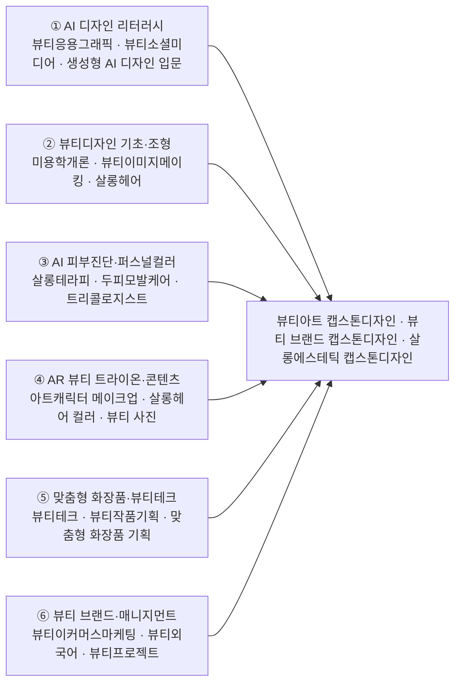

# 뷰티디자인매니지먼트학과 (2027 개편/제안명: AI뷰티디자인학과)

> **현행 공식명은 뷰티디자인매니지먼트학과**이며, 'AI뷰티디자인학과'는 2027 개편/제안명이다. 2026학년도 AI융합교육과정 개편 리서치. 조사 기준: 2024–2026 / 사람인·잡코리아·원티드·LinkedIn 및 산업 보고서(KPMG·PwC 등)

> 조사일 2026-06-25 · 확인일 2026-06-27

## 1. 개요

**뷰티디자인매니지먼트학과**(2027 개편/제안명 'AI뷰티디자인학과')는 메이크업·스킨케어·헤어·네일 등 전통 뷰티 디자인 역량에, **뷰티테크(Beauty-Tech)**와 **데이터·AI 기반 초개인화 서비스 설계** 역량을 결합한 융합형 인재를 양성하는 학과입니다.

화장품이 '바르는 제품'에서 **데이터 기반 테크 서비스**로 이동하면서, 뷰티 전문가에게도 AI 피부진단 데이터 해석, AR 가상 메이크업 콘텐츠 기획, 맞춤형 화장품 큐레이션 등의 디지털 역량이 요구되고 있습니다.

- **AI 융합 개편 방향**: 감각·미용 실무 + AI 피부/컬러 진단 데이터 활용 / 브랜드·콘텐츠 디자인 + 생성형 AI 비주얼·마케팅 워크플로 / 매장·서비스 운영 + 초개인화 추천·뷰티테크 디바이스 운용

## 2. 산업·기술 트렌드 (2024–2026)

### K-뷰티 시장

- 한국 화장품 수출 **2024년 사상 첫 90억 달러 돌파**, **2025년 약 114억 달러**로 **세계 2위 수출국** 부상.
- **인디브랜드 전성시대**: 중저가·고효능 기초 중심 인디브랜드가 전년 대비 50% 이상 고성장. 2026년 키워드 **'K-뷰티 3.0'**.

### 대기업 동향

| 기업 | AI·뷰티테크 움직임 |
| --- | --- |
| **아모레퍼시픽** | 생성형 AI 음성 챗봇 '워너-뷰티 AI', AI 뷰티 컨설턴트(AIBC), AI 파운데이션 조제 서비스, 초박형 센서 패치 '스킨사이트' |
| **LG생활건강** | 신소재·신제형 R&D 중심, 맞춤형/디바이스 기반 제품 개발 확대 |
| **한국콜마** | 'AI 팩토리' — 실시간 공정 최적화, 다품종 소량 생산 |

### 인디브랜드·스타트업

- **에이피알(메디큐브)** 디바이스·콘텐츠 결합 글로벌 확장. **룰루랩(Lululab)**: 삼성 C-Lab 스핀오프, AI 피부분석 '루미니', 전 세계 500만+ 피부 데이터. **앙트러리얼리티(트위닛)**: AI 피부분석+AR 메이크업, CES 2024 혁신상.

### 뷰티테크 핵심 기술

- AI 피부진단 / 가상 메이크업·AR 트라이온 / 퍼스널 컬러 AI / 맞춤형 화장품 즉석 조제

### 리테일

- **CJ올리브영**: 2025년 매출 약 5조원, 앱 MAU 1,000만+, 매장 내 피부·두피·퍼스널컬러 분석 체험형 서비스. **뷰티컬리**·다이소 뷰티 급성장.

## 3. 채용 동향

- **대기업 정기 공채 유지**: 아모레퍼시픽(2026년 진행 공고 약 6건), CJ올리브영(2026 신입 공채), LG생활건강 등에서 **제품디자인·비주얼디자인·VMD·MD·상품마케팅** 직무 상시 모집.
- **디자인 직군 세분화**: 아모레퍼시픽은 제품디자인·브랜드 디자인·비주얼콘텐츠 디자인(경력 3년+) 공고 분리 게시.
- **인디브랜드·스타트업 콘텐츠 직무 급증**: 에이피알(메디큐브) 등 콘텐츠 마케팅 채용연계형 인턴 모집(Adobe + 영상 편집 + SNS 콘텐츠).
- **신입 진입 직무**: 제품/패키지 디자이너, 비주얼·콘텐츠 디자이너, VMD, 뷰티 MD/상품기획, 브랜드·콘텐츠 마케터, 매장 뷰티 컨설턴트(BA), 뷰티테크 서비스 운영.

### 3-1. 고용 전망 — 국내·미국·중국 동향

!!! abstract "이 트랙과 향후 10년 고용"
    - **국내(고용노동부):** 향후 10년 수요가 돌봄·보건 서비스와 대인 서비스에 집중되며, 전문가·서비스직은 AI 대체율이 21~40%로 낮아 뷰티·헬스 BA·컨설턴트 등 대면 직무의 안정성이 상대적으로 높다.
    - **미국(BLS)·글로벌(WEF):** BLS는 보건·사회복지를 2024~2034년 **+8.4%**로 전 산업 최고 성장으로 전망하며 돌봄도우미 일자리가 최다 증가한다. 고령화에 따른 뷰티·헬스 서비스 결합 수요와 맞물린다.
    - **시사점:** 대면 서비스·고객 경험 역량에 디지털·뷰티테크 운영 역량을 더해 대체되기 어려운 융합 인재를 길러야 한다.

> 📊 거시 분석 전체: [고용노동부 취업동향·10년 전망](../employment-outlook.md) · [글로벌 비교 (미국·중국)](../global-employment-outlook.md)

## 4. 요구 직무 역량

| 구분 | 세부 역량 |
| --- | --- |
| **핵심 직무 역량** | 메이크업·스킨케어·헤어 실무, 색채·조형 감각, 퍼스널 컬러 진단, 브랜드/패키지·비주얼 디자인, VMD·매장 연출, 트렌드 리서치, 고객 컨설팅 |
| **AI 융합 역량** | AI 피부진단 데이터 해석, 퍼스널컬러 AI·AR 트라이온 활용, 맞춤형 화장품 조제 데이터 이해, 생성형 AI 비주얼/카피 제작, 초개인화 추천 로직 이해, 뷰티테크 디바이스 운용 |
| **주요 툴·자격** | Adobe Photoshop·Illustrator·Premiere·After Effects, Figma, CLO/3D, 생성형 AI 툴, 맞춤형화장품 조제관리사, 컬러리스트(산업)기사, 미용사(국가) |

## 5. 대표 채용 기업 & 직무 예시

| 구분 | 기업 | 대표 직무 |
| --- | --- | --- |
| **대기업** | 아모레퍼시픽, LG생활건강, CJ올리브영 | 제품/패키지 디자인, 비주얼콘텐츠 디자인, VMD, 뷰티 MD |
| **중견·제조** | 한국콜마, 코스맥스 | 제형·맞춤형 제조 기획, AI 팩토리 연계 품질·공정 |
| **인디·플랫폼** | 에이피알(메디큐브), 무신사 뷰티, 뷰티컬리 | 콘텐츠 마케터, 브랜드 디자이너, 커머스/큐레이션 기획 |
| **뷰티테크 스타트업** | 룰루랩, 앙트러리얼리티(트위닛) | AI 피부분석 서비스 기획, 데이터 라벨링, AR/UX 콘텐츠 기획 |

## 6. 교육과정 개편 시사점

1. **'AI 뷰티 진단·큐레이션' 트랙 신설** — 피부·퍼스널컬러 AI 진단 결과로 맞춤형 제품을 제안하는 실습(룰루랩·올리브영형 서비스 PBL).
2. **'생성형 AI × 뷰티 비주얼 디자인'** — Adobe + 생성형 AI 이미지/영상 도구로 브랜드 콘텐츠·AR 트라이온 콘텐츠 제작.
3. **자격·산학 연계 강화** — 맞춤형화장품 조제관리사 취득 지원, 인디브랜드·뷰티테크 스타트업 연계 캡스톤/인턴십.

## 7. 출처

> 인용 형식: **기관·매체 — 「제목」 (발행일/연도) · URL** / 확인일 2026-06-27

- **삼정KPMG** — 「글로벌 뷰티 트렌드를 견인하는 K-뷰티」 (2025) / **삼일PwC** — 「K-뷰티 가이드북」
- **CNC News** — 「화장품 2025 전망」 / **테넌트뉴스** — 「K-뷰티 3.0」 / **뉴스워치** — 「스킨사이트·AI 팩토리」
- **Microsoft Source Asia** — 「아모레 워너-뷰티 AI」 / **THE K BEAUTY SCIENCE** — 「초개인화 AI」 / **룰루랩** — 「공식」
- **사람인·잡코리아·원티드** — 「채용: CJ올리브영·아모레퍼시픽·LG생활건강」 / **대한상의** — 「맞춤형화장품 조제관리사 자격」

> ※ 시장 규모·수출액·MAU 등 일부 수치는 보고서·언론 발표 기준이며, 비교용 성장률 등은 '추정'으로 표기. 채용 공고 건수는 조회 시점에 따라 변동.

## 8. 교육 목표 (예시)

> **학문 분야 정체성:** 뷰티디자인은 인간의 외적 아름다움과 자기표현을 메이크업·스킨케어·헤어·뷰티 매니지먼트의 미적·과학적 원리로 설계하고, 개인과 시대의 라이프스타일에 맞는 가치를 창출하는 응용 디자인 학문이다.

뷰티디자인매니지먼트학과(2027 개편/제안명 'AI뷰티디자인학과')는 전통적 뷰티디자인의 전공 정체성(메이크업·스킨케어·헤어·뷰티 매니지먼트)을 핵심으로 유지하면서, 생성형 AI와 뷰티테크를 결합하여 데이터 기반 맞춤형 뷰티 솔루션을 설계할 수 있는 융합 인재를 양성한다.

1. **AI 피부진단·퍼스널컬러 역량**: AI 피부진단 데이터와 퍼스널컬러 AI 분석을 해석하여 고객 맞춤형 스킨케어·메이크업·컬러 솔루션을 설계할 수 있는 데이터 리터러시를 함양한다.
2. **AR 뷰티 트라이온·생성형 비주얼 역량**: AR 가상 메이크업·헤어 시뮬레이션과 생성형 AI 비주얼 도구를 활용해 뷰티 룩과 콘텐츠를 신속하게 시각화·프로토타이핑하는 디자인 실행력을 기른다.
3. **맞춤형 화장품·뷰티테크 기획 역량**: 성분·피부 데이터를 기반으로 개인화 화장품과 뷰티 디바이스를 기획하고, 뷰티테크 서비스로 연결하는 융합 기획·매니지먼트 역량을 갖춘다.
4. **AI 윤리·저작권 기반 책임 있는 뷰티 전문가**: 생성형 AI 활용 시 초상권·저작권·데이터 윤리와 뷰티 산업의 다양성·포용성을 준수하는 책임 있는 전문가 의식을 확립한다.

## 9. 교육과정 구성 및 교수법 활용

**교육과정 구성**

- **기초 단계(1학년)**: 뷰티디자인 기초 이론·조형·색채와 AI 디자인 리터러시 입문을 통해 전공·AI 공통 기반을 형성한다.
- **전공심화 단계(2학년)**: 메이크업·스킨케어·헤어·뷰티 매니지먼트 핵심 실기와 이론을 심화하여 전공 정체성을 확립한다.
- **AI 융합 단계(3학년)**: AI 피부진단·퍼스널컬러 AI·AR 트라이온·맞춤형 화장품 등 뷰티테크 융합 교과로 전공과 AI를 결합한다.
- **캡스톤 단계(4학년)**: 산학 연계 프로젝트로 데이터 기반 뷰티 솔루션·브랜드·콘텐츠를 실제 설계하고 포트폴리오로 완성한다.

**교수법 활용**

- **실기·스튜디오 실습**: 메이크업·헤어·스킨케어 직접 실습과 작품 비평을 통한 실기 숙련.
- **PBL(문제기반학습)**: 실제 고객 페르소나·피부 데이터를 활용한 맞춤형 뷰티 솔루션 설계 과제 수행.
- **AI 진단 데이터 실습**: AI 피부진단·퍼스널컬러 분석 결과를 직접 다루며 데이터를 해석·적용하는 실습.
- **산학 캡스톤·포트폴리오**: 뷰티 브랜드·뷰티테크 기업과 연계한 프로젝트 및 디지털 포트폴리오 구축.

## 10. 모듈형 전공교육과정 (역량·성과 중심)

### 10-1. 역량 중심 모듈 구성

> 본 모듈은 **한성대 공식 교과과정([https://www.hansung.ac.kr/Design/5189/subview.do](https://www.hansung.ac.kr/Design/5189/subview.do))**을 기본 데이터로 3~4과목 단위로 재구성했다. 공식 목록에 없는 과목은 **(예시)**로 표기. 확인일 2026-06-28.

| 모듈명 | 계층 | 핵심 역량·주제 | 학습 성과 | 대표 교과(공식/제안) |
| --- | --- | --- | --- | --- |
| AI 디자인 리터러시 | 단과대학 공통 | 생성형 AI 비주얼 도구, 프롬프트 디자인, 데이터 기반 디자인, AI 저작권·윤리 | 생성형 AI 도구로 디자인 시안을 제작하고 윤리·저작권을 준수해 활용한다 | 뷰티응용그래픽 · 뷰티소셜미디어 · 생성형 AI 디자인 입문(예시) · AI 디자인 윤리·저작권(예시) |
| 뷰티디자인 기초·조형 | 학과 전공 | 색채·조형 원리, 뷰티 미학, 얼굴·신체 비례, 디자인 기초 | 뷰티디자인의 미적 원리를 이해하고 기초 룩을 설계한다 | 미용학개론 · 뷰티이미지메이킹 · 살롱헤어 · 뷰티트렌드 메이크업 |
| AI 피부진단·퍼스널컬러 | 학과 전공 | AI 피부진단 데이터 해석, 퍼스널컬러 AI, 맞춤형 진단 설계 | 진단 데이터를 해석해 개인 맞춤형 스킨케어·컬러 솔루션을 제안한다 | 살롱테라피 · 두피모발케어 · 트리콜로지스트 · AI 피부진단 실무(예시) |
| AR 뷰티 트라이온·콘텐츠 | 학과 전공 | AR 가상 메이크업·헤어, 생성형 비주얼 콘텐츠, 뷰티 영상 | AR·생성형 AI로 뷰티 룩을 시각화하고 디지털 콘텐츠를 제작한다 | 아트캐릭터 메이크업 · 살롱헤어 컬러 · 뷰티 사진 · AR 뷰티 시뮬레이션(예시) |
| 맞춤형 화장품·뷰티테크 | 학과 전공 | 성분·피부 데이터, 개인화 화장품 기획, 뷰티 디바이스 | 데이터 기반으로 맞춤형 화장품·뷰티테크 서비스를 기획한다 | 뷰티테크 · 뷰티작품기획 · 맞춤형 화장품 기획(예시) · 화장품 성분·과학(예시) |
| 뷰티 브랜드·매니지먼트 | 학과 전공 | 뷰티 브랜딩, 매장·서비스 운영, 데이터 마케팅, 창업 | 데이터를 활용해 뷰티 브랜드·매장 서비스를 기획·운영한다 | 뷰티이커머스마케팅 · 뷰티외국어 · 뷰티프로젝트 · 뷰티 브랜드 캡스톤디자인1 |

#### 10-1 다이어그램 — 모듈 구성

### 10-2. 모듈 간 관계 (학과·학부·단과대학)

- **단과대학 공통 → 학과 전공심화 위계**: 모든 학생은 1학년에서 디자인대학 공통 「AI 디자인 리터러시」 모듈을 이수해 생성형 AI·프롬프트·윤리의 공통 기반을 갖춘 뒤, 학과 전공심화 모듈(AI 피부진단·AR 트라이온·맞춤형 화장품·뷰티 매니지먼트)로 연계·심화한다.
- **타 학부/트랙 교차수강**: 「AR 뷰티 트라이온·콘텐츠」 모듈은 시각디자인 트랙의 모션·영상 모듈과, 「뷰티 브랜드·매니지먼트」 모듈은 패션디자인 트랙의 브랜드·스타일링 모듈과 교차수강하여 디자인대학 내 융합 역량을 확장한다.
- **마이크로디그리**: 「AI 피부진단·퍼스널컬러」 + 「맞춤형 화장품·뷰티테크」 조합으로 **뷰티테크 마이크로디그리**를, 「AR 뷰티 트라이온·콘텐츠」 + 시각디자인 콘텐츠 모듈로 **뷰티 콘텐츠 마이크로디그리**를 구성해 트랙 간 인증 경로를 제공한다.
- **공통 캡스톤 풀**: 디자인대학 공통 캡스톤 풀에 참여해 패션·시각디자인 학생과 협업 팀을 구성, AI 기반 통합 디자인 프로젝트를 수행한다.

### 10-3. 진로 분야별 모듈 조합 가이드

| 진로 분야 | 권장 모듈 조합 | 목표 직무 |
| --- | --- | --- |
| 뷰티테크 | AI 디자인 리터러시 + AI 피부진단·퍼스널컬러 + 맞춤형 화장품·뷰티테크 | 뷰티테크 기획자, AI 피부진단 솔루션 컨설턴트, 맞춤형 화장품 개발 기획 |
| 브랜드/콘텐츠 | AI 디자인 리터러시 + AR 뷰티 트라이온·콘텐츠 + 뷰티 브랜드·매니지먼트 | 뷰티 콘텐츠 크리에이터, 뷰티 브랜드 마케터, 디지털 뷰티 아트디렉터 |
| 매장·서비스 | 뷰티디자인 기초·조형 + AI 피부진단·퍼스널컬러 + 뷰티 브랜드·매니지먼트 | 뷰티 매장 매니저, 퍼스널컬러·뷰티 컨설턴트, 뷰티 서비스 디자이너 |

### 10-4. 학생 학습경로 예시

**경로 A — 뷰티테크 솔루션 트랙**

- **1학년**: 뷰티디자인 조형·색채학 + 단과대학 공통 「생성형 AI 디자인 입문·프롬프트 디자인」으로 전공·AI 기초 형성.
- **2학년**: 스킨케어·메이크업 핵심 실기 심화 + AI 디자인 윤리·저작권 이수.
- **3학년**: AI 피부진단 실무·퍼스널컬러 AI·맞춤형 화장품 기획으로 뷰티테크 융합, 뷰티테크 마이크로디그리 취득.
- **4학년**: 산학 캡스톤에서 AI 피부진단 기반 맞춤형 화장품 추천 서비스를 설계하고 포트폴리오 완성 → 뷰티테크 기획자로 진출.

**경로 B — 뷰티 브랜드·콘텐츠 트랙**

- **1학년**: 뷰티 미학·조형 + 단과대학 공통 「생성형 AI 디자인 입문·생성형 비주얼」로 시각 표현 기초 형성.
- **2학년**: 메이크업·헤어 실기 심화 + 뷰티 콘텐츠 제작 입문, 시각디자인 모션 모듈 교차수강.
- **3학년**: AR 뷰티 시뮬레이션·생성형 비주얼 스튜디오·뷰티 브랜드 매니지먼트로 콘텐츠 융합, 뷰티 콘텐츠 마이크로디그리 취득.
- **4학년**: 산학 캡스톤에서 AR 트라이온 기반 뷰티 브랜드 캠페인을 기획·제작하고 포트폴리오 완성 → 뷰티 콘텐츠 아트디렉터로 진출.

**경로 C — 뷰티 매장·서비스 컨설팅 트랙**

- **1학년**: 뷰티디자인 조형·색채학 + 단과대학 공통 「생성형 AI 디자인 입문」으로 미적 기초와 AI 리터러시를 형성한다.
- **2학년**: 메이크업·스킨케어 핵심 실기와 고객 컨설팅 기본기를 심화하고, 뷰티 서비스 디자인 입문을 이수한다.
- **3학년**: 퍼스널컬러 AI·AI 피부진단 실무로 데이터 기반 뷰티 컨설팅 역량을 갖추고, 뷰티 브랜드 매니지먼트로 매장·서비스 운영을 학습한다.
- **4학년**: 산학 캡스톤에서 올리브영형 체험 매장의 퍼스널컬러·피부 분석 기반 큐레이션 서비스를 설계하고 포트폴리오 완성 → 퍼스널컬러·뷰티 컨설턴트(뷰티 매장 매니저)로 진출.

**경로 D — 뷰티 창업·인디브랜드 트랙**

- **1학년**: 뷰티 미학·조형 + 단과대학 공통 「생성형 AI 디자인 입문·프롬프트 디자인」으로 전공·AI 기초를 형성한다.
- **2학년**: 메이크업·스킨케어 실기 심화 + 화장품 성분·과학으로 제품 이해 기반을 다진다.
- **3학년**: 맞춤형 화장품 기획·뷰티테크 디바이스 + 뷰티 창업·마케팅으로 데이터 기반 제품·브랜드 기획 역량을 결합한다.
- **4학년**: 산학 캡스톤에서 인디브랜드 콘셉트의 맞춤형 화장품 라인과 D2C 마케팅을 기획·검증하고 포트폴리오 완성 → 뷰티 브랜드 창업가(인디브랜드 상품기획자)로 진출.
