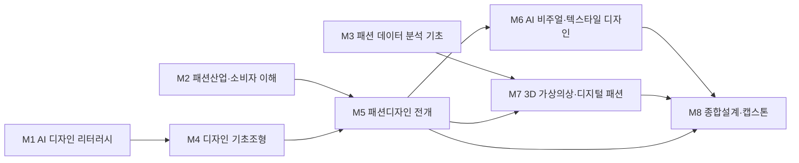

# AI패션학부 · 패션디자인트랙

> 조사일 2026-06-25 · 확인일 2026-06-27 · 재점검 2026-06-30

## 1. 개요
패션디자인트랙은 의상·텍스타일 디자인, 패턴, 컬렉션 기획, 3D 의상 구현을 다루는 트랙입니다. 'AI패션학부' 개편 방향은 손그림·실물 샘플 중심 프로세스에 **생성형 AI 디자인 발상, 3D 디지털 의상(디지털 패션), 가상 피팅·가상 샘플링**을 결합해 디자인 사이클을 단축하고 데이터와 협업하는 디자이너를 양성하는 것입니다.

## 2. 산업·기술 트렌드 (2024–2026)

> **도구 목록 기준일: 2026-07-01 · 분기별 갱신.** 아래 언급된 생성형 AI 도구·제품명은 시장 변화가 빨라 분기 단위로 갱신합니다.

- **생성형 AI 디자인 발상**: LF는 '2025 생성형 AI 업무혁신 챌린지'에서 18개 팀이 참여해 AI 기반 디자인 도출, 모델 가상 피팅 이미지 생성, 수요예측 최적화 아이디어를 제출했다. 디자이너의 초기 시안·소재 발상에 Midjourney·생성형 AI 활용이 확산.
- **3D 디지털 패션의 표준화**: CLO(CLO Virtual Fashion)의 3D 의상 소프트웨어와 협업 플랫폼 CLO-SET이 샘플 제작→생산 협업의 사실상 표준으로 자리. 원단 텍스처·드레이프(drape)·핏을 실물 없이 시뮬레이션해 샘플 비용·리드타임을 절감.
- **가상 피팅·가상 모델**: 생성형 AI 가상 피팅이 온라인 의류 판매 데이터와 결합해 사이즈 추천·구매 확신을 높이는 핵심 기술로 성장(2025 의류 부문이 AI 패션 시장 주도).
- **패러다임 이동**: 생성형 AI(이미지/시안)→에이전트 AI(자동 스타일링·테크팩(tech pack) 생성)→Physical AI(2026, 자동 재단·스마트 생산 연계) 방향.

## 3. 채용 동향
- CLO 기반 디지털 패션디자인 채용연계 교육 수료 시 **영원무역, 세아상역, 한솔섬유, 한세실업, 삼성물산** 등에서 디자이너 취업 기회가 제공되는 등, 제조·OEM 대기업이 3D 디자이너 수요를 견인.
- 한섬은 2025년 OBZEE 우븐디자이너 등 디자인 직무 경력 채용을 진행(잡코리아 기준 약 9건 공고). 신세계인터내셔날은 사람인 기준 약 13건 공고에 그래픽·브랜드 디자이너 포함.
- 신입 진입 직무: 어패럴/우븐 디자이너, 텍스타일·그래픽 디자이너, 3D(CLO) 디자이너, 디자인 어시스턴트, 디지털 패션 디자이너.
- 채용 시장에서 CLO 3D 역량은 **신입 디자이너의 사실상 필수 우대 역량**으로 자리잡는 추세(추정).

### 3-1. 고용 전망 — 국내·미국·중국 동향

!!! abstract "이 트랙과 향후 10년 고용"
    - **국내(고용노동부):** 2023~2033 산업별 전망에서 제조업은 -15.1만으로 감소하나, AI·디지털 전환 속 연구·공학기술직 등 창의·전문 직무는 74.2%가 'AI가 대체보다 보완'으로 분류된다. 섬유·의류 제조 인력은 줄어도 3D·생성형 AI 디자인 직무는 보완 효과가 크다.
    - **미국(BLS)·글로벌(WEF):** WEF는 AI가 스킬 39%를 진부화·전환시킨다고 보면서도 창의 직종은 대체보다 협업 대상으로 본다. BLS도 컴퓨터·수학 직종 +10.1% 성장을 제시해, 디자이너의 생성형 AI·CLO 3D 역량 결합이 진입 경쟁력이 된다.
    - **중국:** 제조 일자리 70%+ 대체 가능 추정으로 단순 봉제·재단은 자동화 압력이 크며, 이는 디자이너 직무가 발상·디지털 구현 등 고부가 영역으로 이동해야 함을 시사한다.
    - **시사점:** 손작업 중심에서 벗어나 생성형 AI 발상·3D 가상 샘플링을 표준 워크플로로 익히는 교육이 '대체보다 보완' 흐름과 부합한다.

> 📊 거시 분석 전체: [고용노동부 취업동향·10년 전망](../employment-outlook.md) · [글로벌 비교 (미국·중국)](../global-employment-outlook.md)

## 4. 요구 직무 역량

| 핵심 직무 역량 | AI 융합 역량 | 주요 툴·자격 |
| --- | --- | --- |
| 의상·컬렉션 디자인, 패턴 설계 | 생성형 AI 시안·무드보드 발상 | Midjourney, Adobe Firefly |
| 텍스타일·그래픽 디자인 | AI 텍스처·프린트 생성 | Photoshop, Illustrator |
| 3D 의상 구현·가상 샘플링 | 디지털 트윈/가상 피팅 제작 | CLO 3D, CLO-SET, Marvelous Designer |
| 소재·핏·드레이프 이해 | 수요예측·트렌드 데이터 해석 | 패션디자인산업기사(우대) |
| 컬러·트렌드 분석 | AI 트렌드 리서치 활용 | WGSN, 생성형 AI 도구 |

!!! tip "추가 보강 제안 (2026 개편 반영안 · 공식 교과 아님)"
    공식 교과를 대체하지 않는 **추가 보강 방향**입니다(신설/심화 제안).
    - **추가 기술트렌드:** 생성형 이미지 · 3D 가상피팅 · 디지털 샘플 · 지속가능 소재 데이터
    - **추가 직무역량:** CLO/Blender · 프롬프트 시각화 · 테크팩 · 저작권 검수
    - **교육과정 보강(제안):** 3D 디지털 패션 · AI 디자인 워크플로우 보강

## 5. 대표 채용 기업 & 직무 예시
- **대기업·OEM**: 삼성물산 패션부문(디자이너), 한세실업·세아상역·영원무역·한솔섬유(어패럴/3D 디자이너), 신세계인터내셔날(브랜드·그래픽 디자이너)
- **중견**: 한섬(OBZEE 우븐디자이너 등), LF(브랜드 디자이너, AI 디자인 프로젝트)
- **스타트업·테크**: CLO Virtual Fashion(3D 패션 소프트웨어/콘텐츠), 무신사(BX·UXUI 디자인)

## 6. 교육과정 개편 시사점
1. 패턴·드레이핑 교과에 **CLO 3D 디지털 의상 구현·가상 샘플링**을 정규 실습으로 편성해 '디지털 샘플 우선' 워크플로우를 체득시킨다.
2. 디자인 발상 단계에 **생성형 AI(Midjourney·Firefly) 무드보드·텍스타일 생성** 실습을 도입하되, 저작권·오리지널리티 윤리를 함께 교육한다.
3. 디자인-마케팅 연계로 **AI 수요예측·트렌드 데이터**를 읽고 컬렉션 기획에 반영하는 융합 캡스톤을 운영한다.

## 7. 출처
> 인용 형식: **기관·매체 — 「제목」 (발행일/연도) · URL** / 확인일 2026-06-27

- **한국경제·뉴스웰** — 「LF, 패션산업 디지털 전환 본격화」
- **클로버추얼패션** — 「CLO 3D 패션 디자인 소프트웨어 / 채용」
- **패션인사이트** — 「생성 AI, 패션산업의 패러다임을 바꾸다」
- **퍼펙트코퍼레이션** — 「패션테크 2026 가이드: 생성형 AI 가상 피팅」
- **뉴스1 / 잡코리아** — 「패션업계 AI 실험 / (주)한섬 채용」

## 8. 교육 목표 (예시)
> 학문 분야 정체성: 패션디자인트랙은 조형·소재·실루엣에 대한 미적 감수성과 디자인 전개 역량을 바탕으로 창의적인 패션 컬렉션과 제품을 기획·구현하는 디자이너를 양성하는 트랙입니다.

1. 패션 디자인 발상·전개 전문성에 생성형 AI 이미지·무드보드 도구를 결합하여, 콘셉트 탐색부터 디자인 베리에이션 생성까지 창작 과정을 가속화할 수 있다.
2. 소재·패턴·실루엣에 대한 조형 역량에 AI 텍스타일·프린트 생성 및 가상 시뮬레이션을 결합하여, 디자인 의도를 디지털로 시각화·검증할 수 있다.
3. 컬렉션 기획 역량에 AI 트렌드·색채 데이터 분석을 결합하여, 근거 있는 디자인 방향과 시즌 콘셉트를 설계할 수 있다.
4. AI 생성물의 저작권·표절·윤리 쟁점을 이해하고, 원작자성과 창작 진정성을 지키는 책임 있는 AI 활용 워크플로를 적용할 수 있다.

## 9. 교육과정 구성 및 교수법 활용
**교육과정 구성**: 기초 → 전공심화 → AI 융합 → 캡스톤의 단계적 구성
- 1학년(기초): 디자인 기초조형, 색채학, 패션드로잉, AI 디자인 리터러시(단과대학 공통)로 조형·디지털 기초 형성.
- 2학년(전공심화): 패션디자인, 입체재단(드레이핑), 소재기획, 패턴메이킹 등 디자인 핵심 역량 심화.
- 3학년(AI 융합): 생성형 AI 패션디자인, AI 텍스타일·프린트, 3D 가상의상·디지털 트윈 등 전공-AI 결합 과목 이수.
- 4학년(캡스톤): 졸업 컬렉션·AI 협업 디자인 캡스톤으로 작품 완성 및 포트폴리오 구축.

**교수법 활용**
- 포트폴리오 중심 학습: 매 과정 결과물을 누적해 디자인 프로세스와 완성도를 가시화하는 작품집 중심 평가.
- AI 페어 실습: 생성형 AI를 디자인 파트너로 활용해 발상·베리에이션을 병행 생성하고 디자이너의 선택·편집 역량을 훈련.
- 스튜디오 크리틱(PBL): 컬렉션 주제를 스튜디오에서 전개하고 정기 크리틱으로 디자인 의사결정을 점검.
- 산학 캡스톤: 브랜드·소재 기업과 연계해 실제 제작 가능한 디자인을 개발하고 현업 디렉터의 피드백을 반영.

## 10. 모듈형 전공교육과정 (M1~Mn)

### 10-1. 모듈형 교육과정 안내

> 출처: 한성대학교 패션디자인트랙 공식 교과과정([https://www.hansung.ac.kr/Design/5112/subview.do](https://www.hansung.ac.kr/Design/5112/subview.do)) 기준, 확인일 2026-06-30. 구성 교과목은 공식 교과목이며, 공식 목록에 없는 보강 항목만 (제안)으로 표기. (이수구분: 전기=전공기초·전필=전공필수·전선=전공선택)
> **교과 구분 표기:** 이수구분(전기·전필·전선)이 붙은 과목은 **공식 현행 교과**, `(제안)`은 **신설 제안 교과**, `(미정)`은 **개설 학기 미정**입니다. 표 오른쪽 '구분' 열은 각 모듈의 교과 구성 성격을 요약합니다.

| 모듈 | 모듈명 | 구성 교과목 (학년-학기·이수구분) | 모듈 설명 | 모듈 학습성과 | 모듈 간 관계 | 구분 |
| --- | --- | --- | --- | --- | --- | --- |
| **M1** | AI 디자인 리터러시 | 패션CAD(2-1·전선) · AI 패션디자인 프로세스(2-2·전필) · AI디자인리터러시(제안) | 생성형 AI 비주얼 도구·프롬프트 디자인·AI 저작권/윤리·데이터 기반 디자인 기초를 다룬다 | 디자인 맥락에서 AI 도구를 책임 있게 활용하고 윤리·저작권을 판단한다 | 단과대학 공통 전공기초 학습 | 공식·제안 |
| **M2** | 패션산업·소비자 이해 | 패션디자인(1-1·전기) · 패션마케팅(2-1·전선) · 서양복식사(2-2·전선) | 패션산업 구조·소비자행동·트렌드 분석을 다룬다 | 산업 가치사슬과 소비자 의사결정을 설명하고 트렌드를 해석한다 | 학부 공통, M5 기반 | 공식 |
| **M3** | 패션 데이터 분석 기초 | 패션CAD(2-1·전선) · 패턴CAD(3-2·전필) · 패션데이터분석입문(제안) · 색채데이터분석(제안) | 디자인·색채·트렌드 데이터 수집·시각화를 다룬다 | 디자인 의사결정에 필요한 데이터를 정제·해석한다 | 학부 공통, M7 기반 | 공식·제안 |
| **M4** | 디자인 기초조형 | 패션드로잉기초(2-1·전선) · 패션일러스트레이션(2-2·전선) · 칼라스튜디오(3-1·전선) · 디자인스케치(3-2·전필) | 조형원리·색채·드로잉·발상을 다룬다 | 조형·색채 원리를 적용해 디자인 발상을 전개한다 | 트랙 전공, M5 선수 | 공식 |
| **M5** | 패션디자인 전개 | 패션디자인(1-1·전기) · 의복구성(2-1·전필) · 어패럴패턴디자인(2-2·전선) · 드레이핑(2-2·전선) | 컬렉션 기획·입체재단·패턴·소재기획을 다룬다 | 콘셉트에서 실물 의상까지 디자인을 전개·구현한다 | 트랙 전공, M4 심화·M6·M7 기반 | 공식 |
| **M6** | AI 비주얼·텍스타일 디자인 | 패션CAD(2-1·전선) · AI 패션디자인 프로세스(2-2·전필) · 니트디자인(3-2·전선) | 생성형 AI 이미지·AI 텍스타일/프린트·무드보드를 다룬다 | 생성형 AI로 디자인 베리에이션·텍스타일을 제작한다 | 트랙 전공, M5와 상호보완 | 공식 |
| **M7** | 3D 가상의상·디지털 패션 | 패턴CAD(3-2·전필) · 토탈패션소품개발 캡스톤디자인(3-2·전필) · 테크니컬디자인(4-2·전선) · 3D가상의상(제안) | 3D 의상 시뮬레이션·디지털 트윈·가상 피팅을 다룬다 | 디자인을 3D로 시각화·검증하고 디지털 컬렉션을 제작한다 | 트랙 전공, M5 심화 | 공식·제안 |
| **M8** | 종합설계·캡스톤 | 토탈패션소품개발 캡스톤디자인(3-2·전필) · 패션디자인포트폴리오(4-1·전필) | 졸업 컬렉션·AI 협업 디자인을 통합 구현한다 | 디자인 역량을 통합해 포트폴리오로 구현·실증한다 | M5-M7 통합 캡스톤 | 공식 |

### 10-2. 모듈형 교육과정 로드맵 (학년·학기)

| 모듈 | 1-1 | 1-2 | 2-1 | 2-2 | 3-1 | 3-2 | 4-1 | 4-2 |
| --- | --- | --- | --- | --- | --- | --- | --- | --- |
| **M1** AI 디자인 리터러시 | | | 패션CAD | AI 패션디자인 프로세스 | | | | |
| **M2** 패션산업·소비자 이해 | 패션디자인 | | 패션마케팅 | 서양복식사 | | | | |
| **M3** 패션 데이터 분석 기초 | | | 패션CAD | | | 패턴CAD | | |
| **M4** 디자인 기초조형 | | | 패션드로잉기초 | 패션일러스트레이션 | 칼라스튜디오 | 디자인스케치 | | |
| **M5** 패션디자인 전개 | 패션디자인 | | 의복구성 | 어패럴패턴디자인 · 드레이핑 | | | | |
| **M6** AI 비주얼·텍스타일 디자인 | | | 패션CAD | AI 패션디자인 프로세스 | | 니트디자인 | | |
| **M7** 3D 가상의상·디지털 패션 | | | | | | 패턴CAD · 토탈패션소품개발 캡스톤디자인 | | 테크니컬디자인 |
| **M8** 종합설계·캡스톤 | | | | | | 토탈패션소품개발 캡스톤디자인 | 패션디자인포트폴리오 | |

**모듈 흐름(요약 다이어그램):**

### 10-3. 학습자 진로 가이드

| 진로 분야 | 권장 모듈 조합 | 지향 |
| --- | --- | --- |
| 패션 디자이너(어패럴) | M4 + M5 + M6 | 어패럴 디자이너, 컬렉션 디자이너 |
| 디지털 패션·3D 디자인 | M1 + M5 + M7 | 3D 패션 디자이너, 디지털 의상 제작자 |
| 텍스타일·프린트 디자인 | M3 + M4 + M6 | 텍스타일/프린트 디자이너, 소재 기획자 |

### 10-4. 학생 학습경로 예시
**경로 A — AI 협업 어패럴 디자이너**
- 1학년: 기초조형, 색채학, 패션드로잉, AI 디자인 리터러시(공통)
- 2학년: 패션디자인, 입체재단, 패턴메이킹
- 3학년: 생성형AI패션디자인, AI텍스타일프린트, 소재기획
- 4학년: 졸업 컬렉션·AI 협업 디자인 캡스톤, 포트폴리오 완성

**경로 B — 디지털 패션/3D 디자이너**
- 1학년: 기초조형, 패션드로잉, AI 디자인 리터러시(공통)
- 2학년: 패션디자인, 패턴메이킹, 패션데이터분석입문
- 3학년: 3D가상의상, 디지털패션스튜디오, 생성형AI패션디자인
- 4학년: 디지털 컬렉션 캡스톤, 가상 피팅 포트폴리오 완성

**경로 C — AI 텍스타일·프린트 디자이너**
- 1학년: 기초조형, 색채학, AI 디자인 리터러시(공통)
- 2학년: 소재기획, 패션디자인, 패션데이터분석입문
- 3학년: AI텍스타일프린트, 생성형AI패션디자인, 색채데이터분석
- 4학년: 산학 텍스타일·프린트 컬렉션 캡스톤, 소재·프린트 포트폴리오 완성 → 텍스타일/프린트 디자이너로 진출

**경로 D — 디지털 패션 콘텐츠 창업·연구자(가상패션/대학원)**
- 1학년: 기초조형, 패션드로잉, AI 디자인 리터러시(공통)
- 2학년: 패션디자인, 패턴메이킹, 패션트렌드분석
- 3학년: 3D가상의상, 디지털패션스튜디오, AI텍스타일프린트
- 4학년: 디지털 패션 R&D 캡스톤, 가상패션 콘텐츠·연구 포트폴리오 완성 → 디지털 패션 콘텐츠 창업가/대학원 연구자로 진출

!!! info "진출 직무 — 이런 전문가로 성장할 수 있어요"
    각 경로를 끝까지 걸으면 도달하는 직무입니다. 무슨 일을 하고 어떤 매력이 있는지, 그리고 졸업 무렵 갖추게 될 **AI 활용 능력·역량**을 함께 그려 봤습니다.

    - **어패럴 디자이너 (경로 A):** 한 시즌 컬렉션의 콘셉트를 잡고 실루엣·색·소재를 결정해 옷 한 벌 한 벌을 세상에 내놓는 디자인의 주역입니다. 내 손끝에서 시작된 스케치가 실제 옷이 되어 매장 행어에 걸리고 누군가의 '최애 옷'이 되는 순간을 직접 경험할 수 있습니다. → *AI 활용 능력·역량:* 생성형 AI(Midjourney·Firefly)로 무드보드와 디자인 베리에이션을 폭넓게 탐색하고 최적 방향을 선별·발전시키는 **AI 협업 디자인 발상 역량**.
    - **3D 패션 디자이너 (경로 B):** 실물 샘플을 만들기 전에 컴퓨터 안에서 옷을 3D로 지어 핏과 드레이프를 미리 완성하는 디지털 패션의 전문가입니다. 원단 한 번 자르지 않고도 수십 번 수정한 완성도 높은 옷을 만들어 내며, 세계적 브랜드가 표준으로 쓰는 CLO 워크플로를 다루는 희소한 인재로 성장할 수 있습니다. → *AI 활용 능력·역량:* CLO 3D·가상 피팅으로 아바타에 옷을 시뮬레이션하고 생성형 AI로 텍스처·패턴을 구현하는 **3D 디지털 가상 샘플링 역량**.
    - **텍스타일/프린트 디자이너 (경로 C):** 옷의 첫인상을 결정하는 원단의 무늬·프린트·색 조합을 창조하는 전문가입니다. 내가 만든 패턴 하나가 시즌 전체의 분위기를 좌우하고, 유행을 예측해 앞서 제안한 색이 실제 트렌드가 되는 성취를 느낄 수 있습니다. → *AI 활용 능력·역량:* 생성형 AI로 프린트·텍스처를 대량 생성하고 색채 데이터를 분석해 유행 색 조합을 도출하는 **AI 텍스타일·색채 데이터 기획 역량**.
    - **디지털 패션 콘텐츠 창업가/연구자 (경로 D):** 게임·SNS·가상세계에서만 존재하는 가상 의상과 디지털 패션 콘텐츠를 창조하거나, 그 기술 자체를 연구하는 개척자입니다. 아직 정답이 없는 새 시장을 스스로 정의하며, 내 아이디어로 브랜드를 세우거나 대학원에서 미래 패션의 방법론을 만들어 가는 도전을 할 수 있습니다. → *AI 활용 능력·역량:* 3D·생성형 AI로 가상 의상·디지털 룩북을 제작하고 새로운 AI 디자인 워크플로를 설계·검증하는 **디지털 패션 R&D 역량**.

### 10-5. 상위 수준 보완 권고

> 아래는 홍익대·국민대·건국대 패션 및 CLO Virtual Fashion·Browzwear 등 패션디자인·디지털 패션 특성화 **상위 비교군** 및 산업 표준 정렬을 위한 **보완 권고**입니다. **공식 교과를 대체하지 않으며**, 2027학년도 교과 개편 시 심의 의견·향후 개선 계획으로 활용합니다.

| 보완 영역 | 반영 위치 | 추가하면 좋은 내용 | 기대 효과 |
| --- | --- | --- | --- |
| 멀티 3D 가상피팅 플랫폼 호환 | M7, M1 | CLO3D 외 Browzwear(VStitcher)·Marvelous Designer 병행 실습, U3M·glTF·OBJ 포맷 변환·표준 워크플로 | 단일 툴 종속 탈피, 업계 표준 3D 파이프라인 적응력 확보 |
| 디지털 트윈 샘플·테크팩 자동화 | M7, M8 | 3D 가상 샘플 기반 테크팩(BOM·그레이딩·봉제사양) 생성, CLO-SET 협업으로 실물 1차 샘플 생략 | 샘플 리드타임·비용 절감, 제조·OEM 생산 협업 즉시 투입 |
| 생성형 이미지 저작권·진정성 검수 | M1, M6 | 학습데이터 출처 검증, 유사도·표절 점검, AI 생성물 라벨링·원작자성 표기 가이드 | 상업화 단계 저작권 리스크 차단, 책임 있는 AI 창작 신뢰 확보 |
| 지속가능 소재 데이터·DPP | M3, M5 | 디지털 제품 여권(DPP), 소재 LCA·탄소·재활용 데이터, EU ESPR 대응 소재 라이브러리 구축 | EU 규제·ESG 대응 역량, 데이터 기반 친환경 소재 기획 |
| 3D 런웨이·디지털 쇼룸 프레젠테이션 | M7, M8 | 디지털 쇼룸·가상 런웨이 연출, 3D 컬렉션 렌더링·실시간 룩북, 메타버스 전시 | 실물 컬렉션 비용 절감, 디지털 컬렉션 발표·바이어 제안 경쟁력 |
| 가상 피팅 핏 검증·사이즈 데이터 | M5, M7 | 아바타 기반 핏·드레이프 정량 검증, 사이즈 추천·이커머스 피팅 데이터 연계 | 핏 완성도 객관화, 온라인 판매·반품 저감 직무 연계 |
