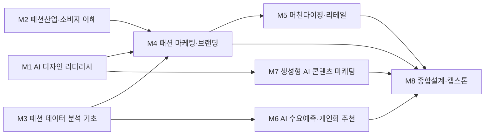

# AI패션학부 · 패션마케팅트랙

> 조사일 2026-06-25 · 확인일 2026-06-27 · 재점검 2026-06-30

## 1. 개요
패션마케팅트랙은 브랜드 전략, 소비자 행동 분석, 디지털·퍼포먼스 마케팅, CRM, 머천다이징을 다루는 트랙이다. 'AI패션학부' 개편 방향은 마케터의 직관 중심 의사결정을 **데이터·AI 기반 의사결정**으로 전환하는 것으로, 수요예측·개인화 추천·고객 세분화·AI 콘텐츠 운영 역량을 마케팅 교육의 핵심 축으로 결합한다.

## 2. 산업·기술 트렌드 (2024–2026)
- **추천·큐레이션의 자동화**: 무신사는 2026년 6월 실시간 트렌드를 학습한 AI가 상품을 먼저 제안하는 'AI 트렌드 큐레이션(선제적 큐레이션)'을 도입했다. 카카오스타일(지그재그), 에이블리는 개인화 추천 알고리즘을 핵심 경쟁력으로 운영한다.
- **수요예측의 제도화**: 산업통상자원부·한국패션협회가 '섬유패션 AI 수요예측 및 비즈니스 지원사업'과 '패션기업 AI 활용 바우처 지원사업'을 운영하며 중소 패션기업으로 AI 수요예측이 확산 중이다.
- **소규모·롱테일(long-tail) 브랜드 활성화**: 삼성패션연구소 '2026 패션시장 전망'은 AI 기반 개인화 추천 플랫폼 확대로 소비자가 세밀한 취향에 맞는 '작은 브랜드'를 쉽게 발견하게 되면서 마케팅이 매스 캠페인에서 **마이크로 타깃팅**으로 이동한다고 분석했다.
- **패러다임 이동**: 생성형 AI(2024) → 에이전트 AI(2025, 캠페인·CRM 자동화) → Physical AI(2026, 오프라인 매장·물류 데이터 연계)로 마케팅 인프라가 확장되는 추세.

## 3. 채용 동향
- 사람인 기준 (주)무신사는 2026년 약 44건의 공고를 진행했으며 이 중 마케팅팀 신입 직무가 포함된다. 신세계인터내셔날은 약 13건의 공고를 운영했다(브랜드/그래픽 디자인 및 마케팅 직군 포함).
- 카카오스타일은 자사 채용 페이지에서 **CRM 마케터**(고객 데이터 분석 기반 CRM 전략, 타깃별 자동화 캠페인, 멤버십·쿠폰 정책 설계)를 상시 채용한다. 에이블리는 퍼포먼스마케터·CRM마케터를 신입/경력으로 채용한다.
- 업계 통념상 신입 채용은 전공 여부보다 **데이터 분석·마케팅 툴 활용·콘텐츠 기획 역량**을 우선 평가하는 흐름(추정). 국내 디지털 마케팅 시장은 2025년 약 87억 달러 규모로 성장 중인 것으로 보도됨.
- 신입 진입 직무: 퍼포먼스 마케터, CRM 마케터, 콘텐츠 마케터, 패션 MD(머천다이저), 그로스 마케터.

### 3-1. 고용 전망 — 국내·미국·중국 동향

!!! abstract "이 트랙과 향후 10년 고용"
    - **국내(고용노동부):** 2025 고용동향상 소매·도매·음식주점업은 온라인화·플랫폼화로 고용이 감소하는 반면, 데이터·플랫폼 기반 마케팅 직무로 수요가 재편되고 있다. 전문가·서비스직의 AI 대체율은 21~40%로 생산직(63.3%)보다 낮아, 마케팅 기획·전략 직무는 상대적 안정성이 높다.
    - **미국(BLS)·글로벌(WEF):** WEF는 빅데이터·핀테크·AI/ML 전문가를 성장 직무로, 캐셔·매표원·데이터 입력원을 감소 직무로 제시한다. 퍼포먼스·CRM 마케터는 데이터 역량과 결합해 성장군에 가깝고, 단순 판매·입력 업무는 자동화 위험이 크다.
    - **시사점:** 직관형 마케터가 아니라 SQL·수요예측·개인화 추천을 다루는 '데이터 기반 마케터'로 양성하는 교육과정 방향이 고용 전망과 정합적이다.

> 📊 거시 분석 전체: [고용노동부 취업동향·10년 전망](../employment-outlook.md) · [글로벌 비교 (미국·중국)](../global-employment-outlook.md)

## 4. 요구 직무 역량

| 핵심 직무 역량 | AI 융합 역량 | 주요 툴·자격 |
| --- | --- | --- |
| 브랜드 전략·마케팅 기획 | AI 수요예측·판매데이터 해석 | GA4, Meta/Google Ads |
| 고객 세분화·CRM 운영 | 추천 알고리즘 이해, 개인화 캠페인 설계 | Braze/AppsFlyer, CRM 솔루션 |
| 퍼포먼스 광고 운영·성과분석 | 생성형 AI 카피·소재 제작 활용 | ChatGPT/Gemini, SQL 기초 |
| 데이터 기반 의사결정 | 대시보드·예측모델 활용 | Excel, Tableau/Looker, GA |
| 머천다이징·재고 기획 | AI 수요예측 결과 운영 적용 | 사회조사분석사·GAIQ(우대) |

!!! tip "추가 보강 제안 (2026 개편 반영안 · 공식 교과 아님)"
    공식 교과를 대체하지 않는 **추가 보강 방향**이다(신설/심화 제안).
    - **추가 기술트렌드:** AI 수요예측 · 리테일 미디어 · CRM/CDP · 라이브커머스 자동화
    - **추가 직무역량:** SQL/BI · 세그먼트 분석 · AI 캠페인 기획
    - **교육과정 보강(제안):** AI 패션데이터분석 · 리테일 CRM 캡스톤 보강

## 5. 대표 채용 기업 & 직무 예시
- **대기업**: 삼성물산 패션부문(브랜드 마케팅, MD), LF(디지털 마케팅, CRM), 신세계인터내셔날(브랜드 마케팅), 한섬(디지털 마케팅·콘텐츠)
- **중견·플랫폼**: 무신사(마케팅팀 신입, 그로스), W컨셉(CRM·퍼포먼스)
- **스타트업·커머스**: 카카오스타일(CRM 마케터, 퍼포먼스 마케터), 에이블리(퍼포먼스·CRM 마케터)

## 6. 교육과정 개편 시사점
1. 마케팅 통계·소비자조사 과목에 **SQL·데이터 시각화·AI 수요예측 실습**을 결합해 '데이터로 말하는 마케터'를 양성한다.
2. 생성형 AI를 활용한 **광고 소재·카피·콘텐츠 자동 제작 워크플로우**와 CRM 자동화 캠페인 설계를 실무 프로젝트(PBL)로 운영한다.
3. 무신사·지그재그·에이블리 등 **국내 커머스 플랫폼의 추천·개인화 로직**을 사례 기반으로 분석하는 캡스톤을 신설한다.

## 7. 출처
> 인용 형식: **기관·매체 — 「제목」 (발행일/연도) · URL** / 확인일 2026-06-27

- **청년일보** — 「무신사 'AI 트렌드 큐레이션' 도입」
- **삼성패션연구소** — 「2026 패션 시장 전망」
- **bizinfo** — 「패션기업 AI 활용 바우처 지원사업」
- **카카오스타일 / 에이블리** — 「CRM 마케터 채용 / 팀 채용」
- **사람인** — 「(주)무신사·신세계인터내셔날 채용」
- **모비인사이드** — 「2026 패션 브랜드 마케팅 지형도」

## 8. 교육 목표 (예시)
> 학문 분야 정체성: 패션마케팅트랙은 소비자·시장·브랜드에 대한 통찰을 바탕으로 패션 상품의 기획부터 유통·판매·커뮤니케이션까지 가치를 설계하고 전달하는 전문가를 양성하는 트랙이다.

1. 소비자 행동 분석과 시장 세분화 역량에 AI 기반 수요예측·개인화 추천을 결합하여, 데이터 근거에 기반한 머천다이징 및 가격 전략을 수립할 수 있다.
2. 브랜드 커뮤니케이션 전문성에 생성형 AI 비주얼·카피 도구를 결합하여, 캠페인 콘셉트부터 콘텐츠 제작까지 신속하게 프로토타이핑하고 A/B 테스트로 검증할 수 있다.
3. 옴니채널 리테일 운영 지식에 AI 수요·재고 분석을 결합하여, 온·오프라인 통합 판매 데이터를 해석하고 채널별 최적 전략을 의사결정할 수 있다.
4. AI 저작권·윤리·개인정보 규범을 이해하고, 데이터 기반 마케팅 활동에서 책임 있는 AI 활용 가이드라인을 적용할 수 있다.

## 9. 교육과정 구성 및 교수법 활용
**교육과정 구성**: 기초 → 전공심화 → AI 융합 → 캡스톤의 단계적 구성
- 1학년(기초): 패션산업의 이해, 소비자행동 기초, 마케팅 원론, AI 디자인 리터러시(단과대학 공통)로 전공·디지털 기초 토대 형성.
- 2학년(전공심화): 패션마케팅, 머천다이징, 리테일링, 브랜드 관리 등 전공 핵심 역량 심화.
- 3학년(AI 융합): 마케팅 데이터 분석, AI 수요예측·추천, 생성형 AI 콘텐츠 마케팅 등 전공-AI 결합 과목 이수.
- 4학년(캡스톤): 산학 연계 데이터 기반 마케팅 캡스톤으로 실무 프로젝트 수행 및 포트폴리오 완성.

**교수법 활용**
- PBL(문제기반학습): 실제 브랜드의 시장 진입·캠페인 과제를 팀 단위로 해결하며 시장 분석부터 전략 제안까지 통합 수행.
- 산학 캡스톤: 패션 리테일·플랫폼 기업과 연계해 실데이터 기반 마케팅 솔루션을 개발하고 현업 피드백을 반영.
- AI 페어 실습: 생성형 AI 도구를 활용해 카피·비주얼·리포트를 공동 제작하고 결과물을 비판적으로 검수하는 페어워크.
- 플립러닝: 데이터 분석 이론·툴 사용법은 사전 영상 학습, 강의실에서는 케이스 해석·실습에 집중.

## 10. 모듈형 전공교육과정 (M1~Mn)

### 10-1. 모듈형 교육과정 안내

> 출처: 한성대학교 패션마케팅트랙 공식 교과과정([https://www.hansung.ac.kr/Design/5105/subview.do](https://www.hansung.ac.kr/Design/5105/subview.do)) 기준, 확인일 2026-06-30. 구성 교과목은 공식 교과목이며, 공식 목록에 없는 보강 항목만 (제안)으로 표기. (이수구분: 전기=전공기초·전필=전공필수·전선=전공선택)

> **교과 구분 표기:** 이수구분(전기·전필·전선)이 붙은 과목은 **공식 현행 교과**, `(제안)`은 **신설 제안 교과**, `(미정)`은 **개설 학기 미정**이다. 표 오른쪽 '구분' 열은 각 모듈의 교과 구성 성격을 요약한다.

| 모듈 | 모듈명 | 구성 교과목 (학년-학기·이수구분) | 모듈 설명 | 모듈 학습성과 | 모듈 간 관계 | 구분 |
| --- | --- | --- | --- | --- | --- | --- |
| **M1** | AI 디자인 리터러시 | AI시대 패션리더십(4-1·전선) · AI패션콘텐츠 크리에이션 캡스톤디자인(4-1·전선) · AI디자인리터러시(제안) | 생성형 AI 비주얼 도구·프롬프트 디자인·AI 저작권/윤리·데이터 기반 디자인 기초를 다룬다 | 디자인 맥락에서 AI 도구를 책임 있게 활용하고 윤리·저작권을 판단한다 | 단과대학 공통 전공기초 학습 | 공식·제안 |
| **M2** | 패션산업·소비자 이해 | 패션비지니스 이해(1-1·전기) · 의복사회심리(3-1·전선) · 소비자행동(3-2·전선) · 글로벌패션시스템(3-2·전선) | 패션산업 구조·소비자행동·트렌드 분석을 다룬다 | 산업 가치사슬과 소비자 의사결정을 설명하고 트렌드를 해석한다 | 학부 공통, M3와 상호보완 | 공식 |
| **M3** | 패션 데이터 분석 기초 | 패션시장조사(2-1·전선) · 패션데이터 어낼리틱스(2-2·전선) · 패션 포토(3-1·전선) | 마케팅·시장 데이터 수집·시각화·통계를 다룬다 | 패션 데이터를 정제·시각화하고 인사이트를 도출한다 | 학부 공통, M4·M6 기반 | 공식 |
| **M4** | 패션 마케팅·브랜딩 | 패션마케팅(2-1·전필) · 패션브랜드와커뮤니케이션(2-2·전선) · 패션상품기획 캡스톤디자인(3-1·전필) | STP·브랜드 관리·IMC·포지셔닝을 다룬다 | 시장을 세분화하고 통합 브랜드 커뮤니케이션 전략을 수립한다 | 트랙 전공, M2·M3 심화 | 공식 |
| **M5** | 머천다이징·리테일 | 의류소재의이해(2-1·전선) · 패션소재기획(2-2·전필) · 패션유통관리(3-1·전필) · 패션리테일링(3-2·전필) | 상품기획·가격/재고관리·옴니채널 리테일을 다룬다 | 머천다이징 계획과 채널 전략을 수립·운영한다 | 트랙 전공, M4와 상호보완 | 공식 |
| **M6** | AI 수요예측·개인화 추천 | 패션데이터 어낼리틱스(2-2·전선) · 온라인 패션스타트업 캡스톤디자인(4-2·전필) · AI수요예측(제안) · 추천시스템과CRM(제안) | 수요예측 모델·추천 알고리즘·고객 세분화를 다룬다 | AI로 수요를 예측하고 개인화 추천·세분화를 마케팅에 적용한다 | 트랙 전공, M3 기반 심화 | 공식·제안 |
| **M7** | 생성형 AI 콘텐츠 마케팅 | AI패션콘텐츠 크리에이션 캡스톤디자인(4-1·전선) · AI시대 패션리더십(4-1·전선) · 생성형AI콘텐츠마케팅(제안) | AI 카피·비주얼 생성·콘텐츠 운영·성과 측정을 다룬다 | 생성형 AI로 캠페인 콘텐츠를 제작하고 성과를 검증한다 | 트랙 전공, M1·M4 상호보완 | 공식·제안 |
| **M8** | 종합설계·캡스톤 | 패션창업 캡스톤디자인(4-1·전필) · 온라인 패션스타트업 캡스톤디자인(4-2·전필) | 산학 데이터 기반 통합 마케팅 솔루션을 개발한다 | 데이터 기반 의사결정과 브랜드·마케팅 전략을 통합해 실증한다 | M4-M7 통합 캡스톤 | 공식 |

### 10-2. 모듈형 교육과정 로드맵 (학년·학기)

| 모듈 | 1-1 | 1-2 | 2-1 | 2-2 | 3-1 | 3-2 | 4-1 | 4-2 |
| --- | --- | --- | --- | --- | --- | --- | --- | --- |
| **M1** AI 디자인 리터러시 | | | | | | | AI시대 패션리더십 · AI패션콘텐츠 크리에이션 캡스톤디자인 | |
| **M2** 패션산업·소비자 이해 | 패션비지니스 이해 | | | | 의복사회심리 | 소비자행동 · 글로벌패션시스템 | | |
| **M3** 패션 데이터 분석 기초 | | | 패션시장조사 | 패션데이터 어낼리틱스 | 패션 포토 | | | |
| **M4** 패션 마케팅·브랜딩 | | | 패션마케팅 | 패션브랜드와커뮤니케이션 | 패션상품기획 캡스톤디자인 | | | |
| **M5** 머천다이징·리테일 | | | 의류소재의이해 | 패션소재기획 | 패션유통관리 | 패션리테일링 | | |
| **M6** AI 수요예측·개인화 추천 | | | | 패션데이터 어낼리틱스 | | | | 온라인 패션스타트업 캡스톤디자인 |
| **M7** 생성형 AI 콘텐츠 마케팅 | | | | | | | AI패션콘텐츠 크리에이션 캡스톤디자인 · AI시대 패션리더십 | |
| **M8** 종합설계·캡스톤 | | | | | | | 패션창업 캡스톤디자인 | 온라인 패션스타트업 캡스톤디자인 |

**모듈 흐름(요약 다이어그램):**

### 10-3. 학습자 진로 가이드

| 진로 분야 | 권장 모듈 조합 | 지향 |
| --- | --- | --- |
| 패션 리테일 MD/머천다이징 | M2 + M5 + M6 | 패션 MD, 바이어, 리테일 플래너 |
| 디지털 마케팅·CRM | M3 + M4 + M6 | 퍼포먼스 마케터, CRM 매니저, 데이터 마케터 |
| 브랜드 콘텐츠·커머스 | M1 + M4 + M7 | 브랜드 마케터, 콘텐츠/커머스 기획자 |

### 10-4. 학생 학습경로 예시
**경로 A — AI 기반 패션 MD/바이어**
- 1학년: 패션산업의 이해, 소비자행동론, AI 디자인 리터러시(공통)
- 2학년: 패션머천다이징, 리테일링, 패션데이터분석입문
- 3학년: AI수요예측, 추천시스템과CRM, 비주얼머천다이징
- 4학년: 산학 데이터기반 머천다이징 캡스톤, 포트폴리오 완성

**경로 B — 디지털 콘텐츠 마케터**
- 1학년: 마케팅원론, 패션산업의 이해, AI 디자인 리터러시(공통)
- 2학년: 패션마케팅, 브랜드관리, 데이터시각화
- 3학년: 생성형AI콘텐츠마케팅, 디지털캠페인실무, 마케팅데이터애널리틱스
- 4학년: 산학 디지털캠페인 캡스톤, 포트폴리오 완성

**경로 C — AI 그로스·CRM 마케터**
- 1학년: 마케팅원론, 소비자행동론, AI 디자인 리터러시(공통)
- 2학년: 패션마케팅, 패션데이터분석입문, 데이터시각화
- 3학년: 추천시스템과CRM, 마케팅데이터애널리틱스, AI수요예측
- 4학년: 산학 CRM·그로스 마케팅 캡스톤, 개인화 캠페인 포트폴리오 완성 → CRM/그로스 마케터로 진출

**경로 D — 데이터 기반 패션 커머스 창업가(D2C 브랜드)**
- 1학년: 패션산업의 이해, 마케팅원론, AI 디자인 리터러시(공통)
- 2학년: 브랜드관리, 패션머천다이징, 리테일링
- 3학년: 생성형AI콘텐츠마케팅, AI수요예측, 추천시스템과CRM
- 4학년: 산학 스몰브랜드 런칭 캡스톤, D2C 사업화 포트폴리오 완성 → 패션 커머스 창업가/브랜드 매니저로 진출

### 10-5. 상위 수준 보완 권고

> 아래는 한양대·중앙대 의류학, 성균관대 마케팅 등 패션마케팅·리테일테크 특성화 **상위 비교군** 및 산업 표준 정렬을 위한 **보완 권고**다. **공식 교과를 대체하지 않으며**, 2027학년도 교과 개편 시 심의 의견·향후 개선 계획으로 활용한다.

| 보완 영역 | 반영 위치 | 추가하면 좋은 내용 | 기대 효과 |
| --- | --- | --- | --- |
| CRM/CDP·고객 세그먼테이션 | M4, M6 | CDP 데이터 통합, RFM·생애가치(LTV) 기반 세그먼트 설계, 자동화 저니(이탈·재구매) 시나리오 실습 | 직관형 캠페인을 데이터 기반 라이프사이클 마케팅으로 전환 |
| SQL·BI 대시보드 | M3, M6 | SQL 쿼리 실습, GA4·판매데이터 조인, Tableau/Looker 마케팅 대시보드 구축 | '데이터로 말하는 마케터' 역량 표준화, 비교군 데이터 트랙과 정렬 |
| 리테일 미디어·라이브커머스 | M5, M7 | 무신사·네이버 등 리테일 미디어 광고 운영, 라이브커머스 기획·전환 측정, 커머스 풀퍼널 설계 | 옴니채널 매출 직결 채널 운영 역량 확보 |
| A/B 테스트·실험설계 | M4, M7 | 가설 수립, 표본·검정력 산정, 통계적 유의성 해석, 크리에이티브·랜딩 실험 운영 | 캠페인 의사결정의 인과적 근거 확보, 성과 재현성 향상 |
| 어트리뷰션·퍼포먼스 측정 | M4, M3 | 멀티터치 어트리뷰션, MMM 개념, ROAS·CAC·기여 분석, 채널 예산 배분 | 광고비 효율 최적화 및 성과 보고 표준화 |
| AI 수요예측 모델 운영 | M6, M8 | 예측모델 평가지표(MAPE 등), 백테스트, 재고·발주 연계 운영, 모델 한계 검수 | 수요예측을 머천다이징 실무에 책임 있게 적용 |
