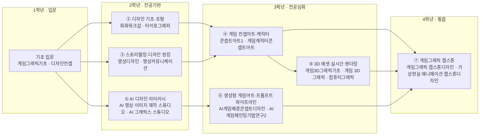

# AI융합디자인학부 · 게임그래픽디자인트랙

> **AI융합디자인학부** 개편에 맞춰, 게임그래픽디자인트랙은 '컨셉아트·3D·UI + 생성형 AI 아트 파이프라인·실시간 엔진'을 결합한 트랙으로 재정의됩니다.

> 조사일 2026-06-25 · 확인일 2026-06-27

## 1. 개요

본 트랙은 **게임 컨셉아트·원화, 캐릭터·배경 3D, 게임 UI/UX, 이펙트** 등 게임 비주얼 전반을 다룹니다. AI 융합 개편 방향은 다음과 같습니다.

- 생성형 AI(Stable Diffusion·Midjourney)를 컨셉·시안·에셋 생성에 정규 파이프라인으로 도입
- 게임사 자체 AI 플랫폼(엔씨 **VARCO Studio** 등) 환경에 대응하는 실무 역량
- 언리얼·유니티 실시간 엔진과 디지털 휴먼·페이셜 등 신기술 연계

## 2. 산업·기술 트렌드 (2024–2026)

- **제작 파이프라인 재편**: 국내 게임업계가 생성형 AI를 컨셉·배경·아이콘·텍스처 제작에 본격 도입하며 아트 파이프라인을 재편 중.
- **자체 생성 AI 플랫폼화**: 엔씨소프트가 자체 생성형 AI 플랫폼 **VARCO Studio**(이미지·텍스트·디지털 휴먼 'VARCO Human')를 사내 적용 후 외부 상용화 추진. 콘솔 신작 '프로젝트M'에 AI 보이스·페이셜 애니메이션 적용.
- **전사 AI 도입**: 넥슨이 앤스로픽 Claude·구글 Gemini Enterprise를 전사 도입, AI 보이스로 영상 음성 작업 시간을 기존 대비 50배 이상 단축(넥슨 발표 기준).
- **생성형 AI 아티스트 직무 신설**: 컴투스 '생성형 AI 아티스트(게임 아트 R&D·제작 지원)', 트리노드 'AI 활용 2D 원화가' 등 AI 전용 아트 직무 등장.

## 3. 채용 동향

- 게임잡·잡코리아·캐치 기준 게임 아트 공고에서 **'생성형 AI 활용 경험'이 우대 요건**으로 빠르게 확산.
- 거시 지표: 기업 69.2%가 AI 역량 고려, 신입직 AI 공고 5년간 162% 증가(한국데이터경제신문 2026). AI 직무 평균 연봉 4,947만 원으로 주요 직무 중 1위.
- 주요 채용 기업: **엔씨소프트, 넥슨/넥슨게임즈, 크래프톤(옴니크래프트랩스), 스마일게이트, 넷마블, 펄어비스, 컴투스**.
- 신입 직무: 2D 캐릭터·배경 컨셉 원화, 3D 모델러, 게임 UI 디자이너, 생성형 AI 아티스트.

### 3-1. 고용 전망 — 국내·미국·중국 동향

!!! abstract "이 트랙과 향후 10년 고용"
    - **국내(고용노동부):** 2027년까지 AI 인력 1.28만 명 부족이 전망되며, 게임 아트의 생성형 AI 활용 직무가 이 부족 수요와 직접 맞닿아 있다.
    - **미국(BLS)·글로벌(WEF):** 미국 컴퓨터·수학직 2024~2034 +10.1% 성장, WEF는 SW개발·AI/ML을 성장 직군으로 꼽아 콘텐츠·소프트웨어 결합형 그래픽 직무에 우호적이다. 다만 WEF는 보유 스킬의 39%가 진부해질 것이라 경고한다.
    - **시사점:** 원화·모델링 같은 창의 역량에 생성형 AI 파이프라인 운용을 결합해 '대체'가 아닌 '보완' 포지션으로 교육과정을 설계해야 한다.

> 📊 거시 분석 전체: [고용노동부 취업동향·10년 전망](../employment-outlook.md) · [글로벌 비교 (미국·중국)](../global-employment-outlook.md)

## 4. 요구 직무 역량

| 핵심 직무 역량 | AI 융합 역량 | 주요 툴·자격 |
| --- | --- | --- |
| 컨셉아트·원화, 캐릭터·배경 디자인 | 생성형 AI 컨셉·에셋 생성(SD/Midjourney) | Photoshop, ZBrush, Substance |
| 3D 모델링·텍스처·게임 UI | LoRA·이미지 투 이미지(image-to-image) 워크플로우 구축 | Stable Diffusion, ComfyUI |
| 실시간 엔진 비주얼·이펙트 | 자체 AI 플랫폼(VARCO 등) 활용·디지털 휴먼 | Unreal Engine, Unity, Maya |

## 5. 대표 채용 기업 & 직무 예시

- **대기업**: 엔씨소프트(VARCO 기반 아트·디지털 휴먼), 넥슨/넥슨게임즈(2D 캐릭터 컨셉 원화), 크래프톤·옴니크래프트랩스(배경 컨셉 아티스트), 넷마블.
- **중견**: 스마일게이트(미디어생성기술 AI·게임 아트), 펄어비스, 컴투스(생성형 AI 아티스트).
- **스타트업**: 트리노드(AI 활용 2D 원화가) 등 AI 아트 직무 채용 스튜디오.

## 6. 교육과정 개편 시사점

1. **'생성형 AI 아트 파이프라인' 정규 과목**: Stable Diffusion/ComfyUI 기반 컨셉→3D→게임 적용 워크플로우와 LoRA 커스텀 학습 실습.
2. **자체 AI 플랫폼 대응 역량**: 엔씨 VARCO식 사내 AI 도구 환경을 가정한 협업·검수·일관성 관리 교과.
3. **AI+실시간 엔진 캡스톤**: AI 생성 에셋을 언리얼·유니티에 통합해 플레이 가능한 프로토타입을 산출하는 종합 프로젝트.

## 7. 출처

> 인용 형식: **기관·매체 — 「제목」 (발행일/연도) · URL** / 확인일 2026-06-27

- **탑데일리** — 「엔씨소프트 VARCO Studio 게임제작 역량 강화」
- **디일렉** — 「생성형 AI, 게임 개발 혁명의 트리거」 / 「넥슨 NDC '게임개발도 AI 활용이 일상'」
- **스마일게이트·넥슨·크래프톤** — 「채용」 / **한국데이터경제신문** — 「AI 채용·연봉 통계」

## 8. 교육 목표 (예시)

> 학문 분야 정체성: 게임그래픽디자인트랙은 게임 컨셉아트·3D 에셋·UI·실시간 렌더링을 통해 인터랙티브 게임 세계의 비주얼을 구축하는 분야로, 생성형 AI와 실시간 3D 파이프라인을 결합해 제작 효율과 비주얼 완성도를 높이는 게임 아티스트를 양성한다.

- **목표 1.** 생성형 AI 이미지·3D 도구를 컨셉아트·텍스처·에셋 생성 공정에 통합하여, 게임 그래픽 제작 주기를 정량적으로 단축하고 에셋 산출량을 높일 수 있다. (프로젝트당 AI 활용 에셋 파이프라인 2단계 이상 적용)
- **목표 2.** 게임 비주얼 문법(컨셉·캐릭터·레벨·UI)과 실시간 3D 파이프라인을 이해하고, AI 생성 에셋을 게임 엔진 환경에 최적화·통합할 수 있다.
- **목표 3.** 프롬프트 디자인과 실시간 3D 기초를 활용해 일관된 아트 디렉션의 게임 비주얼(캐릭터·환경·UI)을 설계·구현할 수 있다.
- **목표 4.** AI 저작권·윤리와 에셋 라이선스·학습 데이터 출처를 검토하여, 상업적 배포가 가능한 책임 있는 게임 그래픽 결과물을 산출할 수 있다.

## 9. 교육과정 구성 및 교수법 활용

**교육과정 구성**

- **기초**: 기초조형·드로잉·색채·디지털 도구·게임 비주얼 기초 + 단과대학 공통 AI 디자인 리터러시.
- **전공심화**: 컨셉아트·3D 모델링/텍스처·게임 UI·실시간 렌더링(게임 엔진)으로 게임 그래픽 전문성 확립.
- **AI 융합**: 프롬프트 기반 컨셉/텍스처 생성·AI 3D 에셋·실시간 3D를 제작 파이프라인에 통합.
- **캡스톤**: 산학·게임잼 연계 게임 비주얼/플레이어블 프로토타입을 기획부터 완성까지 제작.

**교수법 활용**

- **스튜디오 크리틱**: 컨셉·에셋 합평으로 아트 디렉션 일관성 강화.
- **AI 페어 실습**: 프롬프트 기반 컨셉·텍스처 생성과 엔진 통합을 협업으로 실습.
- **PBL·게임잼**: 제한 시간 내 게임 비주얼 제작으로 협업·문제해결 역량 배양.
- **산학 캡스톤**: 게임 스튜디오 연계 실무형 제작 프로젝트.

## 10. 모듈형 전공교육과정 (역량·성과 중심)

### 10-1. 역량 중심 모듈 구성

> 본 모듈은 **한성대 공식 교과과정([https://www.hansung.ac.kr/Design/5168/subview.do](https://www.hansung.ac.kr/Design/5168/subview.do))**을 기본 데이터로 3~4과목 단위로 재구성했다. 공식 목록에 없는 과목은 **(예시)**로 표기. 확인일 2026-06-28.

| 모듈명 | 계층 | 핵심 역량·주제 | 학습 성과 | 대표 교과(공식·예시) |
| --- | --- | --- | --- | --- |
| AI 디자인 리터러시 | 단과대학공통 | 생성형 AI 비주얼·영상 도구, 프롬프트 디자인, 실시간 3D 기초, AI 저작권·윤리 | AI 도구로 비주얼·3D 산출물을 생성하고 윤리·저작권을 검토 | AI 영상·이미지 제작 스튜디오 · AI게임디자인&아트 · AI 그래픽스 스튜디오 · AI저작권과윤리(예시) |
| 디자인 기초·조형 | 학부공통 | 조형·드로잉·색채·디지털 도구 | 시각 표현 기본 문법 구성 | 게임그래픽기초 · 회화워크샵 · 타이포그래피 · 디자인컨셉 |
| 스토리텔링·디자인 씽킹 | 학부공통 | 세계관·내러티브·기획·문제정의 | 게임 세계관 중심 기획 수행 | 영상디자인 · 영상커뮤니케이션 · 게임스토리텔링(예시) · 디자인씽킹(예시) |
| 게임 컨셉아트·캐릭터 | 트랙전공 | 컨셉·캐릭터·환경 디자인·아트 디렉션 | 일관된 컨셉아트/캐릭터 세트 산출 | 게임 드로잉기법연구1 · 콘셉트아트1 · 콘셉트아트2 · 게임캐릭터콘셉트아트 |
| 3D 에셋·실시간 렌더링 | 트랙전공 | 3D 모델링·텍스처·게임 엔진·실시간 3D | 게임 엔진용 3D 에셋 제작·통합 | 게임3D그래픽기초 · 게임 3D 그래픽 · 컴퓨터그래픽 · 디지털애니메이션 동작표현 |
| 생성형 게임아트·프롬프트 파이프라인 | 트랙전공 | 프롬프트 기반 컨셉/텍스처/3D 생성, AI 에셋 워크플로우(실습 도구: Stable Diffusion·ComfyUI 등) | AI 활용 게임 에셋 파이프라인 구축 | AI게임배경콘셉트디자인 · AI게임페인팅기법연구2 · 인터랙티브 미디어 · 메타버스와 XR융합콘텐츠 |
| 게임그래픽 캡스톤 | 트랙전공 | 통합 게임 비주얼·플레이어블 제작·산학/게임잼 | 게임 비주얼/프로토타입 완성작 산출 | 게임그래픽 캡스톤디자인 · 가상현실 애니메이션 캡스톤디자인 · 그래픽디자인-캡스톤디자인 · 게임그래픽콘텐츠워크샵 |

#### 10-1 (A) 1~4학년 모듈 로드맵

#### 10-1 모듈–역량 매핑 (학습 역량 ↔ 기업 요구역량)

> 각 모듈의 핵심 학습 역량을 본 트랙 「4. 요구 직무 역량」의 기업 요구역량과 직접 연결한다.

| 모듈 | 핵심 역량(학습) | 매핑되는 기업 요구 역량 |
| --- | --- | --- |
| ① AI 디자인 리터러시 | 생성형 AI 비주얼·영상 도구, 프롬프트 디자인, 실시간 3D 기초, AI 저작권·윤리 | 생성형 AI 컨셉·에셋 생성(SD/Midjourney) |
| ② 디자인 기초·조형 | 조형·드로잉·색채·디지털 도구 | 컨셉아트·원화, 캐릭터·배경 디자인 / Photoshop |
| ③ 스토리텔링·디자인 씽킹 | 세계관·내러티브·기획·문제정의 | 컨셉아트·원화, 캐릭터·배경 디자인 |
| ④ 게임 컨셉아트·캐릭터 | 컨셉·캐릭터·환경 디자인·아트 디렉션 | 컨셉아트·원화, 캐릭터·배경 디자인 / Photoshop, ZBrush, Substance |
| ⑤ 3D 에셋·실시간 렌더링 | 3D 모델링·텍스처·게임 엔진·실시간 3D | 3D 모델링·텍스처·게임 UI, 실시간 엔진 비주얼·이펙트 / Unreal Engine, Unity, Maya |
| ⑥ 생성형 게임아트·프롬프트 파이프라인 | 프롬프트 기반 컨셉/텍스처/3D 생성, AI 에셋 워크플로우 | LoRA·이미지 투 이미지 워크플로우 구축 / Stable Diffusion, ComfyUI |
| ⑦ 게임그래픽 캡스톤 | 통합 게임 비주얼·플레이어블 제작·산학/게임잼 | 자체 AI 플랫폼(VARCO 등) 활용·디지털 휴먼 |

### 10-2. 모듈 간 관계 (트랙·학부·단과대학)

- **위계**: 단과대학 공통(AI 디자인 리터러시) → AI융합디자인학부 공통(디자인 기초·조형, 스토리텔링·디자인 씽킹) → 트랙 전공심화(컨셉아트·캐릭터, 3D 에셋·실시간 렌더링, 생성형 게임아트) → 게임그래픽 캡스톤.
- **선후수**: 「디자인 기초·조형」 이수 후 「게임 컨셉아트·캐릭터」, 「3D 에셋·실시간 렌더링」 수강. 「생성형 게임아트·프롬프트 파이프라인」은 「AI 디자인 리터러시」·「3D 에셋」 후수 권장.
- **마이크로디그리**: "AI 게임 에셋 제작" 마이크로디그리(AI 디자인 리터러시 + 3D 에셋·실시간 렌더링 + 생성형 게임아트·프롬프트 파이프라인) 운영.
- **교차수강**: 「3D 에셋·실시간 렌더링」은 영상애니메이션·미디어 트랙(실시간 3D)과, 「게임 컨셉아트·캐릭터」는 시각·영상 트랙과 교차 개방.

### 10-3. 진로 분야별 모듈 조합 가이드

| 진로 분야 | 권장 모듈 조합 | 목표 직무 |
| --- | --- | --- |
| 게임 컨셉아트·원화 | AI 디자인 리터러시 + 게임 컨셉아트·캐릭터 + 생성형 게임아트·프롬프트 파이프라인 | 컨셉 아티스트, 캐릭터 원화가 |
| 3D 게임 아트 | 디자인 기초·조형 + 3D 에셋·실시간 렌더링 + 게임그래픽 캡스톤 | 3D 모델러, 테크니컬 아티스트 |
| 게임 UI·실시간 비주얼 | 스토리텔링·디자인 씽킹 + 3D 에셋·실시간 렌더링 + 생성형 게임아트 | 게임 UI 디자이너, 리얼타임 아티스트 |

### 10-4. 학생 학습경로 예시

- **경로 A — 게임 컨셉 아티스트**: 1학년 디지털드로잉·AI 디자인 리터러시 → 2학년 게임스토리텔링·게임컨셉아트 → 3학년 캐릭터디자인·생성형게임아트(AI 컨셉/텍스처) → 4학년 게임잼/산학 게임그래픽 캡스톤 + 원화 포트폴리오.
- **경로 B — 3D 게임 아티스트**: 1학년 기초조형·AI 디자인 리터러시 → 2학년 3D게임모델링·디자인 씽킹 → 3학년 실시간렌더링·AI 에셋 파이프라인 → 4학년 플레이어블 프로토타입 캡스톤 + 3D 포트폴리오.

- **경로 C — 게임 UI·리얼타임 아티스트**: 1학년 디지털드로잉·AI 디자인 리터러시 → 2학년 디자인씽킹·게임스토리텔링(UI 기획) → 3학년 실시간렌더링·생성형게임아트(인게임 UI 시안 생성) → 4학년 게임잼/산학 게임그래픽 캡스톤으로 인터랙티브 UI 통합 → 게임 UI 디자이너로 진출.
- **경로 D — 생성형 AI 게임 아티스트(R&D)**: 1학년 기초조형·AI 디자인 리터러시 → 2학년 게임컨셉아트·AI저작권과윤리 → 3학년 생성형게임아트·AI에셋파이프라인(LoRA 커스텀 학습·이미지 투 이미지) → 4학년 VARCO식 사내 AI 도구 환경 가정 AI 에셋 파이프라인 캡스톤으로 생성형 AI 아티스트로 진출.
