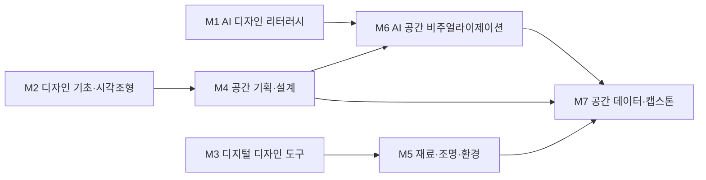

# AI융합디자인학부 · 인테리어디자인트랙

> 한성대학교 **AI융합디자인학부**(구 ICT디자인학부) 2026 개편 리서치 · 조사일 2026-06-25 · 추정값은 '추정' 표기 · 재점검 2026-06-30

## 1. 개요

인테리어디자인트랙은 주거·상업 공간의 **공간기획 → 설계(평면/입면/상세/투시) → 재료·마감 → 시공관리**를 다루는 트랙이다. 전통적으로 AutoCAD·SketchUp 기반 2D/3D 설계 역량이 핵심이었으나, **생성형 AI 렌더링·BIM·디지털 트윈·프롭테크**의 확산으로 직무가 재편되고 있다.

**AI 융합 개편 방향**: '인테리어디자이너'에서 **'AI 공간 디자이너 / 공간 데이터 디자이너'**로 직무를 확장한다. 생성형 AI 시각화, AI 상담·견적 자동화, BIM 기반 데이터 설계를 표준 역량으로 통합하여 기획·시각화·정밀설계를 AI와 협업하는 인재를 양성한다.

## 2. 산업·기술 트렌드 (2024–2026)

> **도구 목록 기준일: 2026-07-01 · 분기별 갱신.** 아래 언급된 생성형 AI 도구·제품명은 시장 변화가 빨라 분기 단위로 갱신한다.

- **국내 공간 AI의 재편**: 국내 3D 인테리어 기술 1위 **아키스케치(ArchiSketch)**가 자체 클라우드 렌더링 엔진으로 렌더링 시간을 반나절 이상 → 1~2분으로 단축, **오늘의집** 및 약 100개 가구 브랜드에 엔진을 공급한다. 한때 대표 주자였던 **어반베이스**는 2024년 파산했고, 2025년 9월 아키스케치가 그 IP(특허·상표 약 30건)를 인수했다.
- **오늘의집(버킷플레이스)의 AI-Native 전환**: 시공·거래·콘텐츠 데이터 기반 'End-to-End 공간 솔루션'을 표방. 2025년 매출 **3,215억 원**(창사 첫 3,000억 돌파).
- **생성형 AI 렌더링의 실무화**: 미드저니·Stable Diffusion·DALL·E + RoomGPT·Interior AI 등으로 컨셉 시각화·리스타일링. 인테리어 디자이너의 AI 도구 사용률은 글로벌 기준 **2023년 9% → 2025년 29%**로 약 3배 증가(1stDibs 디자이너 설문, 해외 표본).
- **BIM 의무화 로드맵(국토부)**: 2026년 **500억 원 이상** → 2028년 300억 원 이상 → **2030년 모든 공공공사** 적용.
- **프롭테크(PropTech) 성장**: 국내 프롭테크 매출 2023년 **2조 3,112억 원**(+9.1%), 2024년 6월 기준 166개사 약 **11,112명 고용**(한국프롭테크포럼).

## 3. 채용 동향

- **공고 물량(조회일 2026-06-25, 추정)**: 사람인 '인테리어디자이너' 약 5,491~7,571건, 잡코리아 '인테리어 디자이너' 약 1,252~1,344건. (원티드는 WAF·JS 렌더링으로 확인불가.)
- **고용 전망**: 워크넷 기준 향후 5년 '현 상태 유지'. 노후 아파트 리모델링·1인 가구·스마트스페이스 수요가 성장 요인, 건설경기 민감성이 리스크. 'AI 기반 건축 시각화 디자이너' 등 융합 직무 신규 등장.
- **연봉(참고)**: 워크넷/커리어넷 중위 약 3,304만 원, 상위 25% 약 4,315만 원.
- **신입 직무**: 공간/실내 디자이너, 리하우스 디자이너(RD), 인테리어 디자인 코워커, 3D·시각화 디자이너.

### 3-1. 고용 전망 — 국내·미국·중국 동향

!!! abstract "이 트랙과 향후 10년 고용"
    - **국내(고용노동부):** 2023~2033 건설업 취업자 -7.5만 명 감소 전망으로 신축 수요는 둔화하나, 리모델링·1인 가구·돌봄/보건 수요 집중과 'AI 건축 시각화' 융합 직무가 공간디자인의 신규 수요원이 된다.
    - **미국(BLS)·글로벌(WEF):** 미국 보건·사회복지직이 2024~2034 +8.4%로 최고 성장하며 고령친화·돌봄 공간 설계 수요를 키운다. WEF는 빅데이터·AI를 성장 직군으로 보아 공간 데이터 기반 설계와 맞닿는다.
    - **시사점:** 건설경기 민감성을 줄이려면 시공 중심에서 벗어나 AI 시각화·리모델링·돌봄형 공간 기획 역량을 교육과정에 보강해야 한다.

> 📊 거시 분석 전체: [고용노동부 취업동향·10년 전망](../employment-outlook.md) · [글로벌 비교 (미국·중국)](../global-employment-outlook.md)

## 4. 요구 직무 역량

| 구분 | 내용 |
| --- | --- |
| **핵심 직무 역량** | 공간기획, 평면·입면·상세·투시도 설계, 재료·마감 선정, 시공관리, 2D/3D CG, 수작업 스케치 |
| **AI 융합 역량** | 생성형 AI 렌더링(미드저니·Stable Diffusion·DALL·E) + 프롬프트 엔지니어링, AI 리스타일링(RoomGPT·Interior AI), AI 상담·자동 컨셉 도출, BIM·디지털 트윈 데이터 설계 |
| **주요 툴** | AutoCAD·SketchUp(필수), 3ds Max·V-Ray·Enscape·Lumion·Blender, Revit(BIM), Photoshop·Illustrator |
| **자격증** | 실내건축기사/산업기사, 컬러리스트기사/산업기사, 전산응용건축제도기능사 |

!!! tip "추가 보강 제안 (2026 개편 반영안 · 공식 교과 아님)"
    공식 교과를 대체하지 않는 **추가 보강 방향**이다(신설/심화 제안).
    - **추가 기술트렌드:** BIM+AI · 공간 디지털트윈 · 에너지/동선 분석
    - **추가 직무역량:** Revit/BIM · 공간 데이터 해석 · 렌더링 자동화
    - **교육과정 보강(제안):** AI 공간분석 · 디지털트윈 인테리어 보강

## 5. 대표 채용 기업 & 직무 예시

- **대기업·중견**: 한샘(홈 인테리어/리하우스 디자이너 상시 공채), LX하우시스(공간디자인 채용연계형 인턴/산학장학), 현대리바트(CX·3D 디자인), 신세계까사(까사미아), 이케아코리아('인테리어 디자인 코워커' 정규직/계약직).
- **스타트업·프롭테크**: 오늘의집/버킷플레이스(공간 디자이너, SketchUp·Photoshop), 아파트멘터리(주거 인테리어 디자이너).
- **건설사**(삼성물산·현대건설·GS건설·DL이앤씨): 건축/주택 트랙으로 광범위 채용(독립 공간디자인 공고는 건축부문·자회사 편입 형태로 추정).

## 6. 교육과정 개편 시사점

1. **생성형 AI 렌더링 + 프롬프트 워크플로 정규 과목화**: AutoCAD·SketchUp 위에 미드저니·Stable Diffusion·AI 리스타일링을 결합한 'AI 공간 시각화' 실습으로 컨셉→시안 속도를 표준 역량화.
2. **BIM·디지털 트윈 데이터 설계 강화**: 2030년 공공공사 BIM 전면 의무화 대비, Revit·BIM 협업과 디지털 트윈/프롭테크 데이터 리터러시를 트랙 핵심으로 편입.
3. **AI 상담·견적 자동화 PBL**: 아키스케치 '시숲', 오늘의집 사례를 모델로 평수·스타일·예산 입력→자동 컨셉 도출 프로젝트로 산업 직결형 포트폴리오 구축.

## 7. 출처

> 인용 형식: **기관·매체 — 「제목」 (발행일/연도) · URL** / 확인일 2026-06-27

- **zdnet·mt** — 「아키스케치/어반베이스 IP 인수」 (2025.09) / **아키스케치** — 「공식」
- **벤처스퀘어·더리포트** — 「오늘의집 실적」 / **1stDibs** — 「AI 사용률」
- **에너지경제** — 「BIM 의무화」 / **머니투데이·전자신문** — 「프롭테크 통계」
- **사람인·잡코리아·커리어넷·버킷플레이스·아파트멘터리·LX하우시스** — 「채용」 / **큐넷** — 「자격증」

## 8. 교육 목표 (예시)

> 학문 분야 정체성: 인테리어디자인트랙은 인간 행동과 공간 경험에 대한 통찰을 바탕으로 거주·상업·공공 공간을 기획·설계·구현하는 공간 디자인 전문가를 양성한다.

1. **공간 기획·설계 핵심 역량 확립**: 졸업 시점까지 인테리어 프로젝트 4건 이상을 평면계획·3D 모델링·재료/조명 설계까지 완수하여 포트폴리오에 수록한다.
2. **AI 기반 공간 디자인 워크플로우 내재화**: 생성형 AI 비주얼 도구(이미지·렌더링)와 프롬프트 디자인을 활용해 컨셉 발산 단계에서 디자인 대안 30종 이상을 생성·선별·정제하는 능력을 갖춘다.
3. **데이터 기반 공간 의사결정 역량**: 동선·점유율·환경(채광·소음) 데이터를 수집·분석하여 설계안에 반영하고, 설계 근거를 정량 지표로 제시할 수 있다.
4. **AI 윤리·저작권 준수 실무 역량**: AI 생성 이미지의 저작권·라이선스 이슈를 판별하고, 실무 산출물에 대한 출처 표기·검증 프로세스를 적용할 수 있다.

## 9. 교육과정 구성 및 교수법 활용

**교육과정 구성**

- **기초**: 디자인 드로잉, 색채·재료, 인간공학·공간개론으로 공간 디자인 기본 어휘 확립.
- **전공심화**: 주거/상업/공공 공간 설계 스튜디오, CAD·BIM·3D 렌더링으로 설계 전 과정 숙련.
- **AI 융합**: 생성형 AI 컨셉 발산, AI 렌더링 워크플로우, 공간 데이터 분석을 설계 프로세스에 통합.
- **캡스톤**: 실제 대지·클라이언트 기반 종합 공간설계 프로젝트를 AI 협업으로 완수·전시.

**교수법 활용**

- **스튜디오 크리틱**: 주차별 데스크 크리틱과 핀업 리뷰로 설계안을 반복 개선.
- **PBL(실대지 프로젝트)**: 실제 공간·클라이언트 요구를 다루는 문제 기반 프로젝트.
- **AI 페어 실습**: 학생-AI 협업으로 컨셉·렌더링을 생성하고 디자이너 판단으로 검증하는 페어 워크플로우.
- **산학 캡스톤**: 인테리어/건축 기업과 연계한 현장형 졸업 프로젝트.

## 10. 모듈형 전공교육과정 (M1~M7)

### 10-1. 모듈형 교육과정 안내

> 출처: 한성대학교 인테리어디자인트랙 공식 교과과정([https://www.hansung.ac.kr/Design/5159/subview.do](https://www.hansung.ac.kr/Design/5159/subview.do)) 기준, 확인일 2026-06-30. 구성 교과목 공식, 미존재 보강은 (제안). (전기=전공기초·전필=전공필수·전선=전공선택)
> **교과 구분 표기:** 이수구분(전기·전필·전선)이 붙은 과목은 **공식 현행 교과**, `(제안)`은 **신설 제안 교과**, `(미정)`은 **개설 학기 미정**이다. 표 오른쪽 '구분' 열은 각 모듈의 교과 구성 성격을 요약한다.
>
> ※ 공식 교과목 로드맵이 PDF·이미지로만 제공되어 **WebFetch 일부 실패** — 학년·학기가 확인되지 않은 교과목은 (학기 미상)으로 표기한다.

| 모듈 | 모듈명 | 구성 교과목 (학년-학기·이수구분) | 모듈 설명 | 모듈 학습성과 | 모듈 간 관계 | 구분 |
| --- | --- | --- | --- | --- | --- | --- |
| **M1** | AI 디자인 리터러시 | AI 공간디자인기초(2-1·전선) · AI 기반 공간렌더링(2-2·전선) · 생성형 AI 디자인 입문(제안) · AI 저작권·윤리(제안) | 생성형 AI 비주얼 도구, 프롬프트 디자인, 데이터 기반 디자인, AI 저작권·윤리 | AI 도구로 디자인 대안을 생성·평가하고 윤리·저작권을 준수한다 | 전공기초·1학년 선이수 | 공식·제안 |
| **M2** | 디자인 기초·시각조형 | 공간 조형(2-1·전필) · 디자인컨셉(1-2·전선) · 기초조형(제안) · 색채와 디자인(제안) | 조형 원리, 색채·타이포, 디자인 사고 | 디자인 기본 문법으로 시각 결과물을 구성한다 | 전공기초학습 | 공식·제안 |
| **M3** | 디지털 디자인 도구 | 드로잉과 CAD(2-1·전선) · IOT인터페이스디자인(2-2·전선) · UX·UI디자인 기초(2-2·전선) · 3D 모델링 기초(제안) | 2D/3D 디지털 저작, 디자인 데이터 처리 | 디지털 도구로 디자인 산출물을 제작·관리한다 | 전공기초학습 | 공식·제안 |
| **M4** | 공간 기획·설계 | 기초공간디자인(미정) · 실내디자인 스튜디오(미정) · 디자인과 감성공학(2-2·전선) · 한국전통디자인(3-1·전선) | 평면계획, 인간공학, 동선·프로그래밍 | 사용자 요구를 공간 설계안으로 변환한다 | M4→M6 선수 | 공식·미정 |
| **M5** | 재료·조명·환경 | 홈인테리어디자인(미정) · 레스토랑디자인(3-2·전선) · 가구디자인(2-2·전선) · 브랜드숍디자인(4-1·전필) | 재료·마감, 조명·색온도, 친환경 설계 | 재료·조명·환경 요소를 설계에 통합한다 | M4-M5 상호보완 | 공식·미정 |
| **M6** | AI 공간 비주얼라이제이션 | AI 기반 공간렌더링(2-2·전선) · AI 공간디자인기초(2-1·전선) · 디자인상품화스튜디오(4-1·전선) · 생성형 컨셉 스튜디오(제안) | AI 렌더링, 컨셉 이미지 생성, 프롬프트-투-스페이스(prompt-to-space) | AI 워크플로우로 공간 컨셉·렌더링을 신속히 제작한다 | M6→M7 심화 | 공식·제안 |
| **M7** | 공간 데이터·캡스톤 | 실내디자인종합설계(미정) · 실내디자인과 창업(4-2·전선) · 취업과 포트폴리오(미정) · 인테리어 취업 캡스톤디자인(4-1·전선) | 동선·점유 데이터 분석, 종합 설계 | 데이터 근거 기반 종합 공간설계를 완수한다 | 기존 모듈 역량 종합 검증 | 공식·미정 |

### 10-2. 모듈형 교육과정 로드맵 (학년·학기)

공식 교과목이 **언제 개설되는지**(학년-학기)를 한눈에 보여준다. (제안)·(미정) 교과목은 제외.

| 모듈 | 1-1 | 1-2 | 2-1 | 2-2 | 3-1 | 3-2 | 4-1 | 4-2 |
| --- | --- | --- | --- | --- | --- | --- | --- | --- |
| **M1** AI 디자인 리터러시 | | | AI 공간디자인기초 | AI 기반 공간렌더링 | | | | |
| **M2** 디자인 기초·시각조형 | | 디자인컨셉 | 공간 조형 | | | | | |
| **M3** 디지털 디자인 도구 | | | 드로잉과 CAD | IOT인터페이스디자인 · UX·UI디자인 기초 | | | | |
| **M4** 공간 기획·설계 | | | | 디자인과 감성공학 | 한국전통디자인 | | | |
| **M5** 재료·조명·환경 | | | | 가구디자인 | | 레스토랑디자인 | 브랜드숍디자인 | |
| **M6** AI 공간 비주얼라이제이션 | | | AI 공간디자인기초 | AI 기반 공간렌더링 | | | 디자인상품화스튜디오 | |
| **M7** 공간 데이터·캡스톤 | | | | | | | 인테리어 취업 캡스톤디자인 | 실내디자인과 창업 |

**모듈 흐름(요약 다이어그램):**

### 10-3. 학습자 진로 가이드

트랙별 권장 모듈 조합이다.

| 진로 분야 | 권장 모듈 조합 | 지향 |
| --- | --- | --- |
| **주거·상업 인테리어 설계** | M4 공간 기획·설계 + M5 재료·조명·환경 + M6 AI 공간 비주얼라이제이션 | 인테리어 디자이너 · 실내건축 설계자 |
| **공간 컨셉·비주얼 스튜디오** | M1 AI 디자인 리터러시 + M6 AI 공간 비주얼라이제이션 + M3 디지털 디자인 도구 | 3D 비주얼라이저 · 컨셉 아티스트 |
| **공간 데이터·스마트 공간** | M7 공간 데이터·캡스톤 + M1 AI 디자인 리터러시 + M4 공간 기획·설계 | 공간 데이터 컨설턴트 · 스마트홈 기획자 |

### 10-4. 학생 학습경로 예시

- **경로 A (설계 실무형)**: 1학년 디자인 기초·AI 리터러시 → 2학년 공간계획·설계스튜디오 I → 3학년 재료·조명 + AI 공간 렌더링 → 4학년 산학 인테리어 캡스톤·포트폴리오 구축.
- **경로 B (AI 비주얼 전문형)**: 1학년 AI 리터러시·디지털 도구 → 2학년 3D 모델링·생성형 컨셉 스튜디오 → 3학년 AI 렌더링 심화 + 공간데이터 분석 → 4학년 AI 협업 공간 비주얼 캡스톤·스튜디오 취업 연계.

- **경로 C (공간 데이터·스마트 공간형)**: 1학년 AI 디자인 리터러시·디지털디자인툴 → 2학년 공간계획·인테리어 설계스튜디오 I → 3학년 공간데이터 분석 + AI 공간 렌더링(동선·점유 데이터 반영) → 4학년 데이터 근거 스마트 공간 캡스톤으로 공간 데이터 컨설턴트·스마트홈 기획자로 진출.
- **경로 D (BIM·디지털 트윈 설계형)**: 1학년 디자인 기초·디지털디자인툴 → 2학년 인테리어 설계스튜디오 I·II → 3학년 인테리어 재료와 마감 + Revit 기반 BIM 데이터 설계 → 4학년 BIM 협업 종합설계 캡스톤으로 BIM 공간 설계자·디지털 트윈 공간 엔지니어로 진출.

!!! info "진출 직무 설명 — 이 직무는 어떤 일을 하나요?"
    각 경로가 향하는 직무가 **실제로 무슨 일을 하고, AI를 어떻게 쓰는지** 쉽게 정리했다.

    - **인테리어 디자이너 (경로 A):** 주거·상업 공간의 평면과 마감, 조명을 계획해 실제로 꾸밀 수 있는 설계안과 시공 도면으로 옮기는 일을 한다. → *AI 활용:* 미드저니·RoomGPT로 컨셉 이미지를 빠르게 뽑아 클라이언트와 방향을 맞춘다.
    - **3D 비주얼라이저 (경로 B):** 아직 짓지 않은 공간을 사진처럼 실감 나는 3D 투시도·이미지로 미리 보여 주는 일을 한다. → *AI 활용:* 생성형 AI 렌더링으로 시안 수십 종을 단시간에 만들어 비교·선별한다.
    - **공간 데이터 컨설턴트·스마트홈 기획자 (경로 C):** 사람들이 공간을 어떻게 쓰는지(동선·머무는 자리) 데이터를 모아 더 편한 공간과 스마트홈 서비스를 제안하는 일을 한다. → *AI 활용:* 동선·점유 데이터를 AI로 분석해 설계 근거로 삼는다.
    - **BIM 공간 설계자·디지털 트윈 공간 엔지니어 (경로 D):** 건물 정보를 담은 3D 모델(BIM)로 설계하고, 실제 공간을 그대로 본뜬 디지털 트윈으로 관리하는 일을 한다. → *AI 활용:* Revit·BIM 데이터를 AI와 연동해 설계 충돌·오류를 미리 걸러낸다.

### 10-5. 상위 수준 보완 권고

> 아래는 홍익대·건국대·국민대 실내건축/공간디자인 등 인테리어·공간디자인 특성화 **상위 비교군** 및 산업 표준 정렬을 위한 **보완 권고**다. **공식 교과를 대체하지 않으며**, 2027학년도 교과 개편 시 심의 의견·향후 개선 계획으로 활용한다.

| 보완 영역 | 반영 위치 | 추가하면 좋은 내용 | 기대 효과 |
| --- | --- | --- | --- |
| Revit/BIM·IFC 데이터 표준 | M3, M4 | Revit 패밀리·룸 데이터 작성, IFC 개방형 포맷 교환·협업, 2030 공공 BIM 의무화 대응 워크플로 | 비교군 BIM 설계 역량 동등 확보, 공공·건설사 협업 직무 직결 |
| 공간 디지털트윈 | M4, M7 | 설계안의 센서·IoT 데이터 연동, 운영 단계 공간 모니터링·시뮬레이션 디지털트윈 구축 | 프롭테크·스마트홈 직무 차별화, 설계-운영 통합 역량 |
| 환경·에너지·동선 시뮬레이션 | M5, M4 | 채광·일사·열·음환경 정량 해석, 동선·점유 시뮬레이션 기반 근거 설계 | 정성 설계에서 데이터 근거 설계로 전환, 친환경·인증 대응 |
| 생성형 렌더링 자동화 파이프라인 | M6, M1 | ControlNet·LoRA로 평면-투시 연동 일관 렌더링, 배치 렌더 자동화·버전 관리 | 컨셉→시안 속도 표준화, 비교군 AI 비주얼 스튜디오 수준 도달 |
| VR/실시간 공간 검토 | M6, M7 | Twinmotion·Enscape·Unreal 실시간 워크스루, VR 1:1 스케일 공간 검토·클라이언트 리뷰 | 몰입형 설계 검증 역량, 설계 의사결정·수주 경쟁력 강화 |
| 3D 스캔·포인트클라우드 실측 | M3, M5 | LiDAR·포토그래메트리 현황 스캔, 포인트클라우드→BIM(Scan-to-BIM) 리모델링 실측 | 리모델링·노후 공간 시장 대응, 정밀 현황 기반 설계 정확도 향상 |
