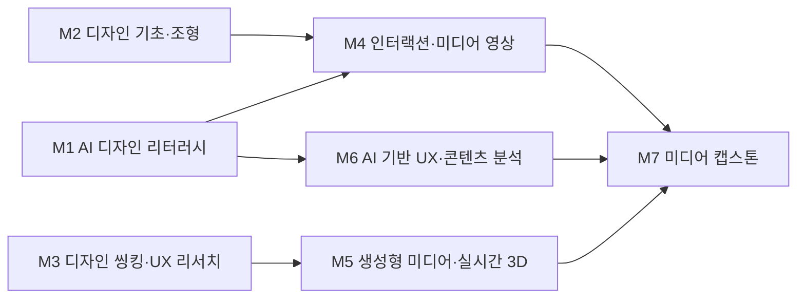

# AI융합디자인학부 · 미디어디자인트랙

> 한성대학교 ICT디자인학부가 **AI융합디자인학부**로 개편됨에 따라, 미디어디자인트랙은 '공간·전시·인터랙티브 미디어 + AI 생성·실시간 렌더링'의 융합 트랙으로 재정의됩니다.

> 조사일 2026-06-25 · 확인일 2026-06-27 · 재점검 2026-06-30

## 1. 개요
미디어디자인트랙은 디지털 미디어를 매개로 한 **몰입형 콘텐츠, 미디어아트, 인터랙티브·공간 디자인, 미디어 파사드(media facade), 전시·체험 콘텐츠**를 다룹니다. AI 융합 개편의 핵심 방향은 다음과 같습니다.
- 생성형 AI(이미지·영상)를 콘텐츠 제작 파이프라인의 전처리·시안 단계에 내재화
- 실시간 3D 엔진(언리얼·유니티) 기반 인터랙티브·미디어아트 제작 역량 강화
- 패러다임 흐름(생성형 AI 2024 → 에이전트 AI 2025 → **Physical AI 2026**)에 맞춰 센서·공간·관객 반응형 콘텐츠로 확장

## 2. 산업·기술 트렌드 (2024–2026)
- **몰입형 미디어아트의 산업화**: 디스트릭트(d'strict)의 'ARTE MUSEUM'이 전 세계 주요 도시로 확산되며 B2C 미디어아트가 산업 규모로 성장. [LED.ART](http://LED.ART) 등 미디어아트 라이선스 B2B 모델도 확대.
- **초실감 콘텐츠 R&D**: 닷밀(Dot-mill)이 기업부설연구소를 통해 초실감 테마파크 요소기술(콘텐츠 제작·체험 디자인·기술 개발)을 연구.
- **실시간 3D 전면화**: 언리얼·유니티 기반 실시간 렌더링이 전시·공간 콘텐츠의 표준이 되며, 관객 반응형(인터랙티브) 미디어가 핵심 차별점으로 부상.
- **생성형 AI의 시안·에셋 생성 활용**: Midjourney·Stable Diffusion류 이미지 생성, Runway·Kling·Pika류 영상 생성이 미디어아트 컨셉·배경·텍스처 제작에 도입.

> **도구 목록 기준일: 2026-07-01 · 분기별 갱신.**

## 3. 채용 동향
- 사람인·잡코리아·인크루트 기준 **'디지털 미디어 콘텐츠 디자이너', '인터랙티브 미디어 아트 콘텐츠 개발자(신입 가능)'** 공고가 꾸준히 게시됨.
- 거시 지표: 최근 5년간 국내 AI 관련 채용 공고 **112% 증가**, **신입직 162% 증가**(잡코리아 분석), 기업 **69.2%가 채용 시 AI 역량 고려**(대한상의). → 조사기관·표본은 [공통 채용 데이터 출처](../data-sources.md) 참조.
- 주요 채용 기업: **디스트릭트코리아, 닷밀, 미디어앤아트, 자이언트스텝** 등 미디어·콘텐츠 전문 기업과 전시·공간 에이전시.
- 신입 직무: 디지털 미디어 콘텐츠 디자이너, 인터랙티브 미디어 개발/디자인, 미디어아트 콘텐츠 제작.

### 3-1. 고용 전망 — 국내·미국·중국 동향

!!! abstract "이 트랙과 향후 10년 고용"
    - **국내(고용노동부):** AI·디지털 전환으로 10년 후 고용은 -13.9%로 추정되나, 연구·공학·콘텐츠 기획 등 창의 전문직은 약 74.2%가 'AI에 의한 보완' 대상으로 분류되어 미디어 콘텐츠 제작 직무는 대체보다 증강에 가깝다.
    - **미국(BLS)·글로벌(WEF):** BLS 2024~2034 컴퓨터·수학 직군 +10.1%로 실시간 3D·인터랙티브 콘텐츠 개발 수요와 맞닿아 있고, WEF는 소프트웨어 개발을 성장 직군으로 꼽으며 AI·정보처리 기술이 기업 86%의 전환 동인으로 본다.
    - **중국:** 휴머노이드·전시 산업의 빠른 성장으로 체험형 미디어 콘텐츠 수요가 확대되는 흐름이 관찰된다.
    - **시사점:** 생성형 AI를 '시안·에셋 생성 워크플로우'로 다루는 역량을 교육과정 핵심에 두면, 보완 대상이 되는 창의 직무로서의 경쟁력을 강화할 수 있다.

> 📊 거시 분석 전체: [고용노동부 취업동향·10년 전망](../employment-outlook.md) · [글로벌 비교 (미국·중국)](../global-employment-outlook.md)

## 4. 요구 직무 역량

| 핵심 직무 역량 | AI 융합 역량 | 주요 툴·자격 |
| --- | --- | --- |
| 모션·공간 연출, 미디어아트 콘텐츠 기획 | 생성형 AI 시안·에셋 제작(이미지·영상) | TouchDesigner, Unreal Engine, Unity |
| 인터랙티브·반응형 콘텐츠 설계 | 프롬프트 설계·워크플로우 구축 | Midjourney, Stable Diffusion, Runway |
| 실시간 렌더링·미디어 파사드 운용 | AI 기반 실시간 생성·관객 반응형 연출 | After Effects, Notch, Houdini |

!!! tip "추가 보강 제안 (2026 개편 반영안 · 공식 교과 아님)"
    공식 교과를 대체하지 않는 **추가 보강 방향**이다(신설/심화 제안).
    - **추가 기술트렌드:** 생성형 인터랙션 · 센서 기반 미디어아트 · 실시간 콘텐츠
    - **추가 직무역량:** TouchDesigner/Unity · 센서 데이터 · 인터랙티브 프로토타이핑
    - **교육과정 보강(제안):** AI 인터랙티브 미디어 · 실감콘텐츠 실습

## 5. 대표 채용 기업 & 직무 예시
- **중견·전문기업**: 디스트릭트코리아(디지털 미디어 콘텐츠 디자이너), 닷밀(초실감 콘텐츠 R&D·체험 디자인), 미디어앤아트(전시·미디어아트).
- **스타트업·에이전시**: 자이언트스텝(실시간 콘텐츠·버추얼), 인터랙티브 미디어아트 콘텐츠 개발 스튜디오(신입 채용).
- **연계 대기업 수요**: 전시·리테일·브랜드 공간 영역에서 CJ·롯데·신세계 계열 체험 콘텐츠 수요 연계.

## 6. 교육과정 개편 시사점
1. **'AI 생성 + 실시간 3D' 통합 스튜디오 과목 신설**: Stable Diffusion/Runway로 에셋을 생성하고 언리얼·TouchDesigner로 인터랙티브 콘텐츠로 구현하는 전 과정(end-to-end) 프로젝트 과목.
2. **Physical AI 대비 반응형 미디어 과목**: 센서·관객 반응 데이터를 활용한 실시간 생성 콘텐츠 캡스톤.
3. **프롬프트·워크플로우 설계 역량 명문화**: AI 도구 활용을 '시안 보조'가 아닌 정규 제작 파이프라인 역량으로 교과에 반영.

## 7. 출처

> 인용 형식: **기관·매체 — 「제목」 (발행일/연도) · URL** / 확인일 2026-06-27

- **한국데이터경제신문** — 「5년간 112% 증가한 AI 채용 공고」 (개별 채용공고 · 보존 URL 없음 · 확인 2026-06-27)
- **디스트릭트(d'strict)** — 「채용」 (개별 채용공고 · 보존 URL 없음 · 확인 2026-06-27)
- **닷밀** — 「채용」 (개별 채용공고 · 보존 URL 없음 · 확인 2026-06-27)
- **잡코리아** — 「인터랙티브 미디어아트 콘텐츠 개발자 공고」 (개별 채용공고 · 보존 URL 없음 · 확인 2026-06-27)
- **인크루트** — 「디스트릭트코리아 기업정보」 (개별 채용공고 · 보존 URL 없음 · 확인 2026-06-27)

## 8. 교육 목표 (예시)
> 학문 분야 정체성: 미디어디자인트랙은 인터랙티브 미디어·UX/UI·뉴미디어 경험을 설계하는 분야로, 사용자와 콘텐츠가 실시간으로 상호작용하는 디지털 경험을 AI와 결합하여 창의적으로 구현하는 디자이너를 양성한다.

- **목표 1.** 생성형 AI 도구(이미지·영상·인터랙션)를 디자인 프로세스에 통합하여, 아이디어 발상부터 프로토타입까지의 제작 주기를 단축하고 산출물의 품질을 정량적으로 향상시킬 수 있다. (학기당 AI 활용 프로토타입 3건 이상 완성)
- **목표 2.** 사용자 데이터·행동 패턴을 AI로 분석하여 근거 기반(evidence-based)의 인터랙션·UX 설계 의사결정을 내릴 수 있다. (캡스톤에서 사용성 지표 개선 1건 이상 실증)
- **목표 3.** 프롬프트 디자인과 실시간 3D 기초를 활용해 반응형·생성형 미디어 인스톨레이션을 설계·구현할 수 있다.
- **목표 4.** AI 저작권·윤리 가이드라인을 이해하고, 생성물의 출처·라이선스·편향 문제를 검토하여 책임 있는 미디어 디자인 결과물을 산출할 수 있다.

## 9. 교육과정 구성 및 교수법 활용
**교육과정 구성**
- **기초**: 디자인 기초조형·타이포그래피·디지털 도구 리터러시 + 단과대학 공통 AI 디자인 리터러시.
- **전공심화**: 인터랙션 디자인·UX/UI·뉴미디어 표현·실시간 3D로 미디어 설계 전문성 확립.
- **AI 융합**: 프롬프트 디자인·생성형 미디어·AI 기반 사용자 분석을 전공 워크플로우에 통합.
- **캡스톤**: 산학 연계 인터랙티브 미디어/UX 프로젝트를 기획·구현·검증하여 포트폴리오로 완성.

**교수법 활용**
- **스튜디오 크리틱**: 주차별 작업물에 대한 동료·교수 합평으로 디자인 감각과 비평적 사고를 단련.
- **AI 페어 실습**: 학생-AI 협업 워크플로우를 실습하며 프롬프트 반복·결과 큐레이션 역량 배양.
- **PBL(문제기반학습)**: 실제 사용자 문제를 정의하고 인터랙티브 솔루션을 도출.
- **산학 캡스톤**: 미디어·플랫폼 기업과 연계한 실무형 프로젝트 수행.

## 10. 모듈형 전공교육과정 (M1~M7)

### 10-1. 모듈형 교육과정 안내

> 출처: 한성대학교 미디어디자인트랙 공식 교과과정([https://www.hansung.ac.kr/Design/5126/subview.do](https://www.hansung.ac.kr/Design/5126/subview.do)) 기준, 확인일 2026-06-30. 구성 교과목은 공식 교과목, 미존재 보강은 (제안). (전기=전공기초·전필=전공필수·전선=전공선택)
> **교과 구분 표기:** 이수구분(전기·전필·전선)이 붙은 과목은 **공식 현행 교과**, `(제안)`은 **신설 제안 교과**, `(미정)`은 **개설 학기 미정**이다. 표 오른쪽 '구분' 열은 각 모듈의 교과 구성 성격을 요약한다.

| 모듈 | 모듈명 | 구성 교과목 (학년-학기·이수구분) | 모듈 설명 | 모듈 학습성과 | 모듈 간 관계 | 구분 |
| --- | --- | --- | --- | --- | --- | --- |
| **M1** | AI 디자인 리터러시 | AI와 HCI(2-1·전필) · AI와 UXD(2-2·전필) · AI 저작권과 윤리(제안) | 생성형 AI 비주얼·영상 도구, 프롬프트 디자인, 실시간 3D 기초, AI 저작권·윤리 | AI 도구로 시각·영상 산출물을 생성하고 윤리·저작권을 검토 | 단과대학 공통 기초 | 공식·제안 |
| **M2** | 디자인 기초·조형 | 기초미디어디자인(1-1·전기) · 인쇄광고 비주얼과 카피(1-1·전선) · 구조와 표현(2-2·전선) · 타이포그래피(2-2·전선) | 조형원리·타이포·색채·디지털 도구 | 디자인 기본 문법으로 시각 산출물 구성 | 학부 공통 기초 | 공식 |
| **M3** | 디자인 씽킹·UX 리서치 | 디자인과인간심리(2-1·전선) · 문화콘텐츠기획(2-2·전선) · UX·UI디자인 기초(2-2·전선) | 사용자 리서치·문제정의·아이데이션 | 사용자 중심 설계 프로세스 수행 | 학부 공통 기초 | 공식 |
| **M4** | 인터랙션·미디어 영상 | 영상디자인(2-2·전선) · 모션그래픽-캡스톤디자인(3-1·전필) · 모바일인터페이스종합설계(3-2·전필) | 인터랙션 패턴·UI 시스템·영상·모션 | 반응형 UI·미디어 영상 제작 | 트랙 전공심화 | 공식 |
| **M5** | 생성형 미디어·실시간 3D | 디지털 촬영 입문(1-2·전선) · 영상촬영 스튜디오(1-2·전선) · 메타버스와 XR융합콘텐츠(3-2·전선) | 프롬프트 기반 미디어 생성, 실시간 3D·제너러티브 | 생성형 미디어 인스톨레이션 구현 | 트랙 전공심화 | 공식 |
| **M6** | AI 기반 UX·콘텐츠 분석 | 인포그래픽-캡스톤디자인(3-1·전선) · 디지털 자원 큐레이션(3-2·전선) · AI 사용성 평가(제안) | 사용자 데이터·콘텐츠 큐레이션·정보 시각화 | 데이터 근거 UX·콘텐츠 의사결정 도출 | 트랙 전공심화 | 공식·제안 |
| **M7** | 미디어 캡스톤 | 커뮤니케이션그래픽디자인-캡스톤디자인(3-2·전선) · 미디어디자인종합설계1(4-1·전필) · 미디어디자인종합설계2(4-2·전필) | 통합 프로젝트·산학 협업 | 인터랙티브 미디어/UX 완성작 산출 | 전 모듈 통합 캡스톤 | 공식 |

### 10-2. 모듈형 교육과정 로드맵 (학년·학기)

| 모듈 | 1-1 | 1-2 | 2-1 | 2-2 | 3-1 | 3-2 | 4-1 | 4-2 |
| --- | --- | --- | --- | --- | --- | --- | --- | --- |
| **M1** AI 디자인 리터러시 | | | AI와 HCI | AI와 UXD | | | | |
| **M2** 디자인 기초·조형 | 기초미디어디자인 · 인쇄광고 비주얼과 카피 | | | 구조와 표현 · 타이포그래피 | | | | |
| **M3** 디자인 씽킹·UX 리서치 | | | 디자인과인간심리 | 문화콘텐츠기획 · UX·UI디자인 기초 | | | | |
| **M4** 인터랙션·미디어 영상 | | | | 영상디자인 | 모션그래픽-캡스톤디자인 | 모바일인터페이스종합설계 | | |
| **M5** 생성형 미디어·실시간 3D | | 디지털 촬영 입문 · 영상촬영 스튜디오 | | | | 메타버스와 XR융합콘텐츠 | | |
| **M6** AI 기반 UX·콘텐츠 분석 | | | | | 인포그래픽-캡스톤디자인 | 디지털 자원 큐레이션 | | |
| **M7** 미디어 캡스톤 | | | | | | 커뮤니케이션그래픽디자인-캡스톤디자인 | 미디어디자인종합설계1 | 미디어디자인종합설계2 |

**모듈 흐름(요약 다이어그램):**

### 10-3. 학습자 진로 가이드

| 진로 분야 | 권장 모듈 조합 | 지향 |
| --- | --- | --- |
| UX/UI·프로덕트 디자인 | M3 디자인 씽킹·UX 리서치 + M4 인터랙션·미디어 영상 + M6 AI 기반 UX·콘텐츠 분석 | UX/UI 디자이너 · 프로덕트 디자이너 |
| 뉴미디어·인터랙티브 아트 | M1 AI 디자인 리터러시 + M5 생성형 미디어·실시간 3D + M7 미디어 캡스톤 | 미디어 아티스트 · 인터랙션 개발자 |
| 디지털 콘텐츠·서비스 기획 | M3 디자인 씽킹·UX 리서치 + M5 생성형 미디어·실시간 3D + M6 AI 기반 UX·콘텐츠 분석 | 콘텐츠 기획자 · 서비스 디자이너 |

### 10-4. 학생 학습경로 예시
- **경로 A — UX/프로덕트 디자이너**: 1학년 기초조형·AI 디자인 리터러시 → 2학년 디자인 씽킹·UX 리서치·인터랙션디자인 → 3학년 UI 디자인 시스템·AI 기반 UX 데이터 분석 → 4학년 산학 미디어 캡스톤(데이터 근거 UX 개선 실증) + 포트폴리오.
- **경로 B — 인터랙티브 미디어 아티스트**: 1학년 AI 디자인 리터러시·디지털디자인도구 → 2학년 인터랙션디자인·제너러티브미디어 입문 → 3학년 실시간3D미디어·프롬프트 기반 생성 워크플로우 심화 → 4학년 생성형 인터랙티브 인스톨레이션 캡스톤 + 전시.

- **경로 C — 미디어 파사드·전시 공간 미디어 디렉터**: 1학년 기초조형·AI 디자인 리터러시 → 2학년 디자인씽킹·인터랙션디자인 → 3학년 실시간3D미디어·AI 사용성평가(공간 체험 분석) → 4학년 도시·리테일 미디어 파사드 산학 캡스톤(센서 반응형 연출) → 전시·공간 미디어 디렉터로 진출.

- **경로 D — 디지털 콘텐츠 서비스 기획자/창업**: 1학년 AI 디자인 리터러시·디지털디자인도구 → 2학년 디자인씽킹·UX리서치방법론 → 3학년 UX데이터분석·제너러티브미디어(콘텐츠 프로토타이핑) → 4학년 생성형 콘텐츠 서비스 캡스톤(MVP 사용성 검증) → 디지털 콘텐츠 서비스 기획자·콘텐츠 스타트업 창업으로 진출.

### 10-5. 상위 수준 보완 권고

> 아래는 홍익대·국민대 미디어아트, 카이스트 문화기술(CT) 등 인터랙티브 미디어아트 특성화 **상위 비교군** 및 산업 표준 정렬을 위한 **보완 권고**다. **공식 교과를 대체하지 않으며**, 2027학년도 교과 개편 시 심의 의견·향후 개선 계획으로 활용한다.

| 보완 영역 | 반영 위치 | 추가하면 좋은 내용 | 기대 효과 |
| --- | --- | --- | --- |
| TouchDesigner 기반 실시간 비주얼 | M4, M5 | 노드 기반 제너러티브 비주얼·오디오리액티브 패치, GLSL 셰이더 기초를 모듈화한 실습 | 비교군 미디어아트 수준의 표준 실시간 도구 숙련 확보 |
| 센서·피지컬 인터랙션 | M5, M7 | Arduino·깊이/동작 카메라(Kinect·LiDAR) 입력 기반 관객 반응형 시스템, Physical AI 연계 | 공간 반응형 콘텐츠로 차별화, 2026 패러다임 대응 |
| 프로젝션 매핑·미디어 파사드 | M4, M5 | 비정형 표면 매핑·워핑/엣지블렌딩, 대형 파사드 캘리브레이션·쇼컨트롤 실습 | 전시·도시 미디어 실무 직결 역량 강화 |
| 생성형 실시간 인터랙션 | M1, M5 | StreamDiffusion·실시간 스타일 전이 등 실시간 생성형 AI와 인터랙션 결합 워크플로우 | 생성형 인터랙션 트렌드 선도, 산업 표준 정렬 |
| 인터랙티브 프로토타이핑·전시 운영 | M4, M7 | Unity/언리얼 인터랙티브 프로토타이핑, 설치·현장 운영·내구성 테스트 절차 | 작품 완성도·현장 운영 신뢰성 제고 |
| 뉴미디어아트 비평·아카이빙 | M3, M6 | 미디어아트 담론·작가 연구, 전시 도큐멘테이션·아카이빙 기반 포트폴리오 | 예술계열 비교군의 담론·전시 역량 보완 |
