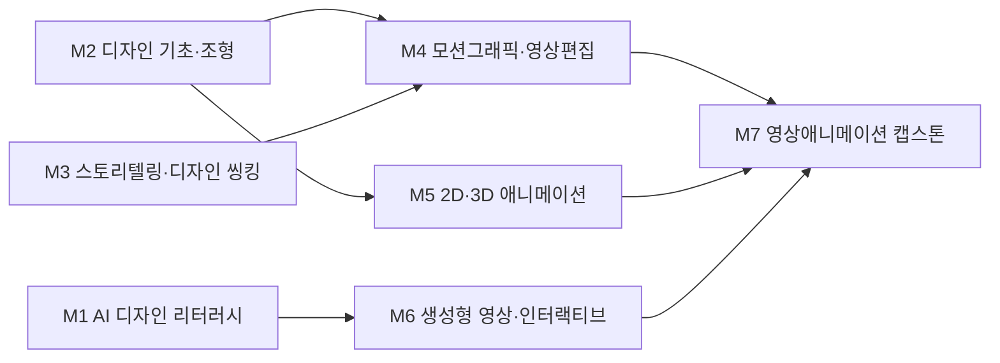

# AI융합디자인학부 · 영상애니메이션디자인트랙

> **AI융합디자인학부** 개편에 따라 영상애니메이션디자인트랙은 '영상·애니메이션·모션그래픽 + AI 영상 생성·버추얼 프로덕션(virtual production)'의 융합 트랙으로 재정의됩니다.

> 조사일 2026-06-25 · 확인일 2026-06-27 · 재점검 2026-06-30

## 1. 개요

본 트랙은 **영상 제작·편집, 2D/3D 애니메이션, 모션그래픽, 광고·콘텐츠 영상**을 다룹니다. AI 융합 개편 방향은 다음과 같습니다.

- 텍스트→영상 생성형 AI(Runway·Kling·Pika류)를 기획·시안·제작 파이프라인에 도입
- 언리얼엔진 기반 **버추얼 프로덕션·실시간 렌더링** 제작 역량 확보
- 'AI가 만드는 영상'이 늘수록 더 중요해지는 **기획력·스토리텔링** 강화

## 2. 산업·기술 트렌드 (2024–2026)

> **도구 목록 기준일: 2026-07-01 · 분기별 갱신.** 아래 언급된 생성형 AI 도구·제품명은 시장 변화가 빨라 분기 단위로 갱신한다.

- **AI 영상 생성 기술 급발전**: 2025년 9월 OpenAI **Sora 2** 발표로 자연스러운 2D 애니메이션 생성 가능성을 입증(단, Sora 웹·앱은 2026.4 종료, API도 2026.9 종료 예정 — 역사적 분기점으로 본다). 현역 도구는 **Runway·중국 클링 3(멀티샷)·시댄스 2(액션신)·Pika·Adobe Firefly Video** 등으로 경쟁 가속.
- **대기업 AI 스튜디오화**: CJ ENM이 AI 제작 신작 애니메이션 **'캣 비기(Cat Biggie)'**를 크리에이터 6명·5개월로 완성, 글로벌 AI 스튜디오 도약을 선언. 직무를 **AI CD(콘텐츠 디렉터)·AI TD(테크 디렉터)·AI BD(비즈 디렉터)**로 세분화해 전문 인재를 발굴할 계획.
- **버추얼 프로덕션 확산**: 자이언트스텝, 모션테크놀로지, 스튜디오이온 등이 언리얼엔진 기반 PREVIS·실시간 렌더링·그린스크린 제작 역량을 보유·채용.
- **AI 모션그래픽 자동화**: 2025년 하반기부터 텍스트만으로 30초 영상이 수 분 내 생성(외주 70% 수준 품질, 추정). 단, '내용·스토리텔링 있는 AI 영상'만 살아남는 방향으로 시장 재편.

## 3. 채용 동향

- 미디어잡·사람인·잡코리아 기준 영상편집·모션그래퍼·애니메이션 디자이너 공고에서 **AI 활용 우대**가 확산.
- 거시 지표: 신입직 AI 공고 5년간 **162% 증가**, 비수도권 **232% 증가**(잡코리아), 기업 **69.2%가 AI 역량 고려**(대한상의). → [공통 채용 데이터 출처](../data-sources.md) 참조.
- 주요 채용 기업: **CJ ENM(AI CD/TD/BD), 자이언트스텝, 모션테크놀로지, 스튜디오이온, 펄어비스(공식 채널 영상 디자이너)** 등.
- 신입 직무: 영상편집·제작, 모션그래퍼, 2D/3D 애니메이션 디자이너, 버추얼 프로덕션 어시스턴트.

### 3-1. 고용 전망 — 국내·미국·중국 동향

!!! abstract "이 트랙과 향후 10년 고용"
    - **국내(고용노동부):** AI·디지털 전환의 10년 후 고용 영향은 -13.9%로 추정되나, 스토리텔링·연출 중심의 창의 전문직은 보완(약 74.2%) 비중이 높아, 단순 모션그래픽 자동화에도 '내용 있는 AI 영상'을 기획·연출하는 직무는 존속 가능성이 크다.
    - **미국(BLS)·글로벌(WEF):** WEF 2025는 AI/ML·소프트웨어 개발을 성장 직군으로 보며 AI·정보처리 기술이 기업 86%의 전환을 이끈다고 분석, AI 영상 생성 도구를 다루는 모션·애니메이션 인력 수요 확대를 뒷받침한다.
    - **중국:** 클링·시댄스 등 AI 영상 모델의 급속한 발전으로 콘텐츠 제작 경쟁이 가속되며 글로벌 시장 재편을 주도하고 있다.
    - **시사점:** 생성형 AI 영상 워크플로우와 버추얼 프로덕션 역량을 결합한 'AI CD/TD형 인재' 양성에 교육과정을 맞춰야 한다.

> 📊 거시 분석 전체: [고용노동부 취업동향·10년 전망](../employment-outlook.md) · [글로벌 비교 (미국·중국)](../global-employment-outlook.md)

## 4. 요구 직무 역량

| 핵심 직무 역량 | AI 융합 역량 | 주요 툴·자격 |
| --- | --- | --- |
| 영상 기획·연출·편집, 스토리텔링 | 텍스트→영상 생성(Runway/Kling/Pika) | Premiere Pro, After Effects |
| 2D/3D 애니메이션·모션그래픽 | AI 모션그래픽 자동화·시안 생성 | Blender, Cinema 4D, Maya |
| 버추얼 프로덕션·실시간 렌더링 | AI 보이스·페이셜·프롬프트 워크플로우 | Unreal Engine, DaVinci Resolve |

!!! tip "추가 보강 제안 (2026 개편 반영안 · 공식 교과 아님)"
    공식 교과를 대체하지 않는 **추가 보강 방향**이다(신설/심화 제안).
    - **추가 기술트렌드:** Post-Sora 영상 생성 스택 · 버추얼 프로덕션 · AI 후반작업
    - **추가 직무역량:** Runway/Kling/Pika/Firefly 활용 · 스토리보드-영상 전환 · QC
    - **교육과정 보강(제안):** AI 영상제작 스튜디오를 현역 도구 중심으로 재정리

## 5. 대표 채용 기업 & 직무 예시

- **대기업**: CJ ENM(AI 콘텐츠 디렉터/테크 디렉터/비즈 디렉터), 스튜디오드래곤 등 콘텐츠 제작사.
- **중견·전문기업**: 자이언트스텝(버추얼 프로덕션 프로듀싱), 스튜디오이온(언리얼 실시간 영상), 모션테크놀로지(버추얼 프로덕션 개발).
- **게임/스타트업**: 펄어비스(게임 공식 채널 영상 디자이너), AI 영상 생성 서비스(AI Studios 등).

## 6. 교육과정 개편 시사점

1. **'AI 영상 생성 + 버추얼 프로덕션' 통합 과목**: Runway·Kling·Pika로 시퀀스를 생성하고 언리얼엔진으로 실사·실시간 합성하는 제작 파이프라인 실습.
2. **스토리텔링·연출 중심 재편**: AI가 생성을 자동화할수록 기획·내러티브·연출 역량이 차별점 — 시나리오·연출 교과 비중 강화.
3. **AI 직무 세분화 대응 트랙**: CJ ENM식 AI CD/TD/BD 모델을 참고해 '연출·기술·기획' 역량을 모듈화한 진로 트랙 제공.

## 7. 출처

> 인용 형식: **기관·매체 — 「제목」 (발행일/연도) · URL** / 확인일 2026-06-27

- **CJ 뉴스룸** — 「글로벌 AI 스튜디오로 도약하는 CJ ENM」 (개별 채용공고 · 보존 URL 없음 · 확인 2026-06-27)
- **게임잡** — 「모션테크놀로지 언리얼 버추얼 프로덕션 개발자 채용」 (개별 채용공고 · 보존 URL 없음 · 확인 2026-06-27)
- **자이언트스텝** — 「채용」 (개별 채용공고 · 보존 URL 없음 · 확인 2026-06-27)
- **잡코리아** — 「펄어비스 게임 공식 채널 영상 디자이너 공고」 (개별 채용공고 · 보존 URL 없음 · 확인 2026-06-27)
- **AI 모션그래픽 자동 제작 가이드** — 「AI 모션그래픽 자동 제작 가이드」 (2026)
- **한국데이터경제신문** — 「AI 채용 통계」 (개별 채용공고 · 보존 URL 없음 · 확인 2026-06-27)

## 8. 교육 목표 (예시)

> 학문 분야 정체성: 영상애니메이션디자인트랙은 모션그래픽·애니메이션·영상 연출을 통해 시간 기반 스토리를 시각화하는 분야로, 생성형 AI 영상·이미지 도구를 활용해 기획·제작·후반작업의 효율과 표현 폭을 확장하는 영상 디자이너를 양성한다.

- **목표 1.** 생성형 AI 영상·이미지 도구를 프리프로덕션~포스트프로덕션에 통합하여, 스토리보드·컨셉아트·중간 프레임 생성 등 제작 공정을 정량적으로 단축할 수 있다. (작품당 AI 활용 공정 2단계 이상 적용)
- **목표 2.** 모션·타이밍·연출 등 영상 문법의 원리를 견고히 이해하고, AI 생성 영상 소스를 비평적으로 선별·편집하여 일관된 작품으로 완성할 수 있다.
- **목표 3.** 프롬프트 디자인과 실시간 3D 기초를 활용해 의도한 비주얼 스타일·카메라·무드를 구현하고 모션그래픽/애니메이션 시퀀스를 설계할 수 있다.
- **목표 4.** AI 저작권·윤리(딥페이크·초상권·학습 데이터 출처 포함)를 이해하고, 생성 영상의 책임 있는 활용 기준을 적용할 수 있다.

## 9. 교육과정 구성 및 교수법 활용

**교육과정 구성**

- **기초**: 기초조형·드로잉·디지털 도구·영상 기초 + 단과대학 공통 AI 디자인 리터러시.
- **전공심화**: 모션그래픽·2D/3D 애니메이션·영상연출·편집/합성으로 영상 제작 전문성 확립.
- **AI 융합**: 프롬프트 기반 영상 생성·AI 컨셉아트·실시간 3D를 제작 파이프라인에 통합.
- **캡스톤**: 산학·공모전 연계 단편 애니메이션/모션그래픽 작품을 기획부터 완성까지 제작.

**교수법 활용**

- **스튜디오 크리틱**: 러프컷·시퀀스 합평으로 연출·타이밍 감각 강화.
- **AI 페어 실습**: 프롬프트 기반 영상·컨셉 생성과 결과 큐레이션을 협업으로 실습.
- **PBL**: 실제 영상 브리프를 기반으로 한 제작 프로젝트.
- **산학·공모전 캡스톤**: 영상·애니메이션 스튜디오 및 공모전 연계 제작.

## 10. 모듈형 전공교육과정 (M1~M7)

### 10-1. 모듈형 교육과정 안내

> 출처: 한성대학교 영상애니메이션디자인트랙 공식 교과과정([https://www.hansung.ac.kr/Design/5133/subview.do](https://www.hansung.ac.kr/Design/5133/subview.do)) 기준, 확인일 2026-06-30. 구성 교과목은 공식 교과목, 미존재 보강은 (제안). (전기=전공기초·전필=전공필수·전선=전공선택)
> **교과 구분 표기:** 이수구분(전기·전필·전선)이 붙은 과목은 **공식 현행 교과**, `(제안)`은 **신설 제안 교과**, `(미정)`은 **개설 학기 미정**이다. 표 오른쪽 '구분' 열은 각 모듈의 교과 구성 성격을 요약한다.

| 모듈 | 모듈명 | 구성 교과목 (학년-학기·이수구분) | 모듈 설명 | 모듈 학습성과 | 모듈 간 관계 | 구분 |
| --- | --- | --- | --- | --- | --- | --- |
| **M1** | AI 디자인 리터러시 | AI 영상·이미지 제작 스튜디오(2-1·전필) · AI 그래픽스 스튜디오(2-2·전선) · AI 저작권과 윤리(제안) | 생성형 AI 비주얼·영상 도구, 프롬프트 디자인, 실시간 3D 기초, AI 저작권·윤리 | AI 도구로 영상·이미지 산출물을 생성하고 윤리·저작권을 검토 | 단과대학 공통 기초 | 공식·제안 |
| **M2** | 디자인 기초·조형 | 영상애니메이션 기초(1-1·전기) · 만화 조형과 색채연구(1-1·전선) · 컴퓨터그래픽(2-1·전선) · 타이포그래피(2-2·전선) | 조형·드로잉·색채·디지털 도구 | 시각 표현 기본 문법 구성 | 학부 공통 기초 | 공식 |
| **M3** | 스토리텔링·디자인 씽킹 | 만화(웹툰) 창작(1-2·전선) · 디자인컨셉(2-1·전선) · 문화콘텐츠기획(2-2·전선) | 내러티브·기획·문제정의 | 스토리 중심 기획 프로세스 수행 | 학부 공통 기초 | 공식 |
| **M4** | 모션그래픽·영상편집 | 디지털 영상 합성(1-1·전선) · 영상촬영 스튜디오(1-2·전선) · 영상커뮤니케이션(2-2·전필) · 컴퓨터 특수시각효과(3-1·전필) | 모션 원리·타이밍·편집·합성 | 모션그래픽/편집 시퀀스 제작 | 트랙 전공심화 | 공식 |
| **M5** | 2D·3D 애니메이션 | 디지털애니메이션 동작표현(2-1·전필) · 게임 드로잉기법연구1(2-1·전선) · 게임 3D 그래픽(3-2·전선) · 캐릭터 개발 프로세스(3-2·전필) | 캐릭터·키프레임·리깅·실시간 3D | 애니메이션 시퀀스 제작 | 트랙 전공심화 | 공식 |
| **M6** | 생성형 영상·인터랙티브 | AI게임페인팅기법연구2(3-1·전선) · 인터랙티브 미디어(3-1·전선) · 메타버스와 XR융합콘텐츠(3-2·전선) | 프롬프트 기반 영상·컨셉아트 생성, AI 워크플로우 | 의도한 톤의 생성형 영상 시퀀스 산출 | 트랙 전공심화 | 공식 |
| **M7** | 영상애니메이션 캡스톤 | 가상현실 애니메이션 캡스톤디자인(1-1·전선) · 영상애니메이션 캡스톤디자인(4-1·전필) · 영상애니메이션 스타트업워크샵(4-2·전필) | 통합 단편 제작·산학/공모전 협업 | 완성 단편 작품 산출 | 전 모듈 통합 캡스톤 | 공식 |

### 10-2. 모듈형 교육과정 로드맵 (학년·학기)

| 모듈 | 1-1 | 1-2 | 2-1 | 2-2 | 3-1 | 3-2 | 4-1 | 4-2 |
| --- | --- | --- | --- | --- | --- | --- | --- | --- |
| **M1** AI 디자인 리터러시 | | | AI 영상·이미지 제작 스튜디오 | AI 그래픽스 스튜디오 | | | | |
| **M2** 디자인 기초·조형 | 영상애니메이션 기초 · 만화 조형과 색채연구 | | 컴퓨터그래픽 | 타이포그래피 | | | | |
| **M3** 스토리텔링·디자인 씽킹 | | 만화(웹툰) 창작 | 디자인컨셉 | 문화콘텐츠기획 | | | | |
| **M4** 모션그래픽·영상편집 | 디지털 영상 합성 | 영상촬영 스튜디오 | | 영상커뮤니케이션 | 컴퓨터 특수시각효과 | | | |
| **M5** 2D·3D 애니메이션 | | | 디지털애니메이션 동작표현 · 게임 드로잉기법연구1 | | | 게임 3D 그래픽 · 캐릭터 개발 프로세스 | | |
| **M6** 생성형 영상·인터랙티브 | | | | | AI게임페인팅기법연구2 · 인터랙티브 미디어 | 메타버스와 XR융합콘텐츠 | | |
| **M7** 영상애니메이션 캡스톤 | 가상현실 애니메이션 캡스톤디자인 | | | | | | 영상애니메이션 캡스톤디자인 | 영상애니메이션 스타트업워크샵 |

**모듈 흐름(요약 다이어그램):**

### 10-3. 학습자 진로 가이드

| 진로 분야 | 권장 모듈 조합 | 지향 |
| --- | --- | --- |
| 모션그래픽·영상 콘텐츠 | M1 AI 디자인 리터러시 + M4 모션그래픽·영상편집 + M6 생성형 영상·인터랙티브 | 모션그래픽 디자이너 · 영상 크리에이터 |
| 애니메이션 제작 | M2 디자인 기초·조형 + M5 2D·3D 애니메이션 + M7 영상애니메이션 캡스톤 | 애니메이터 · 3D 아티스트 |
| 광고·브랜디드 영상 | M3 스토리텔링·디자인 씽킹 + M4 모션그래픽·영상편집 + M6 생성형 영상·인터랙티브 | 광고영상 디렉터 · 콘텐츠 PD |

### 10-4. 학생 학습경로 예시

- **경로 A — 모션그래픽 디자이너**: 1학년 기초조형·AI 디자인 리터러시 → 2학년 영상스토리텔링·모션그래픽 → 3학년 영상편집과합성·생성형영상제작(AI 연출) → 4학년 광고/브랜디드 산학 캡스톤 + 릴.
- **경로 B — 애니메이터**: 1학년 디지털드로잉·AI 디자인 리터러시 → 2학년 2D애니메이션·스토리텔링 → 3학년 3D애니메이션·AI 컨셉아트 워크숍 → 4학년 단편 애니메이션 캡스톤(공모전 출품) + 포트폴리오.

- **경로 C — 브랜디드 콘텐츠 PD**: 1학년 디지털드로잉·AI 디자인 리터러시 → 2학년 영상스토리텔링·디자인씽킹 → 3학년 모션그래픽·AI 컨셉아트 워크숍(기획·연출 중심) → 4학년 광고·브랜드 콘텐츠 산학 캡스톤(캠페인 기획~제작) → 브랜디드 콘텐츠 PD·광고영상 디렉터로 진출.

- **경로 D — 버추얼 프로덕션·AI 테크 디렉터(TD)**: 1학년 기초조형·AI 디자인 리터러시 → 2학년 모션그래픽·영상편집과합성 → 3학년 3D애니메이션·생성형영상제작(실시간 3D·합성 워크플로우) → 4학년 언리얼엔진 버추얼 프로덕션 산학 캡스톤(실시간 합성 파이프라인) → 버추얼 프로덕션 아티스트·AI 테크 디렉터(TD)로 진출.

### 10-5. 상위 수준 보완 권고

> 아래는 한국예술종합학교 영상원·청강문화산업대학 애니메이션콘텐츠스쿨·계원예술대학교 애니메이션과 등 영상·애니메이션 제작 특성화 **상위 비교군** 및 산업 표준 정렬을 위한 **보완 권고**다. **공식 교과를 대체하지 않으며**, 2027학년도 교과 개편 시 심의 의견·향후 개선 계획으로 활용한다.

| 보완 영역 | 반영 위치 | 추가하면 좋은 내용 | 기대 효과 |
| --- | --- | --- | --- |
| Post-Sora 영상 생성 스택 운영 | M1, M6 | Runway·클링·Pika·Firefly Video를 한 파이프라인에서 비교·전환하는 도구별 강·약점 및 시드/카메라 제어 실습 | 단일 도구 종속 탈피, 비교군 수준의 멀티 도구 운용 역량 |
| 멀티샷·캐릭터 일관성 제어 | M5, M6 | 레퍼런스·캐릭터 시트 기반 컨시스턴시, 멀티샷 연결(클링 3 멀티샷)·키프레임 보간 워크플로우 | 단편 분량의 일관된 캐릭터·연속 컷 산출, 작품 완성도 제고 |
| 버추얼 프로덕션(LED·언리얼) 실무 | M6, M7 | 언리얼 nDisplay·LED 월·인카메라 VFX(ICVFX)·PREVIS, 그린스크린 대비 실시간 합성 캡스톤 | 자이언트스텝·스튜디오이온식 현업 버추얼 프로덕션 직결 |
| AI 후반작업·로토·업스케일 | M4, M6 | AI 로토스코핑·매트·인페인팅, 디인터레이스·업스케일·프레임보간(Topaz류) 후반 파이프라인 | 후반작업 공정 단축, 외주 의존 축소 |
| 스토리보드→영상 전환 자동화 | M3, M4 | 스토리보드·애니매틱을 생성형 영상 시안으로 전환하는 콘티-투-비디오 연계, 컷별 프롬프트 설계 | 기획-제작 단절 해소, 빠른 시안 반복 |
| 영상 QC·컬러관리 표준 | M4, M7 | ACES 컬러 파이프라인·라이브러리, 납품 규격(코덱·해상도·라우드니스) QC 체크리스트 | 산업 표준 납품 품질 확보, 비교군 대비 후반 신뢰성 강화 |
