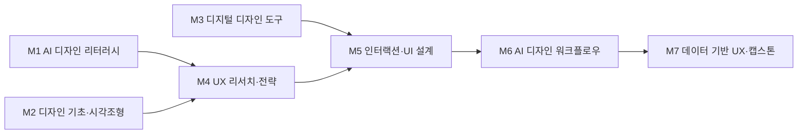

# AI융합디자인학부 · UX/UI디자인트랙

> 한성대학교 **AI융합디자인학부**(구 ICT디자인학부) 2026 개편 리서치 · 조사일 2026-06-25 · 추정값은 '추정' 표기 · 재점검 2026-06-30

## 1. 개요

UX/UI디자인트랙은 디지털 제품·서비스의 **사용자 경험(UX)과 인터페이스(UI), 프로덕트 디자인**을 다룬다. Figma·디자인시스템 기반 화면 설계가 핵심이었으나, **생성형 AI·에이전트 AI**가 디자이너 워크플로를 재편하며 직무가 '화면 제작'에서 **'문제 정의·시스템 설계·AI 오케스트레이션'**으로 이동하고 있다.

**AI 융합 개편 방향**: 단순 UI 제작은 AI에 흡수되므로, **'AI 활용 프로덕트 디자이너 / 디자인 엔지니어'**로 직무를 재정의한다.

## 2. 산업·기술 트렌드 (2024–2026)

> **도구 목록 기준일: 2026-07-01 · 분기별 갱신.** 아래 언급된 생성형 AI 도구·제품명은 시장 변화가 빨라 분기 단위로 갱신한다.

- **AI 디자인 도구의 주류화**: **Figma Make**(텍스트→동작 프로토타입), Figma Sites/Draw/Buzz(Config 2025), **v0 by Vercel**(자연어→React/Next.js 코드), Galileo AI→**Google Stitch**, Uizard·UX Pilot·Relume 등 text-to-design/code 도구 급속 확산. 단 NN/g 평가는 'not ready for primetime(2024) → marginally better(2025)' — AI를 '인턴처럼' 감독 필요.
- **에이전트 AI + 디자인시스템**: **Figma 2025 AI Report**(표본 2,500명) — 에이전틱 AI 제품 구축 기업 **21% → 51%**로 2배 이상 증가. Figma MCP Server(GA), Design Tokens Community Group(DTCG) 1.0 첫 안정 사양(2025.10) — 단, W3C 공식 표준(Standards Track)은 아님.
- **한국 기업 실증**: **토스**는 'AI가 디자인한 화면이 실제 제품에 적용' 시작, **우아한형제들**은 디자인시스템 RAG 챗봇 구축(2026.5), **오늘의집**은 Figma Make+Claude Code+MCP로 UT 세팅 2시간→15분, **KT**는 'AI Agent UX Guide + KT UX Design System v1.0' 공개(2025.10).

## 3. 채용 동향

- **공고 급감**: 국내 UI/UX 디자이너 채용공고 **-70.2%**, 서비스 기획자 -71.4%(2022.01–2025.10, 88,492건 분석, 비사이드/캔디드). 동기간 AI 개발자 수요는 약 5배 증가.
- **양극화**: 원티드랩 2026 서베이(국내 153곳) — 선호 경력 **4~7년차 49.7%** 최다, **신입 12.4%** 최하. 인재상 요소 'AI·데이터 활용역량' 24.2%.
- **연봉(종합)**: UX/UI 신입 약 **2,929만 원** → 5년 3,702만 → 10년 5,147만 원.

### 3-1. 고용 전망 — 국내·미국·중국 동향

!!! abstract "이 트랙과 향후 10년 고용"
    - **국내(고용노동부):** 2027년 신산업 인력 부족이 AI 1.28만·빅데이터 1.96만 명으로 전망돼 AI·데이터 활용 역량을 갖춘 UX/UI 직무 수요를 떠받친다. 다만 사무·판매 직무는 AI로 61~80% 대체 가능해 단순 화면 제작은 줄고 고숙련 설계로 양극화된다.
    - **미국(BLS)·글로벌(WEF):** BLS는 컴퓨터·수학 직군을 2024~2034년 **+10.1%**로 전망하고, WEF는 SW 개발을 대표 성장 직무로 꼽는다(스킬 39% 진부화, AI·정보처리 기술이 기업 86% 전환).
    - **시사점:** AI 인터페이스·디지털 제품을 설계하는 고숙련 UX/UI 역량과 AI 협업 워크플로우를 교육과정 중심에 둬야 한다.

> 📊 거시 분석 전체: [고용노동부 취업동향·10년 전망](../employment-outlook.md) · [글로벌 비교 (미국·중국)](../global-employment-outlook.md)

## 4. 요구 직무 역량

| 구분 | 내용 |
| --- | --- |
| **핵심 직무 역량** | Figma(Auto Layout·Components·Variables·프로토타이핑·핸드오프, 단일 표준), 디자인시스템 구축·운영, PM·개발자 협업, HTML/CSS(우대) |
| **AI 융합 역량** | LLM 프롬프트 엔지니어링, Figma Make·v0·Galileo/Stitch·Relume 활용, AI 에이전트 오케스트레이션, Figma MCP 워크플로, '생성은 저렴·큐레이션이 가치'(문제정의·검증) |
| **데이터 역량** | GA4·Amplitude·Mixpanel, A/B 테스트 설계·해석 |
| **자격증·교육** | 대부분 비필수. NN/g UX Certification 우대. 포트폴리오·실무가 결정 |

!!! tip "추가 보강 제안 (2026 개편 반영안 · 공식 교과 아님)"
    공식 교과를 대체하지 않는 **추가 보강 방향**이다(신설/심화 제안).
    - **추가 기술트렌드:** AI 에이전트 UX · 디자인 토큰 · 접근성 자동화
    - **추가 직무역량:** Figma · 프로토타이핑 · 사용성 계측 · AI 거버넌스
    - **교육과정 보강(제안):** AI 제품디자인 · Design Tokens는 W3C 표준이 아닌 Community Group(DTCG) 사양으로 표기

## 5. 대표 채용 기업 & 직무 예시

- **핀테크·플랫폼(대기업)**: 토스/비바리퍼블리카(TDS 디자인시스템), 우아한형제들/배민(PD 5/7년↑), 쿠팡(Staff/Senior PD), 당근(목적조직 PD).
- **포털·메신저(대기업)**: 네이버(팀네이버 신입 공채 Design, 비전공 가능), 카카오(AI 서비스 UI 디자이너/PD), 라인(LINE Design System), KT, 야놀자, 무신사·29CM.
- **디자인 에이전시**: 플러스엑스(PlusX), 펜타브리드, 디스트릭트.

## 6. 교육과정 개편 시사점

1. **AI 워크플로 정규 과목화**: Figma Make·v0·Figma MCP·프롬프트 엔지니어링을 묶어 'AI 활용 프로덕트 디자인' 과목으로, 디자이너를 **AI 오케스트레이터**로 양성.
2. **데이터 기반 디자인 강화**: GA4·Amplitude·A/B 테스트를 정규 편입해, AI가 대체하기 어려운 **문제 정의·가설 검증·시스템 설계** 역량을 차별화.
3. **디자인시스템·디자인 엔지니어링 PBL**: 컴포넌트·디자인토큰(W3C DTCG)·Storybook·HTML/CSS 핸드오프를 다루는 실습.

## 7. 출처

> 인용 형식: **기관·매체 — 「제목」 (발행일/연도) · URL** / 확인일 2026-06-27

- **Figma** — 「2025 AI Report」 (2025)
- **Figma** — 「Make·Config 2025」 (2025)
- **v0·Galileo·Relume** — 「AI 디자인 도구」
- **NN/g** — 「UX 리셋」
- **DTCG** — 「MCP·Design Tokens」
- **팀캔디드** — 「채용 -70.2%」
- **원티드랩** — 「2026」 (2026)
- **그룹바이** — 「연봉」
- **토스테크·우아한기술블로그·오늘의집·디자인컴퍼스(KT)·당근·카카오·네이버·라인** — 「기업 기술블로그·채용」

## 8. 교육 목표 (예시)

> 학문 분야 정체성: UX/UI디자인트랙은 사용자 조사와 인터랙션 설계를 바탕으로 디지털 제품·서비스의 화면과 경험을 설계·검증하는 UX/UI 디자인 전문가를 양성한다.

1. **UX 리서치·UI 설계 핵심 역량 확립**: 졸업까지 사용자 조사부터 와이어프레임·프로토타입·UI 시스템까지 통합한 디지털 제품 프로젝트 4건 이상을 완수한다.
2. **AI 기반 디자인 워크플로우 내재화**: 생성형 AI로 UI 시안·카피·아이콘을 발산하고, 프롬프트 디자인으로 디자인 시스템 일관성을 유지하며 산출 속도를 높인다.
3. **데이터 기반 UX 의사결정 역량**: 사용성 테스트·행동 로그·A/B 테스트 데이터를 분석해 디자인 개선안을 근거 기반으로 도출·검증할 수 있다.
4. **AI 윤리·저작권·접근성 준수 실무 역량**: AI 생성 UI 자산의 저작권·라이선스를 관리하고, 알고리즘 편향·접근성·다크패턴 등 윤리 이슈를 점검·반영할 수 있다.

## 9. 교육과정 구성 및 교수법 활용

**교육과정 구성**

- **기초**: 디자인 조형, 색채·타이포, HCI·UX 개론으로 디지털 디자인 기본 어휘 확립.
- **전공심화**: UX 리서치, 인터랙션·UI 설계, 프로토타이핑·디자인 시스템 숙련.
- **AI 융합**: 생성형 AI UI 시안, AI 보조 프로토타이핑, 사용성·행동 데이터 분석을 설계 프로세스에 통합.
- **캡스톤**: 실제 서비스·클라이언트 기반 디지털 제품 UX/UI를 AI 협업으로 완수·검증.

**교수법 활용**

- **PBL·디자인 스프린트**: 실서비스 문제를 짧은 주기 스프린트로 해결.
- **스튜디오 크리틱**: 와이어프레임·프로토타입 핀업 리뷰로 설계를 반복 개선.
- **AI 페어 실습**: 학생-AI 협업으로 UI 시안·플로우를 생성하고 디자이너가 사용성 기준으로 검증하는 워크플로우.
- **산학 캡스톤**: IT·서비스 기업 연계 현장형 UX/UI 프로젝트.

## 10. 모듈형 전공교육과정 (M1~M7)

### 10-1. 모듈형 교육과정 안내

> 출처: 한성대학교 UX/UI디자인트랙 공식 교과과정([https://www.hansung.ac.kr/Design/5175/subview.do](https://www.hansung.ac.kr/Design/5175/subview.do)) 기준, 확인일 2026-06-30. 구성 교과목 공식, 미존재 보강은 (제안). (전기=전공기초·전필=전공필수·전선=전공선택)
> **교과 구분 표기:** 이수구분(전기·전필·전선)이 붙은 과목은 **공식 현행 교과**, `(제안)`은 **신설 제안 교과**, `(미정)`은 **개설 학기 미정**이다. 표 오른쪽 '구분' 열은 각 모듈의 교과 구성 성격을 요약한다.

| 모듈 | 모듈명 | 구성 교과목 (학년-학기·이수구분) | 모듈 설명 | 모듈 학습성과 | 모듈 간 관계 | 구분 |
| --- | --- | --- | --- | --- | --- | --- |
| **M1** | AI 디자인 리터러시 | UXUI지식재산권(3-1·전선) · AI 공간디자인기초(2-1·전선) · AI 디자인기초(제안·미정) · 프롬프트 디자인(제안·미정) | 생성형 AI 비주얼 도구, 프롬프트 디자인, 데이터 기반 디자인, AI 저작권·윤리 | AI 도구로 디자인 대안을 생성·평가하고 윤리·저작권을 준수한다 | 단과대학 공통·1학년 선이수 | 제안·미정 |
| **M2** | 디자인 기초·시각조형 | 드로잉과 CAD(2-1·전선) · 컴퓨터그래픽(2-1·전선) · 가구디자인(2-2·전선) | 조형 원리, 색채·타이포, 디자인 사고 | 디자인 기본 문법으로 시각 결과물을 구성한다 | 학부 공통·전공기초 | 공식 |
| **M3** | 디지털 디자인 도구 | 컴퓨터응용디자인(2-1·전필) · 제품서비스융합디자인(3-2·전필) · 디자인상품화스튜디오(4-1·전필) | 디지털 저작, UI 그래픽·이미지 처리 | 디지털 도구로 UI 자산을 제작·관리한다 | 학부 공통·전공기초 | 공식 |
| **M4** | UX 리서치·전략 | UX 디자인의 이해(1-1·전기) · UXUI 디자인프로젝트1(2-1·전필) · UX·UI디자인 기초(2-2·전필) | 사용자 조사, 페르소나·여정지도, 정보구조 | 사용자 인사이트를 UX 전략으로 변환한다 | M4-M5-M6 선후수 | 공식 |
| **M5** | 인터랙션·UI 설계 | IOT인터페이스디자인(2-2·전선) · UXUI 디자인스튜디오1(3-1·전필) · UXUI 디자인스튜디오2(3-2·전필) | 와이어프레임, 인터랙션, 디자인 시스템 | 일관된 인터랙션·UI 시스템을 설계한다 | M4-M5-M6 선후수 | 공식 |
| **M6** | AI 디자인 워크플로우 | UX/UI 디자인프로젝트2(2-2·전선) · Figma Make 생성형 프로토타이핑(제안·미정) · v0·Figma MCP 워크플로(제안·미정) | AI UI 시안 생성, AI 보조 프로토타이핑, 프롬프트 시스템 | AI 워크플로우로 UI 시안·플로우를 고속 제작한다 | M4-M5-M6 선후수 | 제안·미정 |
| **M7** | 데이터 기반 UX·캡스톤 | UX/UI 캡스톤디자인(4-1·전필) · 디자인창업스튜디오 종합설계(4-2·전필) · UX/UI 창업스튜디오(4-2·전필) · UX 데이터 분석(제안·미정) | 사용성 테스트, 행동·A/B 데이터 분석, 종합 설계 | 데이터 근거 기반 종합 UX/UI를 완수·검증한다 | 종합·캡스톤 | 제안·미정 |

### 10-2. 모듈형 교육과정 로드맵 (학년·학기)

| 모듈 | 1-1 | 1-2 | 2-1 | 2-2 | 3-1 | 3-2 | 4-1 | 4-2 |
| --- | --- | --- | --- | --- | --- | --- | --- | --- |
| **M1** AI 디자인 리터러시 | | | AI 공간디자인기초 | | UXUI지식재산권 | | | |
| **M2** 디자인 기초·시각조형 | | | 드로잉과 CAD · 컴퓨터그래픽 | 가구디자인 | | | | |
| **M3** 디지털 디자인 도구 | | | 컴퓨터응용디자인 | | | 제품서비스융합디자인 | 디자인상품화스튜디오 | |
| **M4** UX 리서치·전략 | UX 디자인의 이해 | | UXUI 디자인프로젝트1 | UX·UI디자인 기초 | | | | |
| **M5** 인터랙션·UI 설계 | | | | IOT인터페이스디자인 | UXUI 디자인스튜디오1 | UXUI 디자인스튜디오2 | | |
| **M6** AI 디자인 워크플로우 | | | | UX/UI 디자인프로젝트2 | | | | |
| **M7** 데이터 기반 UX·캡스톤 | | | | | | | UX/UI 캡스톤디자인 | 디자인창업스튜디오 종합설계 · UX/UI 창업스튜디오 |

**모듈 흐름(요약 다이어그램):**

### 10-3. 학습자 진로 가이드

| 진로 분야 | 권장 모듈 조합 | 지향 |
| --- | --- | --- |
| 디지털 프로덕트 UX/UI | M4 UX 리서치·전략 + M5 인터랙션·UI 설계 + M6 AI 디자인 워크플로우 | UX/UI 디자이너, 프로덕트 디자이너 |
| UX 리서치·서비스 디자인 | M4 UX 리서치·전략 + M7 데이터 기반 UX·캡스톤 + M1 AI 디자인 리터러시 | UX 리서처, 서비스 디자이너 |
| AI 프로덕트·디자인 시스템 | M6 AI 디자인 워크플로우 + M5 인터랙션·UI 설계 + M7 데이터 기반 UX·캡스톤 | AI 프로덕트 디자이너, 디자인 시스템 디자이너 |

### 10-4. 학생 학습경로 예시

- **경로 A (프로덕트 디자이너형)**: 1학년 디자인 기초·AI 리터러시 → 2학년 UX 리서치·UI 디자인스튜디오 I → 3학년 프로토타이핑 + AI 보조 UI 디자인 → 4학년 산학 디지털 제품 캡스톤·포트폴리오.
- **경로 B (UX 리서치·데이터형)**: 1학년 AI 리터러시·디지털 도구 → 2학년 서비스디자인 스튜디오·생성형 프로토타이핑 → 3학년 UX 데이터 분석 + AI 디자인 워크플로우 → 4학년 데이터 근거 UX/UI 캡스톤·IT기업 연계.
- **경로 C (디자인 엔지니어형)**: 1학년 디지털디자인툴·AI 디자인 리터러시 → 2학년 UI 디자인스튜디오 I·HTML/CSS 기초 → 3학년 프로토타이핑 + 생성형 프로토타이핑(v0·Figma MCP) + 디자인토큰(W3C DTCG)·Storybook 핸드오프 실습 → 4학년 디자인시스템·코드 핸드오프 캡스톤·포트폴리오로 디자인 엔지니어/디자인 시스템 엔지니어로 진출.
- **경로 D (XR·공간 융합 디자이너형)**: 1학년 기초조형·AI 디자인 리터러시 → 2학년 UX 리서치·UI 디자인스튜디오 I + 인테리어트랙 `공간 기획` 모듈 교차수강 → 3학년 AI 보조 UI 디자인 + VMD트랙 `디스플레이·그래픽` 모듈로 키오스크·XR 인터페이스 연출 → 4학년 공간-디지털 융합(키오스크·XR) UX/UI 캡스톤으로 공간 인터랙션·XR 프로덕트 디자이너로 진출.

!!! info "진출 직무 설명 — 이 직무는 어떤 일을 하나요?"
    각 경로가 향하는 직무가 **실제로 무슨 일을 하고, AI를 어떻게 쓰는지** 쉽게 정리했다.

    - **프로덕트 디자이너 (경로 A):** 앱·웹 서비스의 **화면과 사용 흐름 전체를 설계**하는 디자이너입니다. 사용자가 쉽게 쓰도록 UX(경험)와 UI(화면)를 함께 다룹니다. → *AI 활용:* 생성형 AI로 UI 시안·아이콘·카피를 빠르게 만들고 반복 개선합니다.
    - **UX 리서처 (경로 B):** 사용자를 **조사·인터뷰·데이터 분석해 "무엇이 불편한지"를 밝혀** 디자인 방향을 정하는 역할입니다. → *AI 활용:* 사용성 데이터·리뷰를 AI로 분석·요약해 인사이트를 빠르게 도출합니다.
    - **디자인 엔지니어 / 디자인 시스템 엔지니어 (경로 C):** 디자인과 개발의 **경계에서 디자인을 실제 코드·컴포넌트로 연결**하고, 재사용 가능한 디자인 시스템을 만드는 역할입니다. → *AI 활용:* v0·Figma MCP 등으로 디자인→코드 핸드오프를 자동화합니다.
    - **공간 인터랙션·XR 프로덕트 디자이너 (경로 D):** 키오스크·전시·XR(가상·증강현실)처럼 **공간과 디지털이 결합된 인터페이스**를 설계하는 디자이너입니다. → *AI 활용:* 생성형 AI로 공간·XR 콘텐츠와 인터랙션 프로토타입을 제작합니다.

### 10-5. 상위 수준 보완 권고

> 아래는 국민대·홍익대(경험·시각디자인), 카네기멜런 HCI·Google UX 등 UX/UI·제품디자인 특성화 **상위 비교군** 및 산업 표준 정렬을 위한 **보완 권고**다. **공식 교과를 대체하지 않으며**, 2027학년도 교과 개편 시 심의 의견·향후 개선 계획으로 활용한다.

| 보완 영역 | 반영 위치 | 추가하면 좋은 내용 | 기대 효과 |
| --- | --- | --- | --- |
| 사용성 계측·HEART 프레임워크 | M4, M7 | Google HEART(Happiness·Engagement·Adoption·Retention·Task success) 지표 설계, 태스크 성공률·SUS 측정, 행동 로그 연계 | 정성 리서치를 정량 지표로 전환해 디자인 의사결정을 근거화 |
| 정량 리서치·실험 설계 | M7, M4 | A/B·다변량 테스트 통계 설계, 표본·유의수준 해석, 카네기멜런 HCI식 실험 방법론 | AI가 대체하기 어려운 가설 검증·인과 추론 역량 차별화 |
| 접근성 WCAG 2.2 준수 | M5, M3 | WCAG 2.2 성공기준(대비·포커스·타깃 크기), 접근성 자동검사·스크린리더 점검 실습 | 법적 의무·포용 디자인 대응, 산업 표준 핸드오프 품질 확보 |
| 디자인 토큰·시스템 거버넌스 | M5, M6 | W3C DTCG 토큰 구조, 다크모드·브랜드 테마 분기, 버저닝·기여 가이드 운영 | 다중 플랫폼 일관성과 디자인-개발 단일 소스 운영 역량 |
| AI 에이전트 UX·생성형 UI | M6, M1 | 에이전트 인터랙션 패턴(권한·신뢰·중단·되돌리기), 생성형 UI 가드레일·평가 루브릭 | 에이전틱 제품 급증(Figma 51%) 대응, AI 오케스트레이터 역량 강화 |
| 디자인 엔지니어링·코드 핸드오프 | M5, M3 | Storybook 컴포넌트 문서화, Figma MCP·토큰 동기화, HTML/CSS 핸드오프 검증 | 디자인 엔지니어 직무 진입, 구현 일관성·전달 손실 최소화 |
