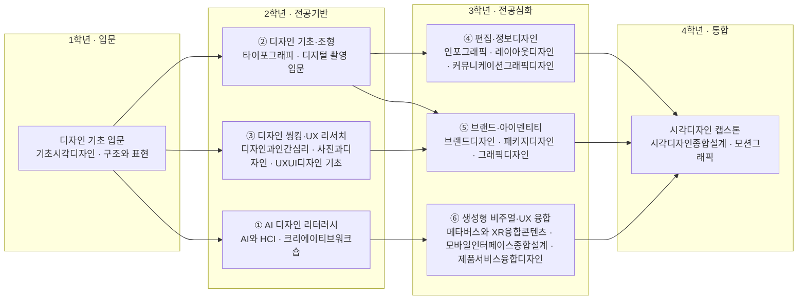

# AI융합디자인학부 · 시각디자인트랙

> ICT디자인학부의 **AI융합디자인학부** 개편에 맞춰, 시각디자인트랙은 'BX·UX/UI·브랜드 비주얼 + 생성형 AI 워크플로우'를 결합한 트랙으로 재정의됩니다.

> 조사일 2026-06-25 · 확인일 2026-06-27

## 1. 개요
시각디자인트랙은 **브랜드 경험(BX), UX/UI, 비주얼·그래픽, 타이포그래피, 편집·광고 디자인**을 다룹니다. AI 융합 개편 방향은 다음과 같습니다.
- 생성형 AI를 단순 툴이 아닌 **브랜드 문제 해결 수단으로 내재화**
- 고정 화면 제작에서 **생성형 UX(규칙·가이드·디자인 시스템 설계)**로 디자이너 역할 이동
- 프롬프트 설계·AI 워크플로우 구축을 핵심 실무 역량으로 정착

## 2. 산업·기술 트렌드 (2024–2026)
- **생성형 UX의 부상**: 디자이너의 역할이 '고정된 페이지 제작'에서 '인터페이스가 생성되는 규칙·가이드 설계'로 이동. AI가 사용자 의도를 파악해 기능·메뉴를 즉시 구성하는 생성형 UX가 확산.
- **BX 전반의 AI 실험**: 2025년부터 브랜드 경험 영역에서 생성형 AI(Midjourney, Kling, Figma Make 등)를 활용한 워크플로우 설계가 채용 우대·필수 요건으로 자리 잡음.
- **프롬프트 디자이너 직무화**: 에이전시들이 프롬프트 엔지니어링으로 디자인 결과물을 체계화하는 '프롬프트 디자이너'를 별도 직무로 채용하기 시작.

## 3. 채용 동향
- 사람인·잡코리아·디자이너잡 기준 UI/UX·BX 공고에서 **'생성형 AI 활용 경험'이 우대→필수**로 빠르게 전환.
- 실제 공고 사례: **민병철유폰** 'AI 전문 UX/UI/BX 디자이너', **멋쟁이사자처럼** BX 디자이너(Midjourney·Kling·Figma Make 워크플로우 설계 경험 우대), **빅링크** 생성형 AI 콘텐츠 플랫폼 UX/UI 신입/경력.
- 거시 지표: AI 직무 평균 연봉 4,947만 원으로 21개 주요 직무 중 1위(대기업 5,279만 / 중소 3,994만, 한국데이터경제신문 2026). 신입직 AI 공고 5년간 162% 증가.
- 주요 수요처: 네이버(Platform Labs UX/UI 등), 쇼핑 프로덕트 디자인 등 플랫폼 기업의 경력·신입 공고 상시 게시.

### 3-1. 고용 전망 — 국내·미국·중국 동향

!!! abstract "이 트랙과 향후 10년 고용"
    - **국내(고용노동부):** AI·디지털 전환의 10년 후 고용 영향은 -13.9%로, 정형 그래픽 제작 등 반복 업무는 대체 압력이 크지만 전문가·서비스직의 AI 대체율은 21~40%로 낮아 고숙련 창의·UX 설계 역량은 보완 영역에 가깝다.
    - **미국(BLS)·글로벌(WEF):** WEF 2025는 AI로 핵심 스킬의 39%가 진부화되고 스킬 격차를 1순위 장벽(63%)으로 지목, 생성형 AI 도구 활용 능력 재교육이 시각디자인 직무 유지의 관건임을 시사한다.
    - **시사점:** 단순 그래픽 산출보다 '생성형 UX·프롬프트 기반 디자인 시스템 설계'로 역량을 이동시켜야 자동화 대체 위험을 회피할 수 있다.

> 📊 거시 분석 전체: [고용노동부 취업동향·10년 전망](../employment-outlook.md) · [글로벌 비교 (미국·중국)](../global-employment-outlook.md)

## 4. 요구 직무 역량

| 핵심 직무 역량 | AI 융합 역량 | 주요 툴·자격 |
| --- | --- | --- |
| BX·브랜드 시스템, 비주얼 아이덴티티 | 생성형 AI 브랜드 에셋 제작·실험 | Figma, Adobe CC(Ps/Ai/Id) |
| UX/UI·디자인 시스템 설계 | 생성형 UX(규칙·가이드) 설계 | Figma Make, Midjourney, Stable Diffusion |
| 타이포그래피·편집·정보 디자인 | 프롬프트 엔지니어링·워크플로우 구축 | Kling, ChatGPT/Claude, Framer |

## 5. 대표 채용 기업 & 직무 예시
- **대기업·플랫폼**: 네이버(UX/UI·쇼핑 프로덕트 디자인), 카카오, 토스·우아한형제들 등 프로덕트 디자이너 수요(공통적으로 AI 활용 역량 우대).
- **중견·에이전시**: 멋쟁이사자처럼(BX 디자이너), 디자인 에이전시의 프롬프트 디자이너.
- **스타트업**: 민병철유폰(AI 전문 UX/UI/BX), 빅링크(생성형 AI 콘텐츠 플랫폼 UX/UI 신입/경력).

## 6. 교육과정 개편 시사점
1. **'생성형 UX' 정규 과목 도입**: 단일 화면 제작이 아닌 디자인 시스템·생성 규칙 설계와 AI 기반 프로토타이핑 중심으로 UX 교과 재편.
2. **프롬프트·AI 워크플로우 실습 의무화**: Midjourney·Figma Make·Stable Diffusion을 활용한 브랜드 에셋 생성 워크플로우 캡스톤.
3. **AI 시대 디자이너 윤리·저작권 모듈**: 생성형 AI 결과물의 권리·표절·브랜드 일관성 검증 역량을 교과에 반영.

## 7. 출처

> 인용 형식: **기관·매체 — 「제목」 (발행일/연도) · URL** / 확인일 2026-06-27

- **디자이너잡** — 「민병철유폰 AI 전문 UX/UI/BX 디자이너 공고」 ()
- **잡코리아** — 「멋쟁이사자처럼 BX 디자이너 채용」 ()
- **잡코리아** — 「빅링크 생성형 AI UX/UI 채용」 ()
- **캐치** — 「네이버 UX/UI 디자이너 채용」 ()
- **한국데이터경제신문** — 「AI 채용·연봉 통계」 ()
- **브런치** — 「디자인 회사에서 드디어 프롬프트 디자이너를 고용하다」 ()

## 8. 교육 목표 (예시)
> 학문 분야 정체성: 시각디자인트랙은 타이포그래피·편집·브랜딩·그래픽 커뮤니케이션을 통해 메시지를 시각적으로 구조화하는 분야로, 생성형 AI를 활용해 발상·표현·실행의 효율과 완성도를 높이는 시각 디자이너를 양성한다.

- **목표 1.** 생성형 AI 이미지·레이아웃 도구를 활용해 브랜드·편집·그래픽 시안을 다양하게 생성하고 큐레이션하여, 발상 단계의 시안 수와 품질을 정량적으로 향상시킬 수 있다. (프로젝트당 AI 활용 컨셉 시안 5종 이상)
- **목표 2.** 타이포그래피·그리드·색채 등 시각 문법의 원리를 견고히 이해하고, AI 생성물을 비평적으로 선별·정제하여 일관된 디자인 시스템으로 통합할 수 있다.
- **목표 3.** 프롬프트 디자인을 통해 의도한 비주얼 톤·스타일을 정확히 구현하고, 브랜드 아이덴티티에 부합하는 비주얼 가이드를 설계할 수 있다.
- **목표 4.** AI 저작권·윤리 기준에 따라 생성 이미지의 라이선스·출처·편향을 검토하여 상업적으로 책임 있는 시각 결과물을 산출할 수 있다.

## 9. 교육과정 구성 및 교수법 활용
**교육과정 구성**
- **기초**: 기초조형·타이포그래피·색채·디지털 도구 + 단과대학 공통 AI 디자인 리터러시.
- **전공심화**: 편집디자인·브랜드 아이덴티티·정보디자인·패키지로 시각 커뮤니케이션 전문성 확립.
- **AI 융합**: 프롬프트 디자인·생성형 비주얼·AI 무드보드/시안 생성을 전공 워크플로우에 통합.
- **캡스톤**: 산학 연계 브랜딩·편집 프로젝트를 컨셉부터 실물 적용까지 완성.

**교수법 활용**
- **스튜디오 크리틱**: 시안 합평을 통해 시각 완성도와 비평적 안목 강화.
- **AI 페어 실습**: 프롬프트 반복과 AI 시안 큐레이션으로 발상-실행 사이클 가속.
- **PBL**: 실제 브랜드·출판 과제를 기반으로 한 문제 해결형 프로젝트.
- **산학 캡스톤**: 브랜딩·출판·광고 업계와 연계한 실무 프로젝트.

## 10. 모듈형 전공교육과정 (역량·성과 중심)

### 10-1. 역량 중심 모듈 구성

> 본 모듈은 **한성대 공식 교과과정([https://www.hansung.ac.kr/Design/5147/subview.do](https://www.hansung.ac.kr/Design/5147/subview.do))**을 기본 데이터로 3~4과목 단위로 재구성했다. 공식 목록에 없는 과목은 **(예시)**로 표기. 확인일 2026-06-28.

| 모듈명 | 계층 | 핵심 역량·주제 | 학습 성과 | 대표 교과(공식/제안) |
| --- | --- | --- | --- | --- |
| AI 디자인 리터러시 | 단과대학공통 | 생성형 AI 비주얼·영상 도구, 프롬프트 디자인, 실시간 3D 기초, AI 저작권·윤리 | AI 도구로 시각 산출물을 생성하고 윤리·저작권을 검토 | AI와 HCI · 크리에이티브워크숍 · AI 저작권과 윤리(예시) |
| 디자인 기초·조형 | 학부공통 | 조형원리·타이포·색채·디지털 도구 | 디자인 기본 문법으로 시각 산출물 구성 | 기초시각디자인 · 타이포그래피 · 구조와 표현 · 디지털 촬영 입문 |
| 디자인 씽킹·UX 리서치 | 학부공통 | 사용자·시장 리서치·문제정의 | 사용자/브랜드 중심 설계 프로세스 수행 | 디자인과인간심리 · 사진과디자인 · UX·UI디자인 기초 |
| 편집·정보디자인 | 트랙전공 | 그리드·레이아웃·정보 구조화·데이터 시각화 | 편집물·인포그래픽 체계 설계 | 인포그래픽-캡스톤디자인 · 레이아웃디자인-캡스톤디자인 · 커뮤니케이션그래픽디자인-캡스톤디자인 |
| 브랜드·아이덴티티 | 트랙전공 | 브랜드 전략·BI/CI·비주얼 시스템 | 일관된 브랜드 아이덴티티 시스템 구축 | 브랜드디자인 · 패키지디자인-캡스톤디자인 · 그래픽디자인-캡스톤디자인 |
| 생성형 비주얼·UX 융합 | 트랙전공 | 프롬프트 기반 이미지·스타일 생성, 생성형 UX | 의도한 톤의 생성형 비주얼 시안 산출 | 메타버스와 XR융합콘텐츠 · 모바일인터페이스종합설계 · 제품서비스융합디자인 |
| 시각디자인 캡스톤 | 트랙전공 | 통합 브랜딩·편집 프로젝트·산학 협업 | 컨셉~실물 적용 완성작 산출 | 시각디자인종합설계1 · 시각디자인종합설계2 · 모션그래픽-캡스톤디자인 |

#### 10-1 다이어그램 — 1~4학년 모듈 로드맵

#### 10-1 모듈–역량 매핑 (학습 역량 ↔ 기업 요구역량)

> 각 모듈의 학습 역량을 본 트랙 「4. 요구 직무 역량」의 기업 직결 항목과 직접 연결한다.

| 모듈 | 핵심 역량(학습) | 매핑되는 기업 요구 역량 |
| --- | --- | --- |
| ① AI 디자인 리터러시 | 생성형 AI 비주얼 도구, 프롬프트 디자인 | 생성형 AI 브랜드 에셋 제작·실험, 프롬프트 엔지니어링·워크플로우 구축 |
| ② 디자인 기초·조형 | 조형원리·타이포·색채·디지털 도구 | 타이포그래피·편집·정보 디자인(시각 기본기) |
| ③ 디자인 씽킹·UX 리서치 | 사용자·시장 리서치·문제정의 | UX/UI·디자인 시스템 설계 |
| ④ 편집·정보디자인 | 그리드·레이아웃·정보 구조화·데이터 시각화 | 타이포그래피·편집·정보 디자인 |
| ⑤ 브랜드·아이덴티티 | 브랜드 전략·BI/CI·비주얼 시스템 | BX·브랜드 시스템, 비주얼 아이덴티티 |
| ⑥ 생성형 비주얼·UX 융합 | 프롬프트 기반 이미지·스타일 생성, 생성형 UX | 생성형 AI 브랜드 에셋 제작·실험, 생성형 UX(규칙·가이드) 설계 |
| 시각디자인 캡스톤 | 통합 브랜딩·편집 프로젝트·산학 협업 | BX·브랜드 시스템 + UX/UI·디자인 시스템 설계(종합) |

### 10-2. 모듈 간 관계 (트랙·학부·단과대학)
- **위계**: 단과대학 공통(AI 디자인 리터러시) → AI융합디자인학부 공통(디자인 기초·조형, 디자인 씽킹·리서치) → 트랙 전공심화(편집·정보, 브랜드·아이덴티티, 생성형 비주얼) → 시각디자인 캡스톤.
- **선후수**: 「디자인 기초·조형(타이포)」 이수 후 「편집·정보디자인」, 「브랜드·아이덴티티」 수강. 「생성형 비주얼·프롬프트 디자인」은 「AI 디자인 리터러시」 후수.
- **마이크로디그리**: "AI 브랜딩 디자인" 마이크로디그리(AI 디자인 리터러시 + 브랜드·아이덴티티 + 생성형 비주얼·프롬프트 디자인) 운영.
- **교차수강**: 「생성형 비주얼·프롬프트 디자인」은 미디어·영상애니메이션 트랙과, 「편집·정보디자인」은 미디어디자인 트랙과 교차 개방.

### 10-3. 진로 분야별 모듈 조합 가이드

| 진로 분야 | 권장 모듈 조합 | 목표 직무 |
| --- | --- | --- |
| 브랜딩·아이덴티티 | AI 디자인 리터러시 + 브랜드·아이덴티티 + 생성형 비주얼·프롬프트 디자인 | 브랜드 디자이너, BX 디자이너 |
| 편집·출판·광고 | 디자인 기초·조형 + 편집·정보디자인 + 생성형 비주얼·프롬프트 디자인 | 편집 디자이너, 아트디렉터 |
| 정보·데이터 시각화 | 디자인 씽킹·리서치 + 편집·정보디자인 + AI 디자인 리터러시 | 인포그래픽 디자이너, 데이터 비주얼라이저 |

### 10-4. 학생 학습경로 예시
- **경로 A — 브랜드 디자이너**: 1학년 기초조형·타이포·AI 디자인 리터러시 → 2학년 디자인 리서치·브랜드디자인 입문 → 3학년 아이덴티티시스템·AI 브랜딩 워크숍(생성형 비주얼) → 4학년 산학 브랜딩 캡스톤 + 포트폴리오.
- **경로 B — 편집/아트디렉터**: 1학년 기초조형·타이포·AI 디자인 리터러시 → 2학년 편집디자인·정보디자인 → 3학년 생성형비주얼디자인·데이터 시각화 심화 → 4학년 출판/광고 산학 캡스톤 + 작품집.

- **경로 C — 인포그래픽·데이터 비주얼라이저**: 1학년 기초조형·타이포·AI 디자인 리터러시 → 2학년 디자인리서치·편집디자인 → 3학년 정보디자인·데이터 시각화·생성형비주얼디자인 → 4학년 공공·미디어 데이터 시각화 산학 캡스톤(인터랙티브 인포그래픽) → 인포그래픽 디자이너·데이터 비주얼라이저로 진출.

- **경로 D — 프롬프트 디자이너/생성형 UX 설계자**: 1학년 AI 디자인 리터러시·기초조형 → 2학년 디자인씽킹·브랜드디자인 입문 → 3학년 생성형비주얼디자인·AI 브랜딩 워크숍(프롬프트 워크플로우 구축) → 4학년 생성형 UX·디자인 시스템 캡스톤(AI 디자인 시스템 설계) → 프롬프트 디자이너·생성형 UX 설계자로 진출.
