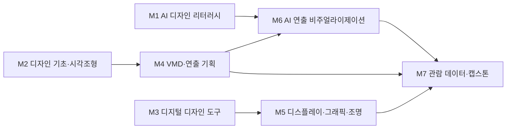

# AI융합디자인학부 · VMD전시디자인트랙

> 한성대학교 **AI융합디자인학부**(구 ICT디자인학부) 2026 개편 리서치 · 조사일 2026-06-25 · 추정값은 '추정' 표기 · 재점검 2026-06-30

## 1. 개요

VMD전시디자인트랙은 **비주얼 머천다이징(VMD)** — 매장 디스플레이·진열 전략·집기 디자인 — 과 **전시디자인**(박물관·과학관·테마파크·미디어아트·팝업)을 다룬다. 전통적 '진열·연출'에서 **리테일테크·생성형 AI 비주얼·데이터 기반 매장 분석·몰입형 실감미디어**로 융합 확장 중이다.

**AI 융합 개편 방향**: VMD를 '공간 그래픽 + 생성형 AI 비주얼 + 매장 데이터 분석'의 융합 직무로, 전시디자인을 '몰입형·실감미디어 + 디지털 트윈' 직무로 재정의한다.

## 2. 산업·기술 트렌드 (2024–2026)

> **도구 목록 기준일: 2026-07-01 · 분기별 갱신.** 아래 언급된 생성형 AI 도구·제품명은 시장 변화가 빨라 분기 단위로 갱신한다.

- **리테일테크 & 무인매장**: 국내 무인매장 약 **6,323개**(2023). 현대백화점 **'언커먼 스토어'**(AI 카메라+무게센서 자동결제), 롯데마트 AI 맞춤 추천 등 매장 자동화·동선 분석 확산.
- **AI 개인화 추천(실증)**: 롯데온은 AI 스타트업 **업스테이지** 추천 API로 테스트에서 **구매전환율 30% 개선**. 현대백화점 생성형 AI 쇼핑 어시스턴트 **'헤이디(HEYDI)'**, 롯데쇼핑 AI 전담조직 **'라일락(LILAC)'**, 신세계그룹-OpenAI **MOU 체결(2026.04)**(단, MOU 체결 약 10일 만에 협력 논의가 중단되고 이후 Reflection AI 중심으로 전환했다는 보도가 있어 '전략 제휴'로 단정하기 어려움).
- **디지털 사이니지**: 한국 시장 2024년 약 **5.43억 달러**(CAGR 약 5.55%, IMARC).
- **생성형 AI 공간 비주얼**: 미드저니·Adobe Firefly가 VMD 콘셉트 비주얼·무드보드 제작에 확산.
- **몰입형/미디어아트 전시(성장축)**: **디스트릭트(d'strict)** 2024년 별도 매출 약 **470억 원**, **닷밀(Dotmill)** **2024년 코스닥 상장**(국내 첫 실감미디어 테마파크 상장, 매출 약 236억 원).

## 3. 채용 동향

- **공고 물량(잡코리아 검색 기준, 시점 변동)**: VMD 약 949~1,196건, VMD 디자이너 약 1,224건, 비주얼머천다이저 약 840건, 전시디자인 약 1,874건, 전시기획 약 3,460건.
- **직무 분포**: 신입보다 **경력 2~10년 요구 공고가 다수**, 서울(특히 강남) 집중.
- **신입 직무**: 백화점/리테일 VMD 담당, 브랜드 VMD, 공간 그래픽 디자이너, 전시디자이너/전시기획.

### 3-1. 고용 전망 — 국내·미국·중국 동향

!!! abstract "이 트랙과 향후 10년 고용"
    - **국내(고용노동부):** 소매·도매·음식점의 온라인화로 매장 일자리는 감소하나, 그만큼 오프라인 매장은 체험·전시형 공간으로 전환돼 VMD·전시연출의 차별화 수요가 커진다. 수요는 서비스직 중심으로 이동한다.
    - **미국(BLS)·글로벌(WEF):** 미국은 캐셔 등 단순 판매직 감소를 전망하는 반면, WEF는 디지털·체험 콘텐츠 직군 성장을 제시해 공간연출과 디지털 전시의 결합이 유리하다.
    - **시사점:** 온라인이 대체하기 어려운 '오프라인 체험·전시' 역량에 디지털 사이니지·3D 시각화를 더해 VMD 교육과정의 경쟁력을 강화해야 한다.

> 📊 거시 분석 전체: [고용노동부 취업동향·10년 전망](../employment-outlook.md) · [글로벌 비교 (미국·중국)](../global-employment-outlook.md)

## 4. 요구 직무 역량

| 구분 | 내용 |
| --- | --- |
| **핵심 직무 역량** | VMD/공간/그래픽 기획·디자인, 스토어 포맷별 디스플레이 전략, 집기 디자인, 진열 가이드 수립, 전시 콘셉트·동선 기획 |
| **AI 융합 역량** | 생성형 AI 비주얼(미드저니·Adobe Firefly·Stable Diffusion), AI 렌더링·디지털 트윈·실감콘텐츠 제작, 디지털 사이니지·인터랙티브 미디어 기획, 매장 데이터(동선·구매) 분석 리터러시 |
| **주요 툴** | Photoshop·Illustrator(상급, 필수), SketchUp·3ds Max(우대), 미디어아트·인터랙티브 콘텐츠 툴 |
| **자격증** | 컬러리스트 산업기사/기사, 전시기획 관련 |

!!! tip "추가 보강 제안 (2026 개편 반영안 · 공식 교과 아님)"
    공식 교과를 대체하지 않는 **추가 보강 방향**이다(신설/심화 제안).
    - **추가 기술트렌드:** 리테일미디어 · 매장 센서 · AI 개인화 · 디지털 사이니지
    - **추가 직무역량:** 동선/구매 데이터 분석 · 무드보드 생성 · 전시 인터랙션
    - **교육과정 보강(제안):** 데이터 기반 VMD · AI 전시연출 실습

## 5. 대표 채용 기업 & 직무 예시

- **백화점·유통(대기업)**: 현대백화점(디자인LAB VMD팀, 아울렛 VMD)·계열 한섬(해외패션·화장품 VMD), 롯데마트(AR/VMD팀), 신세계그룹(2026 VMD 직무 채용).
- **뷰티·패션 리테일**: CJ올리브영(공간크리에이티브팀 VMD, 2026 상반기 신입 공채), **아모레퍼시픽**(2026 상반기 신입에 'VMD 디자인' 직무 명시, AI 역량검사 포함), 러쉬코리아·한세엠케이 등.
- **전시·공간 에이전시(중견·스타트업)**: 시공테크(박물관·과학관·테마파크 전시디자인), 닷밀(실감미디어), 디스트릭트코리아.

## 6. 교육과정 개편 시사점

1. **'AI VMD' 융합 트랙화**: 생성형 AI 비주얼(미드저니·Firefly)로 콘셉트 시안을 제작하고, 매장 동선·구매 데이터를 해석하는 '데이터 기반 VMD' 과목을 신설.
2. **몰입형·실감미디어 전시 실습**: 디스트릭트·닷밀·시공테크 사례를 모델로 디지털 사이니지·인터랙티브 미디어·디지털 트윈 전시 프로젝트를 운영.
3. **신입 차별화 포트폴리오**: 경력 수요가 큰 시장 특성상, AI 툴 포트폴리오 + 컬러리스트 자격으로 신입 경쟁력을 확보하는 산학연계 트랙 설계(추정 제언).

## 7. 출처

> 인용 형식: **기관·매체 — 「제목」 (발행일/연도) · URL** / 확인일 2026-06-27

- **알스퀘어** — 「무인매장」
- **업스테이지** — 「롯데온 AI 전환율 30%」
- **뉴데일리** — 「신세계그룹-OpenAI MOU 체결」 (2026.04, 언론 보도 기준) · 원문 URL 미확보 · 확인 2026-06-30 (※ MOU 약 10일 후 협력 논의 중단·Reflection AI 전환 보도 포함 — '전략 제휴'로 단정 불가)
- **IMARC·산업종합저널** — 「디지털 사이니지」
- **아시아경제·thevc** — 「디스트릭트·닷밀 상장」
- **잡코리아·원티드·올리브영·아모레·현대백화점·시공테크** — 「채용」
- **큐넷** — 「자격증」

## 8. 교육 목표 (예시)

> 학문 분야 정체성: VMD전시디자인트랙은 브랜드·상품·콘텐츠의 메시지를 공간 연출과 디스플레이로 시각화하여 관람·구매 경험을 설계하는 비주얼 머천다이징·전시 디자인 전문가를 양성한다.

1. **연출·디스플레이 핵심 역량 확립**: 졸업까지 리테일 VMD·전시 공간 연출 프로젝트 4건 이상을 컨셉-공간-그래픽-조명까지 통합 완수한다.
2. **AI 기반 연출 비주얼 워크플로우 내재화**: 생성형 AI로 매장·전시 연출 무드와 디스플레이 시안을 빠르게 발산·정제하고, 프롬프트 디자인으로 브랜드 톤을 일관되게 구현한다.
3. **데이터 기반 동선·진열 의사결정 역량**: 관람·고객 동선, 체류·시선 데이터를 분석해 진열·연출 전략의 효과를 정량적으로 검증·개선할 수 있다.
4. **AI 윤리·저작권 준수 실무 역량**: 전시·리테일 콘텐츠에 사용되는 AI 생성 비주얼의 저작권·브랜드 IP 이슈를 판별하고 출처·라이선스를 관리할 수 있다.

## 9. 교육과정 구성 및 교수법 활용

**교육과정 구성**

- **기초**: 디자인 조형, 색채·그래픽, 머천다이징·전시 개론으로 연출 기본 어휘 확립.
- **전공심화**: 리테일 VMD, 전시·박람회 공간 연출, 디스플레이·그래픽·사이니지 설계 숙련.
- **AI 융합**: 생성형 AI 연출 무드보드, AI 비주얼 시안, 관람 데이터 분석을 연출 프로세스에 통합.
- **캡스톤**: 실제 브랜드·전시 주제 기반 종합 VMD/전시 연출을 AI 협업으로 완수·전시.

**교수법 활용**

- **스튜디오 크리틱**: 무드보드·연출안 핀업 리뷰로 비주얼 완성도를 반복 개선.
- **PBL(실브랜드 프로젝트)**: 실제 브랜드·전시 주제를 다루는 문제 기반 연출 프로젝트.
- **AI 페어 실습**: 학생-AI 협업으로 연출 무드·디스플레이 시안을 생성하고 디자이너가 큐레이션하는 워크플로우.
- **산학 캡스톤**: 리테일·전시기획 기업 연계 현장 연출 프로젝트.

## 10. 모듈형 전공교육과정 (M1~M7)

### 10-1. 모듈형 교육과정 안내

> 출처: 한성대학교 VMD전시디자인트랙 공식 교과과정([https://www.hansung.ac.kr/Design/5154/subview.do](https://www.hansung.ac.kr/Design/5154/subview.do)) 기준, 확인일 2026-06-30. 구성 교과목 공식, 미존재 보강은 (제안). (전기=전공기초·전필=전공필수·전선=전공선택)
> **교과 구분 표기:** 이수구분(전기·전필·전선)이 붙은 과목은 **공식 현행 교과**, `(제안)`은 **신설 제안 교과**, `(미정)`은 **개설 학기 미정**이다. 표 오른쪽 '구분' 열은 각 모듈의 교과 구성 성격을 요약한다.

| 모듈 | 모듈명 | 구성 교과목 (학년-학기·이수구분) | 모듈 설명 | 모듈 학습성과 | 모듈 간 관계 | 구분 |
| --- | --- | --- | --- | --- | --- | --- |
| **M1** | AI 디자인 리터러시 | AI 공간디자인기초(2-1·전선) · AI 기반 공간렌더링(2-2·전선) · 생성형 AI 디자인 입문(제안) · AI 저작권·윤리(제안) | 생성형 AI 비주얼 도구, 프롬프트 디자인, 데이터 기반 디자인, AI 저작권·윤리 | AI 도구로 디자인 대안을 생성·평가하고 윤리·저작권을 준수한다 | 전공기초·1학년 선이수 | 공식·제안 |
| **M2** | 디자인 기초·시각조형 | 공간 조형(2-1·전필) · 디자인컨셉(1-2·전선) · 컬러와 패턴디자인(3-2·전선) · 한국전통디자인(3-1·전선) | 조형 원리, 색채·타이포, 디자인 사고 | 디자인 기본 문법으로 시각 결과물을 구성한다 | 전공기초학습 | 공식 |
| **M3** | 디지털 디자인 도구 | 드로잉과 CAD(2-1·전선) · IOT인터페이스디자인(2-2·전선) · UX·UI디자인 기초(2-2·전선) · 디자인과 감성공학(2-2·전선) | 2D/3D 디지털 저작, 그래픽·이미지 처리 | 디지털 도구로 연출용 비주얼을 제작·관리한다 | 전공기초학습 | 공식 |
| **M4** | VMD·연출 기획 | VMD와 전시무대디자인(1-1·전기) · VMD스튜디오(2-2·전필) · 브랜드디자인(3-2·전선) · 디자인컨설팅(3-2·전선) | 머천다이징, 공간 연출, 브랜드 스토리텔링 | 브랜드 메시지를 공간 연출 전략으로 구성한다 | M4→M6 선수 | 공식 |
| **M5** | 디스플레이·그래픽·조명 | 가구디자인(2-2·전선) · 브랜드숍디자인(4-1·전필) · 디스플레이 취업(4-2·전필) · 패키지디자인-캡스톤디자인(3-1·전선) | 디스플레이 구조, 사이니지·그래픽, 조명 연출 | 디스플레이·그래픽·조명을 통합 연출한다 | M4-M5 상호보완 | 공식 |
| **M6** | AI 연출 비주얼라이제이션 | AI 공간디자인기초(2-1·전선) · AI 기반 공간렌더링(2-2·전선) · 디자인상품화스튜디오(4-1·전선) · 생성형 연출 무드보드(제안) | AI 무드보드, 연출 시안 생성, 프롬프트-투-씬(prompt-to-scene) | AI 워크플로우로 연출 무드·시안을 신속히 제작한다 | M6→M7 심화 | 공식·제안 |
| **M7** | 관람 데이터·캡스톤 | 전시디자인 스튜디오1(3-1·전필) · 전시디자인 스튜디오2(3-2·전필) · VMD창업과 실무 캡스톤디자인(4-1·전필) · 레이아웃디자인-캡스톤디자인(3-1·전선) | 동선·체류·시선 데이터 분석, 종합 연출 | 데이터 근거 기반 종합 VMD/전시 연출을 완수한다 | 기존 모듈 역량 종합 검증 | 공식 |

### 10-2. 모듈형 교육과정 로드맵 (학년·학기)

공식 교과목이 **언제 개설되는지**(학년-학기)를 한눈에 보여준다. (제안)·(미정) 교과목은 제외.

| 모듈 | 1-1 | 1-2 | 2-1 | 2-2 | 3-1 | 3-2 | 4-1 | 4-2 |
| --- | --- | --- | --- | --- | --- | --- | --- | --- |
| **M1** AI 디자인 리터러시 | | | AI 공간디자인기초 | AI 기반 공간렌더링 | | | | |
| **M2** 디자인 기초·시각조형 | | 디자인컨셉 | 공간 조형 | | 한국전통디자인 | 컬러와 패턴디자인 | | |
| **M3** 디지털 디자인 도구 | | | 드로잉과 CAD | IOT인터페이스디자인 · UX·UI디자인 기초 · 디자인과 감성공학 | | | | |
| **M4** VMD·연출 기획 | VMD와 전시무대디자인 | | | VMD스튜디오 | | 브랜드디자인 · 디자인컨설팅 | | |
| **M5** 디스플레이·그래픽·조명 | | | | 가구디자인 | 패키지디자인-캡스톤디자인 | | 브랜드숍디자인 | 디스플레이 취업 |
| **M6** AI 연출 비주얼라이제이션 | | | AI 공간디자인기초 | AI 기반 공간렌더링 | | | 디자인상품화스튜디오 | |
| **M7** 관람 데이터·캡스톤 | | | | | 전시디자인 스튜디오1 · 레이아웃디자인-캡스톤디자인 | 전시디자인 스튜디오2 | VMD창업과 실무 캡스톤디자인 | |

**모듈 흐름(요약 다이어그램):**

### 10-3. 학습자 진로 가이드

트랙별 권장 모듈 조합이다.

| 진로 분야 | 권장 모듈 조합 | 지향 |
| --- | --- | --- |
| **리테일 VMD** | M4 VMD·연출 기획 + M5 디스플레이·그래픽·조명 + M6 AI 연출 비주얼라이제이션 | VMD 디자이너 · 비주얼 머천다이저 |
| **전시·박람회 연출** | M4 VMD·연출 기획 + M7 관람 데이터·캡스톤 + M3 디지털 디자인 도구 | 전시 디자이너 · 공간 연출 기획자 |
| **AI 연출 비주얼 스튜디오** | M1 AI 디자인 리터러시 + M6 AI 연출 비주얼라이제이션 + M5 디스플레이·그래픽·조명 | 연출 비주얼라이저 · 컨셉 아트 디렉터 |

### 10-4. 학생 학습경로 예시

- **경로 A (리테일 VMD 실무형)**: 1학년 디자인 기초·AI 리터러시 → 2학년 VMD 기획·전시연출 스튜디오 I → 3학년 디스플레이·조명 + AI 연출 비주얼 → 4학년 산학 리테일 VMD 캡스톤·포트폴리오.
- **경로 B (전시 연출·데이터형)**: 1학년 AI 리터러시·디지털 도구 → 2학년 전시연출 스튜디오·생성형 무드보드 → 3학년 AI 연출 비주얼 + 관람·동선 데이터 분석 → 4학년 데이터 근거 전시 연출 캡스톤·전시기획사 연계.

- **경로 C (몰입형·실감미디어 전시형)**: 1학년 디자인 기초·AI 리터러시 → 2학년 전시연출 스튜디오·3D 모델링 기초 → 3학년 전시그래픽·사이니지 + AI 연출 비주얼(디지털 트윈·인터랙티브 미디어) → 4학년 디스트릭트·닷밀형 실감미디어 전시 캡스톤으로 실감미디어 전시 디자이너로 진출.
- **경로 D (AI 연출 비주얼 스튜디오형)**: 1학년 AI 디자인 리터러시·생성형 AI 디자인 입문 → 2학년 VMD 기획·생성형 무드보드 스튜디오 → 3학년 AI 연출 비주얼라이제이션 + 디스플레이디자인 → 4학년 브랜드 연출 비주얼 캡스톤으로 연출 비주얼라이저·컨셉 아트 디렉터로 진출.

!!! info "진출 직무 설명 — 이 직무는 어떤 일을 하나요?"
    각 경로가 향하는 직무가 **실제로 무슨 일을 하고, AI를 어떻게 쓰는지** 쉽게 정리했다.

    - **VMD 디자이너·비주얼 머천다이저 (경로 A):** 매장 진열과 디스플레이, 집기를 기획해 손님이 사고 싶게 만드는 매장 연출을 담당하는 일을 한다. → *AI 활용:* 미드저니·Firefly로 매장 무드보드와 진열 시안을 빠르게 만든다.
    - **전시 디자이너·공간 연출 기획자 (경로 B):** 박물관·박람회·팝업 같은 전시 공간의 콘셉트와 동선, 볼거리를 설계하는 일을 한다. → *AI 활용:* 관람 동선·체류 데이터를 AI로 분석해 연출 효과를 정량 검증한다.
    - **실감미디어 전시 디자이너 (경로 C):** 프로젝션 매핑·미디어아트처럼 몰입감 있는 실감형 전시를 기획·제작하는 일을 한다. → *AI 활용:* 생성형 AI와 디지털 트윈으로 인터랙티브 영상 콘텐츠를 만든다.
    - **연출 비주얼라이저·컨셉 아트 디렉터 (경로 D):** 브랜드 연출과 전시의 전체 비주얼 톤을 잡고 콘셉트 이미지의 방향을 정하는 일을 한다. → *AI 활용:* 프롬프트로 브랜드 톤을 일관되게 유지하며 연출 시안을 대량 생성한다.

### 10-5. 상위 수준 보완 권고

> 아래는 홍익대·국민대·건국대 공간·전시디자인 등 VMD·전시·리테일테크 특성화 **상위 비교군** 및 산업 표준 정렬을 위한 **보완 권고**다. **공식 교과를 대체하지 않으며**, 2027학년도 교과 개편 시 심의 의견·향후 개선 계획으로 활용한다.

| 보완 영역 | 반영 위치 | 추가하면 좋은 내용 | 기대 효과 |
| --- | --- | --- | --- |
| 리테일테크·매장 센서/동선 데이터 | M7, M4 | AI 카메라·무게센서·비콘 기반 동선·체류 데이터 수집·전처리, 히트맵 진열 효과 분석(언커먼 스토어형 무인매장 사례) | 진열·연출 의사결정을 정량 근거로 검증하는 데이터 기반 VMD 역량 확보 |
| AI 개인화 추천·리테일미디어 | M1, M6 | 구매전환·추천 API(업스테이지·헤이디형) 연계, 매장 내 개인화 오퍼와 VMD 연출 정합 설계 | 온·오프 통합 리테일미디어 환경의 매장 연출 직무 대응력 강화 |
| 디지털 사이니지·인터랙티브 미디어 | M5, M6 | 콘텐츠 스케줄링·반응형 사이니지·CMS 운용, 센서 연동 인터랙션 시나리오 설계 실습 | 정적 디스플레이를 넘어선 동적·실감 연출 포트폴리오 확장 |
| 생성형 AI 무드보드·시안 파이프라인 | M1, M6 | 미드저니·Firefly 프롬프트 체계화, 브랜드 톤 일관 시드·레퍼런스 관리, 무드보드→연출 시안 자동화 워크플로우 | 콘셉트 발산·정제 속도 향상과 브랜드 톤 재현성 확보 |
| 몰입형·실감미디어 전시 연출 | M7, M3 | 디지털 트윈·프로젝션 매핑·미디어아트(디스트릭트·닷밀형) 공간 인터랙션 프로토타이핑 | 성장축인 실감미디어 전시 시장의 차별화 직무 진입 경쟁력 |
| 구매·체류 데이터 분석·성과 검증 | M7 | KPI 설계(체류·전환·객단가), A/B 진열 테스트, 대시보드 기반 연출 성과 리포팅 | 연출 효과를 사업 지표로 입증하는 데이터 커뮤니케이션 역량 강화 |
