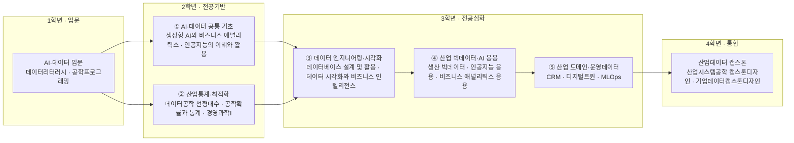

# 산업시스템공학부 · 응용산업데이터공학트랙

> 한성대학교 IT공과대학 산업시스템공학부 · 2026학년도 AI융합 교육과정 개편 자료 · 작성 기준일: 2026-06-25

## 1. 개요

**트랙 정의.** 응용산업데이터공학트랙은 제조·물류·서비스 등 **산업 도메인 데이터를 수집·분석·모델링**하여 의사결정과 예측·최적화로 연결하는 역량을 기른다. 데이터 분석, 머신러닝, 수리 최적화, AI 수요예측, 제조 AI가 핵심 영역이다.

**AI 융합 개편 방향.** "데이터 분석 도구를 다루는 사람"을 넘어, **산업 도메인 지식 + 데이터/AI 역량 + 비즈니스 문제 정의 능력**을 갖춘 인재를 양성한다. AI가 코딩·분석 일부를 대체하면서, "우리 회사·공정의 문제를 정의하고 AI로 푸는" 도메인 결합형 데이터 인재의 가치가 커지고 있다.

## 2. 산업·기술 트렌드 (2024–2026)

### 대기업 동향

- **삼성전자**: AI 자율공장 전환의 핵심은 **데이터**. 디지털 트윈 시뮬레이션과 품질·생산·물류 AI 에이전트가 공정 데이터를 실시간 분석. AI/데이터 분야 사원 별도 모집(DX부문).
- **쿠팡**: 데이터 분석 기반 운영·예측이 핵심 경쟁력. 데이터 분석·테스트 PM 등 데이터 직무 상시 모집.
- **물류(CJ대한통운)**: 디지털 트윈 가상 창고로 물류 수요예측, AI 기반 물류 최적화 솔루션 확산.

### 핵심 기술 키워드

- 데이터 분석·엔지니어링(SQL·Python, 파이프라인, 클라우드) / AI 수요예측 / 제조 AI(예측 정비, AI 비전 품질검사) / 최적화+ML 결합(예측→의사결정)

### 중소·정부 동향

- 정부 2026년 예산안 **약 10.1조 원 규모 AI 투자**, 제조·농업 '풀스택 Physical AI' 역량 확보 목표.
- **스마트제조 전문인력 육성사업 Track2(제조AI 솔루션 개발인력)** — 데이터·AI 인재의 제조 현장 진입 경로.

## 3. 채용 동향

- **흐름**: 사람인·잡코리아·LinkedIn·Indeed 기준, 데이터 분석/엔지니어 직무 공고가 꾸준히 이어짐(Indeed 서울 기준 데이터 분석 800건+ 수준). 2025년 공고 핵심 키워드는 **'AI 활용 능력'**과 도메인 이해도.
- **선호 인재상**: 기초 코딩 + 통계 이해 + 도메인 지식(제조·물류·금융) 결합. 자격증 개수보다 SQL·통계·클라우드 처리 경험·포트폴리오 중시.
- **신입 연봉(참고)**: 데이터 분석가 신입 약 3,800~5,000만 원 수준(링커리어 가이드 인용, 도메인 축적 시 상승폭 큼).
- **신입 직무 예시**: 데이터 분석가, 데이터 엔지니어, 제조/물류 데이터 사이언티스트, 수요예측·BI 담당.

### 3-1. 고용 전망 — 국내·미국·중국 동향

!!! abstract "이 트랙과 향후 10년 고용"
    - **국내(고용노동부):** 신산업 인력난에서 빅데이터 부족 1.96만·클라우드 1.88만명(2027)으로 응용산업데이터 직무가 부족 1·2위를 차지하며, 연구개발업·컴퓨터 프로그래밍 분야 취업자가 증가한다.
    - **미국(BLS)·글로벌(WEF):** 컴퓨터·수학 직군 +10.1% 성장(AI 수요)이 예상되고, WEF는 빅데이터 전문가를 최고 성장 직무로, 데이터 입력 등 단순직을 감소 직무로 분류한다.
    - **시사점:** SQL·통계·클라우드 처리 등 고숙련 산업데이터 분석 역량을 도메인 지식과 결합해 키워야 부족 직무 수요에 대응할 수 있다.

> 📊 거시 분석 전체: [고용노동부 취업동향·10년 전망](../employment-outlook.md) · [글로벌 비교 (미국·중국)](../global-employment-outlook.md)

## 4. 요구 직무 역량

| 구분 | 세부 역량 |
| --- | --- |
| **핵심 직무 역량** | 데이터 분석·통계, 데이터 전처리·파이프라인, 시각화/BI, 도메인(제조·물류) 문제 정의, 가설 검증 |
| **AI 융합 역량** | 머신러닝 모델링, AI 수요예측, 제조 AI(이상감지·예측정비), 생성형/에이전트 AI 활용, 예측+최적화 연계 |
| **주요 툴·자격** | Python, SQL, 통계, 수리 최적화, 클라우드 데이터 처리, ERP/MES 데이터, BI 툴(Tableau/Power BI), 빅데이터분석기사·ADsP·SQLD, GA4·SQLP(추정 우대) |

!!! tip "추가 보강 제안 (2026 개편 반영안 · 공식 교과 아님)"
    공식 교과를 대체하지 않는 **추가 보강 방향**이다(신설/심화 제안).
    - **추가 기술트렌드:** 제조AI · 예지보전 · 운영데이터 플랫폼
    - **추가 직무역량:** ETL · ML 모델링 · 대시보드 · MLOps
    - **교육과정 보강(제안):** 산업데이터 파이프라인 · 제조AI 운영

## 5. 대표 채용 기업 & 직무 예시

| 구분 | 기업 | 직무 예시 |
| --- | --- | --- |
| **대기업** | 삼성전자(DX부문), LG전자, 현대자동차 | AI/데이터 사원, 제조 데이터 사이언티스트, 공정 데이터 분석 |
| **플랫폼·물류** | 쿠팡, CJ대한통운 | 데이터 분석·테스트 PM, AI·빅데이터, 물류 수요예측 |
| **중견·금융/유통** | 유통·제조사 BI/데이터 조직 | BI 분석가, 수요예측·재고 분석 |
| **스타트업/중소** | 제조AI·데이터 솔루션 기업(Track2 수요기업) | 제조AI 솔루션 개발, ML 엔지니어, 데이터 엔지니어 |

## 6. 교육과정 개편 시사점

1. **"산업 도메인 + AI 분석" 결합 캡스톤**: 채용 시장이 '도메인 이해 + AI 활용'을 핵심으로 본다. 제조·물류 실데이터로 AI 수요예측·이상감지 프로젝트 포트폴리오 강화.
2. **예측(ML) → 최적화(의사결정) 파이프라인 교육**: 단순 분석을 넘어 재고·생산·물류 최적화 의사결정으로 연결하는 융합 과목 신설(산업공학트랙과 교차 수강).
3. **AI 에이전트·생성형 AI 실무 + 산학 인턴십**: 생성형/에이전트 AI를 데이터 분석 워크플로에 활용하는 실습을 정규화, 정부 스마트제조 인력육성(Track2) 및 기업 인턴십과 연계.

## 7. 출처

> 인용 형식: **기관·매체 — 「제목」 (발행일/연도) · URL** / 확인일 2026-06-27

- **캐치** — 「삼성전자 DX부문 AI/데이터 사원」
- **잡코리아** — 「쿠팡 데이터 분석 & 테스트 PM」
- **사람인** — 「데이터분석가 채용정보」
- **Indeed** — 「데이터 분석(서울)」
- **링커리어** — 「2025 데이터 분석가 가이드」
- **Datarian** — 「채용공고 모음」
- **코드잇** — 「데이터 자격증 총정리」
- **삼성 뉴스룸** — 「AI 자율공장」
- **CJ대한통운** — 「디지털 트윈」
- **PwC** — 「피지컬 AI」
- **뉴스천지** — 「2026 AI 대전환」

## 8. 교육 목표 (예시)

> 학문 분야 정체성: 응용산업데이터공학은 산업 현장에서 생성되는 대규모 데이터를 수집·처리·분석하고 모델링하여, 산업 시스템의 운영과 의사결정을 데이터 기반으로 지능화하는 학문이다.

산업 도메인(제조·물류·서비스) 이해를 토대로 데이터 엔지니어링·머신러닝·MLOps 역량을 결합해, 산업 데이터를 가치 있는 의사결정과 지능형 서비스로 전환하는 산업데이터 융합 인재를 양성한다.

1. **산업 데이터 파이프라인 구축 역량**: 센서·공정·물류 데이터를 수집·정제·저장·처리하는 데이터 엔지니어링 파이프라인을 설계·구현할 수 있다. (실데이터 파이프라인 1건 구축)
2. **AI 수요예측·이상탐지 모델링**: 시계열·머신러닝·딥러닝 기법으로 수요예측·이상탐지·예측정비 모델을 개발하고 성능을 평가할 수 있다. (예측/탐지 모델 2건 이상, 정량 지표 검증)
3. **디지털트윈·제조AI 서비스 구현**: 산업 데이터를 디지털트윈·제조AI 분석 서비스로 통합하고 MLOps 기반으로 배포·운영할 수 있다. (모델 배포·모니터링 파이프라인 1건 구축)
4. **AI 윤리·데이터 거버넌스 적용**: 데이터 품질·프라이버시·편향·재현성 등 책임 있는 데이터·AI 거버넌스 기준을 산업 데이터 프로젝트에 적용할 수 있다. (데이터·모델 거버넌스 점검 보고서 1건)

## 9. 교육과정 구성 및 교수법 활용

**교육과정 구성**

- **기초 단계(1~2학년)**: 공학수학·통계, Python·데이터 기초, 생성형 AI 활용, 데이터베이스 등 데이터 핵심 기초를 형성한다.
- **전공심화 단계(2~3학년)**: 데이터 엔지니어링, 데이터베이스·빅데이터 처리, 산업통계, 머신러닝 등 산업데이터 분석·처리 역량을 심화한다.
- **AI 융합 단계(3~4학년)**: ML 기초 위에 AI 수요예측·이상탐지·디지털트윈·MLOps 등 전공-AI 결합 교과로 산업 응용 역량을 확장한다.
- **캡스톤 단계(4학년)**: 산학 연계 실데이터로 파이프라인부터 모델 배포까지 통합하는 산업데이터 종합설계를 수행한다.

**교수법 활용**

- **데이터 분석 프로젝트**: 실제 산업 데이터셋을 활용한 분석·모델링 과제 중심 학습.
- **산학 연계 캡스톤**: 제조·물류 기업의 데이터·과제를 기반으로 한 종합설계.
- **AI 툴·클라우드 실습**: Python·노트북·클라우드 ML 환경과 생성형 AI 코딩 도구를 활용한 파이프라인·모델 실습.
- **PBL(문제 기반 학습)**: 산업 도메인 문제를 데이터 관점에서 정의·해결하는 과정 중심 수업.

## 10. 모듈형 전공교육과정 (역량·성과 중심)

### 10-1. 역량 중심 모듈 구성

> 본 모듈은 **한성대 공식 교과과정([https://www.hansung.ac.kr/Engineering/5022/subview.do](https://www.hansung.ac.kr/Engineering/5022/subview.do))**을 기본 데이터로 3~4과목 단위로 재구성했다. 공식 목록에 없는 과목은 **(예시)**로 표기. 확인일 2026-06-28.

| 모듈명 | 계층 | 핵심 역량·주제 | 학습 성과 | 대표 교과(공식 3~4과목) |
| --- | --- | --- | --- | --- |
| AI·데이터 공통 기초 | 단과대학 공통 | Python·데이터, 생성형 AI 활용, AI 응용 | 데이터를 다루고 생성형 AI·AI 도구를 책임 있게 활용 | 데이터리터러시 · 공학프로그래밍 · 생성형 AI와 비즈니스 애널리틱스 · 인공지능의 이해와 활용 |
| 산업통계·최적화(OR) | 학부 공통 | 선형대수, 확률·통계, 최적화·의사결정 | 산업 문제를 수리모형·통계로 해석 | 데이터공학 선형대수 · 공학확률과 통계 · 경영과학Ⅰ · 경영과학Ⅱ |
| 데이터 엔지니어링·시각화 | 트랙 전공 | 데이터베이스, 데이터 프로그래밍, BI 시각화 | 산업 데이터 수집·정제·시각화 파이프라인 구축 | 데이터베이스 설계 및 활용 · 데이터 시각화와 비즈니스 인텔리전스 · 기업데이터프로그래밍1 · 기업데이터프로그래밍2 |
| 산업 빅데이터·AI 응용 | 트랙 전공 | 생산 빅데이터, AI·애널리틱스 응용 | AI 기반 예측·분석 모델 개발·활용 | 생산 빅데이터 · 인공지능 응용 · 비즈니스 애널리틱스 응용 · 특허정보 분석 및 활용 |
| 산업 도메인·운영데이터 | 트랙 전공 | 고객·운영 데이터, 디지털트윈·MLOps 운영 | 산업AI 모델을 서비스·운영으로 연결 | CRM · 디지털트윈(예시) · MLOps(예시) · 이상탐지(예시) |
| 산업데이터 캡스톤 | 트랙 전공 | 융합 종합설계, 산학 프로젝트 | 데이터 파이프라인부터 배포까지 통합 구현 | 산업시스템공학 캡스톤디자인 · 기업데이터캡스톤디자인 · 산업AI서비스(예시) |

#### 10-1 (A) 1~4학년 모듈 로드맵

#### 10-1 모듈–역량 매핑 (학습 역량 ↔ 기업 요구역량)

아래 표는 각 모듈의 핵심 학습 역량을 4장 「요구 직무 역량」과 직접 매핑한 것이다.

| 모듈 | 핵심 역량(학습) | 매핑되는 기업 요구 역량 |
| --- | --- | --- |
| AI·데이터 공통 기초 | Python·데이터, 생성형 AI 활용 | 데이터 분석·통계, 생성형/에이전트 AI 활용(Python) |
| 산업통계·최적화 | 확률·통계, 최적화·의사결정 | 데이터 분석·통계, 예측+최적화 연계(통계·수리 최적화) |
| 데이터 엔지니어링·시각화 | 데이터 수집·정제, BI 시각화 | 데이터 전처리·파이프라인, 시각화/BI(SQL·BI 툴) |
| 산업 빅데이터·AI 응용 | AI 기반 예측·분석 모델 개발 | 머신러닝 모델링, AI 수요예측, 제조 AI(이상감지·예측정비) |
| 산업 도메인·운영데이터 | 운영데이터, 디지털트윈·MLOps 운영 | 도메인(제조·물류) 문제 정의, 제조 AI 운영 |
| 산업데이터 캡스톤 | 파이프라인부터 배포까지 통합 구현 | 가설 검증, 예측+최적화 연계, 클라우드 데이터 처리 |

### 10-2. 모듈 간 관계 (트랙·학부·단과대학)

- **위계 구조**: 단과대학 공통(AI·데이터 기초) → 산업시스템공학부 공통(산업통계·OR, 시뮬레이션) → 트랙 전공심화(데이터 엔지니어링, 산업 머신러닝·예측분석, 디지털트윈·MLOps) → 산업데이터 캡스톤.
- **선후수 관계**: `Python·데이터 기초 → 데이터베이스 → 데이터 엔지니어링`, `ML 기초 → 산업 머신러닝 → MLOps` 순으로 이수 권장.
- **마이크로디그리**: "데이터 엔지니어링", "산업 머신러닝·예측분석"을 각각 마이크로디그리로 인증해 모듈 단위 취득 가능.
- **교차수강**: 산업공학트랙의 생산·품질 시스템, AI 수요예측·SCM 모듈을 교차수강해 산업 도메인 이해를 보강 가능.

### 10-3. 진로 분야별 모듈 조합 가이드

| 진로 분야 | 권장 모듈 조합 | 목표 직무 |
| --- | --- | --- |
| 데이터 엔지니어링·플랫폼 | AI·데이터 공통 기초 + 데이터 엔지니어링 + 디지털트윈·MLOps | 산업 데이터 엔지니어, 데이터 플랫폼 개발자 |
| 산업AI·예측분석 | AI·데이터 공통 기초 + 산업 머신러닝·예측분석 + 산업데이터 캡스톤 | ML 엔지니어, 산업 데이터 사이언티스트 |
| 스마트제조 데이터 운영 | 데이터 엔지니어링 + 산업 머신러닝·예측분석 + 디지털트윈·MLOps | 스마트팩토리 데이터 분석가, MLOps 엔지니어 |

### 10-4. 학생 학습경로 예시

**경로 A — 산업 데이터 엔지니어**

- 1학년: Python 프로그래밍, 데이터 분석 기초, 공학수학.
- 2학년: 데이터베이스, 공학통계, 빅데이터처리, 생성형 AI 활용.
- 3학년: 데이터엔지니어링, ML 기초, 산업 머신러닝, AI 윤리.
- 4학년: MLOps, 디지털트윈, 산업데이터 캡스톤(실시간 데이터 파이프라인 구축).

**경로 B — 산업 데이터 사이언티스트**

- 1학년: Python 프로그래밍, 데이터 분석 기초, 확률통계 입문.
- 2학년: 공학통계, 데이터베이스, 머신러닝, 경영과학(OR).
- 3학년: AI 수요예측, 이상탐지·예측정비, 시뮬레이션, 디지털트윈.
- 4학년: MLOps, 산업AI서비스, 산업데이터 캡스톤(예측정비 모델 배포·운영).

**경로 C — 스마트팩토리 MLOps 엔지니어**

- 1학년: Python 프로그래밍, 데이터 분석 기초, 공학수학.
- 2학년: 데이터베이스, 빅데이터처리, 공학통계, 생성형 AI 활용.
- 3학년: 데이터엔지니어링, ML 기초, 이상탐지·예측정비, 디지털트윈.
- 4학년: MLOps, 산업AI서비스, 산업데이터 캡스톤(스마트팩토리 예측정비 파이프라인 배포·모니터링) → 스마트팩토리 MLOps 엔지니어로 진출.

**경로 D — 물류·SCM 수요예측 분석가**

- 1학년: Python 프로그래밍, 데이터 분석 기초, 확률통계 입문.
- 2학년: 공학통계, 경영과학(OR), 데이터베이스, 머신러닝.
- 3학년: AI 수요예측, 최적화이론, 시뮬레이션, 시스템모델링.
- 4학년: MLOps, 산업데이터 캡스톤(물류 수요예측→재고·배송 최적화 의사결정 시스템) → 물류·SCM 수요예측 분석가로 진출.
