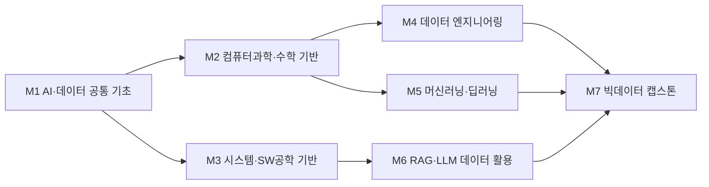

# 컴퓨터공학부 · 빅데이터트랙

> 한성대학교 IT공과대학 컴퓨터공학부 · 2026학년도 AI융합 교육과정 개편 리서치 (조사일: 2026-06-25)

## 1. 개요

빅데이터트랙은 대용량 데이터 수집·처리·분석 파이프라인과 머신러닝/MLOps, 그리고 LLM·RAG 기반 AI 서비스의 데이터 기반(backbone)을 구축하는 트랙이다.

**AI 융합 개편 방향**: 거시 지표상 국내 기업의 **69%(2026)가 채용 시 AI 역량을 고려**한다. 기존 데이터엔지니어링(Spark·Airflow·dbt·SQL·클라우드)에 LLM 파인튜닝·RAG·벡터DB·에이전트 워크플로우를 결합한다.

## 2. 산업·기술 트렌드 (2024–2026)

### 대기업

- **AI 전환(AX) 본격화.** 삼성전자(DX), SKT(AI CIC), LG(LG AI연구원/LG CNS) 등이 생성형 AI를 넘어 전사 업무 자동화로 진입. SI 기업이 AI 전문 인력을 집중 확보.
- **경력직 쏠림 심화**: AI 채용 공고 중 경력직 요구 비율이 2020년 54% → 2024년 80.6%로 급증, AI 응용 개발 직무 비중 42.9%.

### 스타트업·플랫폼

- **토스(비바리퍼블리카)**: 직원 약 2,000명(2024말) → 3,000명(2025말) 목표로 ML 엔지니어·데이터 분석가·데이터 엔지니어 대규모 채용. **자체 LLM 대신 오픈소스 LLM 파인튜닝** 전략, 매일 약 100TB 처리 → "AI 개발자보다 데이터 엔지니어를 더 뽑는" 대표 사례.
- **기술 스택 진화**: Data Lakehouse(Databricks·Iceberg·Delta Lake), dbt 모델링, 실시간 파이프라인(Kafka·Spark Streaming·Flink), 데이터 품질·관측성·계보(Lineage)·거버넌스 표준화.
- **RAG/벡터DB 실무 확산**: 2025년이 RAG 실무 정착 원년. 벡터DB로 Pinecone·FAISS와 함께 Qdrant·Redis 부상. **Agentic RAG**가 차기 트렌드.

## 3. 채용 동향

잡코리아 2026 1분기 분석·한국데이터경제신문 등 기준 실제 수치:

- AI 키워드 포함 채용 공고: **5년간 112% 증가**, 신입직 **162% 증가**, 비수도권 **232% 증가**.
- 세부 직무 비중: AI 서비스 개발자 18.1% / AI·ML 엔지니어 17.9% / 데이터 사이언티스트 17.4% / AI 기획자 13.8% / 데이터 분석가 10.4% / **데이터 엔지니어 10.4%**.
- 연봉: AI·개발·데이터 직무 평균 4,947만원(21개 직무 중 1위). 대기업 5,279 / 중견 4,483 / 중소 3,994만원.
- **대한상의 2025 하반기 조사(HR 약 500명): 69.2%가 채용 시 AI 역량 고려** → 소통·협력(55.4%)·직무 전문성(54.9%)보다 우선.
- 한국은행 조사(400개 기업): 대기업 69%·중견 68.7%·중소 56.2%가 AI 인력 확대 계획.

### 3-1. 고용 전망 — 국내·미국·중국 동향

!!! abstract "이 트랙과 향후 10년 고용"
    - **국내(고용노동부):** 신산업 인력 부족(2027)이 빅데이터 1.96만명으로 전 분야 최대이며, 클라우드(1.88만)·AI(1.28만)가 뒤를 이어 데이터 엔지니어·사이언티스트 수요가 구조적으로 초과 상태다.
    - **미국(BLS)·글로벌(WEF):** 컴퓨터·수학 직군은 2024~2034 +10.1%로 AI 수요가 견인하며, WEF는 '빅데이터 전문가'를 가장 빠르게 성장하는 직무 1순위로 꼽았다(핀테크·AI/ML이 뒤를 이음).
    - **시사점:** 데이터 수집·처리·분석 파이프라인 역량은 국내외 모두 최대 부족 직무이므로, 본 트랙의 데이터 엔지니어링·ML 연계 교육을 핵심축으로 강화할 가치가 크다.

> 📊 거시 분석 전체: [고용노동부 취업동향·10년 전망](../employment-outlook.md) · [글로벌 비교 (미국·중국)](../global-employment-outlook.md)

## 4. 요구 직무 역량

| 구분 | 내용 |
| --- | --- |
| 핵심 직무 역량 | SQL 심화(대용량 최적화), Python(Scala/Java 보조), 자료구조·알고리즘 |
| 데이터 엔지니어링 | Spark·Airflow·dbt·Kafka·Flink / Lakehouse(Databricks·Iceberg·Delta Lake) / DW(BigQuery·Snowflake·Redshift) / 배치+실시간 |
| 클라우드/인프라 | AWS·GCP·Azure 중 1개 이상, Kubernetes |
| ML/MLOps | ML 알고리즘 구현, 모델 서빙·배포, 분산 컴퓨팅 |
| AI 융합 역량 | LLM 파인튜닝, RAG 파이프라인, 벡터DB(Pinecone·FAISS·Milvus·Qdrant), LangGraph, Agentic AI, Prompt Engineering, 멀티모달 |

!!! tip "추가 보강 제안 (2026 개편 반영안 · 공식 교과 아님)"
    공식 교과를 대체하지 않는 **추가 보강 방향**이다(신설/심화 제안).
    - **추가 기술트렌드:** Lakehouse · Vector DB · RAGOps · 데이터 거버넌스
    - **추가 직무역량:** SQL · DuckDB/dbt · 벡터검색 · 평가 데이터셋 구축
    - **교육과정 보강(제안):** 벡터DB/RAG 평가 · 데이터 품질관리 추가

## 5. 대표 채용 기업 & 직무 예시

| 구분 | 기업 | 직무 예시 |
| --- | --- | --- |
| 대기업 | 삼성전자(DX) | BI/데이터 엔지니어, 데이터 사이언티스트, ML 엔지니어 |
|  | SKT / LG AI연구원·LG CNS / 카카오 | AI R&D, AX 전문 인력, AI/ML·데이터 엔지니어 |
| 플랫폼/중견 | 쿠팡 / 토스 / TVING·하이브 | ML 엔지니어, 데이터 엔지니어·분석가 대규모 채용 |
| 스타트업 | 스트리미(Gopax), 바비톡, 넥스트증권 | Data Engineer (Spark·Airflow·K8s) |

## 6. 교육과정 개편 시사점

1. **AI 융합형 데이터 엔지니어링 필수화.** Spark/Airflow/dbt/SQL/클라우드 위에 **LLM 파인튜닝·RAG·벡터DB·LangGraph/Agentic AI** 모듈을 정규 편성.
2. **데이터 거버넌스·MLOps 운영 역량 강화.** 데이터 품질·관측성·계보·모델 서빙·배포는 이미 채용 표준 요구. 운영(production) 단계 역량을 PBL로 학습.
3. **패러다임 전환 대응.** 멀티모달·센서/로보틱스 데이터 처리, 에이전트 워크플로우 설계 선택 트랙을 신설. 기업 69%가 AI 역량을 본다는 점에서 모든 데이터 커리큘럼에 AI 활용 역량을 기본 탑재.

## 7. 출처

> 인용 형식: **기관·매체 — 「제목」 (발행일/연도) · URL** / 확인일 2026-06-27

- **한국데이터경제신문** — 「AI 채용 공고 5년간 112% 증가」
- **ZDNet Korea** — 「112% 증가」
- **헤럴드경제** — 「하반기 채용 키워드 'ACE', 10곳 중 7곳 "AI 역량"」
- **미주중앙일보** — 「AI 개발자 대신 데이터 엔지니어 뽑는 토스」
- **SK AX** — 「2026 에이전트 AI 트렌드」
- **프로그래머스** — 「KDT 데이터 엔지니어링」
- **토스** — 「2025 DATA·ML 집중채용」
- **kt cloud** — 「RAG」

> 검증 메모: 잡코리아 통계(112%·162%·232%)는 한국데이터경제/ZDNet 교차 확인. Gartner 40% 전망은 시장 예측치(추정).

## 8. 교육 목표 (예시)

> 학문 분야 정체성: 빅데이터트랙은 대규모 데이터의 수집·저장·처리·분석 SW공학 역량에 MLOps와 RAG·LLM 기반 데이터 활용을 결합하여, 데이터로부터 가치를 창출하고 신뢰성 있게 운영하는 데이터 엔지니어·ML 엔지니어를 양성한다.

1. **데이터 파이프라인 구축 역량**: 분산처리(Spark)·스트리밍·데이터레이크/웨어하우스를 활용해 대용량 데이터 수집-적재-변환 파이프라인을 설계·구현하고, 4학년까지 엔드투엔드 파이프라인 프로젝트 2건 이상을 완성한다.
2. **MLOps 기반 모델 운영 역량**: 학습-배포-모니터링-재학습으로 이어지는 ML 라이프사이클을 자동화하고, CI/CD와 실험 추적을 적용한 재현 가능한 ML 시스템을 1건 이상 구축한다.
3. **RAG·LLM 기반 데이터 활용**: 사내/도메인 데이터를 벡터DB와 RAG로 연결한 LLM 분석·질의 시스템을 설계·구현해 비정형 데이터 활용 역량을 입증한다.
4. **데이터 윤리·거버넌스 준수**: 개인정보 보호·편향 점검·데이터 품질 관리를 적용하고, AI 코딩 어시스턴트로 분석·파이프라인 개발 생산성을 정량적으로 향상한 사례를 캡스톤에서 제시한다.

## 9. 교육과정 구성 및 교수법 활용

**교육과정 구성**

- 기초: Python·데이터 처리, 통계·확률, 자료구조로 데이터 분석·SW 기반을 형성한다.
- 전공심화: 데이터베이스, 데이터 엔지니어링, 머신러닝, 분산처리로 빅데이터 전공 역량을 심화한다.
- AI 융합: MLOps, RAG·LLM 데이터 활용, 빅데이터 분석으로 지능형 데이터 시스템 역량을 결합한다.
- 캡스톤: 산학 연계 데이터·AI 파이프라인을 구축-운영까지 수행하는 종합 프로젝트로 마무리한다.

**교수법 활용**

- PBL: 실제 도메인 데이터셋 기반 분석·파이프라인 문제 해결형 수업
- 플립러닝: 이론 사전 학습 후 실습실에서 핸즈온 데이터 실습
- 해커톤: 데이터 분석·ML 모델 챌린지(Kaggle형) 운영
- 산학 캡스톤 + AI 페어프로그래밍: 기업 데이터 과제를 AI 코딩 어시스턴트와 협업해 분석·개발

## 10. 모듈형 전공교육과정 (M1~M7)

### 10-1. 모듈형 교육과정 안내

> 출처: 한성대학교 빅데이터트랙 공식 교과과정([https://www.hansung.ac.kr/Engineering/4896/subview.do](https://www.hansung.ac.kr/Engineering/4896/subview.do)) 기준, 확인일 2026-06-30. 구성 교과목 공식, 미존재 보강은 (제안). (전기=전공기초·전필=전공필수·전선=전공선택)
> **교과 구분 표기:** 이수구분(전기·전필·전선)이 붙은 과목은 **공식 현행 교과**, `(제안)`은 **신설 제안 교과**, `(미정)`은 **개설 학기 미정**이다. 표 오른쪽 '구분' 열은 각 모듈의 교과 구성 성격을 요약한다.

| 모듈 | 모듈명 | 구성 교과목 (학년-학기·이수구분) | 모듈 설명 | 모듈 학습성과 | 모듈 간 관계 | 구분 |
| --- | --- | --- | --- | --- | --- | --- |
| **M1** | AI·데이터 공통 기초 | 컴퓨터프로그래밍(1-2·전기) · 프로그래밍랩(1-2·전선) · 객체지향언어1(2-1·전선) · AI를 이용한 주식가치평가(1-1·전선) | Python·데이터 처리, 생성형 AI/LLM 활용, AI 코딩 어시스턴트, AI 윤리 | AI 도구로 데이터 처리·프로토타이핑 수행 | 단과대학공통 | 공식 |
| **M2** | 컴퓨터과학·수학 기반 | 자료구조(2-1·전선) · 알고리즘(2-2·전선) · 확률및통계(2-1·전선) · 선형대수(2-2·전선) | 자료구조, 알고리즘, 확률·통계, 선형대수 | 효율적 알고리즘 설계 및 데이터 모델링 기반 확립 | 학부공통 | 공식 |
| **M3** | 시스템·SW공학 기반 | 컴퓨터구조(2-1·전선) · 운영체제(3-1·전선) · 소프트웨어공학(3-1·전선) · 설계패턴(3-2·전선) | 운영체제, 컴퓨터구조, 협업·설계, 테스트 | 협업 기반 SW 개발 프로세스 수행 | 학부공통 | 공식 |
| **M4** | 데이터 엔지니어링 | 데이터베이스(3-1·전선) · 데이터베이스설계(3-2·전필) · 빅데이터기초(2-2·전필) · 빅데이터프로그래밍(4-1·전필) | 데이터베이스, 분산처리(Spark), ETL, 데이터레이크 | 대용량 데이터 파이프라인 구현 | 트랙전공 | 공식 |
| **M5** | 머신러닝·딥러닝 | 데이터마이닝(3-1·전필) · 컴퓨터비젼(3-2·전선) · 영상처리(3-1·전선) · 딥러닝(제안) | 지도/비지도학습, 딥러닝, 비전, 모델 평가 | 데이터 기반 예측·분류 모델 구현 | 트랙전공 | 공식·제안 |
| **M6** | RAG·LLM 데이터 활용 | 인공지능(4-2·전필) · 오픈소스소프트웨어(2-2·전선) · 생성형AI데이터분석(제안) · RAG시스템(제안) | 벡터DB, RAG, LLM 분석·질의, MLOps | 비정형 데이터 LLM 활용 시스템 구현 | 트랙전공 | 공식·제안 |
| **M7** | 빅데이터 캡스톤 | 빅데이터 캡스톤디자인(4-1·전필) · 기업연계 SW캡스톤디자인(3-2·전선) · 융합캡스톤디자인(4-2·전선) | 데이터·AI 파이프라인 구축·운영, 산학 협업 | 데이터 AI 시스템 종합 완성 | 트랙전공 | 공식 |

### 10-2. 모듈형 교육과정 로드맵 (학년·학기)

| 모듈 | 1-1 | 1-2 | 2-1 | 2-2 | 3-1 | 3-2 | 4-1 | 4-2 |
| --- | --- | --- | --- | --- | --- | --- | --- | --- |
| **M1** AI·데이터 공통 기초 | AI를 이용한 주식가치평가 | 컴퓨터프로그래밍 · 프로그래밍랩 | 객체지향언어1 | | | | | |
| **M2** 컴퓨터과학·수학 기반 | | | 자료구조 · 확률및통계 | 알고리즘 · 선형대수 | | | | |
| **M3** 시스템·SW공학 기반 | | | 컴퓨터구조 | | 운영체제 · 소프트웨어공학 | 설계패턴 | | |
| **M4** 데이터 엔지니어링 | | | | 빅데이터기초 | 데이터베이스 | 데이터베이스설계 | 빅데이터프로그래밍 | |
| **M5** 머신러닝·딥러닝 | | | | | 데이터마이닝 · 영상처리 | 컴퓨터비젼 | | |
| **M6** RAG·LLM 데이터 활용 | | | | 오픈소스소프트웨어 | | | | 인공지능 |
| **M7** 빅데이터 캡스톤 | | | | | | 기업연계 SW캡스톤디자인 | 빅데이터 캡스톤디자인 | 융합캡스톤디자인 |

**모듈 흐름(요약 다이어그램):**

- **마이크로디그리:** "MLOps 엔지니어링" 마이크로디그리(M5 머신러닝·딥러닝 + M4 데이터 엔지니어링 + M6 RAG·LLM 데이터 활용) 운영.
- **타 트랙 교차수강:** 웹공학트랙의 클라우드·백엔드, 모바일트랙의 온디바이스AI 과목 교차수강 권장.

### 10-3. 학습자 진로 가이드

| 진로 분야 | 권장 모듈 조합 | 지향 |
| --- | --- | --- |
| 데이터 엔지니어링 | M4 데이터 엔지니어링 + M2 컴퓨터과학·수학 기반 + M1 AI·데이터 공통 기초 | 데이터 엔지니어·데이터 플랫폼 엔지니어 |
| 머신러닝·MLOps | M5 머신러닝·딥러닝 + M4 데이터 엔지니어링 + M7 빅데이터 캡스톤 | ML 엔지니어·MLOps 엔지니어 |
| AI 데이터 분석·LLM 활용 | M6 RAG·LLM 데이터 활용 + M2 컴퓨터과학·수학 기반 + M7 빅데이터 캡스톤 | 데이터 사이언티스트·AI 분석가 |

### 10-4. 학생 학습경로 예시

**경로 A — MLOps 엔지니어**

- 1학년: AI·데이터 공통 기초, 파이썬 데이터 처리, 확률과통계
- 2학년: 자료구조, 데이터베이스, 머신러닝 입문
- 3학년: 딥러닝, 빅데이터처리(Spark), MLOps
- 4학년: 데이터플랫폼, 산학 캡스톤(ML 파이프라인), 포트폴리오 완성

**경로 B — AI 데이터 분석가**

- 1학년: AI·데이터 공통 기초, 생성형 AI 활용, 파이썬 데이터 처리
- 2학년: 확률과통계, 데이터시각화, 데이터베이스
- 3학년: 머신러닝, 생성형AI데이터분석, RAG시스템
- 4학년: 빅데이터 캡스톤(LLM 분석 시스템), 산학 PoC

**경로 C — 데이터 플랫폼 엔지니어**

- 1학년: AI·데이터 공통 기초, 파이썬 데이터 처리, 자료구조
- 2학년: 데이터베이스, 컴퓨터네트워크, 운영체제
- 3학년: 빅데이터처리(Spark), 데이터플랫폼, 클라우드(Kubernetes) 교차수강
- 4학년: 산학 캡스톤(실시간 Lakehouse 파이프라인), 데이터 플랫폼 엔지니어로 진출

**경로 D — 데이터 사이언티스트(연구·대학원)**

- 1학년: AI·데이터 공통 기초, 파이썬 데이터 처리, 확률과통계
- 2학년: 선형대수, 데이터시각화, 머신러닝 입문
- 3학년: 딥러닝, 생성형AI데이터분석, 머신러닝 심화
- 4학년: 빅데이터 캡스톤(멀티모달 데이터 연구), 대학원 진학·AI 연구 데이터 사이언티스트로 진출

### 10-5. 상위 수준 보완 권고

> 아래는 KAIST·서울대 데이터사이언스대학원·성균관대 등 빅데이터·데이터엔지니어링 특성화 **상위 비교군** 및 산업 표준 정렬을 위한 **보완 권고**다. **공식 교과를 대체하지 않으며**, 2027학년도 교과 개편 시 심의 의견·향후 개선 계획으로 활용한다.

| 보완 영역 | 반영 위치 | 추가하면 좋은 내용 | 기대 효과 |
| --- | --- | --- | --- |
| Lakehouse 테이블 포맷 표준 | M4 | Iceberg/Delta 테이블 포맷, 스키마 진화·타임트래블, ACID 트랜잭션, 파티셔닝·압축(compaction) 실습 | 토스·Databricks형 Lakehouse 실무 표준 직접 대응, 데이터 플랫폼 엔지니어 역량 강화 |
| dbt·DuckDB 데이터 모델링 | M4, M2 | ELT 변환·dbt 모델/테스트/문서화, DuckDB 임베디드 분석, 차원 모델링(스타스키마) | DW 적재 후 변환·품질 자동화로 분석 신뢰성 확보, 분석 엔지니어 직무 정렬 |
| 스트리밍 데이터 처리 | M4, M7 | Kafka 토픽 설계·Flink/Spark Structured Streaming, 정확히 한 번(exactly-once)·워터마크, 실시간+배치(람다/카파) | 실시간 파이프라인 채용 표준 충족, 캡스톤 실시간 Lakehouse 과제 고도화 |
| 데이터 거버넌스·카탈로그·계보 | M4, M6 | 데이터 카탈로그(Unity/DataHub), 계보(lineage)·관측성, 개인정보 마스킹·접근통제, 데이터 계약(contract) | 운영(production) 거버넌스 역량 입증, 신뢰성 있는 데이터 운영 직무 경쟁력 |
| RAGOps·벡터DB 운영 | M6 | 청킹·임베딩 전략, 하이브리드 검색·리랭킹, Agentic RAG, RAG 평가 지표(faithfulness·recall) 운영 | 상위 비교군 RAG 실무 정착 수준 정렬, AI 데이터 활용 시스템 운영 역량 |
| 데이터 품질·평가셋 구축 | M5, M6 | Great Expectations형 품질 검증, 골든 평가셋·LLM-as-judge, 데이터/모델 드리프트 모니터링 | 평가 기반 개발 문화 확립, ML·LLM 시스템의 정량 평가·재현성 확보 |
