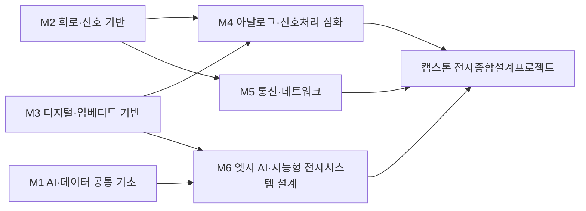

# 기계전자공학부(현행, 2027 개편명 전기전자공학부) · 전자트랙

> 한성대학교 IT공과대학 기계전자공학부(→전기전자공학부) 2026 AI융합 교육과정 개편 리서치 · 작성 기준일: 2026-06-25

## 1. 개요

전자트랙은 임베디드 시스템, 전력전자, 회로·제어, 로보틱스를 기반으로 하드웨어와 소프트웨어를 잇는 전자공학 핵심 인재를 양성하는 트랙이다. 산업의 무게중심이 생성형 AI → 에이전트 AI → Physical AI로 이동하면서 '지능을 물리 세계에 구현하는' 엣지/임베디드 영역의 중요성이 급격히 커지고 있다.

**AI 융합 개편 방향**: 임베디드/제어 위에 **엣지 AI 추론(온디바이스 AI)** 역량 결합(TinyML, NPU 가속, 모델 경량화) / 로보틱스·전력전자 제어에 Physical AI 관점 도입. Physical AI 시장 2026년 약 $110.8B·CAGR≈36%(로봇·Embodied AI 포함 광의 추정; 좁은 정의는 MarketsandMarkets 2026 $1.50B).

## 2. 산업·기술 트렌드 (2024–2026)

### 임베디드 / 엣지 AI

- AI 투자 무게중심이 **학습(training) → 추론(inference)**으로 이동, 수요가 GPU·HBM을 넘어 **온디바이스 AI 반도체·NPU**로 확산.
- 임베디드 직무에서 요구되는 기술 스택이 C/MCU/RTOS 전통 영역에서 **AI 가속기 연동, 멀티미디어·비전 SW**로 확장(예: 차량용 AI 가속기 개발 보스반도체 등).

### 전력전자 (Power Electronics)

- **SiC·GaN** 차세대 전력반도체가 주력 양산 단계로 진입, 전문 인재 영입 경쟁 심화.
- 전기차 트랙션 인버터·고전압 아키텍처에서 SiC 채택률 상승. 현대차·LG전자 등이 인버터·전력변환회로·모터제어 직무 상시 채용(MATLAB Simulink, PSIM, PLECS).

### 로보틱스 / Physical AI (엣지 제어)

- CES 2026 이후 글로벌 로봇 기업이 **체화 AI(Embodied AI) + 온디바이스 AI 반도체** 중심 전략 재편.
- 전력당 추론 성능(perf/Watt) 5배+ 개선(NVIDIA Jetson Thor, Qualcomm Robotics, 삼성 Exynos Auto).
- 국내: 두산로보틱스, 레인보우로보틱스(RB-Y1), 삼성·LG전자 가정용 로봇.

## 3. 채용 동향 (사람인·잡코리아·원티드·LinkedIn)

- **임베디드 SW**: 원티드·점핑·잡코리아에 신입~경력 공고 다수, 자격증보다 프로젝트 경험·포트폴리오 우선.
- **전력전자**: LG전자 R&D가 전력전자·전기전자·로봇 직무 상시 채용. 현대모비스 2026 상반기 신입에 자율주행 시스템 개발, 로보틱스 기구/시스템, 배터리 시작개발 포함.
- 전반적으로 단순 '하드웨어 엔지니어'보다 **HW+SW+AI 융합형** 채용 비중 증가.

### 3-1. 고용 전망 — 국내·미국·중국 동향

!!! abstract "이 트랙과 향후 10년 고용"
    - **국내(고용노동부):** 제조 취업자는 2023~2033년 -15.1만명으로 감소하고 자동차 등 전통 제조는 산업전환으로 줄지만, 전자 설계·제어 같은 공학·정보통신 전문가 수요는 집중되어 연구·공학기술직은 AI 시대에도 74.2%가 대체가 아닌 보완 대상으로 평가된다.
    - **미국(BLS)·글로벌(WEF):** 미국 컴퓨터·수학 직군은 2024~2034년 +10.1% 성장하고, WEF는 빅데이터·AI/ML·SW개발과 함께 로봇 설치 상위 5개국(중국·일본·미국·한국·독일)이 세계 설치의 80%를 차지한다고 본다 — 전자·임베디드 HW+SW 융합 역량의 수요 기반.
    - **중국:** 산업로봇 누적 200만 대(세계 설치의 54%)로, 전력전자·모터제어·로봇 구동부 설계 인력의 글로벌 수요를 끌어올린다.
    - **시사점:** 단순 하드웨어 직무는 자동화로 축소되므로, 엣지 AI·전력전자·로보틱스 제어를 묶은 고숙련 융합 역량으로 교육과정의 무게중심을 옮겨야 한다.

> 📊 거시 분석 전체: [고용노동부 취업동향·10년 전망](../employment-outlook.md) · [글로벌 비교 (미국·중국)](../global-employment-outlook.md)

## 4. 요구 직무 역량

| 구분 | 내용 |
| --- | --- |
| **핵심 직무 역량** | C/C++, MCU·펌웨어, RTOS, 디바이스 드라이버, 부트로더/커널, 회로설계, 전력변환/모터제어, 제어이론, 신호처리 |
| **AI 융합 역량** | 엣지 AI·온디바이스 AI 추론, TinyML, 모델 경량화/양자화, NPU·AI 가속기 연동, 비전·센서 융합(sensor fusion), Physical AI(체화 AI) 제어 |
| **주요 툴·자격** | MATLAB/Simulink, PSIM, PLECS, Python, Linux, Git, ROS/ROS2, TensorFlow Lite·PyTorch(엣지), 임베디드기사·전자기사 |

!!! tip "추가 보강 제안 (2026 개편 반영안 · 공식 교과 아님)"
    공식 교과를 대체하지 않는 **추가 보강 방향**이다(신설/심화 제안).
    - **추가 기술트렌드:** Edge AI · 센서퓨전 · TinyML · 로봇 제어
    - **추가 직무역량:** 임베디드 C · RTOS · NPU 추론 · 제어기초
    - **교육과정 보강(제안):** 엣지AI 임베디드 · 센서융합 실습

## 5. 대표 채용 기업 & 직무 예시

- **대기업**: 삼성전자(임베디드/SoC SW), LG전자(전력전자, 로봇, 전기전자 R&D), 현대모비스(자율주행 시스템, 로보틱스 기구/시스템, 전장), 현대자동차(EV/HEV 인버터·모터제어)
- **팹리스/중견**: 보스반도체(차량용 AI 가속기 임베디드 SW), 자동차 전장·전력반도체 중견사
- **스타트업**: 레인보우로보틱스·두산로보틱스 등 로보틱스, 온디바이스 AI·엣지 디바이스 스타트업

## 6. 교육과정 개편 시사점

1. **임베디드 + 엣지 AI 트랙 신설**: 펌웨어/MCU 교과에 TinyML·온디바이스 추론·모델 경량화·NPU 연동 실습을 결합한 캡스톤.
2. **Physical AI 기반 로보틱스 융합**: ROS2 + 제어 + 강화/모방학습을 묶어 인지-판단-구동 통합 프로젝트화. 산학(현대모비스·로보틱스 기업) 연계 캡스톤.
3. **전력전자 + AI 진단/제어**: SiC/GaN 전력회로 설계에 AI 기반 상태감시·열관리·모터제어 최적화 모듈을 결합.

## 7. 출처

> 인용 형식: **기관·매체 — 「제목」 (발행일/연도) · URL** / 확인일 2026-06-27

- **SK하이닉스** — 「2026 채용」
- **자소설** — 「LG전자 2026 채용」
- **현대모비스** — 「로보틱스 기구/시스템」
- **원티드** — 「임베디드 개발자 채용」
- **잡코리아** — 「보스반도체 임베디드 SW」
- **THE ELEC** — 「전력전자/SiC 동향」
- **(기관·매체 미상)** — 「글로벌 산업 트렌드(반도체·스마트팩토리·피지컬AI)」
- **(기관·매체 미상)** — 「피지컬 AI 정리」 (2026)

## 8. 교육 목표 (예시)

> **학문 분야 정체성**: 전자트랙은 아날로그·디지털 회로와 신호처리를 기반으로 지능형 전자시스템을 설계·구현하는 전자공학 전문 인재를 양성한다.

전자공학의 핵심 정체성(회로·신호·시스템 설계)을 유지하면서, 엣지 단에서 동작하는 AI를 전자 하드웨어에 통합하는 융합 역량을 결합한다. 구체적·측정 가능한 교육 목표는 다음과 같다.

1. **회로·신호 설계 역량**: 아날로그/디지털 회로, 신호처리, 임베디드 시스템을 이해하고 4학년까지 동작하는 전자시스템 1건 이상을 독립 설계·검증할 수 있다.
2. **엣지 AI 구현 역량**: TinyML·경량 신경망을 MCU/엣지보드에 포팅하여 추론 지연·전력·정확도를 정량 측정하고, 모델 경량화(양자화·프루닝) 전후 성능을 비교 분석할 수 있다.
3. **AI 융합 설계 역량**: 센서-신호처리-AI 추론으로 이어지는 엣지 파이프라인을 PBL/캡스톤에서 1개 이상 구현하여 baseline 대비 성능 개선을 수치로 제시할 수 있다.
4. **책임 있는 엔지니어링 역량**: 데이터 편향·전력/안전 제약·AI 신뢰성 관점에서 자신의 설계를 평가하고 개선안을 문서화할 수 있다.

## 9. 교육과정 구성 및 교수법 활용

**교육과정 구성**

- **기초 단계(1학년)**: 공학수학·프로그래밍·회로 기초 + 단과대학 공통 AI·데이터 기초(Python·데이터)로 전공과 AI의 공통 토대를 마련한다.
- **전공심화 단계(2~3학년)**: 회로이론·전자기학·신호및시스템·디지털회로·임베디드 시스템 등 전자공학 핵심을 체계화한다.
- **AI 융합 단계(3~4학년)**: 머신러닝 기초 위에 엣지 AI·TinyML·신호처리용 딥러닝을 얹어 전자 하드웨어와 AI를 결합한다.
- **캡스톤 단계(4학년)**: 센서·신호·AI 추론을 통합한 지능형 전자시스템을 산학/설계 프로젝트로 완성한다.

**교수법 활용**

- **실험실습**: 회로·임베디드·신호처리 실측 기반 실습으로 이론을 검증한다.
- **PBL(문제기반학습)**: 실제 센서 데이터로 엣지 AI 문제를 정의·해결한다.
- **설계프로젝트**: 하드웨어-소프트웨어 통합 설계를 단계적으로 수행한다.
- **산학 캡스톤 / AI 툴 실습**: 산업 현장 과제와 생성형 AI·EDA 보조 툴을 활용한 설계 자동화를 경험한다.

## 10. 모듈형 전공교육과정 (M1~M6)

### 10-1. 모듈형 교육과정 안내

> 출처: 한성대학교 전자트랙(기계전자공학부) 공식 교과과정([https://www.hansung.ac.kr/Engineering/4917/subview.do](https://www.hansung.ac.kr/Engineering/4917/subview.do)) 기준, 확인일 2026-06-30. 구성 교과목 공식, 미존재 보강은 (예시). (전기=전공기초·전필=전공필수·전선=전공선택)

| 모듈 | 모듈명 | 구성 교과목 (학년-학기·이수구분) | 모듈 설명 | 모듈 학습성과 | 모듈 간 관계 |
| --- | --- | --- | --- | --- | --- |
| **M1** | AI·데이터 공통 기초 | 프로그래밍언어(2-1·전선) · 자료구조(3-1·전선) · 인공지능(4-2·전선) · 생성형 AI 활용(예시·학기 미상) | Python·자료구조, 인공지능, 생성형 AI 활용, AI 윤리 | 데이터 처리·AI 도구 활용 및 윤리적 판단 가능 | 단과대학공통 · M6 기반 |
| **M2** | 회로·신호 기반 | 회로이론 Ⅰ(2-1·전필) · 전자기학(2-1·전선) · 회로이론 Ⅱ(2-2·전선) · 신호 및 시스템(2-2·전필) | 회로이론, 전자기학, 신호및시스템 | 전기전자 핵심 물리·수학 모델 해석·적용 | 학부공통 · M4·M5 기반 |
| **M3** | 디지털·임베디드 기반 | 논리회로(2-1·전필) · 디지털회로 실험(2-2·전선) · 마이크로프로세서실험(3-2·전선) · 임베디드시스템(3-2·전선) | 디지털논리, 마이크로프로세서, 임베디드 C | 임베디드 타깃에 펌웨어 설계·구현 | 학부공통 · M4·M6 기반 |
| **M4** | 아날로그·신호처리 심화 | 전기전자회로실험(2-2·전선) · 디지털 신호처리(3-1·전선) · 제어공학(3-1·전선) · 디지털영상처리(3-2·전선) | 신호처리, 영상처리, 제어 | 센서 신호 취득·필터링·특징추출 구현 | 트랙전공 · 캡스톤 연계 |
| **M5** | 통신·네트워크 | 통신공학 Ⅰ(3-1·전필) · 통신공학 Ⅱ(3-2·전선) · 데이터통신 및 컴퓨터네트워크(3-2·전선) · 무선통신공학(4-2·전선) | 통신이론, 데이터통신, 무선통신 | 통신 시스템 신호·프로토콜 설계·분석 | 트랙전공 · 캡스톤 연계 |
| **M6** | 엣지 AI·지능형 전자시스템 설계 | 전자종합설계프로젝트(4-1·전선) · 인공지능(4-2·전선) · 엣지AI·TinyML(예시·학기 미상) · 임베디드AI설계(예시·학기 미상) | 엣지 AI·TinyML, 센서-신호-AI 통합 | 엣지 추론 파이프라인 통합 시스템 구현 | 트랙전공 · 캡스톤 연계 |

### 10-2. 모듈형 교육과정 로드맵 (학년·학기)

각 모듈 교과목이 **언제 개설되는지**(학년-학기)를 한눈에 보여준다. 학기 미상 (예시) 교과는 표에서 생략한다.

| 모듈 | 1-1 | 1-2 | 2-1 | 2-2 | 3-1 | 3-2 | 4-1 | 4-2 |
| --- | --- | --- | --- | --- | --- | --- | --- | --- |
| **M1** AI·데이터 공통 기초 | | | 프로그래밍언어 | | 자료구조 | | | 인공지능 |
| **M2** 회로·신호 기반 | | | 회로이론 Ⅰ · 전자기학 | 회로이론 Ⅱ · 신호 및 시스템 | | | | |
| **M3** 디지털·임베디드 기반 | | | 논리회로 | 디지털회로 실험 | | 마이크로프로세서실험 · 임베디드시스템 | | |
| **M4** 아날로그·신호처리 심화 | | | | 전기전자회로실험 | 디지털 신호처리 · 제어공학 | 디지털영상처리 | | |
| **M5** 통신·네트워크 | | | | | 통신공학 Ⅰ | 통신공학 Ⅱ · 데이터통신 및 컴퓨터네트워크 | | 무선통신공학 |
| **M6** 엣지 AI·지능형 전자시스템 설계 | | | | | | | 전자종합설계프로젝트 | 인공지능 |

**모듈 흐름(요약 다이어그램):**

- **마이크로디그리:** 'M6 엣지 AI·지능형 전자시스템 설계' 모듈을 3과목 묶음 마이크로디그리로 인증하여 비전공·인접트랙 학생에게 개방한다.
- **교차수강:** 시스템반도체트랙의 디지털설계·HDL, 컴퓨터계열의 머신러닝을 교차수강하여 HW 가속·모델링 역량을 보강한다.

### 10-3. 학습자 진로 가이드

| 진로 분야 | 권장 모듈 조합 | 지향 |
| --- | --- | --- |
| 엣지 AI·임베디드 개발 | M3 디지털·임베디드 기반 + M6 엣지 AI·지능형 전자시스템 설계 | 임베디드 AI 엔지니어 |
| 센서·신호처리 시스템 | M2 회로·신호 기반 + M4 아날로그·신호처리 심화 + M6 엣지 AI·지능형 전자시스템 설계 | 신호처리·센서시스템 엔지니어 |
| AI 융합 전자시스템 | M1 AI·데이터 공통 기초 + M4 아날로그·신호처리 심화 + M6 엣지 AI·지능형 전자시스템 설계 | 전자시스템 설계 엔지니어 |

### 10-4. 학생 학습경로 예시

**경로 A — 엣지 AI 임베디드 엔지니어**

- 1학년: AI·데이터 공통 기초, 프로그래밍, 회로이론 입문
- 2학년: 디지털논리회로, 신호및시스템, 임베디드시스템
- 3학년: 디지털신호처리, 머신러닝(교차수강), 엣지AI
- 4학년: TinyML실습 → 임베디드AI설계 → 전자시스템캡스톤(센서+엣지추론 통합)

**경로 B — 센서·신호처리 시스템 엔지니어**

- 1학년: AI·데이터 공통 기초, 공학수학, 회로이론
- 2학년: 전자기학, 아날로그회로설계, 신호및시스템
- 3학년: 디지털신호처리, 센서인터페이스, 엣지AI 개념
- 4학년: 엣지AI 응용 → 지능형 전자시스템 설계 → 캡스톤(센서 신호 기반 AI 진단 시스템)

**경로 C — Physical AI 로보틱스 제어 엔지니어**

- 1학년: AI·데이터 공통 기초, 프로그래밍, 회로이론 입문
- 2학년: 디지털논리회로, 신호및시스템, 임베디드시스템
- 3학년: 머신러닝(교차수강), 엣지AI, ROS2 기반 로봇제어 기초
- 4학년: TinyML실습 → 임베디드AI설계 → 전자시스템캡스톤(ROS2 기반 체화 AI 로봇 인지-구동 통합) → 로보틱스 제어 엔지니어로 진출

**경로 D — EV 전력전자·모터제어 AI 엔지니어**

- 1학년: AI·데이터 공통 기초, 공학수학, 회로이론
- 2학년: 전자기학, 아날로그회로설계, 전력전자 기초
- 3학년: 디지털신호처리, 머신러닝(교차수강), 엣지AI 개념
- 4학년: 모터제어·전력변환회로 → 임베디드AI설계 → 전자시스템캡스톤(SiC/GaN 인버터 AI 상태감시·열관리) → EV 전력전자·모터제어 엔지니어로 진출

### 10-5. 상위 수준 보완 권고

> 아래는 KAIST·한양대·서울대 전기전자 등 임베디드·엣지AI 특성화 **상위 비교군** 및 산업 표준 정렬을 위한 **보완 권고**다. **공식 교과를 대체하지 않으며**, 2027학년도 교과 개편 시 심의 의견·향후 개선 계획으로 활용한다.

| 보완 영역 | 반영 위치 | 추가하면 좋은 내용 | 기대 효과 |
| --- | --- | --- | --- |
| NPU·AI 가속기 추론 최적화 | M3, M6 | Jetson·NPU 보드 타깃 모델 컴파일·연산자 매핑, perf/Watt·추론지연 벤치마킹, 메모리·대역폭 프로파일링 | 온디바이스 추론 하드웨어 가속 실측 역량으로 상위 비교군 엣지 랩 수준 도달 |
| 모델 경량화 툴체인 심화 | M6, M1 | 양자화(PTQ/QAT)·프루닝·지식증류 실습, TFLite·ONNX·TensorRT 변환 파이프라인, 정확도-크기-전력 트레이드오프 정량화 | TinyML 개념을 산업 표준 경량화 워크플로로 확장, 캡스톤 모델 배포 완성도 향상 |
| RTOS·실시간 임베디드 C 심화 | M3 | FreeRTOS/Zephyr 태스크 스케줄링·우선순위 역전·지연 분석, 인터럽트·DMA 기반 결정적 처리, MISRA-C 코딩 | 추론과 제어가 공존하는 실시간 엣지 시스템 설계 역량 강화 |
| 센서퓨전·상태추정 | M4, M2 | 칼만/확장칼만 필터, IMU·비전·라이다 멀티센서 융합, 시간동기·캘리브레이션 실습 | 신호처리 교과를 Physical AI 인지 파이프라인으로 연결, 로보틱스 캡스톤 정밀도 향상 |
| 모터제어·전력전자 제어 실습 | M4 | FOC(자기장지향제어)·PWM 인버터 제어, SiC/GaN 게이트 드라이브, 피드백 루프 튜닝·하드웨어 인더루프(HIL) | 제어공학 이론을 EV·로봇 구동부 실전 제어로 구현, 전력전자 직무 직결 |
| 기능안전·신뢰성 검증 | M3, M6 | ISO 26262 기능안전 개념·ASIL, 결함주입·내고장성 설계, 엣지 AI 추론 신뢰성·검증 절차 | 차량·산업 임베디드 표준 대응력 확보, 안전 critical 직무 진입 경쟁력 강화 |
