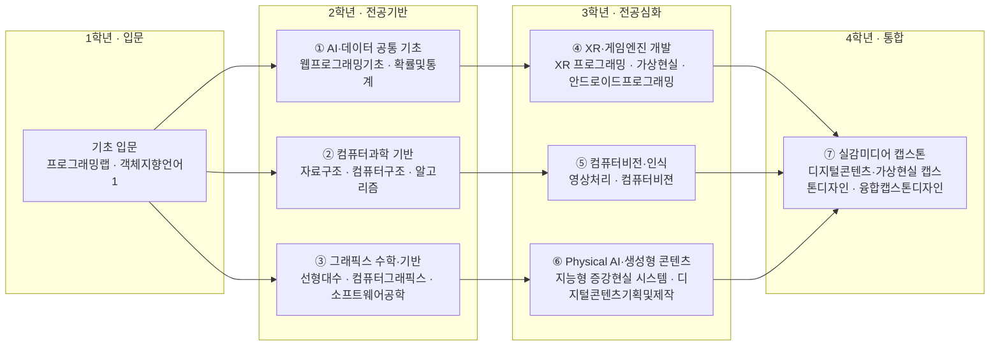

# 컴퓨터공학부 · 지능형실감미디어공학트랙

> 한성대학교 IT공과대학 컴퓨터공학부 · 2026학년도 AI융합 교육과정 개편 리서치 (조사일: 2026-06-25) / 현행(공식) 트랙명: 디지털콘텐츠·가상현실트랙 · '지능형실감미디어공학트랙'은 개편(제안)명

## 1. 개요

지능형실감미디어공학트랙은 XR(AR/VR/MR)·메타버스·버추얼 프로덕션·디지털휴먼·실시간 3D 그래픽스를 다루는 트랙이다.

**AI 융합 개편 방향**: 생성형 3D(Diffusion·Gaussian Splatting/NeRF)와 AI NPC·디지털휴먼을 결합하고, **2026 Physical AI**(시뮬레이션·합성데이터·디지털트윈)로 가장 밀접하게 수렴하는 트랙으로서, 실감미디어 기술스택이 곧 Physical AI의 가상세계 구축 기반과 동일 계열임을 교육에 반영한다.

## 2. 산업·기술 트렌드 (2024–2026)

### 하드웨어 — '공간컴퓨팅' 본격화

- 2024 Apple Vision Pro 이후 침체됐던 XR이 2025년 재점화. Vision Pro 한국 출시, 삼성 **갤럭시 XR**(Android XR 플랫폼 최초, 구글·퀄컴 공동개발, Snapdragon XR2+ Gen 2) 2025.10 국내 출시로 Meta·Apple·삼성 3강 구도.
- 키워드가 "메타버스"에서 **"공간컴퓨팅(Spatial Computing)"**으로 이동. LG전자는 국가 R&D 기반 **AI 스마트글래스** 개발 추진.

### 소프트웨어·콘텐츠

- **생성형 3D + Gaussian Splatting/NeRF**가 핵심 축. 3DGS는 실시간 렌더링으로 NeRF를 빠르게 대체, ETRI 등 국내 연구 진행. MPEG가 2025.10부터 3DGS 압축 표준화 착수(2026 완성 목표).
- **버추얼 프로덕션 + 디지털휴먼**: 언리얼 엔진 실시간 렌더링이 광고·방송·국방 가시화로 확산. 자이언트스텝 버추얼휴먼 '이솔(SORI)'.
- 정부: 과기정통부 **메타버스 펀드 2025년 400억원**(정부 230억+민간 170억), 실감콘텐츠·공간컴퓨팅·홀로그램 등 29개 R&D 과제 지원.

## 3. 채용 동향

순수 "메타버스 개발자"보다 **버추얼 프로덕션·디지털휴먼·실시간 그래픽스(언리얼/유니티)** 직무가 채용을 견인.

- 잡코리아 기준 "언리얼 엔진" 관련 공고 약 145건, "언리얼 클라이언트" 약 41건(시점 변동, 추정).
- 신입은 게임·실감콘텐츠 분야 클라이언트/TA/모델러 위주. 정부 인력양성(메타버스 아카데미 140명, 경기 메타버스 캠퍼스 Unity·Unreal 각 30명)이 신입 공급원.
- 연봉(출처 기반, 변동 가능): 네이버제트 평균 약 6,032만원, 비브스튜디오스 평균 약 4,218만원.

### 3-1. 고용 전망 — 국내·미국·중국 동향

!!! abstract "이 트랙과 향후 10년 고용"
    - **국내(고용노동부):** 콘텐츠·SW 융합 직무는 컴퓨터 프로그래밍·연구개발업 증가 흐름과 맞닿아 있으며, 공학·정보통신 전문가 중심의 수요 집중 영역에 속한다.
    - **미국(BLS)·글로벌(WEF):** WEF는 소프트웨어 개발과 AI/ML을 성장 직무로 분류하고 생성형 AI·정보처리 기술 확산으로 기업 86%가 전환을 예고했으며, 미국 컴퓨터·수학 직군도 +10.1% 성장한다 — 실시간 그래픽스·디지털휴먼 제작 역량과 직결된다.
    - **시사점:** XR·실감미디어는 창의 콘텐츠와 SW 엔지니어링을 동시에 요구하므로, 생성형 AI 도구 활용과 실시간 엔진 역량을 결합한 교육 설계가 고용 경쟁력을 높인다.

> 📊 거시 분석 전체: [고용노동부 취업동향·10년 전망](../employment-outlook.md) · [글로벌 비교 (미국·중국)](../global-employment-outlook.md)

## 4. 요구 직무 역량

| 구분 | 항목 |
| --- | --- |
| 핵심 직무 역량 | 자료구조·알고리즘, OOP, 3D 수학(벡터·행렬·좌표계), 협업 |
| 프로그래밍 언어 | C++(언리얼), C#(유니티), Python |
| 엔진/그래픽스 | Unreal Engine, Unity, 셰이더(HLSL), 렌더 파이프라인, 최적화 |
| 3D 콘텐츠 | Maya, 3ds Max, Blender, ZBrush, Substance, 모델링·리깅·애니메이션 |
| XR/플랫폼 | Android XR, visionOS, Meta Quest SDK, OpenXR, AR Foundation/ARKit |
| 신기술 스택 | NeRF, 3D Gaussian Splatting, 포토그래메트리, 버추얼 프로덕션(LED월), 디지털트윈 |
| AI 융합 역량 | 생성형 3D/이미지(Diffusion), 디지털휴먼 음성·표정 합성, AI NPC/대화형 에이전트, Physical AI(시뮬레이션·합성데이터·로봇 학습) 연계 |

## 5. 대표 채용 기업 & 직무 예시

- **대기업**: 삼성전자·네이버/네이버랩스(XR 디바이스·OS·플랫폼, 공간컴퓨팅 R&D), LG전자(AI 스마트글래스 R&D)
- **중견/콘텐츠 전문기업**: 자이언트스텝(VH 버추얼휴먼 제작), 비브스튜디오스(XR 시뮬레이션·AI 생성형 콘텐츠), 위지윈스튜디오/브이에이코퍼레이션, 스튜디오리얼라이브(SM 계열)
- **스타트업/플랫폼**: 네이버제트(제페토), ZEP, 컴투스, 애니펜, 가온그룹(XR/AR, Unity/C#)

## 6. 교육과정 개편 시사점

1. **실시간 3D 엔진 + AI 융합 단일 트랙화.** 모델링·렌더링 기초 위에 생성형 3D(Diffusion·Gaussian Splatting/NeRF) 실습을 결합 → 'AI로 에셋 생성 후 엔진에서 실시간 구현'하는 엔드투엔드(end-to-end) 역량.
2. **Physical AI/디지털트윈 연계 모듈 신설.** 시뮬레이션·합성데이터·디지털트윈을 다뤄 XR 역량을 로보틱스·산업 가시화로 확장.
3. **에이전틱 AI + 산학·정부사업 연계 PBL.** AI NPC·자율 에이전트·UGC 자동화 실습을 프로젝트로 운영, 메타버스 펀드/아카데미와 연계.

## 7. 출처

> 인용 형식: **기관·매체 — 「제목」 (발행일/연도) · URL** / 확인일 2026-06-27

- **렛플** — 「2025년 다시 뜨는 XR 산업」
- **삼정KPMG** — 「XR 이슈모니터 2025」
- **EPNC** — 「자이언트스텝 버추얼휴먼」
- **헤럴드경제** — 「비브스튜디오스 XR」
- **SMART CITY KOREA** — 「메타버스 펀드 400억원」
- **ETRI** — 「3D Gaussian Splatting 압축 표준화」
- **NVIDIA** — 「GTC 2026 가상세계/피지컬 AI」
- **테크데일리** — 「삼성 갤럭시 XR」
- **전자신문** — 「LG AI 스마트글래스」
- **NAVER Z** — 「채용」
- **ZEP** — 「채용」

## 8. 교육 목표 (예시)

> 학문 분야 정체성: 지능형실감미디어공학트랙은 3D 그래픽스·XR(AR/VR)·컴퓨터비전 SW공학 역량에 Physical AI와 생성형 AI를 결합하여, 현실과 가상을 잇는 몰입형 지능 미디어 시스템을 설계·구현하는 엔지니어를 양성한다.

1. **실감미디어 SW공학 기본기 확립**: 게임엔진(Unity/Unreal) 기반 XR 콘텐츠를 설계-구현-배포하고, 4학년까지 인터랙티브 XR 프로젝트 2건 이상을 완성한다.
2. **컴퓨터비전·Physical AI 통합 역량**: 객체 인식·자세 추정·SLAM 등 비전 AI와 센서·로보틱스를 연계한 실시간 인식·제어 시스템을 1건 이상 구현한다.
3. **생성형 AI 콘텐츠 제작 역량**: 텍스트-3D, 이미지·영상 생성, 디지털 휴먼 등 생성형 AI를 실감 콘텐츠 파이프라인에 통합해 제작 효율과 품질을 정량적으로 개선한다.
4. **AI 코딩 어시스턴트 기반 개발 생산성**: AI 페어프로그래밍으로 셰이더·인터랙션 로직 개발을 가속하고, 캡스톤에서 개발 리드타임 단축 사례를 입증한다.

## 9. 교육과정 구성 및 교수법 활용

**교육과정 구성**

- 기초: Python·데이터 처리, 프로그래밍 기초, 선형대수·그래픽스 수학으로 미디어·AI 기반을 형성한다.
- 전공심화: 컴퓨터그래픽스, 게임엔진 프로그래밍, 컴퓨터비전, 인터랙션 디자인으로 실감미디어 전공 역량을 심화한다.
- AI 융합: XR AI, Physical AI·로보틱스, 생성형 AI 콘텐츠 제작으로 지능형 실감 시스템 역량을 결합한다.
- 캡스톤: 산학 연계 몰입형 XR·AI 콘텐츠를 기획-제작-시연까지 수행하는 종합 프로젝트로 마무리한다.

**교수법 활용**

- PBL: 실제 전시·체험 시나리오 기반 실감 콘텐츠 문제 해결형 수업
- 플립러닝: 이론은 사전 영상, 강의실은 엔진·셰이더 실습 중심
- 해커톤: XR·생성형 AI 콘텐츠 제작 해커톤 운영
- 산학 캡스톤 + AI 페어프로그래밍: 기업·기관 과제를 AI 코딩 어시스턴트와 협업해 제작

## 10. 모듈형 전공교육과정 (역량·성과 중심)

### 10-1. 역량 중심 모듈 구성

> 본 모듈은 **한성대 공식 교과과정([https://www.hansung.ac.kr/Engineering/4903/subview.do](https://www.hansung.ac.kr/Engineering/4903/subview.do))**을 기본 데이터로 3~4과목 단위로 재구성했다. 공식 목록에 없는 과목은 **(예시)**로 표기. 확인일 2026-06-28.

| 모듈명 | 계층 | 핵심 역량·주제 | 학습 성과 | 대표 교과(공식 3~4과목) |
| --- | --- | --- | --- | --- |
| ① AI·데이터 공통 기초 | 단과대학공통 | Python·데이터 처리, 생성형 AI/LLM 활용, AI 코딩 어시스턴트, AI 윤리 | AI 도구로 데이터 처리·프로토타이핑 수행 | 프로그래밍랩 · 객체지향언어1 · 웹프로그래밍기초 · 확률및통계 |
| ② 컴퓨터과학 기반 | 학부공통 | 자료구조, 알고리즘, 운영체제, 네트워크 | 시스템 동작 원리 이해 및 효율적 알고리즘 설계 | 자료구조 · 컴퓨터구조 · 알고리즘 · 운영체제 |
| ③ 그래픽스 수학·기반 | 학부공통 | 선형대수, 기하, 컴퓨터그래픽스 원리 | 3D 변환·렌더링 원리 이해 및 구현 | 선형대수 · 컴퓨터그래픽스 · 게임그래픽&애니메이션 · 소프트웨어공학 |
| ④ XR·게임엔진 개발 | 트랙전공 | Unity/Unreal, AR/VR, 인터랙션 디자인 | 인터랙티브 XR 콘텐츠 독립 구현 | XR 프로그래밍 · 가상현실 · 안드로이드프로그래밍 · 오픈소스소프트웨어 |
| ⑤ 컴퓨터비전·인식 | 트랙전공 | 객체인식, 자세추정, SLAM, 딥러닝 비전 | 실시간 비전 인식 시스템 구현 | 영상처리 · 컴퓨터비젼 · 딥러닝비전(예시) · SLAM(예시) |
| ⑥ Physical AI·생성형 콘텐츠 | 트랙전공 | 텍스트-3D, 디지털 휴먼, 센서·시뮬레이션 | 생성형 AI 기반 콘텐츠·지능 제어 파이프라인 구축 | 지능형 증강현실 시스템 · 디지털콘텐츠기획및제작 · 피지컬AI(예시) · 생성형AI콘텐츠(예시) |
| ⑦ 실감미디어 캡스톤 | 트랙전공 | 기획·제작·시연, 산학 협업 | 몰입형 XR·AI 콘텐츠 종합 완성 | 디지털콘텐츠·가상현실 캡스톤디자인 · 가상현실 애니메이션 캡스톤디자인 · 융합캡스톤디자인 |

#### 10-1 다이어그램 (A) — 1~4학년 모듈 로드맵

#### 10-1 모듈–역량 매핑 (학습 역량 ↔ 기업 요구역량)

> 각 모듈의 학습 역량을 4장 「요구 직무 역량」 항목과 직접 연결한 표이다.

| 모듈 | 핵심 역량(학습) | 매핑되는 기업 요구 역량 |
| --- | --- | --- |
| ① AI·데이터 공통 기초 | Python·데이터 처리, 생성형 AI/LLM 활용, AI 코딩 어시스턴트 | 프로그래밍 언어(Python), AI 융합 역량(생성형 이미지·콘텐츠 활용 리터러시) |
| ② 컴퓨터과학 기반 | 자료구조, 알고리즘, 운영체제, 네트워크 | 핵심 직무 역량(자료구조·알고리즘, OOP) |
| ③ 그래픽스 수학·기반 | 선형대수, 기하, 컴퓨터그래픽스 원리 | 핵심 직무 역량(3D 수학: 벡터·행렬·좌표계), 엔진/그래픽스(렌더 파이프라인 원리) |
| ④ XR·게임엔진 개발 | Unity/Unreal, AR/VR, 인터랙션 디자인 | 엔진/그래픽스(Unreal·Unity·셰이더), XR/플랫폼(OpenXR·Meta Quest·AR Foundation/ARKit) |
| ⑤ 컴퓨터비전·인식 | 객체인식, 자세추정, SLAM, 딥러닝 비전 | 신기술 스택(NeRF·포토그래메트리·디지털트윈), AI 융합 역량(Physical AI 시뮬레이션·로봇 학습 연계) |
| ⑥ Physical AI·생성형 콘텐츠 | 텍스트-3D, 디지털 휴먼, 센서·시뮬레이션 | AI 융합 역량(생성형 3D/이미지 Diffusion, 디지털휴먼 합성, AI NPC/대화형 에이전트) |
| ⑦ 실감미디어 캡스톤 | 기획·제작·시연, 산학 협업 | 핵심 직무 역량(협업), 신기술 스택(3D Gaussian Splatting·버추얼 프로덕션·디지털트윈 종합) |

### 10-2. 모듈 간 관계 (트랙·학부·단과대학)

- **위계**: 단과대학 공통(AI·데이터 기초) → 컴퓨터공학부 공통(자료구조·OS·네트워크·선형대수·그래픽스) → 실감미디어 트랙 전공심화(XR·게임엔진 → 컴퓨터비전 → Physical AI → 생성형 콘텐츠 → 캡스톤)
- **선후수**: 프로그래밍 기초·선형대수 이수 후 컴퓨터그래픽스 수강, 컴퓨터그래픽스·딥러닝 기초 이수 후 컴퓨터비전·XR AI 수강
- **마이크로디그리**: "XR·Physical AI" 마이크로디그리(컴퓨터비전 + 피지컬AI + XR콘텐츠개발) 운영
- **타 트랙 교차수강**: 빅데이터트랙의 딥러닝, 모바일트랙의 온디바이스AI 과목 교차수강 권장

### 10-3. 진로 분야별 모듈 조합 가이드

| 진로 분야 | 권장 모듈 조합 | 목표 직무 |
| --- | --- | --- |
| XR·메타버스 개발 | XR·게임엔진 개발 + 그래픽스 수학·기반 + AI·데이터 공통 기초 | XR/메타버스 개발자, 게임 클라이언트 개발자 |
| 컴퓨터비전·Physical AI | 컴퓨터비전·인식 + Physical AI·로보틱스 + 컴퓨터과학 기반 | 비전 AI 엔지니어, 로보틱스 SW 엔지니어 |
| 생성형 AI 콘텐츠 제작 | 생성형 AI 콘텐츠 + XR·게임엔진 개발 + 실감미디어 캡스톤 | 생성형 AI 테크니컬 아티스트, 콘텐츠 개발자 |

### 10-4. 학생 학습경로 예시

**경로 A — 컴퓨터비전·Physical AI 엔지니어**

- 1학년: AI·데이터 공통 기초, 프로그래밍 기초, 선형대수
- 2학년: 자료구조, 컴퓨터그래픽스, 영상처리
- 3학년: 컴퓨터비전, 피지컬AI, 로보틱스시뮬레이션
- 4학년: 산학 캡스톤(비전·로봇 연동), 포트폴리오 완성

**경로 B — XR·생성형 콘텐츠 개발자**

- 1학년: AI·데이터 공통 기초, 생성형 AI 활용, 프로그래밍 기초
- 2학년: 컴퓨터그래픽스, 게임엔진프로그래밍, XR콘텐츠개발
- 3학년: 생성형AI콘텐츠, 디지털휴먼, 인터랙션 디자인
- 4학년: 실감미디어 캡스톤(XR·AI 콘텐츠), 산학 시연

**경로 C — 버추얼 프로덕션 테크니컬 디렉터**

- 1학년: AI·데이터 공통 기초, 프로그래밍 기초, 선형대수
- 2학년: 컴퓨터그래픽스, 게임엔진프로그래밍, 영상처리
- 3학년: XR콘텐츠개발, 디지털휴먼, 생성형AI콘텐츠
- 4학년: 실감미디어 캡스톤(언리얼 LED월 버추얼 프로덕션), 버추얼 프로덕션 테크니컬 디렉터로 진출

**경로 D — 디지털트윈·로보틱스 시뮬레이션 엔지니어(산업 가시화)**

- 1학년: AI·데이터 공통 기초, 프로그래밍 기초, 선형대수
- 2학년: 자료구조, 컴퓨터그래픽스, 영상처리
- 3학년: 컴퓨터비전, 피지컬AI, 로보틱스시뮬레이션
- 4학년: 실감미디어 캡스톤(산업 디지털트윈·합성데이터), 디지털트윈·로보틱스 시뮬레이션 엔지니어로 진출
