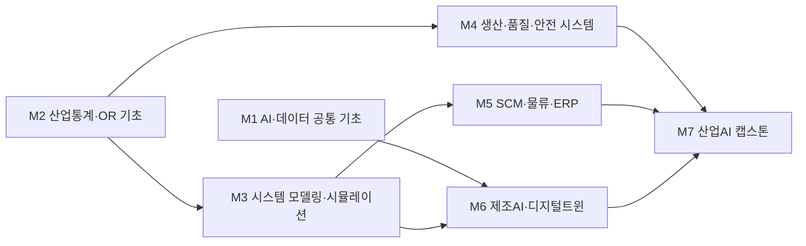

# 산업시스템공학부 · 산업공학트랙

> 한성대학교 IT공과대학 산업시스템공학부 · 2026학년도 AI융합 교육과정 개편 자료 · 작성 기준일: 2026-06-25

## 1. 개요

**트랙 정의.** 산업공학트랙은 사람·설비·자재·정보가 결합된 생산·물류·서비스 시스템을 **설계·분석·최적화**하는 역량을 기릅니다. 생산관리, 품질관리, 공정 최적화, 공급망관리(SCM), 물류, 시스템 시뮬레이션이 핵심 영역입니다.

**AI 융합 개편 방향.** 전통적 산업공학(IE) 방법론(최적화·확률통계·시뮬레이션)에 **AI/데이터 역량을 결합**하여, 스마트팩토리·디지털 트윈·AI 에이전트 환경에서 "현장 문제를 정의하고 AI로 푸는" 융합형 엔지니어를 양성합니다.

## 2. 산업·기술 트렌드 (2024–2026)

### 대기업 동향

- **삼성전자**: 2030년까지 국내외 공장을 **AI 자율공장(AI Driven Factory)**으로 전환 추진. 자재 입고부터 생산·출하까지 전 공정에 **디지털 트윈 시뮬레이션**을 도입, 품질·생산·물류 **AI 에이전트**로 이상 감지·고장 예측·생산 일정 최적화.
- **현대자동차그룹**: 싱가포르 **HMGICS** 스마트팩토리의 고도 자동화 모델을 미국 HMGMA로 이식.
- **물류(CJ대한통운·쿠팡)**: CJ대한통운은 **디지털 트윈 기반 가상 창고**로 물류 예측·시뮬레이션 체계를 구축.

### 핵심 기술 키워드

- 스마트팩토리/제조 AI(공정 최적화·예측 정비·이상 감지) / 디지털 트윈·시뮬레이션 / SCM·물류 최적화 / 품질·생산관리(AI 비전 검사, SPC+ML)

### 중소·정부 동향

- 정부 **2026년 스마트 제조혁신 지원사업**: 제조AI 특화 스마트공장(자율형공장 AI트랙), 예측유지보수·공정최적화용 AI에이전트·온디바이스 AI 보급.
- **스마트제조 전문인력 육성사업** Track1(생산·기술인력), Track2(제조AI 솔루션 개발인력).
- 중소제조 핵심은 **"기존 ERP 위에 AI 레이어를 올리는 방식"**.

## 3. 채용 동향

- **흐름**: 사람인·잡코리아·LinkedIn 기준, 제조·물류 대기업이 직무를 명시적으로 **SCM / 로보틱스·자동화 / AI·빅데이터**로 분리해 모집.
- **CJ대한통운**: 2025 하반기 공채에서 SCM, 로봇·자동화, AI·빅데이터, 재무·회계 + 글로벌 SCM 트랙 모집. 2026 상반기 안전/보건 전형 신설.
- **아모레퍼시픽**: 2025 하반기 스마트팩토리 지능화(AI) 연구/개발 신입 수시.
- **SK하이닉스**: 반도체가 스마트팩토리로 진화하며 일부 팀의 **산업공학 전공자 비율이 약 70%**까지 상승(채용 스토리 인용).
- **신입 직무 예시**: 생산기술/생산관리, SCM·구매기획, 품질엔지니어, 공정·설비 데이터 분석, 물류 운영/네트워크 설계.

### 3-1. 고용 전망 — 국내·미국·중국 동향

!!! abstract "이 트랙과 향후 10년 고용"
    - **국내(고용노동부):** 제조(-15.1만)·운수물류 등은 산업·디지털 전환으로 취업자가 감소하지만, 산업공학의 공정·데이터 최적화 역량은 설치·정비·생산직의 63.3% 대체 흐름 속에서 자동화를 설계·운영하는 쪽에 자리하며 수요가 공학·정보통신 전문가로 집중된다.
    - **미국(BLS)·글로벌(WEF):** WEF는 빅데이터·AI/ML을 성장 직무로 꼽고 로봇 설치 상위 5개국(한국 포함)이 세계의 80%를 차지한다고 보며, 사무·데이터입력 등 정형 직무는 감소 — SCM·생산 데이터를 다루는 분석형 IE 인재에 유리하다.
    - **중국:** 산업로봇 누적 200만 대(세계 설치 54%)로 스마트팩토리·물류 자동화가 급속 확산, 공정·물류 최적화와 디지털 트윈 설계 수요를 키운다.
    - **시사점:** 전통 IE 방법론(최적화·시뮬레이션)에 제조AI·디지털트윈을 결합해 '자동화를 설계·운영하는' 융합 인재로 길러야 대체 흐름의 수혜자가 된다.

> 📊 거시 분석 전체: [고용노동부 취업동향·10년 전망](../employment-outlook.md) · [글로벌 비교 (미국·중국)](../global-employment-outlook.md)

## 4. 요구 직무 역량

| 구분 | 세부 역량 |
| --- | --- |
| **핵심 직무 역량** | 생산·공정관리, 품질관리(SPC), SCM·재고·물류 최적화, 시스템 시뮬레이션, 통계적 의사결정, 산업안전 |
| **AI 융합 역량** | 제조 데이터 분석, AI 수요예측, 예측 정비(ML 기반), 디지털 트윈/시뮬레이션 모델링, AI 에이전트 활용·연계 |
| **주요 툴·자격** | Python, SQL, 통계, 수리·메타휴리스틱 최적화(LP/MIP, 휴리스틱), ERP/MES, 디지털 트윈/시뮬레이션(AnyLogic, Plant Simulation), 빅데이터분석기사·ADsP·SQLD, 품질경영기사(추정 우대) |

!!! tip "추가 보강 제안 (2026 개편 반영안 · 공식 교과 아님)"
    공식 교과를 대체하지 않는 **추가 보강 방향**입니다(신설/심화 제안).
    - **추가 기술트렌드:** 프로세스마이닝 · 디지털트윈 · 최적화+AI
    - **추가 직무역량:** OR/시뮬레이션 · 생산 데이터 분석 · 개선안 검증
    - **교육과정 보강(제안):** 스마트팩토리 디지털트윈 · 공정 AI 캡스톤

## 5. 대표 채용 기업 & 직무 예시

| 구분 | 기업 | 직무 예시 |
| --- | --- | --- |
| **대기업** | 삼성전자, SK하이닉스, 현대자동차, LG전자 | 생산기술, 공정/설비 최적화, 스마트팩토리 엔지니어, 디지털 트윈 |
| **물류·유통** | CJ대한통운, 쿠팡(쿠팡로지스틱스) | SCM, 물류 네트워크 설계, 로봇·자동화 운영, AI·빅데이터 |
| **중견·제조** | 아모레퍼시픽 등 | 스마트팩토리 AI 연구/개발, 생산관리, 품질 데이터 분석 |
| **스타트업/중소** | 제조AI·스마트공장 솔루션 기업 | 제조AI 솔루션, 예측유지보수, ERP+AI 연동 |

## 6. 교육과정 개편 시사점

1. **"IE 방법론 + AI"의 명시적 결합**: 최적화·시뮬레이션·품질관리 과목에 ML/AI 예측·이상감지 모듈을 결합한 AI 융합 생산·SCM 과목 신설.
2. **디지털 트윈·시뮬레이션 실습 강화**: 삼성·CJ대한통운 사례처럼 가상 검증이 산업 표준. Python + 시뮬레이션 도구로 가상 공장/창고 모델링 캡스톤.
3. **ERP/MES + AI 에이전트 실무 연계**: "ERP 위 AI 레이어"를 반영, ERP/MES 데이터 흐름 이해 + AI 에이전트 활용 실습을 산학연계·정부 인턴십과 연결.

## 7. 출처

> 인용 형식: **기관·매체 — 「제목」 (발행일/연도) · URL** / 확인일 2026-06-27

- **삼성 뉴스룸** — 「AI 자율공장 전환」
- **삼성 뉴스룸** — 「엔비디아와 반도체 AI 팩토리 구축」
- **이코노믹리뷰** — 「(제목 미상)」
- **CJ대한통운** — 「보도자료(2025 하반기 신입공채, 디지털 트윈)」
- **헬로티** — 「2026 상반기 공채 안전·보건 신설」
- **SK하이닉스 뉴스룸** — 「산업공학 취업 스토리」
- **링커리어** — 「아모레퍼시픽」
- **비즈인포** — 「2026 스마트 제조혁신」
- **PwC** — 「피지컬 AI」

## 8. 교육 목표 (예시)

> 학문 분야 정체성: 산업공학은 사람·설비·정보·물류로 이루어진 복잡한 시스템을 최적화·표준화하여 최소 자원으로 최대 성과를 내도록 설계·운영·개선하는 학문입니다.

산업공학 고유의 최적화·생산시스템·공급망관리(SCM) 역량을 중심으로, AI·데이터 기술을 결합해 데이터 기반 의사결정과 지능형 시스템 설계를 수행하는 융합 산업공학 인재를 양성합니다.

1. **최적화·OR 핵심 역량 확보**: 선형계획·정수계획·확률모형·시뮬레이션을 활용해 생산·물류·서비스 시스템의 최적화 문제를 정식화하고 해를 도출할 수 있다. (전공 핵심 교과 6과목 이상 이수, 최적화 프로젝트 1건 완수)
2. **AI 기반 수요예측·공급망 의사결정**: 시계열·머신러닝 기법으로 수요를 예측하고 재고·생산·물류 계획에 반영하는 데이터 기반 SCM 의사결정 모델을 구현할 수 있다. (예측 정확도(MAPE) 기준 베이스라인 대비 개선 1건)
3. **제조AI·디지털트윈·예측정비 설계**: 공정 데이터를 수집·분석하여 디지털트윈 기반 공정 모니터링과 설비 예측정비(PdM) 모델을 설계·검증할 수 있다. (캡스톤에서 실데이터 기반 제조AI 모델 1건 구현)
4. **AI 윤리·책임 있는 자동화 적용**: 산업 현장의 자동화·의사결정 시스템에 데이터 편향·안전·노동영향 등 AI 윤리 기준을 적용해 책임 있게 설계할 수 있다. (윤리 체크리스트 기반 설계 검토 보고서 1건)

## 9. 교육과정 구성 및 교수법 활용

**교육과정 구성**

- **기초 단계(1~2학년)**: 공학수학·통계·확률, Python·데이터 기초, 생성형 AI 활용 등 공통·기초 역량을 형성한다.
- **전공심화 단계(2~3학년)**: 최적화·OR, 생산시스템, 품질공학, SCM, 시뮬레이션 등 산업공학 핵심 이론과 모델링 역량을 심화한다.
- **AI 융합 단계(3~4학년)**: ML 기초 위에 AI 수요예측·제조AI·디지털트윈·예측정비 등 전공-AI 결합 교과로 응용 역량을 확장한다.
- **캡스톤 단계(4학년)**: 산학 연계 실데이터로 최적화·AI 모델을 통합 적용하는 종합설계 프로젝트를 수행한다.

**교수법 활용**

- **PBL(문제 기반 학습)**: 실제 생산·물류 시스템의 최적화 문제를 정의하고 해결하는 과정 중심 수업.
- **산학 연계 캡스톤**: 제조·물류 기업의 실데이터·현장 과제를 기반으로 한 종합설계.
- **시뮬레이션 실습**: 이산사건·시스템 다이내믹스 시뮬레이터로 생산·공급망 시나리오를 검증.
- **데이터 분석·AI 툴 실습**: Python·노트북 환경과 생성형 AI 코딩 도구를 활용한 모델 구현 실습.

## 10. 모듈형 전공교육과정 (M1~M7)

### 10-1. 모듈형 교육과정 안내

> 출처: 한성대학교 산업공학트랙 공식 교과과정([https://www.hansung.ac.kr/Engineering/4994/subview.do](https://www.hansung.ac.kr/Engineering/4994/subview.do)) 기준, 확인일 2026-06-30. 구성 교과목 공식, 미존재 보강은 (제안). (전기=전공기초·전필=전공필수·전선=전공선택)
> **교과 구분 표기:** 이수구분(전기·전필·전선)이 붙은 과목은 **공식 현행 교과**, `(제안)`은 **신설 제안 교과**, `(미정)`은 **개설 학기 미정**입니다. 표 오른쪽 '구분' 열은 각 모듈의 교과 구성 성격을 요약합니다.

| 모듈 | 모듈명 | 구성 교과목 (학년-학기·이수구분) | 모듈 설명 | 모듈 학습성과 | 모듈 간 관계 | 구분 |
| --- | --- | --- | --- | --- | --- | --- |
| **M1** | AI·데이터 공통 기초 | 공학프로그래밍(2-1·전선) · 데이터베이스 설계 및 활용(2-1·전선) · 인공지능의 이해와 활용(3-1·전선) · 생성형 AI 활용(제안·미정) | Python·데이터베이스, 인공지능 활용, 생성형 AI, AI 윤리 | 데이터를 다루고 ML 모델과 생성형 AI 도구를 책임 있게 활용 | 단과대학 공통 · M6 기반 | 공식·제안·미정 |
| **M2** | 산업통계·OR 기초 | 산업공학개론(1-1·전기) · 공학확률과 통계(2-2·전선) · 경영과학Ⅰ(2-2·전필) · 경영과학Ⅱ(3-1·전선) | 확률·통계, 선형·정수계획, 경영과학 | 산업 문제를 수리모형으로 정식화하고 해석 | 학부 공통 · M3·M4 기반 | 공식 |
| **M3** | 시스템 모델링·시뮬레이션 | 공학경제개론(2-1·전필) · 기술경영(2-2·전선) · 공학통계응용(3-1·전필) · 시스템 시뮬레이션(3-2·전필) | 이산사건 시뮬레이션, 통계응용, 공학경제 | 복잡 시스템을 모델링·시뮬레이션으로 분석 | 학부 공통 · M5·M6 기반 | 공식 |
| **M4** | 생산·품질·안전 시스템 | 인간공학(2-1·전필) · 생산경영(2-2·전필) · 품질 및 공정관리(3-1·전선) · 안전관리(3-2·전필) | 생산계획, 품질공학(SPC), 인간공학, 안전 | 생산·품질 시스템을 설계·관리 | 트랙 전공 · M7 연계 | 공식 |
| **M5** | SCM·물류·ERP | SAP 구매 프로세스(1-1·전선) · 물류경영(3-1·전선) · SAP 생산 프로세스(3-2·전선) · CRM(4-2·전선) | 공급망·물류, ERP 프로세스, 고객관리 | 물류·구매·생산 프로세스를 ERP로 통합 운영 | 트랙 전공 · M7 연계 | 공식 |
| **M6** | 제조AI·디지털트윈 | 프로세스혁신(2-2·전선) · 제조 공정 및 자동화(2-2·전선) · 디자인과 제조(2-2·전선) · 디지털트윈(제안·미정) | 공정 데이터 분석, 디지털트윈, 예측정비(PdM) | 스마트팩토리 지능형 운영 모델 설계 | 트랙 전공 · M7 연계 | 공식·제안·미정 |
| **M7** | 산업AI 캡스톤 | 산업시스템공학 캡스톤디자인(4-1·전선) · 제조데이터분석(제안·미정) · 산업AI 종합설계(제안·미정) | 융합 종합설계, 산학 프로젝트 | 실데이터로 최적화·AI 통합 솔루션 도출 | 트랙 전공 · 종합 캡스톤 | 공식·제안·미정 |

### 10-2. 모듈형 교육과정 로드맵 (학년·학기)

각 모듈 교과목이 **언제 개설되는지**(학년-학기)를 한눈에 보여줍니다. (제안)·(미정) 교과는 표에서 생략합니다.

| 모듈 | 1-1 | 1-2 | 2-1 | 2-2 | 3-1 | 3-2 | 4-1 | 4-2 |
| --- | --- | --- | --- | --- | --- | --- | --- | --- |
| **M1** AI·데이터 공통 기초 | | | 공학프로그래밍 · 데이터베이스 설계 및 활용 | | 인공지능의 이해와 활용 | | | |
| **M2** 산업통계·OR 기초 | 산업공학개론 | | | 공학확률과 통계 · 경영과학Ⅰ | 경영과학Ⅱ | | | |
| **M3** 시스템 모델링·시뮬레이션 | | | 공학경제개론 | 기술경영 | 공학통계응용 | 시스템 시뮬레이션 | | |
| **M4** 생산·품질·안전 시스템 | | | 인간공학 | 생산경영 | 품질 및 공정관리 | 안전관리 | | |
| **M5** SCM·물류·ERP | SAP 구매 프로세스 | | | | 물류경영 | SAP 생산 프로세스 | | CRM |
| **M6** 제조AI·디지털트윈 | | | | 프로세스혁신 · 제조 공정 및 자동화 · 디자인과 제조 | | | | |
| **M7** 산업AI 캡스톤 | | | | | | | 산업시스템공학 캡스톤디자인 | |

**모듈 흐름(요약 다이어그램):**

- **마이크로디그리:** 'M5 SCM·물류·ERP', 'M6 제조AI·디지털트윈'을 각각 마이크로디그리로 인증해 비전공자·타 트랙 학생도 모듈 단위 취득이 가능하다.
- **교차수강:** 응용산업데이터공학트랙의 데이터엔지니어링·MLOps 모듈을 교차수강해 데이터 파이프라인 역량을 보강한다.

### 10-3. 학습자 진로 가이드

| 진로 분야 | 권장 모듈 조합 | 지향 |
| --- | --- | --- |
| 스마트제조·생산기술 | M1 AI·데이터 공통 기초 + M4 생산·품질·안전 시스템 + M6 제조AI·디지털트윈 | 스마트팩토리 엔지니어·제조AI·공정 데이터 분석가 |
| 공급망·물류 최적화 | M2 산업통계·OR 기초 + M5 SCM·물류·ERP + M3 시스템 모델링·시뮬레이션 | SCM 플래너·수요예측·물류 최적화 컨설턴트 |
| 시스템 설계·운영 컨설팅 | M2 산업통계·OR 기초 + M3 시스템 모델링·시뮬레이션 + M7 산업AI 캡스톤 | 산업공학 컨설턴트·운영혁신(OE)·PI 전문가 |

### 10-4. 학생 학습경로 예시

**경로 A — 스마트제조 엔지니어**

- 1학년: Python 프로그래밍, 데이터 분석 기초, 공학수학.
- 2학년: 공학통계, 경영과학(OR), 생산관리, 생성형 AI 활용.
- 3학년: 품질경영, 시뮬레이션, ML 기초, 스마트제조/디지털트윈.
- 4학년: 제조데이터분석, 예측정비, 산업AI 캡스톤(공정 데이터 기반 PdM 솔루션).

**경로 B — SCM·수요예측 플래너**

- 1학년: Python 프로그래밍, 데이터 분석 기초, 확률통계 입문.
- 2학년: 공학통계, 최적화이론, 공급망관리, AI 윤리.
- 3학년: ML 기초, AI 수요예측, 물류최적화, 시뮬레이션.
- 4학년: 의사결정분석, 산업AI 캡스톤(AI 수요예측 기반 재고·물류 최적화).

**경로 C — 운영혁신(OE)·산업공학 컨설턴트**

- 1학년: Python 프로그래밍, 데이터 분석 기초, 공학수학.
- 2학년: 공학통계, 경영과학(OR), 시스템모델링, 생성형 AI 활용.
- 3학년: 최적화이론, 시뮬레이션, ML 기초, 의사결정론.
- 4학년: 디지털트윈, 산업AI 캡스톤(시뮬레이션·디지털트윈 기반 공정·물류 운영혁신 설계) → 산업공학 컨설턴트(OE/PI)로 진출.

**경로 D — 품질·AI 비전검사 엔지니어**

- 1학년: Python 프로그래밍, 데이터 분석 기초, 확률통계 입문.
- 2학년: 공학통계, 품질경영, 공정설계, AI 윤리.
- 3학년: ML 기초, 제조데이터분석, 품질공학(SPC), 시뮬레이션.
- 4학년: 스마트제조, 산업AI 캡스톤(AI 비전검사+SPC 기반 품질예측 시스템) → 품질엔지니어(AI 비전검사)로 진출.

!!! info "진출 직무 — 이런 전문가로 성장할 수 있어요"
    각 경로를 끝까지 걸으면 도달하는 직무입니다. 무슨 일을 하고 어떤 매력이 있는지, 그리고 졸업 무렵 갖추게 될 **AI 활용 능력·역량**을 함께 그려 봤습니다.

    - **스마트제조 엔지니어 (경로 A):** 거대한 공장 전체를 데이터로 꿰뚫어 보며 "여기서 멈춘다"를 예언하고 미리 손보는 사람입니다. 내가 만든 예측정비 모델 덕분에 라인이 멈추지 않고, 절감된 비용이 숫자로 증명되는 성취를 직접 경험할 수 있습니다. → *AI 활용 능력·역량:* 공정·설비 데이터를 학습해 고장을 예측하고 이상 징후를 자동 포착하는 **AI 예측정비 역량**.
    - **SCM·수요예측 플래너 (경로 B):** 아직 오지 않은 수요를 먼저 읽어 원자재·재고·물류를 부족도 과잉도 없이 맞추는, 공급망 전체를 지휘하는 사람입니다. 내 예측이 회사의 재고 회전과 결품률을 바꾸는 임팩트를 눈으로 확인할 수 있습니다. → *AI 활용 능력·역량:* 판매·물류 데이터로 수요를 예측해 재고·배송 계획을 최적화하는 **AI 수요예측·공급망 최적화 역량**.
    - **산업공학 컨설턴트(운영혁신·OE) (경로 C):** 기업의 일하는 방식과 공정·물류 흐름을 꿰뚫어 낭비를 찾아내고, 조직 전체를 더 나은 방식으로 바꿔 놓는 사람입니다. 내 제안 한 건이 회사의 운영 방식을 바꾸는 영향력과, 다양한 산업을 넘나드는 확장성이 매력입니다. → *AI 활용 능력·역량:* 시뮬레이션·디지털트윈으로 개선안을 가상 검증해 최적안을 도출하는 **AI 기반 운영혁신 역량**.
    - **품질엔지니어(AI 비전검사) (경로 D):** 사람 눈이 놓치는 미세한 불량까지 AI의 눈으로 걸러내, 제품에 대한 신뢰 그 자체를 지키는 사람입니다. 내가 만든 검사 시스템이 불량을 완벽히 걸러내고 고객 클레임을 없애는 보람을 느낄 수 있습니다. → *AI 활용 능력·역량:* AI 영상 검사로 불량을 자동 판별하고 SPC와 결합해 품질을 예측·관리하는 **AI 비전 품질관리 역량**.

### 10-5. 상위 수준 보완 권고

> 아래는 KAIST·POSTECH·한양대 산업공학 등 산업공학·스마트팩토리 특성화 **상위 비교군** 및 산업 표준 정렬을 위한 **보완 권고**입니다. **공식 교과를 대체하지 않으며**, 2027학년도 교과 개편 시 심의 의견·향후 개선 계획으로 활용합니다.

| 보완 영역 | 반영 위치 | 추가하면 좋은 내용 | 기대 효과 |
| --- | --- | --- | --- |
| 프로세스마이닝 | M5, M6 | ERP/MES 이벤트 로그 기반 공정·물류 흐름 자동 발견, 병목·재작업 탐지(PM4Py·Celonis) 실습 | ERP 위 AI 레이어 사례를 데이터로 진단하는 PI 역량 확보 |
| 디지털트윈·시뮬레이션 고도화 | M3, M6 | AnyLogic 기반 이산사건·에이전트 모델로 가상 공장/창고 구축, 실데이터 보정(Calibration)·what-if 검증 | 삼성·CJ 사례 수준의 가상 검증 표준 충족 |
| 최적화+AI(OR·강화학습) | M2, M7 | LP/MIP에 더해 강화학습 기반 생산 일정·재고 정책 학습, 메타휴리스틱과 ML 결합 | 동적·불확실 환경의 의사결정 자동화 역량 강화 |
| 스마트팩토리·MES 연계 | M5, M6 | MES/SCADA 데이터 모델, OPC-UA 수집 파이프라인, 설비종합효율(OEE) 대시보드 구축 | 현장 시스템과 AI를 연결하는 운영 엔지니어링 역량 확보 |
| 생산 데이터 분석·품질(SPC+ML) | M4, M7 | 관리도·공정능력(Cp/Cpk)에 AI 비전검사·이상탐지 결합, 품질 예측 모델 검증 | 통계적 품질관리와 제조AI를 통합한 품질엔지니어 역량 강화 |
| 공급망 분석·수요예측 | M2, M5 | 다계층 SCM 네트워크 최적화, 시계열·ML 수요예측과 재고정책 연동, 리스크 시나리오 분석 | 분석형 IE 인재의 SCM 의사결정 정밀도 향상 |
