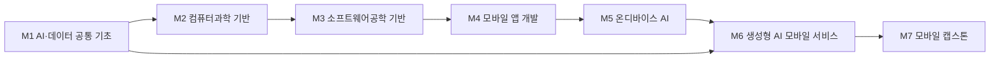

# 컴퓨터공학부 · 모바일소프트웨어트랙

> 한성대학교 IT공과대학 컴퓨터공학부 · 2026학년도 AI융합 교육과정 개편 리서치 (조사일: 2026-06-25)

## 1. 개요

모바일소프트웨어트랙은 안드로이드(Kotlin)·iOS(Swift) 네이티브 앱과 Flutter·KMP(Kotlin Multiplatform) 등 크로스플랫폼 모바일 소프트웨어를 설계·개발하는 트랙이다.

**AI 융합 개편 방향**: 2024 생성형 AI → 2025 에이전트 AI → 2026 Physical AI로 이어지는 패러다임 속에서, 모바일은 **온디바이스 AI의 실행 단말**이자 **에이전트의 프런트엔드·센서/액추에이터 게이트웨이**로 역할이 재정의되고 있다. 단순 UI 구현을 넘어 '앱에 LLM 기능을 직접 통합'하는 온디바이스 AI 역량을 정규 커리큘럼에 결합한다.

## 2. 산업·기술 트렌드 (2024–2026)

### 대기업

- **온디바이스 AI가 기본기로 진입.** 삼성 Galaxy AI는 온디바이스+클라우드 하이브리드 구조로, 갤럭시 S25부터 **Gemini Nano** 탑재. 갤럭시 S26은 '에이전틱 AI'를 전면에 내세움. 삼성은 Meta와 협력해 PyTorch 온디바이스 추론 솔루션 **ExecuTorch**를 Exynos에서 구동.
- **안드로이드**: Google이 **ML Kit GenAI API**(Gemini Nano·AICore 기반)를 공개(2025.05). AI 지식 없이 몇 줄 코드로 요약·교정·재작성·이미지 설명 기능 통합 가능.
- **iOS**: WWDC25에서 **Foundation Models framework** 공개. 약 3B 파라미터 온디바이스 모델을 Swift API로 노출(guided generation, tool calling, LoRA 어댑터). '3줄 코드'로 Apple Intelligence 호출, 오프라인·프라이버시 강조.

### 중소·스타트업

- **Kotlin + Jetpack Compose**(안드로이드), **Swift + SwiftUI**(iOS)가 사실상 표준 스택. 코루틴/비동기·선언형 UI가 채용 필수 키워드.
- **Flutter**: 크로스플랫폼 수요 지속, 주로 스타트업·중소·외주에서 채택.
- **KMP(Kotlin Multiplatform)**: 2025년 Android Studio 통합 + Compose Multiplatform iOS 안정화로 프로덕션 성숙. 국내 SK(에이닷 iOS팀) 도입 경험 공유.

## 3. 채용 동향

사람인·잡코리아·원티드·LinkedIn 등 다채널 기준, 채용 규모는 줄고 기준은 높아진 **양극화 시장**으로, 곧바로 투입 가능한 경력자 선호가 강하다.

- **토스 — 2025 토스 NEXT 개발자 챌린지**: 경력 3년 이하 대상, **최대 50명** 채용 목표. 모집 직군에 **안드로이드·iOS** 포함.
- **쿠팡 2025 공개채용**: 모바일 엔지니어(안드로이드/iOS) 포함.
- **당근(당근마켓)**: iOS/Android Software Engineer 상시 채용.
- **네이버제트(NAVER Z)**: Android 공고에서 Kotlin 3년+, Jetpack Compose 깊은 이해, **AI 기반 개발툴 활용 경험** 명시 요구.
- *(단일출처·추정)* 신규 공고의 64%가 'AI 툴 활용 경험'을 우대로 명시, 안드로이드 신입 평균 연봉 약 3,570만원(단일 블로그 인용치로 추정 표기).

### 3-1. 고용 전망 — 국내·미국·중국 동향

!!! abstract "이 트랙과 향후 10년 고용"
    - **국내(고용노동부):** 2027년 AI 인력 1.28만·클라우드 1.88만 명 부족이 전망돼 모바일 SW 고숙련 개발자 수요를 뒷받침한다. AI·디지털 전환으로 연구·공학직은 74.2%가 대체보다 보완(증강) 대상으로 분류된다.
    - **미국(BLS)·글로벌(WEF):** BLS는 컴퓨터·수학 직군을 2024~2034년 **+10.1%**로 전망하고, WEF는 SW 개발·AI/ML을 대표 성장 직무로 꼽는다(스킬 39% 진부화).
    - **시사점:** Kotlin/Swift 등 모바일 기반기술에 AI 협업·증강 개발 역량을 결합한 고숙련 인재 양성이 교육과정의 핵심이다.

> 📊 거시 분석 전체: [고용노동부 취업동향·10년 전망](../employment-outlook.md) · [글로벌 비교 (미국·중국)](../global-employment-outlook.md)

## 4. 요구 직무 역량

| 구분 | 내용 |
| --- | --- |
| 핵심 직무 역량 | 문제 해결력(코드 구조 설계·오류 분석), 코딩테스트/CS(알고리즘·자료구조), 배포·운영(CI/CD, 스토어 출시), 협업·문서화 |
| AI 융합 역량 | AI 리터러시, 온디바이스 AI((Android)Gemini Nano·ML Kit GenAI·AICore / (iOS)Foundation Models framework), AI 코딩 어시스턴트(GitHub Copilot·Claude Code·Cursor) |
| 기술스택 | (Android) Kotlin·Jetpack Compose·Coroutine/Flow / (iOS) Swift·SwiftUI·async/await / (크로스) Flutter·Kotlin Multiplatform / (AI) Gemini Nano·Apple Foundation Models·ExecuTorch |

!!! tip "추가 보강 제안 (2026 개편 반영안 · 공식 교과 아님)"
    공식 교과를 대체하지 않는 **추가 보강 방향**이다(신설/심화 제안).
    - **추가 기술트렌드:** 온디바이스 AI · 모바일 에이전트 · 개인정보 보호 추론
    - **추가 직무역량:** Swift/Kotlin · Core ML/Gemini Nano · 경량 모델 배포
    - **교육과정 보강(제안):** 온디바이스 AI 앱 · 모바일 RAG 실습

## 5. 대표 채용 기업 & 직무 예시

- **대기업/플랫폼**: 삼성전자(Galaxy AI·온디바이스 SW), 네이버·네이버제트(Android/iOS), 카카오·카카오모빌리티, 쿠팡(모바일 엔지니어), SK(에이닷 — KMP iOS)
- **중견/유니콘**: 토스(NEXT 챌린지 Android/iOS 신입), 배민(우아한형제들), 당근(iOS/Android SW Engineer)
- **스타트업/중소·외주**: Flutter·Kotlin·Swift 중심, 신입~3년차 트랙

## 6. 교육과정 개편 시사점

1. **온디바이스 AI를 모바일 정규 커리큘럼에 편성.** Android는 Gemini Nano·ML Kit GenAI, iOS는 Foundation Models framework를 실습 과제화. '앱에 LLM 기능 3줄 통합' 수준의 핸즈온이 신입 차별화 포인트.
2. **선언형 UI + 멀티플랫폼 이중 트랙.** Kotlin/Compose·Swift/SwiftUI를 기본기로, Flutter 또는 KMP 중 1개 크로스플랫폼 역량을 졸업 포트폴리오에 포함.
3. **AI 융합 + 출시형 포트폴리오 PBL.** AI 코딩 어시스턴트 활용 전제 프로젝트 + 실제 스토어 출시·운영 경험 + 코딩테스트 대비 결합.

## 7. 출처

> 인용 형식: **기관·매체 — 「제목」 (발행일/연도) · URL** / 확인일 2026-06-27

- **토스피드** — 「2025 토스 NEXT 개발자 챌린지」
- **전자신문** — 「50명 채용」
- **Android Developers** — 「Gemini Nano / On-device GenAI APIs」
- **Apple Developer** — 「Foundation Models framework」 (WWDC25)
- **JetBrains** — 「Kotlin Multiplatform Roadmap 2025」
- **SK DevOcean** — 「KMP iOS 도입 경험」
- **원티드** — 「네이버제트 Android 공고」
- **당근 채용** — 「iOS Software Engineer」

## 8. 교육 목표 (예시)

> 학문 분야 정체성: 모바일소프트웨어트랙은 모바일·임베디드 환경에서 동작하는 소프트웨어를 설계·구현하는 SW공학 역량에 온디바이스 AI를 결합하여, 단말에서 실시간으로 지능형 서비스를 제공하는 엔지니어를 양성한다.

1. **모바일 SW공학 기본기 확립**: 안드로이드/iOS(또는 크로스플랫폼 Flutter) 앱을 요구사항 분석부터 배포·운영까지 수행하고, 4학년까지 앱스토어 배포 가능한 프로젝트 2건 이상을 완성한다.
2. **온디바이스 AI 통합 역량**: TensorFlow Lite·Core ML 등 경량화 추론 엔진을 활용해 이미지·음성·센서 기반 AI 기능을 모바일 앱에 탑재하고, 모델 양자화·경량화로 추론 지연 200ms 이하를 달성한다.
3. **생성형 AI 연동 모바일 서비스 구현**: LLM API·온디바이스 sLM과 RAG를 연계한 대화형/멀티모달 모바일 앱을 1건 이상 설계·구현한다.
4. **AI 코딩 어시스턴트 기반 생산성**: AI 페어프로그래밍 도구를 활용해 코드 리뷰·테스트 자동화를 적용하고, 동일 과제 대비 개발 리드타임을 정량적으로 단축한 사례를 캡스톤에서 입증한다.

## 9. 교육과정 구성 및 교수법 활용

**교육과정 구성**

- 기초: Python·데이터 처리, 프로그래밍 기초, 자료구조로 SW 사고력과 AI·데이터 공통 기반을 형성한다.
- 전공심화: 모바일 프로그래밍, 모바일 UI/UX, 네트워크·데이터베이스로 앱 개발 전공 역량을 심화한다.
- AI 융합: 온디바이스 AI, 모바일 머신러닝, 생성형 AI 앱 개발로 지능형 모바일 서비스 역량을 결합한다.
- 캡스톤: 산학 연계 모바일 AI 서비스를 기획-개발-배포까지 수행하는 종합 프로젝트로 마무리한다.

**교수법 활용**

- PBL: 실제 사용자 시나리오 기반 모바일 앱 문제 해결형 수업
- 플립러닝: 이론은 사전 영상, 강의실은 코드 클리닉·실습 중심
- 해커톤: 학기 내 온디바이스 AI 미니 해커톤 운영
- 산학 캡스톤 + AI 페어프로그래밍: 기업 과제를 AI 코딩 어시스턴트와 협업해 개발

## 10. 모듈형 전공교육과정 (M1~M7)

### 10-1. 모듈형 교육과정 안내

> 출처: 한성대학교 모바일소프트웨어트랙 공식 교과과정([https://www.hansung.ac.kr/Engineering/4889/subview.do](https://www.hansung.ac.kr/Engineering/4889/subview.do)) 기준, 확인일 2026-06-30. 구성 교과목 공식, 미존재 보강은 (예시). (전기=전공기초·전필=전공필수·전선=전공선택)

| 모듈 | 모듈명 | 구성 교과목 (학년-학기·이수구분) | 모듈 설명 | 모듈 학습성과 | 모듈 간 관계 |
| --- | --- | --- | --- | --- | --- |
| **M1** | AI·데이터 공통 기초 | 컴퓨터프로그래밍(1-2·전기) · 프로그래밍랩(2-1·전선) · 확률및통계(2-1·전선) · AI를 이용한 주식가치평가(1-1·전선) | Python·데이터 처리, 생성형 AI/LLM 활용, AI 코딩 어시스턴트, AI 윤리 | AI 도구로 데이터 처리·프로토타이핑 수행 | 단과대학 공통 |
| **M2** | 컴퓨터과학 기반 | 자료구조(2-1·전선) · 컴퓨터구조(2-1·전선) · 알고리즘(2-2·전선) · 운영체제(3-1·전선) | 자료구조, 알고리즘, 운영체제, 네트워크 | 시스템 동작 원리 이해 및 효율적 알고리즘 설계 | 학부 공통 |
| **M3** | 소프트웨어공학 기반 | 객체지향언어1(2-1·전선) · 객체지향언어2(2-2·전선) · 소프트웨어공학(3-1·전선) · 설계패턴(3-2·전선) | 객체지향, 협업·형상관리, 테스트 | 협업 기반 SW 개발 프로세스 수행 | 학부 공통 |
| **M4** | 모바일 앱 개발 | 모바일&스마트시스템(2-2·전필) · 안드로이드프로그래밍(3-1·전필) · 고급모바일프로그래밍(3-2·전필) · iOS프로그래밍(4-1·전필) | 안드로이드/iOS·Flutter, 모바일 UI/UX, 앱 아키텍처 | 스토어 배포 가능한 앱 독립 구현 | M4-M5-M6 선후수 |
| **M5** | 온디바이스 AI | 데이터마이닝(3-1·전선) · 컴퓨터비젼(3-2·전선) · 모바일시스템응용프로젝트(4-2·전필) · 온디바이스AI(예시·학기 미상) | 모델 경량화·양자화, TFLite/Core ML, 엣지 추론 | 단말 내 실시간 AI 기능 탑재 | M4-M5-M6 선후수·마이크로디그리 |
| **M6** | 생성형 AI 모바일 서비스 | 네트워크프로그래밍(3-2·전선) · 웹서버프로그래밍(3-1·전선) · 생성형AI앱개발(예시·학기 미상) · 모바일AI서비스(예시·학기 미상) | LLM API·sLM, RAG, 멀티모달 연동 | 대화형 AI 모바일 앱 구현 | M4-M5-M6 선후수 |
| **M7** | 모바일 캡스톤 | 모바일 캡스톤디자인(4-2·전필) · 기업연계 SW캡스톤디자인(3-2·전선) · 융합캡스톤디자인(4-2·전선) | 기획·개발·배포·운영, 산학 협업 | AI 모바일 서비스 종합 완성 | 종합·캡스톤 |

### 10-2. 모듈형 교육과정 로드맵 (학년·학기)

| 모듈 | 1-1 | 1-2 | 2-1 | 2-2 | 3-1 | 3-2 | 4-1 | 4-2 |
| --- | --- | --- | --- | --- | --- | --- | --- | --- |
| **M1** AI·데이터 공통 기초 | AI를 이용한 주식가치평가 | 컴퓨터프로그래밍 | 프로그래밍랩 · 확률및통계 | | | | | |
| **M2** 컴퓨터과학 기반 | | | 자료구조 · 컴퓨터구조 | 알고리즘 | 운영체제 | | | |
| **M3** 소프트웨어공학 기반 | | | 객체지향언어1 | 객체지향언어2 | 소프트웨어공학 | 설계패턴 | | |
| **M4** 모바일 앱 개발 | | | | 모바일&스마트시스템 | 안드로이드프로그래밍 | 고급모바일프로그래밍 | iOS프로그래밍 | |
| **M5** 온디바이스 AI | | | | | 데이터마이닝 | 컴퓨터비젼 | | 모바일시스템응용프로젝트 |
| **M6** 생성형 AI 모바일 서비스 | | | | | 웹서버프로그래밍 | 네트워크프로그래밍 | | |
| **M7** 모바일 캡스톤 | | | | | | 기업연계 SW캡스톤디자인 | | 모바일 캡스톤디자인 · 융합캡스톤디자인 |

**모듈 흐름(요약 다이어그램):**

### 10-3. 학습자 진로 가이드

| 진로 분야 | 권장 모듈 조합 | 지향 |
| --- | --- | --- |
| 모바일 앱 개발 | M4 모바일 앱 개발 + M3 소프트웨어공학 기반 + M1 AI·데이터 공통 기초 | 안드로이드/iOS 개발자, 크로스플랫폼 개발자 |
| 온디바이스 AI 엔지니어 | M5 온디바이스 AI + M4 모바일 앱 개발 + M2 컴퓨터과학 기반 | 엣지 AI 엔지니어, 모바일 ML 엔지니어 |
| AI 모바일 서비스 기획·개발 | M6 생성형 AI 모바일 서비스 + M7 모바일 캡스톤 + M1 AI·데이터 공통 기초 | AI 프로덕트 개발자, 모바일 AI 서비스 PM |

### 10-4. 학생 학습경로 예시

**경로 A — 온디바이스 AI 엔지니어**

- 1학년: AI·데이터 공통 기초, 프로그래밍 기초, 파이썬 데이터 처리
- 2학년: 자료구조, 객체지향프로그래밍, 모바일프로그래밍 입문
- 3학년: 모바일머신러닝, 온디바이스AI, 컴퓨터네트워크
- 4학년: 모바일AI서비스, 산학 캡스톤(엣지 AI 앱), 포트폴리오 완성

**경로 B — AI 모바일 서비스 개발자**

- 1학년: AI·데이터 공통 기초, 생성형 AI 활용, 프로그래밍 기초
- 2학년: 자료구조, 모바일프로그래밍, 모바일UI/UX
- 3학년: 생성형AI앱개발, RAG·LLM 연동, 데이터베이스
- 4학년: 모바일AI서비스 캡스톤, 스토어 배포, 산학 PoC

**경로 C — 크로스플랫폼 모바일 개발자**

- 1학년: AI·데이터 공통 기초, 프로그래밍 기초, 파이썬 데이터 처리
- 2학년: 객체지향프로그래밍, 자료구조, 모바일프로그래밍(Kotlin/Compose)
- 3학년: 모바일UI/UX, Flutter·Kotlin Multiplatform 실습, 소프트웨어공학
- 4학년: 크로스플랫폼 캡스톤(KMP·Compose Multiplatform), 안드로이드·iOS 동시 스토어 배포로 크로스플랫폼 모바일 개발자로 진출

**경로 D — 엣지 AI 연구·대학원 진학형**

- 1학년: AI·데이터 공통 기초, 파이썬 데이터 처리, AI·데이터 리터러시
- 2학년: 자료구조, 알고리즘, 모바일프로그래밍
- 3학년: 모바일머신러닝, 온디바이스AI(모델 경량화·양자화), 빅데이터트랙 데이터 엔지니어링 교차수강
- 4학년: 온디바이스AI 캡스톤(엣지 추론 최적화 연구)·논문화로 엣지 AI 연구원(대학원 진학)으로 진출
