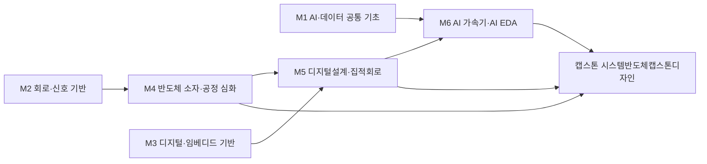

# 기계전자공학부(현행, 2027 개편명 전기전자공학부) · 시스템반도체트랙

> 한성대학교 IT공과대학 기계전자공학부(→전기전자공학부) 2026 AI융합 교육과정 개편 리서치 · 작성 기준일: 2026-06-25

## 1. 개요

시스템반도체트랙은 반도체 설계(RTL/회로)·검증·소자·공정·패키징을 아우르는 비메모리 중심 인재를 양성하는 트랙이다. AI 반도체(NPU)·HBM·팹리스·파운드리·첨단패키징으로 산업 축이 이동하면서, 설계·검증 역량에 AI/머신러닝 이해를 결합한 인재 수요가 급증하고 있다.

**AI 융합 개편 방향**: RTL 설계·검증 교과에 AI 반도체(NPU/가속기) 아키텍처 이해 결합, EDA 자동화·AI 기반 설계/검증 워크플로 도입, 정부 "반도체 인재 10년간 15만명" 정책 연계.

## 2. 산업·기술 트렌드 (2024–2026)

### 메모리 슈퍼사이클 & HBM

- 2026년은 AI·HPC 수요로 메모리 강한 성장세, **HBM이 시장 견인**. BofA 추산 2026년 HBM 시장 약 546억 달러(전년비 +58%, 인용치). 주력 HBM3E.
- 삼성전자·SK하이닉스가 차세대 **HBF**(High Bandwidth Flash) 샘플 공개를 두고 '추론 반도체' 경쟁.

### AI 반도체 / NPU & 팹리스

- AI 무게중심이 **학습 → 추론**으로 이동. **K-팹리스 3인방(리벨리온·퓨리오사AI·딥엑스)**이 저전력 추론 NPU로 데이터센터·온디바이스 공략.
- 리벨리온: 2026년 3월 정부 'K-엔비디아 육성' 국민성장펀드 1호로 약 6,400억원 프리IPO 유치, 기업가치 약 3.4조원.

### 파운드리 / 패키징

- 비메모리에서 **첨단 파운드리·차량용 로직·첨단 패키징(CoWoS 등)**이 핵심 성장 동력. 정부 반도체첨단패키징 전문인력 양성사업.

### 정부 정책

- 10년간 **반도체 인재 15만명** 양성, 전공 무관 융합교육·반도체 부트캠프(마이크로디그리), 기업-정부 1:1 매칭 채용연계. 특성화대학 8곳 집중 지원.

## 3. 채용 동향 (사람인·잡코리아·캐치·LinkedIn)

- **SK하이닉스**: 2026년 'Talent hy-way' 수시 신입 채용. 핵심인 **'설계' 분야에서 수시로는 이례적 세 자릿수 규모** 선발 예정, 2026년 9월 입사. '4년제 학사 이상' 학력요건 삭제, 직무 역량 중심 전환.
- **삼성전자**: 2026년 채용 진행(캐치·인크루트 등재).
- **반도체 계약학과/채용연계**: 2026학년도 전국 13개 대학·18개 학과, 총 약 780명. 삼성전자(7개교), SK하이닉스(3개교). 학비 전액·연수·인턴십, 졸업 시 입사 보장. '삼전닉스' 계약학과 입결이 서울대 자연계를 추월.
- **K-팹리스 채용**: 리벨리온 공고에 500명+ 지원·예상 채용 30여명(약 17:1). 대기업 수준 연봉 + 스톡옵션으로 S급 엔지니어 영입 경쟁.

### 3-1. 고용 전망 — 국내·미국·중국 동향

!!! abstract "이 트랙과 향후 10년 고용"
    - **국내(고용노동부):** 신산업 인력은 2027년까지 부족이 예상되며 나노 분야만 약 0.84만 명이 모자랄 전망이고, 수요가 공학·정보통신 전문가에 집중되어 반도체 설계·검증 같은 고숙련 직무는 AI 시대에도 보완(연구·공학기술직 74.2% 보완) 성격이 강하다.
    - **미국(BLS)·글로벌(WEF):** 미국 컴퓨터·수학 직군이 2024~2034년 +10.1%로 평균(+3.1%)을 크게 웃돌고, WEF는 AI/ML·빅데이터·SW개발을 성장 직무로 꼽는다 — NPU·AI 가속기 설계 인재 수요의 거시 배경.
    - **중국:** 미·중 반도체 전략 경쟁과 휴머노이드·산업로봇용 추론 칩 수요(휴머노이드 2025년 약 12,800대, 세계 90% — 산업계 추정·언론 보도 기준) 확대가 시스템반도체 설계 인력 경쟁을 심화시킨다.
    - **시사점:** RTL 설계·검증에 NPU 아키텍처·AI 기반 EDA를 결합한 고숙련 인재 양성이 국내 인력부족·정부 반도체 인재정책과 정확히 맞닿는다.

> 📊 거시 분석 전체: [고용노동부 취업동향·10년 전망](../employment-outlook.md) · [글로벌 비교 (미국·중국)](../global-employment-outlook.md)

## 4. 요구 직무 역량

| 구분 | 내용 |
| --- | --- |
| **핵심 직무 역량** | RTL 설계(Verilog/SystemVerilog), 디지털/아날로그 회로설계, 논리설계, 반도체 소자/공정, 물리설계(PnR), 신호무결성, 디지털 검증 |
| **AI 융합 역량** | NPU·AI 가속기 아키텍처 이해, AI 기반 EDA·설계자동화, 머신러닝 워크로드/데이터플로우 이해, 엣지 AI·온디바이스 추론 칩 설계 개념 |
| **주요 툴·자격** | SystemVerilog·UVM, AMBA(AXI/APB), Coverage/Assertion 검증, Cadence·Synopsys EDA, Python/Tcl, MATLAB, 반도체설계기사·전자기사 |

> 참고: 신입 '설계' 직무는 실제로 **설계와 검증**이 묶인 직무이며, 칩 복잡도 증가로 "설계 30% : 검증 70%"라 불릴 만큼 SystemVerilog/UVM 기반 검증 역량 비중이 높다.

!!! tip "추가 보강 제안 (2026 개편 반영안 · 공식 교과 아님)"
    공식 교과를 대체하지 않는 **추가 보강 방향**이다(신설/심화 제안).
    - **추가 기술트렌드:** AI 가속기 · HBM/패키징 · AI EDA 자동화
    - **추가 직무역량:** Verilog · Python/Tcl · 검증 · 컴퓨터구조
    - **교육과정 보강(제안):** AI 반도체설계 · EDA 자동화 프로젝트

## 5. 대표 채용 기업 & 직무 예시

- **대기업**: 삼성전자(DS, 설계/공정/패키징), SK하이닉스(Tech R&D 설계·소자·공정·Product Engineering), LG전자(SoC), 현대모비스(차량용 반도체)
- **팹리스/중견**: 리벨리온, 퓨리오사AI, 딥엑스(추론 NPU), 보스반도체(차량용 AI 가속기) — RTL 설계·검증·SW
- **파운드리/패키징·소부장**: 삼성 파운드리, 첨단 패키징·후공정 협력사

## 6. 교육과정 개편 시사점

1. **RTL 설계+검증+AI 반도체 아키텍처** 통합 교과: SystemVerilog/UVM 검증을 핵심으로, NPU/AI 가속기 데이터플로우 설계를 캡스톤화.
2. **채용연계형 산학 모듈**: 정부 '반도체 부트캠프·마이크로디그리'와 연계한 단기 집중과정 + 팹리스/대기업 1:1 매칭 인턴십.
3. **AI 기반 EDA·설계자동화 실습**: Cadence/Synopsys 툴체인에 AI 보조 설계/검증·자동화(Python/Tcl) 도입.

## 7. 출처

> 인용 형식: **기관·매체 — 「제목」 (발행일/연도) · URL** / 확인일 2026-06-27

- **SK하이닉스** — 「2026 Talent hy-way」
- **캐치** — 「상반기 신입」
- **인크루트** — 「삼성전자 2026 채용」
- **SK하이닉스 뉴스룸** — 「HBM 슈퍼사이클」
- **이로운뉴스** — 「추론 반도체·HBF 경쟁」
- **시사저널e** — 「K-팹리스 양산 경쟁」
- **한국경제** — 「AI 반도체 스타트업 인재 경쟁」
- **이투데이** — 「반도체 계약학과」
- **경향신문** — 「삼전닉스 계약학과 입결」
- **정책브리핑** — 「반도체 인재 15만명」
- **삼일PwC** — 「반도체 전망 2026」

## 8. 교육 목표 (예시)

> **학문 분야 정체성**: 시스템반도체트랙은 반도체 소자·디지털설계·SoC를 기반으로 AI 연산을 가속하는 하드웨어를 설계·검증하는 시스템반도체 전문 인재를 양성한다.

반도체공학의 정체성(소자·회로·디지털설계·SoC)을 유지하면서, AI 워크로드를 위한 NPU/가속기 설계와 AI 기반 EDA 설계 자동화를 결합한다. 구체적·측정 가능한 교육 목표는 다음과 같다.

1. **디지털 설계·검증 역량**: 디지털논리·HDL·SoC 설계를 이해하고 4학년까지 RTL 설계 1건 이상을 합성·시뮬레이션으로 검증할 수 있다.
2. **AI 가속기(NPU) 설계 역량**: 신경망 연산(MAC·컨볼루션)의 하드웨어 매핑을 이해하고, 간이 NPU/가속 IP를 설계하여 처리량·전력·면적(PPA)을 정량 평가할 수 있다.
3. **AI 기반 EDA·설계 자동화 역량**: 생성형 AI·ML 보조 EDA 툴을 활용하여 설계·검증 과정을 자동화하고, 수작업 대비 효율 개선을 수치로 제시할 수 있다.
4. **책임 있는 반도체 엔지니어링 역량**: 전력·면적·신뢰성 간 상충관계(trade-off)와 AI 하드웨어의 데이터·보안 이슈를 평가하고 설계 의사결정을 문서화할 수 있다.

## 9. 교육과정 구성 및 교수법 활용

**교육과정 구성**

- **기초 단계(1학년)**: 공학수학·프로그래밍·회로 기초 + 단과대학 공통 AI·데이터 기초(Python·데이터)로 전공과 AI의 공통 토대를 마련한다.
- **전공심화 단계(2~3학년)**: 반도체소자·전자회로·디지털논리·HDL·컴퓨터구조 등 시스템반도체 핵심을 체계화한다.
- **AI 융합 단계(3~4학년)**: 머신러닝 기초 위에 NPU/AI 가속기 아키텍처와 AI 기반 EDA를 얹어 반도체 설계와 AI를 결합한다.
- **캡스톤 단계(4학년)**: AI 연산을 가속하는 SoC/IP를 RTL부터 검증까지 산학/설계 프로젝트로 완성한다.

**교수법 활용**

- **실험실습**: HDL 코딩·합성·시뮬레이션, FPGA 검증 기반 실습으로 설계를 검증한다.
- **PBL(문제기반학습)**: 신경망 연산의 하드웨어 가속 문제를 정의·해결한다.
- **설계프로젝트**: RTL→합성→검증으로 이어지는 단계적 설계 흐름을 수행한다.
- **산학 캡스톤 / AI 툴 실습**: 산업 과제와 AI 기반 EDA·생성형 AI 설계 보조 툴을 활용한 설계 자동화를 경험한다.

## 10. 모듈형 전공교육과정 (M1~M6)

### 10-1. 모듈형 교육과정 안내

> 출처: 한성대학교 시스템반도체트랙(기계전자공학부) 공식 교과과정([https://www.hansung.ac.kr/Engineering/4924/subview.do](https://www.hansung.ac.kr/Engineering/4924/subview.do)) 기준, 확인일 2026-06-30. 구성 교과목 공식, 미존재 보강은 (제안). (전기=전공기초·전필=전공필수·전선=전공선택)
> **교과 구분 표기:** 이수구분(전기·전필·전선)이 붙은 과목은 **공식 현행 교과**, `(제안)`은 **신설 제안 교과**, `(미정)`은 **개설 학기 미정**이다. 표 오른쪽 '구분' 열은 각 모듈의 교과 구성 성격을 요약한다.

| 모듈 | 모듈명 | 구성 교과목 (학년-학기·이수구분) | 모듈 설명 | 모듈 학습성과 | 모듈 간 관계 | 구분 |
| --- | --- | --- | --- | --- | --- | --- |
| **M1** | AI·데이터 공통 기초 | 프로그래밍언어(2-1·전선) · 자료구조(3-1·전선) · 인공지능(4-2·전선) · 생성형 AI 활용(제안·미정) | Python·자료구조, 인공지능, 생성형 AI 활용, AI 윤리 | 데이터 처리·AI 도구 활용 및 윤리적 판단 가능 | 단과대학공통 · M6 기반 | 공식·제안·미정 |
| **M2** | 회로·신호 기반 | 회로이론 Ⅰ(2-1·전선) · 전자기학(2-1·전선) · 회로이론 Ⅱ(2-2·전선) · 전기전자회로실험(2-2·전선) | 회로이론, 전자기학, 회로실험 | 전기전자 핵심 물리·수학 모델 해석·적용 | 학부공통 · M4 기반 | 공식 |
| **M3** | 디지털·임베디드 기반 | 디지털회로 실험(2-2·전선) · 디지털 신호처리(3-1·전선) · 마이크로프로세서실험(3-2·전선) · 임베디드시스템(3-2·전선) | 디지털논리, 마이크로프로세서, 임베디드, 신호처리 | 디지털 시스템·펌웨어 설계·구현 | 학부공통 · M5 기반 | 공식 |
| **M4** | 반도체 소자·공정 심화 | 반도체소자(2-1·전필) · 전자회로(2-2·전필) · 반도체공정(3-1·전필) · 반도체센서(3-2·전필) | 반도체소자, 아날로그·CMOS 회로, 공정, 센서 | 소자 동작 해석 및 CMOS 회로 설계 | 트랙전공 · M5·캡스톤 연계 | 공식 |
| **M5** | 디지털설계·집적회로 | 디지털집적회로(3-1·전필) · 제어공학(3-1·전선) · 아날로그집적회로(3-2·전필) · 시스템반도체설계및실습(4-1·전선) | 집적회로 설계, RTL·SoC, 시스템반도체 설계 | RTL 설계·합성·검증 수행 | 트랙전공 · M6·캡스톤 연계 | 공식 |
| **M6** | AI 가속기·AI EDA | 인공지능(4-2·전선) · AI반도체설계(제안·미정) · AI 기반 EDA(제안·미정) | NPU 아키텍처, 신경망 HW 매핑, AI 기반 EDA | AI 가속 IP 설계 및 PPA 평가·설계 자동화 | 트랙전공 · 캡스톤 연계 | 공식·제안·미정 |

### 10-2. 모듈형 교육과정 로드맵 (학년·학기)

각 모듈 교과목이 **언제 개설되는지**(학년-학기)를 한눈에 보여준다. (제안)·(미정) 교과는 표에서 생략한다.

| 모듈 | 1-1 | 1-2 | 2-1 | 2-2 | 3-1 | 3-2 | 4-1 | 4-2 |
| --- | --- | --- | --- | --- | --- | --- | --- | --- |
| **M1** AI·데이터 공통 기초 | | | 프로그래밍언어 | | 자료구조 | | | 인공지능 |
| **M2** 회로·신호 기반 | | | 회로이론 Ⅰ · 전자기학 | 회로이론 Ⅱ · 전기전자회로실험 | | | | |
| **M3** 디지털·임베디드 기반 | | | | 디지털회로 실험 | 디지털 신호처리 | 마이크로프로세서실험 · 임베디드시스템 | | |
| **M4** 반도체 소자·공정 심화 | | | 반도체소자 | 전자회로 | 반도체공정 | 반도체센서 | | |
| **M5** 디지털설계·집적회로 | | | | | 디지털집적회로 · 제어공학 | 아날로그집적회로 | 시스템반도체설계및실습 | |
| **M6** AI 가속기·AI EDA | | | | | | | | 인공지능 |

**모듈 흐름(요약 다이어그램):**

- **마이크로디그리:** 'M6 AI 가속기·AI EDA' 모듈을 3과목 묶음 마이크로디그리로 인증하여 인접트랙·컴퓨터계열 학생에게 개방한다.
- **교차수강:** 전자트랙의 엣지AI·TinyML, 컴퓨터계열의 머신러닝을 교차수강하여 AI 모델·소프트웨어 관점을 보강한다.

### 10-3. 학습자 진로 가이드

| 진로 분야 | 권장 모듈 조합 | 지향 |
| --- | --- | --- |
| AI 반도체·NPU 설계 | M5 디지털설계·집적회로 + M6 AI 가속기·AI EDA + M3 디지털·임베디드 기반 | AI 반도체(NPU) 설계 엔지니어 |
| SoC·디지털 IC 설계 | M3 디지털·임베디드 기반 + M5 디지털설계·집적회로 + M4 반도체 소자·공정 심화 | SoC·디지털 설계 엔지니어 |
| 반도체 설계 자동화(EDA) | M1 AI·데이터 공통 기초 + M5 디지털설계·집적회로 + M6 AI 가속기·AI EDA | EDA·설계검증 엔지니어 |

### 10-4. 학생 학습경로 예시

**경로 A — AI 반도체(NPU) 설계 엔지니어**

- 1학년: AI·데이터 공통 기초, 프로그래밍, 회로이론 입문
- 2학년: 디지털논리회로, 전자회로, 컴퓨터구조
- 3학년: 디지털시스템설계(HDL), 머신러닝(교차수강), SoC설계 기초
- 4학년: AI반도체설계(NPU) → AI 기반 EDA 실습 → 반도체캡스톤(신경망 가속 IP 설계·검증)

**경로 B — SoC·EDA 설계 자동화 엔지니어**

- 1학년: AI·데이터 공통 기초, 공학수학, 회로이론
- 2학년: 반도체소자, 디지털논리회로, 마이크로프로세서
- 3학년: 집적회로설계, 디지털시스템설계(HDL), 생성형 AI 활용
- 4학년: SoC설계 → AI 기반 EDA·설계검증 자동화 → 캡스톤(AI EDA 적용 SoC 설계)

**경로 C — 디지털 검증(DV) 엔지니어**

- 1학년: AI·데이터 공통 기초, 프로그래밍, 회로이론 입문
- 2학년: 디지털논리회로, 마이크로프로세서, 컴퓨터구조
- 3학년: 디지털시스템설계(HDL), 머신러닝(교차수강), SoC설계 기초
- 4학년: AI반도체설계(NPU) → SystemVerilog/UVM·Coverage 검증 → 반도체캡스톤(AI 가속 IP 커버리지 기반 검증) → 디지털 검증(DV) 엔지니어로 진출

**경로 D — 아날로그·혼성신호 IC 설계 엔지니어**

- 1학년: AI·데이터 공통 기초, 공학수학, 회로이론
- 2학년: 반도체소자, 전자회로, 디지털논리회로
- 3학년: 집적회로설계, 아날로그/CMOS 회로, 생성형 AI 활용
- 4학년: 집적회로설계 심화 → AI 기반 EDA 실습 → 반도체캡스톤(혼성신호 IP 설계·PPA 검증) → 아날로그·혼성신호 IC 설계 엔지니어로 진출

!!! info "진출 직무 설명 — 이 직무는 어떤 일을 하나요?"
    각 경로가 향하는 직무가 **실제로 무슨 일을 하고, AI를 어떻게 쓰는지** 쉽게 정리했다.

    - **AI 반도체(NPU) 설계 엔지니어 (경로 A):** 신경망 연산을 빠르고 적은 전력으로 처리하는 AI 전용 칩(NPU/가속기)의 회로 구조를 설계하는 일이다. 어떤 연산을 하드웨어로 직접 만들지 정하고 성능·전력·면적을 맞춰 나간다. → *AI 활용:* 신경망 연산 패턴을 분석해 어떤 부분을 하드웨어로 가속하면 좋을지 설계 판단에 참고한다.
    - **SoC·EDA 설계 자동화 엔지니어 (경로 B):** 여러 기능을 한 칩에 모은 SoC를 설계하고, 반복되는 설계·검증 작업을 자동화 도구(EDA)로 효율화하는 일이다. → *AI 활용:* AI 보조 EDA 툴로 설계 코드 생성·최적화·오류 점검을 자동화해 작업 시간을 줄인다.
    - **디지털 검증(DV) 엔지니어 (경로 C):** 설계한 칩이 실제로 오류 없이 동작하는지 시뮬레이션으로 꼼꼼히 확인하는 일이다. 테스트 시나리오를 만들고 얼마나 검증됐는지(커버리지) 측정한다. → *AI 활용:* AI로 테스트 케이스를 자동 생성하고, 검증이 덜 된 부분을 찾아 검증 범위를 넓힌다.
    - **아날로그·혼성신호 IC 설계 엔지니어 (경로 D):** 소리·전압처럼 연속적으로 변하는 아날로그 신호와 디지털 신호를 함께 다루는 회로를 설계하는 일이다. 센서·전원·통신 칩의 핵심 부분을 맡는다. → *AI 활용:* AI 기반 EDA로 회로 특성 최적화와 설계 검토를 보조해 성능·안정성 확보를 돕는다.

### 10-5. 상위 수준 보완 권고

> 아래는 KAIST·서울대 반도체공동연구소·성균관대 반도체시스템공학 등 시스템반도체·AI 반도체 특성화 **상위 비교군** 및 산업 표준 정렬을 위한 **보완 권고**다. **공식 교과를 대체하지 않으며**, 2027학년도 교과 개편 시 심의 의견·향후 개선 계획으로 활용한다.

| 보완 영역 | 반영 위치 | 추가하면 좋은 내용 | 기대 효과 |
| --- | --- | --- | --- |
| RTL 설계 정량 트레이닝 | M3, M5 | Verilog/SystemVerilog 합성 가능 코딩 규약, FSM·파이프라인·CDC 설계 과제, 합성 후 타이밍/면적 리포트 분석 반복 | 상위 비교군 수준의 합성 가능 RTL 작성·STA 해석 역량 표준화 |
| UVM 검증·기능 커버리지 | M5, M6 | UVM 테스트벤치 계층(agent·sequence·scoreboard), Assertion(SVA)·Coverage 기반 검증, 회귀 검증 자동화 | "설계 30:검증 70" 산업 현실에 맞춘 DV 직무 즉시투입 역량 확보 |
| DFT·테스트 설계 | M4, M5 | Scan·BIST·JTAG 등 테스트 용이화 설계, fault coverage 개념, 양산 테스트 흐름 입문 | 파운드리·후공정 양산 연계 테스트 역량 보강(현행 미흡 영역) |
| NPU·AI 가속기 아키텍처 심화 | M6 | Systolic array·dataflow(WS/OS/RS) 매핑, 양자화·sparsity 가속, 온칩 메모리/대역폭 trade-off 정량 분석 | KAIST·성균관대 수준 AI 가속기 설계 깊이 확보, PPA 평가 정교화 |
| HBM·첨단 패키징/칩렛 | M4, M6 | HBM3E 인터페이스, CoWoS·2.5D/3D·칩렛 인터커넥트(UCIe), 열·신호무결성 공동설계 입문 | HBM·첨단 패키징 산업축 이동(파운드리·OSAT) 대응 역량 확보 |
| EDA 자동화·저전력 설계 | M1, M6 | Tcl/Python 기반 합성·PnR 스크립팅, 클럭게이팅·전압도메인 등 저전력 기법, AI 보조 EDA 워크플로 표준화 | 설계 자동화 생산성·저전력 설계 역량을 상위 비교군 수준으로 정렬 |
