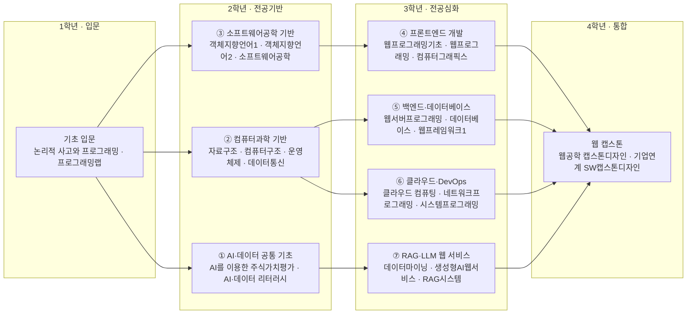

# 컴퓨터공학부 · 웹공학트랙

> 한성대학교 IT공과대학 컴퓨터공학부 · 2026학년도 AI융합 교육과정 개편 리서치 (조사일: 2026-06-25)

## 1. 개요

웹공학트랙은 프론트엔드(React/Next.js)·백엔드(Node/Spring)·클라우드 인프라를 아우르는 풀스택 웹 소프트웨어를 설계·개발·운영하는 트랙이다.

**AI 융합 개편 방향**: AI 코딩 어시스턴트(GitHub Copilot·Cursor·Claude Code)와 바이브 코딩이 웹 개발 생산성과 채용 구조를 재편하고 있다. 개편 방향은 "코드 생산"에서 **"설계·검증·AI 오케스트레이션"**으로 역할을 옮기고, AI API 통합·클라우드 네이티브 역량을 풀스택에 결합하는 것이다.

## 2. 산업·기술 트렌드 (2024–2026)

### 대기업

- **즉시 전력 위주 채용**: 2025년은 "얼마나"보다 "누구를 뽑느냐"가 핵심. 규모 축소, 기준 상향.
- **신입 공채 사실상 중단**: '네카라쿠배당토' 중 네이버를 제외하면 신입 IT 개발자 공개채용 계획이 없고 상시채용으로 전환.

### 스타트업

- 투자 단계가 높아질수록 AI 직군 비율 15% → 34%로 상승(추정).
- **바이브 코딩(Vibe Coding) 확산**(2025.02 카파시 명명). Vercel 'State of Vibe Coding 2025': v0 사용자의 63%가 비개발자.

### 기술

- **프론트엔드**: React + Next.js + TypeScript 표준. React Query·Zustand·Tailwind 우대.
- **백엔드**: Node.js·Spring(Java) 중심, 서버/백엔드가 공고·지원 모두 1위.
- **클라우드/인프라**: AWS/GCP, Docker/Kubernetes, 서버리스, Terraform(IaC), CI/CD 핵심.

## 3. 채용 동향

**사람인-점핑 2025 상반기 개발자 채용 리포트**(공고 약 10만 건, 지원 약 260만 건):

| 직무 | 공고 비중 | 지원 비중 |
| --- | --- | --- |
| 서버/백엔드 | 16.2% (1위) | 23.5% (1위) |
| SW/솔루션 | 11.3% | - |
| 프론트엔드 | 11.1% | 15.5% |
| DevOps/시스템 | 11.1% | 10.2% |

- **연차 미스매치**: 공고는 5~10년차가 39.7%, 신입 0.8%. 반면 지원은 신입이 29.5%로 최다 → 신입 공급 과잉·수요 부족.
- **원티드랩 2026 서베이**(153곳): 적극 채용 연차 4~7년차 49.7%·신입 12.4%. 74.5%가 2026 채용 유지/확대. 중요 역량: 직무 전문성 64.7%·팀워크 37.9%·**AI·데이터 활용 24.2%(4위)**.
- 연봉(점핑 2025): AI/ML 5,183만원, Python 5,078만원 등. 신입 평균 약 3,243만원.

### 3-1. 고용 전망 — 국내·미국·중국 동향

!!! abstract "이 트랙과 향후 10년 고용"
    - **국내(고용노동부):** 컴퓨터 프로그래밍·연구개발업은 증가 직종으로 분류되고, 클라우드 인력 부족(2027 약 1.88만명)이 커서 백엔드·DevOps 등 웹 인프라 직무 수요가 구조적으로 유지된다.
    - **미국(BLS)·글로벌(WEF):** WEF는 소프트웨어 개발자를 가장 빠르게 성장하는 직무 최상위권에 두며, 미국 컴퓨터·수학 직군도 2024~2034 +10.1%로 AI 수요가 견인한다.
    - **시사점:** 신입 공급 과잉·시니어 수요 편중(공고 5~10년차 39.7%) 구조에서, 클라우드·AI 활용을 결합한 풀스택 실무 역량 교육이 신입의 진입 장벽을 낮추는 열쇠다.

> 📊 거시 분석 전체: [고용노동부 취업동향·10년 전망](../employment-outlook.md) · [글로벌 비교 (미국·중국)](../global-employment-outlook.md)

## 4. 요구 직무 역량

| 구분 | 항목 |
| --- | --- |
| 핵심 직무 역량 | 직무 전문성, 시스템 설계, 복잡한 문제 해결, 협업/소통, 즉시 투입 경험 |
| 프론트엔드 스택 | React, Next.js, TypeScript, React Query, Zustand, Tailwind CSS |
| 백엔드 스택 | Node.js, Spring(Java), Python, SQL/DB, REST·API 설계, 데이터 파이프라인 |
| 클라우드/인프라 | AWS, GCP, Docker, Kubernetes, 서버리스, Terraform(IaC), CI/CD |
| AI 융합 역량 | AI 코딩 어시스턴트 실무 활용(Copilot·Cursor·Claude Code·Amazon Q), AI 리터러시·프롬프트 설계·AI API 통합, 데이터 이해력(SQL·파이프라인) |

## 5. 대표 채용 기업 & 직무 예시

| 구분 | 기업 | 직무/프로그램 |
| --- | --- | --- |
| 대기업 | 네이버 | 2025년 유일하게 신입 IT 공채 진행 |
|  | 카카오·라인·쿠팡·배민 | 신입 공채 없음, 상시·경력 중심 |
| 유니콘/중견 | 토스 | 2025 NEXT 챌린지(경력 3년 이하) |
|  | 당근마켓 | 프론트엔드 경력직(React 2년+), MVP 인턴십 |
| 스타트업 | 세이프닥·데브게이트 등 | React/Next.js, TypeScript 필수, AWS 배포 우대 |

## 6. 교육과정 개편 시사점

1. **AI 코딩 어시스턴트 실무 통합 필수화.** Copilot/Cursor/Claude Code 활용 코드 리뷰·테스트 생성·리팩터링·바이브 코딩 워크플로우를 정규 편성하고, AI 산출물을 검증·디버깅하는 비판적 역량을 강화.
2. **풀스택 + 클라우드 네이티브 + AI 융합 통합 트랙.** React/Next/TS + Node/Spring + AWS/GCP·Docker/K8s·CI/CD를 PBL로 통합하고 AI API 통합·데이터 파이프라인을 필수 모듈로 추가.
3. **'즉시 전력감' 갭 해소형 캡스톤·인턴 강화.** 4~7년차 선호 구조에서, 학부 단계의 실서비스 배포·운영·Git 워크플로우·AI 도구 활용 포트폴리오로 신입 즉시 투입 가능성을 높임.

## 7. 출처

> 인용 형식: **기관·매체 — 「제목」 (발행일/연도) · URL** / 확인일 2026-06-27

- **이투데이** — 「사람인-점핑 2025 상반기 개발자 채용 리포트」
- **전자신문** — 「원티드랩 2026 서베이」
- **점핑** — 「2025 개발자 연봉 리포트」
- **전자신문** — 「토스 2025 NEXT 챌린지」
- **삼성SDS** — 「바이브 코딩」
- **SK플래닛** — 「GitHub Copilot 활용기」
- **원티드** — 「2025 개발자 리포트」

> 검증 메모: 사람인-점핑·원티드랩·점핑 수치는 발표 리포트 기반. 투자단계별 AI직군 '15→34%'는 전망치(추정). 잡코리아 공고 건수는 검색 시점 스냅샷.

## 8. 교육 목표 (예시)

> 학문 분야 정체성: 웹공학트랙은 프론트엔드·백엔드·클라우드를 아우르는 웹 서비스 SW공학 역량에 RAG·LLM 기반 AI 기능과 AI 코딩 어시스턴트를 결합하여, 지능형 웹 서비스를 설계·구현·운영하는 풀스택 엔지니어를 양성한다.

1. **풀스택 웹 SW공학 기본기 확립**: 프론트엔드·백엔드·DB를 연동한 웹 서비스를 요구분석부터 배포·운영까지 수행하고, 4학년까지 실서비스 수준 웹 프로젝트 2건 이상을 완성한다.
2. **클라우드·DevOps 운영 역량**: 컨테이너·CI/CD·클라우드(서버리스 포함)를 활용해 확장 가능한 웹 백엔드를 배포·모니터링하고, 무중단 배포 파이프라인을 1건 이상 구축한다.
3. **RAG·LLM 기반 지능형 웹 서비스 구현**: 벡터DB·RAG와 LLM API를 연동한 대화형/검색형 AI 웹 기능을 설계·구현해 사용자 가치를 정량적으로 입증한다.
4. **AI 코딩 어시스턴트 기반 생산성·품질**: AI 페어프로그래밍으로 코드 생성·리뷰·테스트를 자동화하고, 캡스톤에서 개발 생산성·품질 개선 사례를 제시하며 AI 윤리·보안을 준수한다.

## 9. 교육과정 구성 및 교수법 활용

**교육과정 구성**

- 기초: Python·데이터 처리, 프로그래밍 기초, 웹 프로그래밍 입문으로 웹·AI 기반을 형성한다.
- 전공심화: 프론트엔드, 백엔드, 데이터베이스, 웹 보안으로 풀스택 전공 역량을 심화한다.
- AI 융합: 클라우드·DevOps, RAG·LLM 웹 연동, AI 웹 서비스 개발로 지능형 웹 역량을 결합한다.
- 캡스톤: 산학 연계 AI 웹 서비스를 기획-개발-배포-운영까지 수행하는 종합 프로젝트로 마무리한다.

**교수법 활용**

- PBL: 실제 서비스 요구사항 기반 웹 애플리케이션 문제 해결형 수업
- 플립러닝: 이론은 사전 영상, 강의실은 라이브 코딩·코드 리뷰 중심
- 해커톤: AI 웹 서비스 풀스택 해커톤 운영
- 산학 캡스톤 + AI 페어프로그래밍: 기업 과제를 AI 코딩 어시스턴트와 협업해 개발·배포

## 10. 모듈형 전공교육과정 (역량·성과 중심)

### 10-1. 역량 중심 모듈 구성

> 본 모듈은 **한성대 공식 교과과정([https://www.hansung.ac.kr/Engineering/4910/subview.do](https://www.hansung.ac.kr/Engineering/4910/subview.do))**을 기본 데이터로 3~4과목 단위로 재구성했다. 공식 목록에 없는 과목은 **(예시)**로 표기. 확인일 2026-06-28.

| 모듈명 | 계층 | 핵심 역량·주제 | 학습 성과 | 대표 교과(공식/제안) |
| --- | --- | --- | --- | --- |
| AI·데이터 공통 기초 | 단과대학공통 | Python·데이터 처리, 생성형 AI/LLM 활용, AI 코딩 어시스턴트, AI 윤리 | AI 도구로 데이터 처리·프로토타이핑 수행 | 논리적 사고와 프로그래밍 · 프로그래밍랩 · AI를 이용한 주식가치평가 · AI·데이터 리터러시(예시) |
| 컴퓨터과학 기반 | 학부공통 | 자료구조, 알고리즘, 운영체제, 네트워크 | 시스템 동작 원리 이해 및 효율적 알고리즘 설계 | 자료구조 · 컴퓨터구조 · 운영체제 · 데이터통신 |
| 소프트웨어공학 기반 | 학부공통 | 객체지향, 협업·형상관리, 테스트 | 협업 기반 SW 개발 프로세스 수행 | 객체지향언어1 · 객체지향언어2 · 소프트웨어공학 · 설계패턴 |
| 프론트엔드 개발 | 트랙전공 | HTML/CSS/JS, React 등 SPA, 웹 UI/UX | 인터랙티브 웹 프론트엔드 구현 | 웹프로그래밍기초 · 웹프로그래밍 · 컴퓨터그래픽스 · 프론트엔드개발(예시) |
| 백엔드·데이터베이스 | 트랙전공 | REST/GraphQL API, 서버 프레임워크, RDB/NoSQL | 확장 가능한 웹 백엔드·DB 구현 | 웹서버프로그래밍 · 데이터베이스 · 웹프레임워크1 · 웹프레임워크2 |
| 클라우드·DevOps | 트랙전공 | 컨테이너, CI/CD, 클라우드·서버리스, 모니터링 | 무중단 배포·운영 파이프라인 구축 | 클라우드 컴퓨팅 · 네트워크프로그래밍 · 시스템프로그래밍 · 데브옵스(예시) |
| RAG·LLM 웹 서비스 | 트랙전공 | 벡터DB, RAG, LLM API 연동, 챗봇·검색 | 지능형 AI 웹 기능 구현 | 데이터마이닝 · 컴퓨터비젼 · 생성형AI웹서비스(예시) · RAG시스템(예시) |
| 웹 캡스톤 | 트랙전공 | 기획·개발·배포·운영, 산학 협업 | AI 웹 서비스 종합 완성 | 웹공학 캡스톤디자인 · 융합캡스톤디자인 · 기업연계 SW캡스톤디자인 |

#### 10-1 다이어그램 (A) — 1~4학년 모듈 로드맵

#### 10-1 모듈–역량 매핑 (학습 역량 ↔ 기업 요구역량)

> 각 모듈의 학습 역량을 4장 「요구 직무 역량」 항목과 직접 연결한 표이다.

| 모듈 | 핵심 역량(학습) | 매핑되는 기업 요구 역량 |
| --- | --- | --- |
| ① AI·데이터 공통 기초 | Python·데이터 처리, 생성형 AI/LLM 활용, AI 코딩 어시스턴트, AI 윤리 | AI 융합 역량(AI 코딩 어시스턴트 실무 활용, AI 리터러시, 데이터 이해력) |
| ② 컴퓨터과학 기반 | 자료구조, 알고리즘, 운영체제, 네트워크 | 핵심 직무 역량(시스템 설계, 복잡한 문제 해결) |
| ③ 소프트웨어공학 기반 | 객체지향, 협업·형상관리, 테스트 | 핵심 직무 역량(직무 전문성, 협업/소통, 즉시 투입 경험) |
| ④ 프론트엔드 개발 | HTML/CSS/JS, React 등 SPA, 웹 UI/UX | 프론트엔드 스택(React·Next.js·TypeScript·React Query·Zustand·Tailwind CSS) |
| ⑤ 백엔드·데이터베이스 | REST/GraphQL API, 서버 프레임워크, RDB/NoSQL | 백엔드 스택(Node.js·Spring·Python·SQL/DB·REST·API 설계) |
| ⑥ 클라우드·DevOps | 컨테이너, CI/CD, 클라우드·서버리스, 모니터링 | 클라우드/인프라(AWS·GCP·Docker·Kubernetes·서버리스·Terraform·CI/CD) |
| ⑦ RAG·LLM 웹 서비스 | 벡터DB, RAG, LLM API 연동, 챗봇·검색 | AI 융합 역량(AI API 통합, 프롬프트 설계) |
| 웹 캡스톤 | 기획·개발·배포·운영, 산학 협업 | 핵심 직무 역량(즉시 투입 경험, 시스템 설계, 협업/소통) |

### 10-2. 모듈 간 관계 (트랙·학부·단과대학)

- **위계**: 단과대학 공통(AI·데이터 기초) → 컴퓨터공학부 공통(자료구조·OS·네트워크·SW공학) → 웹 트랙 전공심화(프론트엔드/백엔드 → 클라우드·DevOps → RAG·LLM 웹 서비스 → 캡스톤)
- **선후수**: 프로그래밍 기초·웹프로그래밍 이수 후 프론트엔드·백엔드 수강, 백엔드·네트워크 이수 후 클라우드·DevOps 수강
- **마이크로디그리**: "클라우드 네이티브 AI 웹" 마이크로디그리(백엔드개발 + 클라우드컴퓨팅 + 생성형AI웹서비스) 운영
- **타 트랙 교차수강**: 빅데이터트랙의 데이터 엔지니어링·MLOps, 모바일트랙의 모바일 서비스 과목 교차수강 권장

### 10-3. 진로 분야별 모듈 조합 가이드

| 진로 분야 | 권장 모듈 조합 | 목표 직무 |
| --- | --- | --- |
| 프론트엔드 개발 | 프론트엔드 개발 + SW공학 기반 + AI·데이터 공통 기초 | 프론트엔드 개발자, 웹 UI 엔지니어 |
| 백엔드·클라우드 | 백엔드·데이터베이스 + 클라우드·DevOps + 컴퓨터과학 기반 | 백엔드 개발자, 클라우드/DevOps 엔지니어 |
| AI 웹 서비스 풀스택 | RAG·LLM 웹 서비스 + 백엔드·데이터베이스 + 웹 캡스톤 | AI 풀스택 개발자, AI 프로덕트 엔지니어 |

### 10-4. 학생 학습경로 예시

**경로 A — 백엔드·클라우드 엔지니어**

- 1학년: AI·데이터 공통 기초, 프로그래밍 기초, 웹프로그래밍
- 2학년: 자료구조, 객체지향프로그래밍, 백엔드개발
- 3학년: 데이터베이스, 컴퓨터네트워크, 클라우드컴퓨팅·데브옵스
- 4학년: 산학 캡스톤(클라우드 네이티브 백엔드), 포트폴리오 완성

**경로 B — AI 웹 풀스택 개발자**

- 1학년: AI·데이터 공통 기초, 생성형 AI 활용, 웹프로그래밍
- 2학년: 자료구조, 프론트엔드개발, 백엔드개발
- 3학년: 데이터베이스, 생성형AI웹서비스, RAG시스템
- 4학년: 웹 캡스톤(AI 웹 서비스), 산학 배포·운영

**경로 C — 프론트엔드 개발자**

- 1학년: AI·데이터 공통 기초, 프로그래밍 기초, 웹프로그래밍
- 2학년: 객체지향프로그래밍, 자료구조, 프론트엔드개발(React/Next.js)
- 3학년: 소프트웨어공학, 생성형AI웹서비스, 웹 UI/UX
- 4학년: 웹 캡스톤(AI 코딩 어시스턴트 활용 SPA), 프론트엔드 개발자·웹 UI 엔지니어로 진출

**경로 D — 웹 서비스 창업(스타트업 CTO)**

- 1학년: AI·데이터 공통 기초, 생성형 AI 활용, 웹프로그래밍
- 2학년: 프론트엔드개발, 백엔드개발, 객체지향프로그래밍
- 3학년: 클라우드컴퓨팅·데브옵스, 생성형AI웹서비스, RAG시스템
- 4학년: 웹 캡스톤(바이브 코딩 기반 MVP 실서비스 배포), AI 웹 서비스 창업·스타트업 CTO로 진출
