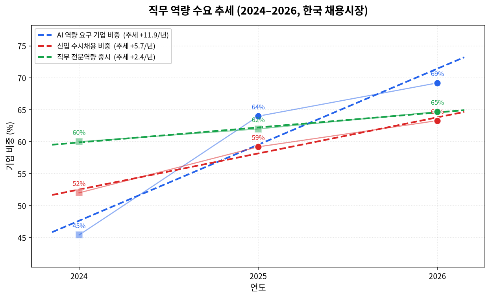
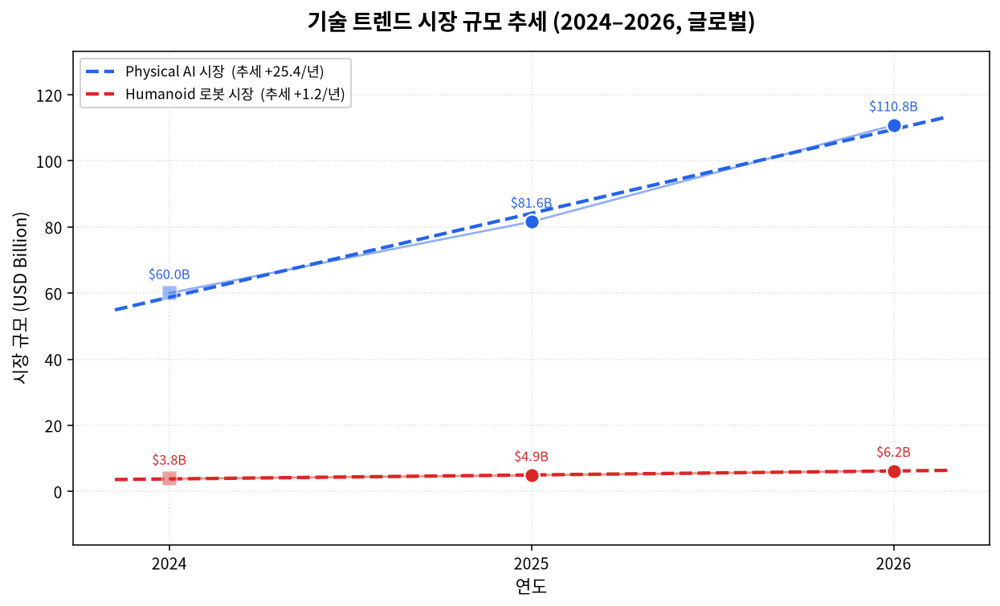
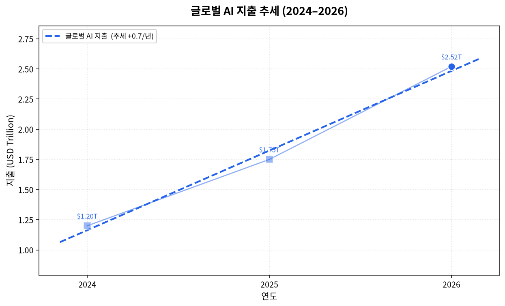

# 기술 트렌드 · 직무 역량 분석 (2024–2026)

> PARC Lab — Physical AI Real-Time Control for Mobility & Robotics
> 2024·2025·2026년 **기술 트렌드**와 **직무 역량 수요**를 데이터로 도출하고 추세선(선형회귀, linear regression)으로 분석한 보고서. 데이터 기준 2026-06.

## 1. 핵심 결론

**Gartner 전략 트렌드와 산업 신호를 기준으로 2024 생성형 AI 대중화 → 2025 에이전트 AI → 2026 Physical AI·멀티에이전트·도메인 특화 모델이 부상했고, 직무 시장은 `AI 활용 역량`을 가장 가파른 기울기로 요구한다.** 두 추세선의 교차점에 PARC Lab의 도메인(Physical AI·로봇·모빌리티 실시간 제어)이 정확히 위치한다.

> 위 흐름은 기술이 **순차적으로 대체**됐다는 실증 명제가 아니라, Gartner 전략 트렌드·산업 신호에 근거한 **부상(浮上)·비중 이동의 방향성 프레이밍**이다.

## 2. 직무 역량 수요 추세 (한국 채용시장)

| 지표 | 2024 | 2025 | 2026 | 연 추세(기울기) |
|---|---|---|---|---|
| **AI 역량 요구 기업 비중** | ~45% | 64% | 69% | **+11.9%p/년 (최대)** |
| 신입 수시채용 비중 | ~52% | 59% | 63% | +5.7%p/년 |
| 직무 전문역량 중시 | ~60% | 62% | 65% | +2.4%p/년 |

> **지표 해석 주의:** 위 3개 지표는 조사 주체·정의·표본이 다른 연도값을 연결한 **3개 연도 단순 비교 기준의 방향성 지표**이며(2024는 추정값, 2025·2026은 서로 다른 조사일 가능성), 조사 정의가 달라 **엄밀한 시계열 예측이 아니다**. 기울기(%p/년)는 통계적 회귀 예측이 아닌 방향성 참고용이다.

- **AI 역량**의 기울기(+11.9%p/년)가 전통 역량(직무 전문성 +2.4)을 압도 → AI 활용은 *우대 → 필수*로 전환.
- 채용 방식은 공채 → **수시채용** 구조 전환(우상향).
- 직무 전문성은 여전히 인재상 1순위이나 증가율은 완만 → "기본기 + AI 레버리지"가 표준.

## 3. 기술 트렌드 시장 규모 추세 (글로벌)

| 시장 | 2024 | 2025 | 2026 | 연 추세 |
|---|---|---|---|---|
| **Physical AI** | ~$60.0B | $81.6B | $110.8B | **+$25.4B/년 (CAGR≈36%)** |
| Humanoid 로봇 | ~$3.8B | $4.89B | $6.24B | +$1.2B/년 |

> **Physical AI 시장 정의 주의:** 위 $110.8B(2026)는 로봇·휴머노이드·자율 이동체·Embodied AI 등 **인접 시장 기회를 합산한 광의·복합 추정**으로, 구성 시장·중복 제거·산식이 공개되지 않은 값이다. 좁은 정의의 'Physical AI 시장'([MarketsandMarkets](https://www.marketsandmarkets.com/Market-Reports/physical-ai-market-240269196.html) 기준 **2026년 $1.50B → 2032년 $15.24B**)과는 **정의가 다르므로 직접 비교하지 않는다**.

| 지표 | 2024 | 2025 | 2026 | 연 추세 |
|---|---|---|---|---|
| 글로벌 AI 지출·투자 전망 | ~$1.20T | ~$1.75T | $2.52T | +$0.66T/년 (2026 +44% YoY) |

> 위 'AI 지출·투자 전망'은 IDC·Gartner 등의 **지출(spending) 전망**으로, 특정 제품 **시장 규모(market size)**와는 정의가 다르다.

- **Physical AI 시장**이 가장 큰 절대 성장 → 로봇·드론·스마트장비가 파일럿에서 양산 단계로.
- Humanoid: NVIDIA(Cosmos·GR00T), Tesla(Optimus, 2026년 양산 준비·생산 확대 목표), Boston Dynamics(현대 Atlas), Agility(Amazon Digit) 상용 배치 본격화.

## 4. 연도별 기술 패러다임

| 연도 | Gartner 대표 전략 트렌드 | 키워드 | 직무 시장 신호 |
|---|---|---|---|
| 2024 | Democratized GenAI | 생성형 AI 대중화, AI Trust/Risk | "AI 툴 경험 우대" 등장 |
| 2025 | **Agentic AI** (1위) | 에이전트 AI, Physical AI의 ChatGPT 모먼트(CES) | AI 역량 요구 64% 급등 |
| 2026 | AI Agents+DSLM, **Physical AI** | 도메인 특화 모델, 물리세계 양산 진입 | AI 역량 고려 기업 69% |

## 5. 2026학년도 AI융합교육과정 개편 대상 트랙(학과)

□ 대상: 2026학년도 AI융합교육과정 개편 대상 트랙(학과) — **괄호 안은 2027학년도 이후 개편(예정) 명칭**(2026학년도 현재 명칭은 좌측 단과대학·학부 기준). 각 트랙명을 클릭하면 상세 분석으로 이동합니다.

!!! note "조직 명칭·신설 시점 주의"
    한성대 학칙 기준 **2026학년도 현재는 창의융합대학**, **2027학년도 이후 개편명이 AI융합대학**이다. 단과대학 단위 `AI` 접두어(AI디자인대학·AI융합대학 등)는 2027학년도 이후 명칭이다. 또한 **AI기계로봇공학과는 2027학년도 신설 예정**으로, 2026학년도 개편 대상이 아닌 신설 예정 학과로 본다.

| 단과대학 | 학부 | 트랙·학과 |
|---|---|---|
| 디자인대학 (AI디자인대학) | 글로벌패션산업학부 (AI패션학부) | [패션마케팅트랙](design/fashion-marketing.md) / [패션디자인트랙](design/fashion-design.md) / [패션크리에이티브디렉션트랙](design/fashion-creative-direction.md) |
| | ICT디자인학부 (AI융합디자인학부) | [미디어디자인트랙](design/media-design.md) / [시각디자인트랙](design/visual-design.md) / [영상애니메이션디자인트랙](design/motion-animation.md) / [게임그래픽디자인트랙](design/game-graphic.md) / [인테리어디자인트랙](design/interior-design.md) / [VMD전시디자인트랙](design/vmd-exhibition.md) / [UX/UI디자인트랙](design/uxui-design.md) |
| | 뷰티디자인매니지먼트학과 (AI뷰티디자인학과) | [AI뷰티디자인학과](design/beauty-design.md) |
| IT공과대학 | 컴퓨터공학부 | [모바일소프트웨어트랙](it/mobile-software.md) / [빅데이터트랙](it/big-data.md) / 디지털콘텐츠·가상현실트랙([지능형실감미디어공학트랙](it/immersive-media.md)) / [웹공학트랙](it/web-engineering.md) |
| | 기계전자공학부 (전기전자공학부) | [전자트랙](it/electronics.md) / [시스템반도체트랙](it/system-semiconductor.md) |
| | 산업시스템공학부 | [산업공학트랙](it/industrial-engineering.md) / [응용산업데이터공학트랙](it/applied-industrial-data.md) |
| 창의융합대학 (AI융합대학) | (AI학부) | [AI응용학과](ai/ai-application.md) / [융합보안학과](ai/convergence-security.md) |
| | (AI융합학부) | [미래모빌리티학과](ai/future-mobility.md) / [문학문화콘텐츠학과](ai/literature-culture-contents.md) / [AI기계로봇공학과(2027학년도 신설 예정)](ai/ai-robotics.md) |

- 단과대학 단위까지 **`AI` 접두어**가 부여되는 전면 개편 → 기업 채용시장의 AI 역량 수요 우상향(+11.9%p/년)과 동일 방향의 공급측 신호.
- **미래모빌리티학과**는 (AI융합학부) 산하에 위치, **2027학년도 신설 예정인 AI기계로봇공학과**와 같은 학부로 묶임 → PARC Lab의 Physical AI·로봇·모빌리티 도메인과 조직 구조가 직접 정렬.

!!! info "모듈형 교육과정 기본 데이터 출처"
    각 트랙 상세의 **모듈형 전공교육과정(10장)**은 **한성대학교 공식 교과과정**([디자인대학](https://www.hansung.ac.kr/Design/index.do)·[IT공과대학](https://www.hansung.ac.kr/Engineering/index.do)·[창의융합대학](https://www.hansung.ac.kr/CreCon/index.do))을 **기본 데이터**로 삼아, 공식 교과목을 3~4개 단위 모듈로 재구성한 것이다. 공식 교과목 목록에 없는 항목은 새로 만들지 않고 **(예시)**로 표기했으며, 각 트랙 모듈 구성은 Mermaid 다이어그램으로 함께 시각화했다.

## 6. 트랙별 학생 학습경로 (4개 예시 구조)

24개 전 트랙은 각 트랙 상세의 모듈형 전공교육과정 말미에 **학년별(1~4학년) 학습경로 예시 4개(경로 A~D)**를 제공한다. 향후 10년 고용 전망([고용노동부 취업동향·10년 전망](employment-outlook.md)·[글로벌 비교(미국·중국)](global-employment-outlook.md): *고숙련·AI·돌봄으로의 수요 이동*)에 대응해, 같은 트랙 안에서도 학생이 서로 다른 진로로 분기하도록 설계했다.

| 경로 유형 | 지향 | 대표 예 |
|---|---|---|
| **취업·실무 직무형** (주로 A·B) | 전공 핵심 직무로 즉시 취업 | 데이터 엔지니어, UX 디자이너, 모션제어 SW 엔지니어 |
| **연구·대학원형** (주로 D) | 심화 연구·R&D | 자율주행 Physical AI 연구원, Edge AI 연구원 |
| **창업·서비스형** | 창업·브랜드·프리랜서 | 패션 D2C 창업, 인디 뷰티 브랜드, 웹 서비스 CTO |
| **융합·산업 특화형** (주로 C) | 인접 도메인·특정 산업 결합 | 스마트팩토리 MLOps, BIM·디지털 트윈, 디지털 포렌식 |

- 각 경로는 **1~4학년 이수 흐름 + 캡스톤 + 진출 직무**까지 명시 → 입학 단계부터 진로 설계가 가능.
- 4개 경로 구조는 거시 전망과 정렬: *취업형*은 즉시 수요, *연구형*은 고숙련 공학·정보통신 전문가 수요, *창업·서비스형*은 서비스업 증가(2023~33 +61.3만), *융합·특화형*은 신산업 인력 부족(빅데이터 1.96만·클라우드 1.88만·AI 1.28만, 2027)에 각각 대응.
- 예시는 각 트랙 상세 페이지의 「10-4. 학생 학습경로 예시」 참조(예: [AI기계로봇공학과](ai/ai-robotics.md)·[빅데이터트랙](it/big-data.md)).

## 7. PARC Lab 시사점

1. **타이밍 정렬** — 산업 트렌드(Physical AI)와 인력 수요(AI 역량)의 두 추세선이 2025–2026에 교차·수렴. 랩 연구 도메인이 시장 변곡점과 일치.
2. **인재 전략** — 채용/양성 시 *직무 기본기 + AI 활용 + 실시간 제어* 결합 역량을 표준 요건으로.
3. **리스크** — Gartner: 에이전트 프로젝트 40%+가 2027년까지 실패. 비용·검증 가능성·정책 준수가 관건 → 실시간 제어·안전성 연구의 가치 부각.

## 8. 데이터 주의 · 출처

!!! warning "데이터 주의"
    `reported`=출처 보고값, `estimated`=인접 연도·성장률로 역산한 추정값(차트에서 사각형·흐린 마커). 추세선은 3개 연도 선형회귀(`numpy.polyfit`, deg=1) 기울기.

!!! info "국가 공식 통계 보강"
    민간 채용 플랫폼 기반의 위 분석은 **[고용노동부 취업동향·10년 전망](employment-outlook.md)** 페이지에서 국가 공식 통계(중장기 인력수급 전망, AI·디지털 전환 고용구조 재편)로 교차 검증됩니다. 향후 10년 **추가 필요인력 122.2만 명(경제성장률 2.0% 달성을 전제로 한 추가 필요인력 추계)**, 수요의 **고숙련·AI·돌봄 직종 집중**이 본 추세와 동일 방향입니다.

**출처**

> 인용 형식: **기관·매체 — 「제목」 (발행일/연도) · URL** / 확인일 2026-06-27

- **사람인** — 「2026 정규직 채용계획」(327개사) · 「2025 채용계획」(511개사)
- **원티드랩** — 「2026 채용 트렌드 서베이」(153개사)
- **LinkedIn Korea** — 2025 하반기 채용공고 분석
- **Gartner** — 「Top Strategic Technology Trends」 (2024/2025/2026)
- **Grand View·MarketsandMarkets 등** — Physical AI/Humanoid 시장보고서
- **CES** — (2025·2026)
- **고용노동부·한국고용정보원** — 중장기 인력수급 전망(2024~2034, 2023~2033) · AI 디지털 전환 고용구조 재편 전망
- **통계청·고용노동부** — 고용동향 (2025)

### 8-1. 원자료 (raw data)

??? note "차트 원자료 펼치기 · `reported`(출처 보고값)/`estimated`(역산 추정값) 구분"

    | 지표 | 2024 | 2025 | 2026 | 구분 |
    |---|---|---|---|---|
    | AI 역량 요구 기업 비중 | ~45% | 64% | 69% | 2024 estimated / 2025·2026 reported |
    | 신입 수시채용 비중 | ~52% | 59% | 63% | 2024 estimated / 2025·2026 reported |
    | 직무 전문역량 중시 | ~60% | 62% | 65% | 2024 estimated / 2025·2026 reported |
    | Physical AI 시장(광의) | ~$60.0B | $81.6B | $110.8B | 2024 estimated / 이후 reported |
    | Humanoid 로봇 시장 | ~$3.8B | $4.89B | $6.24B | 2024 estimated / 이후 reported |
    | 글로벌 AI 지출·투자 | ~$1.20T | ~$1.75T | $2.52T | 2024·2025 estimated / 2026 reported |

    - `~` 접두 또는 estimated = 인접 연도·성장률로 역산한 추정값(차트의 흐린/사각 마커).
    - 추세선은 3개 연도 선형회귀(`numpy.polyfit`, deg=1) 기울기. 원본 데이터·차트 코드: GitHub `parclab-hsu/tech-trends-2024-2026`.
